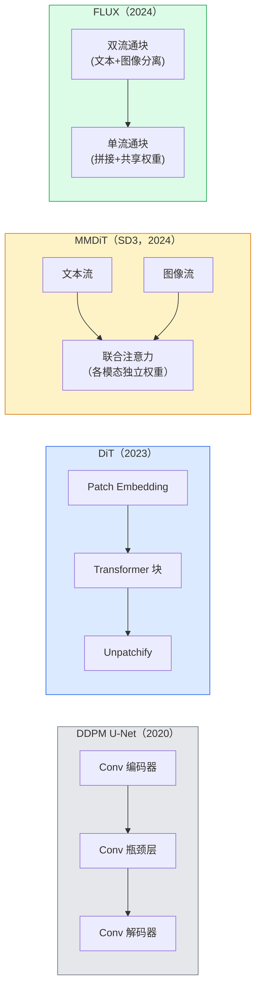

# Diffusion Transformers & Rectified Flow

> U-Net 并不是扩散模型的核心秘诀。把它替换成 transformer，将噪声调度换成直线流，于是你便得到了 SD3、FLUX 以及所有 2026 年的文生图模型。

**类型：** 学习 + 实践
**语言：** Python
**前置知识：** 第 4 阶段课程 10（Diffusion DDPM）、第 4 阶段课程 14（ViT）、第 7 阶段课程 02（Self-Attention）
**时间：** 约 75 分钟

## 学习目标

- 追溯从 U-Net DDPM（课程 10）到 Diffusion Transformer（DiT）、MMDiT（SD3）和双流+单流 DiT（FLUX）的演进路径
- 解释 rectified flow：为什么数据与噪声之间的直线轨迹能让模型仅用 20 步完成采样而非 1000 步
- 实现一个小型 DiT block 和一个 rectified flow 训练循环，代码量均不超过 100 行
- 根据架构、参数量与许可证区分各模型变体（SD3、FLUX.1-dev、FLUX.1-schnell、Z-Image、Qwen-Image）

## 问题背景

课程 10 使用 U-Net 去噪器构建了一个 DDPM。这一方案在 2020–2023 年间占据主导地位：U-Net + beta 调度 + 噪声预测损失。它诞生了 Stable Diffusion 1.5、2.1 以及 DALL-E 2。

但每一个 2026 年的文生图 SOTA 模型都已经跨越了它。Stable Diffusion 3、FLUX、SD4、Z-Image、Qwen-Image、Hunyuan-Image——没有一个使用 U-Net，它们都使用 Diffusion Transformer（DiT）。SD3 和 FLUX 还将 DDPM 的噪声调度替换为 rectified flow，将噪声到数据的轨迹拉直，使得一致性蒸馏或加速变体仅需 1–4 步推理。

这一转变意义重大，因为正是它让基于扩散的图像生成变得可控、对 prompt 忠实（SD3/SD4 解决了文字渲染问题），且适合生产部署。理解 DiT + rectified flow，就是理解 2026 年代生成式图像技术栈的核心。

## 概念讲解

### 从 U-Net 到 Transformer



- **DiT**（Peebles & Xie，2023）—— 用类似 ViT 的 transformer 替换 U-Net，操作于 latent patch。通过自适应层归一化（AdaLN）注入条件信息。
- **MMDiT**（SD3，Esser et al.，2024）—— 文本和图像 token 分别走独立的权重流，在 joint attention 层共享注意。
- **FLUX**（Black Forest Labs，2024）—— 前 N 个 block 采用双流结构（如 SD3），后面的 block 拼接并共享权重（单流），以在高深度下提升效率。
- **Z-Image**（2025）—— 一个 6B 参数的高效单流 DiT，挑战"规模就是一切"的理念。

### Rectified Flow 一句话概括

DDPM 将前向过程定义为一条噪声 SDE，其中 $x_t$ 逐步被破坏。学习的逆过程是第二条 SDE，需要 1000 个小步求解。

Rectified flow 在干净数据和纯噪声之间定义了一条**直线**插值：

```
x_t = (1 - t) * x_0 + t * epsilon,     t ∈ [0, 1]
```

训练网络预测速度 $v_\theta(x_t, t) = \epsilon - x_0$——即沿直线从干净数据到噪声方向（$dx_t/dt$）。采样时，沿该速度反向积分，从噪声逐步走向数据。所得 ODE 路径更接近直线，因此只需极少积分步即可完成采样。

SD3 称之为**Rectified Flow Matching**。FLUX、Z-Image 及大多数 2026 年模型均采用相同目标函数。典型推理：20–30 步 Euler 积分（确定性），对比旧 DDPM 体系的 50+ 步 DDIM。蒸馏/ turbo / schnell / LCM 变体可进一步压缩至 1–4 步。

### AdaLN 条件注入

DiT 通过**自适应层归一化**注入时间步和类别/文本条件：从条件向量预测 `scale` 和 `shift`，并在 LayerNorm 后应用。比 U-Net 中 FiLM 风格的调制更干净，也是所有现代 DiT 的默认方式。

```
cond -> MLP -> (scale, shift, gate)
norm(x) * (1 + scale) + shift，再残差连接 * gate
```

### SD3 与 FLUX 中的文本编码器

- **SD3** 使用三个文本编码器：两个 CLIP + T5-XXL。嵌入拼接后送入图像流作为文本条件。
- **FLUX** 使用一个 CLIP-L + T5-XXL。
- **Qwen-Image / Z-Image** 变体使用自研文本编码器，与其基础 LLM 对齐。

文本编码器是 SD3/FLUX 比 SD1.5 更擅长理解 prompt 的关键原因之一。仅 T5-XXL 就有 47 亿参数。

### Classifier-Free Guidance 仍然适用

Rectified flow 改变的是采样器，而非条件机制。Classifier-free guidance（训练中 10% 概率丢弃文本，推理时混合条件与无条件预测）在 rectified flow 中完全同样适用。大多数 2026 年模型使用 guidance scale 3.5–5——低于 SD1.5 的 7.5，因为 rectified flow 模型默认就能更紧密地遵循 prompt。

### Consistency、Turbo、Schnell、LCM

四个名字，同一个思想：将慢速多步模型蒸馏为快速少步模型。

- **LCM（Latent Consistency Model）**——训练一个学生模型，从任意中间 $x_t$ 一步预测最终 $x_0$。
- **SDXL Turbo / FLUX schnell**——通过对抗扩散蒸馏训练的 1–4 步模型。
- **SD Turbo**——适配到 latent diffusion 的 OpenAI 式 Consistency Models。

任何新模型的生产部署都会同时提供"全质量"checkpoint 和"turbo / schnell"变体。Schnell（德语"快"，Black Forest Labs 的命名惯例）仅需 1–4 步，适合实时管线。

### 2026 年模型全景

| 模型 | 参数量 | 架构 | 许可证 |
|------|--------|------|--------|
| Stable Diffusion 3 Medium | 2B | MMDiT | SAI Community |
| Stable Diffusion 3.5 Large | 8B | MMDiT | SAI Community |
| FLUX.1-dev | 12B | 双流 + 单流 DiT | 非商用 |
| FLUX.1-schnell | 12B | 同左，已蒸馏 | Apache 2.0 |
| FLUX.2 | — | 迭代版 FLUX.1 | 混合 |
| Z-Image | 6B | S3-DiT（可扩展单流） | 宽松 |
| Qwen-Image | ~20B | DiT + Qwen 文本塔 | Apache 2.0 |
| Hunyuan-Image-3.0 | ~80B | DiT | 研究用途 |
| SD4 Turbo | 3B | DiT + 蒸馏 | SAI Commercial |

FLUX.1-schnell 是 2026 年的开源默认选择。Z-Image 是效率之王。FLUX.2 和 SD4 是当前质量巅峰。

### 为何这一范式转移至关重要

DDPM + U-Net 能工作。DiT + rectified flow 能**工作得更好、更快、扩展更 cleanly**。这一转变类似于 NLP 中从 RNN 到 transformer 的过渡：两种架构解决同一问题，但 transformer 展现出更强的扩展能力并占据主导。每一篇 2026 年关于图像、视频或 3D 生成的论文都使用 DiT 形状的去噪器，并通常采用 rectified flow 目标函数。U-Net DDPM 如今主要作为教学材料（课程 10）。

```figure
cv3-rectified-flow
```

## 动手实践

### 步骤 1：带 AdaLN 的 DiT Block

```python
import torch
import torch.nn as nn


class AdaLNZero(nn.Module):
    """
    Adaptive LayerNorm with a gate. 从条件向量预测 (scale, shift, gate)。
    初始化为恒等映射（"zero init"）。
    """

    def __init__(self, dim, cond_dim):
        super().__init__()
        self.norm = nn.LayerNorm(dim, elementwise_affine=False)
        self.mlp = nn.Linear(cond_dim, dim * 3)
        nn.init.zeros_(self.mlp.weight)
        nn.init.zeros_(self.mlp.bias)

    def forward(self, x, cond):
        scale, shift, gate = self.mlp(cond).chunk(3, dim=-1)
        h = self.norm(x) * (1 + scale.unsqueeze(1)) + shift.unsqueeze(1)
        return h, gate.unsqueeze(1)


class DiTBlock(nn.Module):
    def __init__(self, dim=192, heads=3, mlp_ratio=4, cond_dim=192):
        super().__init__()
        self.adaln1 = AdaLNZero(dim, cond_dim)
        self.attn = nn.MultiheadAttention(dim, heads, batch_first=True)
        self.adaln2 = AdaLNZero(dim, cond_dim)
        self.mlp = nn.Sequential(
            nn.Linear(dim, dim * mlp_ratio),
            nn.GELU(),
            nn.Linear(dim * mlp_ratio, dim),
        )

    def forward(self, x, cond):
        h, gate1 = self.adaln1(x, cond)
        a, _ = self.attn(h, h, h, need_weights=False)
        x = x + gate1 * a
        h, gate2 = self.adaln2(x, cond)
        x = x + gate2 * self.mlp(h)
        return x
```

`AdaLNZero` 以恒等映射启动，因为其 MLP 权重初始化为零。训练逐步将 block 从恒等映射推开；这大幅稳定了深层 transformer 扩散模型。

### 步骤 2：小型 DiT

```python
def timestep_embedding(t, dim):
    import math
    half = dim // 2
    freqs = torch.exp(-math.log(10000) * torch.arange(half, device=t.device) / half)
    args = t[:, None].float() * freqs[None]
    return torch.cat([args.sin(), args.cos()], dim=-1)


class TinyDiT(nn.Module):
    def __init__(self, image_size=16, patch_size=2, in_channels=3, dim=96, depth=4, heads=3):
        super().__init__()
        self.patch_size = patch_size
        self.num_patches = (image_size // patch_size) ** 2
        self.patch = nn.Conv2d(in_channels, dim, kernel_size=patch_size, stride=patch_size)
        self.pos = nn.Parameter(torch.zeros(1, self.num_patches, dim))
        self.time_mlp = nn.Sequential(
            nn.Linear(dim, dim * 2),
            nn.SiLU(),
            nn.Linear(dim * 2, dim),
        )
        self.blocks = nn.ModuleList([DiTBlock(dim, heads, cond_dim=dim) for _ in range(depth)])
        self.norm_out = nn.LayerNorm(dim, elementwise_affine=False)
        self.head = nn.Linear(dim, patch_size * patch_size * in_channels)

    def forward(self, x, t):
        n = x.size(0)
        x = self.patch(x)
        x = x.flatten(2).transpose(1, 2) + self.pos
        t_emb = self.time_mlp(timestep_embedding(t, self.pos.size(-1)))
        for blk in self.blocks:
            x = blk(x, t_emb)
        x = self.norm_out(x)
        x = self.head(x)
        return self._unpatchify(x, n)

    def _unpatchify(self, x, n):
        p = self.patch_size
        h = w = int(self.num_patches ** 0.5)
        x = x.view(n, h, w, p, p, -1).permute(0, 5, 1, 3, 2, 4).reshape(n, -1, h * p, w * p)
        return x
```

### 步骤 3：Rectified Flow 训练

```python
import torch.nn.functional as F

def rectified_flow_train_step(model, x0, optimizer, device):
    model.train()
    x0 = x0.to(device)
    n = x0.size(0)
    t = torch.rand(n, device=device)
    epsilon = torch.randn_like(x0)
    x_t = (1 - t[:, None, None, None]) * x0 + t[:, None, None, None] * epsilon

    target_velocity = epsilon - x0
    pred_velocity = model(x_t, t)

    loss = F.mse_loss(pred_velocity, target_velocity)
    optimizer.zero_grad()
    loss.backward()
    optimizer.step()
    return loss.item()
```

对比 DDPM 的噪声预测损失（课程 10）：结构相同，目标不同。不是预测噪声 $\epsilon$，而是预测**速度** $\epsilon - x_0$，它沿直线插值从数据指向噪声方向。

### 步骤 4：Euler 采样器

Rectified flow 是一个 ODE。Euler 方法最简单，对于训练良好的 rectified flow 模型，在 20+ 步时精度几乎与更高阶求解器相当。

```python
@torch.no_grad()
def rectified_flow_sample(model, shape, steps=20, device="cpu"):
    model.eval()
    x = torch.randn(shape, device=device)
    dt = 1.0 / steps
    t = torch.ones(shape[0], device=device)
    for _ in range(steps):
        v = model(x, t)
        x = x - dt * v
        t = t - dt
    return x
```

20 步。在训练好的模型上，这能产出与 1000 步 DDPM 相当的质量。

### 步骤 5：端到端冒烟测试

```python
import numpy as np

def synthetic_blobs(num=200, size=16, seed=0):
    rng = np.random.default_rng(seed)
    out = np.zeros((num, 3, size, size), dtype=np.float32)
    yy, xx = np.meshgrid(np.arange(size), np.arange(size), indexing="ij")
    for i in range(num):
        cx, cy = rng.uniform(4, size - 4, size=2)
        r = rng.uniform(2, 4)
        mask = (xx - cx) ** 2 + (yy - cy) ** 2 < r ** 2
        colour = rng.uniform(-1, 1, size=3)
        for c in range(3):
            out[i, c][mask] = colour[c]
    return torch.from_numpy(out)
```

在矩形数据上训练 `TinyDiT`，配合 rectified flow。经过 500 步训练后，采样输出应呈现为模糊的彩色斑点。

## 实际使用

对于使用 FLUX / SD3 / Z-Image 的真实图像生成，`diffusers` 提供了统一 API：

```python
from diffusers import FluxPipeline, StableDiffusion3Pipeline
import torch

pipe = FluxPipeline.from_pretrained(
    "black-forest-labs/FLUX.1-schnell",
    torch_dtype=torch.bfloat16,
).to("cuda")

out = pipe(
    prompt="a golden retriever surfing a tsunami, hyperrealistic, studio lighting",
    guidance_scale=0.0,           # schnell 在无 CFG 下训练
    num_inference_steps=4,
    max_sequence_length=256,
).images[0]
out.save("surf.png")
```

三行代码，`FLUX.1-schnell` 四步出图。如需更高质量，将模型 id 换成 `black-forest-labs/FLUX.1-dev`，配合 CFG 在 20–30 步内推理。

对于 SD3：

```python
pipe = StableDiffusion3Pipeline.from_pretrained(
    "stabilityai/stable-diffusion-3.5-large",
    torch_dtype=torch.bfloat16,
).to("cuda")
out = pipe(prompt, guidance_scale=3.5, num_inference_steps=28).images[0]
```

## 交付成果

本课程产出：

- `outputs/prompt-dit-model-picker.md`——根据质量、延迟和许可证约束，在 SD3、FLUX.1-dev、FLUX.1-schnell、Z-Image、SD4 Turbo 之间做出选择。
- `outputs/skill-rectified-flow-trainer.md`——编写完整的 rectified flow 训练循环，含 AdaLN DiT 和 Euler 采样。

## 练习

1. **（简单）** 在合成斑点数据集上训练上述 TinyDiT，共 500 步。比较使用 10、20、50 步 Euler 采样器的输出。
2. **（中等）** 将学习到的类别嵌入拼接到时间嵌入中，加入文本条件（按颜色分 10 个斑点"类别"）。分别采样类别 0、5、9，验证颜色是否匹配。
3. **（困难）** 计算同一规模网络在同一数据、相同步数下训练时，rectified flow 版本与 DDPM 版本的 Fréchet 距离（FID 代理指标）。报告哪种方式收敛更快。

## 关键术语

| 术语 | 人们怎么说 | 实际含义 |
|------|------------|----------|
| DiT | "Diffusion transformer" | 替代 U-Net 作为扩散去噪器的 transformer；操作于 patchified latent |
| AdaLN | "Adaptive layer norm" | 通过 LayerNorm 后学习的 scale、shift、gate 注入时间步/文本条件；所有现代 DiT 的标准 |
| MMDiT | "Multi-modal DiT（SD3）" | 文本和图像 token 有独立权重流，共享 joint self-attention |
| Single-stream / double-stream | "FLUX 的 trick" | 前 N 个 block 双流通（各模态独立权重），后续 block 单流通（拼接 + 共享权重）以提升效率 |
| Rectified flow | "直线噪声到数据" | 数据与噪声间的线性插值；网络预测速度；推理所需 ODE 步数更少 |
| Velocity target | "epsilon - x_0" | rectified flow 中的回归目标；方向从干净数据指向噪声 |
| CFG guidance | "classifier-free guidance" | 混合条件与无条件预测；在 rectified flow 模型中仍然使用 |
| Schnell / turbo / LCM | "1–4 步蒸馏" | 从全质量模型蒸馏出的少步变体；用于生产实时场景 |

## 延伸阅读

- [Scalable Diffusion Models with Transformers (Peebles & Xie, 2023)](https://arxiv.org/abs/2212.09748) —— DiT 原始论文
- [Scaling Rectified Flow Transformers (Esser et al., SD3 论文)](https://arxiv.org/abs/2403.03206) —— MMDiT 与大规模 rectified flow
- [FLUX.1 model card and technical report (Black Forest Labs)](https://huggingface.co/black-forest-labs/FLUX.1-dev) —— 双流 + 单流细节
- [Z-Image: Efficient Image Generation Foundation Model (2025)](https://arxiv.org/html/2511.22699v1) —— 6B 参数单流 DiT
- [Elucidating the Design Space of Diffusion (Karras et al., 2022)](https://arxiv.org/abs/2206.00364) —— 所有扩散设计权衡的参考
- [Latent Consistency Models (Luo et al., 2023)](https://arxiv.org/abs/2310.04378) —— LCM-LoRA 如何实现 4 步推理
