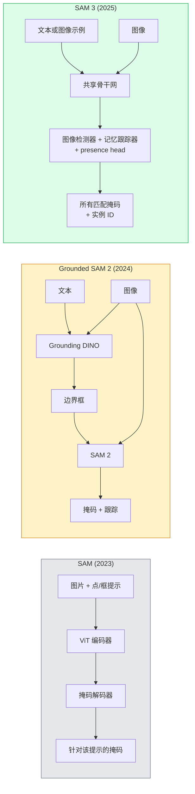

# SAM 3 & Open-Vocabulary Segmentation

> 给模型一个文本提示和一张图片，即可获得所有匹配对象的掩码。SAM 3 只需一次前向传播即可完成。

**类型：** Use + Build
**语言：** Python
**先修课程：** Phase 4 Lesson 07 (U-Net)、Phase 4 Lesson 08 (Mask R-CNN)、Phase 4 Lesson 18 (CLIP)
**预计时间：** ~60 分钟

## 学习目标

- 区分 SAM（仅支持视觉提示）、Grounded SAM / SAM 2（检测器 + SAM）与 SAM 3（通过 Promptable Concept Segmentation 原生支持文本提示）
- 解释 SAM 3 架构：共享骨干网 + 图像检测器 + 基于记忆的视频跟踪器 + presence head + 解耦的检测器-跟踪器设计
- 使用 Hugging Face `transformers` SAM 3 集成进行文本提示的检测、分割和视频跟踪
- 根据延迟、概念复杂度和部署目标，在 SAM 3、Grounded SAM 2、YOLO-World 和 SAM-MI 之间做出选择

## 问题所在

2023 年的 SAM 是一个仅支持视觉提示的模型：你点击一个点或绘制一个框，它会返回一个掩码。对于"给我找出这张照片里所有的橙子"这类需求，你需要一个检测器（如 Grounding DINO）来生成边界框，再用 SAM 对每个框进行分割。Grounded SAM 将这个流程变成了管线，但它是两个冻结模型的级联，不可避免地会产生误差累积。

SAM 3（Meta，2025 年 11 月，ICLR 2026）将该级联结构整合成了一个整体。它接受简短的名词短语或图像示例作为提示，并在单次前向传播中返回所有匹配的掩码和实例 ID。这就是 **Promptable Concept Segmentation（PCS）**。结合 2026 年 3 月的 Object Multiplex 更新（SAM 3.1），它可以高效地跟踪视频中同一概念的多个实例。

本节讲述的是这一结构性转变。2D 分割、检测和图文匹配已融合到同一个模型中。生产环境的核心问题不再是"我该串联哪几条管线"，而是"哪个提示驱动型模型可以端到端处理我的用例"。

## 核心概念

### 三代模型演进



### Promptable Concept Segmentation

"概念提示"是一个简短的名词短语（如 `"yellow school bus"`、`"striped red umbrella"`、`"hand holding a mug"`）或一张图像示例。模型会返回图像中所有与该概念匹配的实例的分割掩码，并为每个匹配分配唯一的实例 ID。

这与经典视觉提示型 SAM 的区别在于三点：

1. 无需逐个实例提示 —— 一条文本提示即可返回所有匹配项。
2. 开放词汇 —— 概念可以是任何能用自然语言描述的内容。
3. 一次性返回多个实例，而非每次提示返回一个掩码。

### 关键架构组件

- **共享骨干网（Shared backbone）** — 单个 ViT 处理图像，检测头与基于记忆的跟踪器均从它读取特征。
- **Presence head** — 预测图像中是否完全存在该概念。将"有没有"与"在哪里"解耦，减少缺失概念时的误报。
- **解耦检测器-跟踪器** — 图像级检测和视频级跟踪使用独立的头，避免相互干扰。
- **记忆库（Memory bank）** — 跨帧存储每实例特征以支持视频跟踪（机制与 SAM 2 相同）。

### 大规模训练

SAM 3 在 **400 万个独特概念** 上训练，这些数据由一个数据引擎迭代生成，结合 AI 标注与人工审核不断修正。新的 **SA-CO benchmark** 包含 27 万个独特概念，规模是先前基准的 50 倍。SAM 3 在 SA-CO 上达到人类水平的 75-80%，并在图像与视频 PCS 上将已有系统的性能翻倍。

### SAM 3.1 Object Multiplex

2026 年 3 月更新：**Object Multiplex** 引入了共享记忆机制，用于同时联合跟踪同一概念的多个实例。此前，跟踪 N 个实例意味着需要 N 个独立的记忆库。Multiplex 将其压缩为一个共享记忆配合每实例查询。结果：在不牺牲精度的前提下显著提升多目标跟踪速度。

### 2026 年 Grounded SAM 依然适用的场景

- 需要替换特定开放词汇检测器时（DINO-X、Florence-2）。
- SAM 3 的许可（Hugging Face  gated access）成为阻碍时。
- 需要对检测器阈值施加比 SAM 3 更多控制时。
- 针对检测器组件的研究/消融实验。

模块化管线仍有其位置。但对于大多数生产场景，SAM 3 是更简洁的解决方案。

### YOLO-World vs SAM 3

- **YOLO-World** — 仅开放词汇检测器（无掩码）。实时运行。适合需要高 fps 边界框的场景。
- **SAM 3** — 完整分割 + 跟踪。速度较慢但输出更丰富。

生产环境分工：YOLO-World 用于快速检测专用管线（机器人导航、实时仪表盘），SAM 3 用于需要掩码或跟踪的任何场景。

### SAM-MI 效率优化

SAM-MI（2025-2026）解决了 SAM 解码器的瓶颈。核心思路：

- **稀疏点提示（Sparse point prompting）** — 使用少量精心选择的点替代密集提示；将解码器调用减少 96%。
- **浅层掩码聚合（Shallow mask aggregation）** — 将粗糙掩码预测合并为更清晰的单个掩码。
- **解耦掩码注入（Decoupled mask injection）** — 解码器接收预计算的掩码特征，而非重新运行。

结果：在开放词汇基准上相比 Grounded-SAM 提速约 1.6×。

### 三种模型的输出格式

三者均返回相同的通用结构（边界框 + 标签 + 分数 + 掩码 + ID），这一点非常友好——下游管线无需因模型不同而分叉。

```figure
cv3-open-vocab
```

## 动手构建

### 步骤 1：提示构建

创建一个辅助函数，将用户句子转换为 SAM 3 概念提示列表。这是"用户输入"与"模型消费"的边界层。

```python
def split_concepts(sentence):
    """
    多概念提示启发式分割器。
    返回短名词短语列表。
    """
    for sep in [",", ";", "and", "or", "&"]:
        if sep in sentence:
            parts = [p.strip() for p in sentence.replace("and ", ",").split(",")]
            return [p for p in parts if p]
    return [sentence.strip()]

print(split_concepts("cats, dogs and balloons"))
```

SAM 3 每次前向传播仅接受一个概念；对于多概念查询，请循环或批量处理。

### 步骤 2：后处理辅助函数

将 SAM 3 的原始输出转换为符合我们 Phase 4 Lesson 16 管线契约的干净检测结果列表。

```python
from dataclasses import dataclass
from typing import List

@dataclass
class ConceptDetection:
    concept: str
    instance_id: int
    box: tuple          # (x1, y1, x2, y2)
    score: float
    mask_rle: str       # 游程编码


def rle_encode(binary_mask):
    flat = binary_mask.flatten().astype("uint8")
    runs = []
    prev, count = flat[0], 0
    for v in flat:
        if v == prev:
            count += 1
        else:
            runs.append((int(prev), count))
            prev, count = v, 1
    runs.append((int(prev), count))
    return ";".join(f"{v}x{c}" for v, c in runs)
```

RLE 即使面对大量高分辨率掩码也能保持响应载荷小巧。该格式在 SAM 2、SAM 3、Grounded SAM 2 之间通用。

### 步骤 3：统一开放词汇分割接口

将你拥有的任意后端（SAM 3、Grounded SAM 2、YOLO-World + SAM 2）封装在单一方法之下。当后端切换时，下游代码无需变更。

```python
from abc import ABC, abstractmethod
import numpy as np

class OpenVocabSeg(ABC):
    @abstractmethod
    def detect(self, image: np.ndarray, concept: str) -> List[ConceptDetection]:
        ...


class StubOpenVocabSeg(OpenVocabSeg):
    """
    确定性桩实现，用于在真实模型未加载时进行管线测试。
    """
    def detect(self, image, concept):
        h, w = image.shape[:2]
        return [
            ConceptDetection(
                concept=concept,
                instance_id=0,
                box=(w * 0.2, h * 0.3, w * 0.5, h * 0.8),
                score=0.89,
                mask_rle="0x100;1x50;0x200",
            ),
            ConceptDetection(
                concept=concept,
                instance_id=1,
                box=(w * 0.55, h * 0.25, w * 0.85, h * 0.75),
                score=0.74,
                mask_rle="0x80;1x40;0x220",
            ),
        ]
```

真实的 `SAM3OpenVocabSeg` 子类将封装 `transformers.Sam3Model` 和 `Sam3Processor`。

### 步骤 4：Hugging Face SAM 3 使用（参考）

对于实际模型，`transformers` 集成方式如下：

```python
from transformers import Sam3Processor, Sam3Model
import torch

processor = Sam3Processor.from_pretrained("facebook/sam3")
model = Sam3Model.from_pretrained("facebook/sam3").eval()

inputs = processor(images=pil_image, return_tensors="pt")
inputs = processor.set_text_prompt(inputs, "yellow school bus")

with torch.no_grad():
    outputs = model(**inputs)

masks = processor.post_process_masks(
    outputs.masks, inputs.original_sizes, inputs.reshaped_input_sizes
)
boxes = outputs.boxes
scores = outputs.scores
```

一条提示，单次调用返回所有匹配结果。

### 步骤 5：衡量 Grounded SAM 2 曾经提供的优势

一次诚实的基准测试：将 Grounded SAM 2 替换为 SAM 3 后，真实管线会发生什么变化？

- **延迟**：SAM 3 省去了一次独立前向传播（无需单独检测器），但模型本身更重；总体通常持平或略有加速。
- **精度**：SAM 3 在稀有或组合概念（如"条纹红伞"）上显著更优；在常见单词概念上两者相近。
- **灵活性**：Grounded SAM 2 允许你替换检测器（DINO-X、Florence-2、Grounding DINO 1.5）；SAM 3 是单体架构。

结论：SAM 3 是 2026 年开放词汇分割的默认选择。当你需要检测器灵活性或不同的许可条款时，Grounded SAM 2 仍是正确答案。

## 投入使用

生产部署模式：

- **实时标注** — SAM 3 + CVAT 的 label-as-text-prompt 功能。标注员选择标签名，SAM 3 预标注所有匹配实例，人工复核与修正。
- **视频分析** — SAM 3.1 Object Multiplex 多目标跟踪；将帧输入基于记忆的跟踪器。
- **机器人** — SAM 3 用于开放词汇操作（"拿起红色杯子"），作为规划原语运行。
- **医学影像** — SAM 3 在医学概念上微调；需在 Hugging Face 申请访问权限。

Ultralytics 在其 Python 包中封装了 SAM 3：

```python
from ultralytics import SAM

model = SAM("sam3.pt")
results = model(image_path, prompts="yellow school bus")
```

接口与 YOLO 和 SAM 2 保持一致。

## 交付成果

本节产出：

- `outputs/prompt-open-vocab-stack-picker.md` — 一个提示，根据延迟、概念复杂度和许可选择 SAM 3 / Grounded SAM 2 / YOLO-World / SAM-MI。
- `outputs/skill-concept-prompt-designer.md` — 一个 skill，将用户话语转换为规范化的 SAM 3 概念提示（分割、消歧、回退策略）。

## 练习题

1. **（简单）** 用你自选的概念提示在 10 张图像上运行 SAM 3。与同一组图像上的 SAM 2 + Grounding DINO 1.5 对比。报告每种模型遗漏了哪些概念。
2. **（中等）** 在 SAM 3 之上构建"点击包含 / 点击排除"交互 UI：文本提示返回候选实例；用户点击决定哪些计入正样本。最终概念集以 JSON 输出。
3. **（困难）** 在自定义概念集（如 5 种电子元件类型）上对 SAM 3 进行微调，每种概念 20 张标注图像。与同测试集上的零样本 SAM 3 对比；测量掩码 IoU 的提升幅度。

## 关键术语

| 术语 | 人们常说的说法 | 实际含义 |
|------|---------------|---------|
| Open-vocabulary segmentation | "按文本分割" | 为自然语言描述的对象生成掩码，而非固定标签集 |
| PCS | "可提示概念分割" | SAM 3 的核心任务 —— 给定名词短语或图像示例，分割所有匹配实例 |
| Concept prompt | "文本输入" | 简短名词短语或图像示例；非完整句子 |
| Presence head | "它在这里吗？" | SAM 3 模块，负责在定位之前判断概念是否存在于图像中 |
| SA-CO | "SAM 3 基准" | 27 万概念开放词汇分割基准；规模是先前开放词汇基准的 50 倍 |
| Object Multiplex | "SAM 3.1 更新" | 共享记忆多目标跟踪；快速联合跟踪多个实例 |
| Grounded SAM 2 | "模块化管线" | 检测器 + SAM 2 级联；当检测器可替换时仍有意义 |
| SAM-MI | "高效 SAM 变体" | Mask Injection，较 Grounded-SAM 提速 1.6× |

## 延伸阅读

- [SAM 3: Segment Anything with Concepts (arXiv 2511.16719)](https://arxiv.org/abs/2511.16719)
- [SAM 3.1 Object Multiplex (Meta AI, 2026 年 3 月)](https://ai.meta.com/blog/segment-anything-model-3/)
- [Hugging Face 上的 SAM 3 模型页面](https://huggingface.co/facebook/sam3)
- [Grounded SAM 2 教程 (PyImageSearch)](https://pyimagesearch.com/2026/01/19/grounded-sam-2-from-open-set-detection-to-segmentation-and-tracking/)
- [Ultralytics SAM 3 文档](https://docs.ultralytics.com/models/sam-3/)
- [SAM3-I: Instruction-aware SAM (arXiv 2512.04585)](https://arxiv.org/abs/2512.04585)
