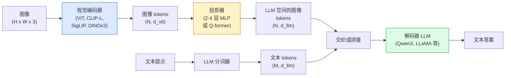

# 视觉-语言模型 —— ViT-MLP-LLM 模式

> 视觉编码器将图像转换为 tokens。MLP 投影器将这些 tokens 映射到 LLM 的嵌入空间。语言模型完成其余工作。这种 ViT-MLP-LLM 模式就是 2026 年所有生产级 VLM 的架构。

**类型：** 学习 + 实践
**语言：** Python
**前置知识：** 第4阶段第14课（ViT）、第4阶段第18课（CLIP）、第7阶段第02课（自注意力）
**时间：** 约 75 分钟

## 学习目标

- 阐述 ViT-MLP-LLM 架构并解释三个组件各自的作用
- 对比 Qwen3-VL、InternVL3.5、LLaVA-Next 和 GLM-4.6V 在参数量、上下文长度和基准性能上的差异
- 解释 DeepStack：为什么多级 ViT 特征比单一最后一层特征更能加强视觉-语言对齐
- 使用跨模态错误率（CMER）在生产中衡量 VLM 幻觉并采取行动

## 问题背景

CLIP（第4阶段第18课）为图像和文本提供了共享嵌入空间，足以用于零样本分类和检索。但它无法回答"这张图片里有多少辆红色汽车？"因为 CLIP 不生成文本——它只计算相似度分数。

视觉-语言模型（VLMs）—— Qwen3-VL、InternVL3.5、LLaVA-Next、GLM-4.6V —— 在 CLIP 家族的图像编码器上接一个完整的语言模型。模型能看到图像和问题，然后生成答案。在 2026 年的开源 VLM 中，它们在多模态基准（MMMU、MMBench、DocVQA、ChartQA、MathVista、OSWorld）上已能媲美或超越 GPT-5 和 Gemini-2.5-Pro。

这三大组件（ViT、投影器、LLM）是标准配置。模型间的差异在于选用哪种 ViT、哪种投影器、哪种 LLM，以及训练数据和微调方案的不同。理解这个模式后，替换任何组件都是机械性工作。

## 概念

### ViT-MLP-LLM 架构



1. **视觉编码器** — 预训练的 ViT（CLIP-L/14、SigLIP、DINOv3 或微调变体）。输出 patch tokens。
2. **投影器** — 一个小型模块（2-4 层 MLP，或 Q-former），将视觉 tokens 映射到 LLM 的嵌入维度。这是微调的主要发生地。
3. **LLM** — 纯解码器语言模型（Qwen3、Llama、Mistral、GLM、InternLM）。按顺序读取视觉和文本 tokens，生成文本。

三个组件理论上都可训练。实践中，视觉编码器和 LLM 基本冻结，主要训练投影器——用少量参数获得高效学习。

### DeepStack

传统投影只使用最后一个 ViT 层。DeepStack（Qwen3-VL）从多个 ViT 深度采样特征并进行堆叠。更深层次携带高级语义；较浅层次携带细粒度空间和纹理信息。同时输入两者到 LLM，填补了"图像包含什么"（语义）和"具体在哪里"（空间定位）之间的差距。

### 三阶段训练

现代 VLM 分阶段训练：

1. **对齐阶段** — 冻结 ViT 和 LLM。仅在图像-描述对上训练投影器。教会投影器将视觉空间映射到语言空间。
2. **预训练** — 解冻全部组件。在大规模交错图像-文本数据（5 亿+ 对）上训练。构建模型的视觉知识。
3. **指令微调** — 在精选的（图像、问题、答案）三元组上微调。教会对话行为和任务格式。这是将"具备视觉能力的 LM"转化为可用助手的关键步骤。

大多数 LoRA 微调针对阶段 3，使用小规模标注数据集。

### 模型家族对比（2026 年初）

| 模型 | 参数量 | 视觉编码器 | LLM | 上下文 | 优势 |
|-------|--------|----------------|-----|---------|-----------|
| Qwen3-VL-235B-A22B（MoE） | 235B（22B 激活） | 自定义 ViT + DeepStack | Qwen3 | 256K | 通用 SOTA，GUI 智能体 |
| Qwen3-VL-30B-A3B（MoE） | 30B（3B 激活） | 自定义 ViT + DeepStack | Qwen3 | 256K | 较小 MoE 替代方案 |
| Qwen3-VL-8B（密集） | 8B | 自定义 ViT | Qwen3 | 128K | 生产环境密集模型默认选项 |
| InternVL3.5-38B | 38B | InternViT-6B | Qwen3 + GPT-OSS | 128K | MMBench / MMVet 表现强劲 |
| InternVL3.5-241B-A28B | 241B（28B 激活） | InternViT-6B | Qwen3 | 128K | 与 GPT-4o 竞争 |
| LLaVA-Next 72B | 72B | SigLIP | Llama-3 | 32K | 开源，易于微调 |
| GLM-4.6V | ~70B | 自定义 | GLM | 64K | 开源，OCR 能力强 |
| MiniCPM-V-2.6 | 8B | SigLIP | MiniCPM | 32K | 适合边缘部署 |

### 视觉智能体

Qwen3-VL-235B 在 OSWorld 上达到全球顶级性能——这是一个面向**视觉智能体**的基准，操作 GUI（桌面、移动、网页）。模型看到截图、理解 UI，并发出动作（点击、输入、滚动）。结合工具使用，可完成常见桌面任务的闭环。这就是 2026 年大多数"AI PC"演示背后的技术。

### 智能体能力 + RoPE 变体

VLM 需要知道视频中的某一帧处于什么**时间点**。Qwen3-VL 从 T-RoPE（时间旋转位置编码）演进到了**基于文本的时间对齐**——在视频帧之间交错显式的时间戳文本 tokens。模型看到"`<timestamp 00:32>` 帧，提示"，能够进行时间关系推理。

### 对齐问题

爬取数据集中 12% 的图像-文本对包含未完全基于图像的文本描述。在此数据上训练的 VLM 会悄无声息地学会幻觉——捏造对象、误读数字、虚构关系。在生产环境中，这是主要的失败模式。

Skywork.ai 引入了**跨模态错误率（CMER）**来追踪这一问题：

```
CMER = 文本置信度高但图像-文本相似度低（通过 CLIP 家族检查器）的输出比例
```

高 CMER 意味着模型正自信地说出与图像无关的内容。在生产监控中将 CMER 作为 KPI 可将幻觉率降低约 35%。关键技巧不是"修复模型"，而是"将高 CMER 输出路由到人工审核"。

### LoRA / QLoRA 微调

大多数团队无法负担 70B VLM 的全量微调。在注意力层和投影器层上使用 LoRA（秩 16-64），或使用 4-bit 基础权重的 QLoRA，可在单张 A100 / H100 上运行。成本：5,000-50,000 个样本，100-5,000 美元算力，2-10 小时训练时间。

### 空间推理仍然薄弱

当前 VLM 在空间推理基准上得分 50-60%（上下、左右、计数、距离）。如果你的应用场景依赖"哪个物体在哪个物体上面"，需要进行充分验证——通用 VLM 的表现低于人类水平。纯空间任务的更好选择：专用的关键点/姿态估计器、深度模型，或带框几何后处理的目标检测模型。

```figure
v4-vlm-projector
```

## 动手实践

### 步骤 1：投影器

这是你最常训练的部分。2-4 层 MLP 搭配 GELU。

```python
import torch
import torch.nn as nn


class Projector(nn.Module):
    def __init__(self, vit_dim=768, llm_dim=4096, hidden=4096):
        super().__init__()
        self.net = nn.Sequential(
            nn.Linear(vit_dim, hidden),
            nn.GELU(),
            nn.Linear(hidden, llm_dim),
        )

    def forward(self, x):
        return self.net(x)
```

输入是 `(N_patches, d_vit)` 的 token 张量。输出是 `(N_patches, d_llm)`。LLM 将每个输出行视为另一个 token。

### 步骤 2：端到端组装 ViT-MLP-LLM

最小化 VLM 的前向传播骨架。真实代码使用 `transformers`；这是概念性布局。

```python
class MinimalVLM(nn.Module):
    def __init__(self, vit, projector, llm, image_token_id):
        super().__init__()
        self.vit = vit
        self.projector = projector
        self.llm = llm
        self.image_token_id = image_token_id  # 文本提示中的占位 token

    def forward(self, image, input_ids, attention_mask):
        # 1. 视觉特征
        vision_tokens = self.vit(image)                     # (B, N_patches, d_vit)
        vision_embeds = self.projector(vision_tokens)       # (B, N_patches, d_llm)

        # 2. 文本嵌入
        text_embeds = self.llm.get_input_embeddings()(input_ids)  # (B, M, d_llm)

        # 3. 将图像占位 token 替换为视觉嵌入
        merged = self._merge(text_embeds, vision_embeds, input_ids)

        # 4. 运行 LLM
        return self.llm(inputs_embeds=merged, attention_mask=attention_mask)

    def _merge(self, text_embeds, vision_embeds, input_ids):
        out = text_embeds.clone()
        expected = vision_embeds.size(1)
        for b in range(input_ids.size(0)):
            positions = (input_ids[b] == self.image_token_id).nonzero(as_tuple=True)[0]
            if len(positions) != expected:
                raise ValueError(
                    f"批次 {b} 有 {len(positions)} 个图像 tokens，但 vision_embeds 有 {expected} 个 patches。"
                    "批次中每个样本必须预填充到相同数量的图像占位 token。")
            out[b, positions] = vision_embeds[b]
        return out
```

文本中的 `<image>` 占位 token 会被真实图像嵌入替换——这是 LLaVA、Qwen-VL 和 InternVL 使用的相同模式。

### 步骤 3：CMER 计算

轻量级运行时检查。

```python
import torch.nn.functional as F


def cross_modal_error_rate(image_emb, text_emb, text_confidence, sim_threshold=0.25, conf_threshold=0.8):
    """
    image_emb, text_emb: 图像和生成文本的嵌入（内部归一化）
    text_confidence:     [0, 1] 范围内每个 token 概率的均值
    返回：                高置信度但图像-文本对齐度低的输出比例
    """
    image_emb = F.normalize(image_emb, dim=-1)
    text_emb = F.normalize(text_emb, dim=-1)
    sim = (image_emb * text_emb).sum(dim=-1)        # 余弦相似度
    high_conf_low_sim = (text_confidence > conf_threshold) & (sim < sim_threshold)
    return high_conf_low_sim.float().mean().item()
```

将 CMER 作为生产 KPI。按端点、按提示类型、按客户进行监控。CMER 上升表明模型开始在某种输入分布上产生幻觉。

### 步骤 4：玩具 VLM 分类器（可运行）

演示投影器可以训练。输入伪造的"ViT 特征"；一个小型 LLM 风格的 token 预测类别。

```python
class ToyVLM(nn.Module):
    def __init__(self, vit_dim=32, llm_dim=64, num_classes=5):
        super().__init__()
        self.projector = Projector(vit_dim, llm_dim, hidden=64)
        self.head = nn.Linear(llm_dim, num_classes)

    def forward(self, vision_tokens):
        projected = self.projector(vision_tokens)
        pooled = projected.mean(dim=1)
        return self.head(pooled)
```

可以在合成（特征，类别）对上训练，少于 200 步即可收敛——足以证明投影器模式有效。

## 生产使用

2026 年生产团队使用 VLM 的三种方式：

- **托管 API** — OpenAI Vision、Anthropic Claude Vision、Google Gemini Vision。无需基础设施，存在供应商风险。
- **开源自建** — 通过 `transformers` 和 `vllm` 部署 Qwen3-VL 或 InternVL3.5。完全控制，前期投入较高。
- **领域微调** — 加载 Qwen2.5-VL-7B 或 LLaVA-1.6-7B，在 5k-50k 自定义样本上 LoRA 微调，使用 `vllm` 或 `TGI` 服务。

```python
from transformers import AutoProcessor, AutoModelForVision2Seq
import torch
from PIL import Image

model_id = "Qwen/Qwen3-VL-8B-Instruct"
processor = AutoProcessor.from_pretrained(model_id)
model = AutoModelForVision2Seq.from_pretrained(model_id, torch_dtype=torch.bfloat16, device_map="auto")

messages = [{
    "role": "user",
    "content": [
        {"type": "image", "image": Image.open("plot.png")},
        {"type": "text", "text": "这张图表展示了什么？"},
    ],
}]
inputs = processor.apply_chat_template(messages, add_generation_prompt=True, tokenize=True, return_dict=True, return_tensors="pt").to("cuda")
generated = model.generate(**inputs, max_new_tokens=256)
answer = processor.decode(generated[0][inputs["input_ids"].shape[1]:], skip_special_tokens=True)
```

`apply_chat_template` 隐藏了 `<image>` 占位 token 的分词细节；模型内部处理合并逻辑。

## 交付成果

本课产出：

- `outputs/prompt-vlm-selector.md` — 根据精度、延迟、上下文长度和预算，选择 Qwen3-VL / InternVL3.5 / LLaVA-Next / API。
- `outputs/skill-cmer-monitor.md` — 生成用于在生产 VLM 端点中集成跨模态错误率的代码，包括各端点仪表板和告警阈值。

## 练习

1. **（简单）** 对五张图片分别运行三个提示（"这是什么？"、"数一下物体数量"、"描述场景"），用手评估每个答案是否正确/部分正确/产生幻觉。计算初步的类 CMER 指标。
2. **（中等）** 使用 LoRA（秩 16）在 500 张目标领域的图像及描述上微调 Qwen2.5-VL-3B 或 LLaVA-1.6-7B。对比零样本与微调后的 MMBench 风格准确率。
3. **（困难）** 将 VLM 的图像编码器替换为 DINOv3，而非默认的 SigLIP/CLIP。仅重新训练投影器（冻结 LLM + 冻结 DINOv3）。衡量密集预测任务（计数、空间推理）是否有所改进。

## 关键术语

| 术语 | 人们怎么说 | 实际含义 |
|------|----------------|----------------------|
| ViT-MLP-LLM | "VLM 模式" | 视觉编码器 + 投影器 + 语言模型；2026 年所有 VLM 的基础架构 |
| Projector | "桥梁" | 2-4 层 MLP（或 Q-former），将视觉 tokens 映射到 LLM 嵌入空间 |
| DeepStack | "Qwen3-VL 特征技巧" | 堆叠多级 ViT 特征，而非仅使用最后一层 |
| Image token | "<image> 占位符" | 文本流中的特殊 token，被投影后的视觉嵌入替换 |
| CMER | "幻觉 KPI" | 跨模态错误率；文本置信度高但图像-文本相似度低时数值较高 |
| Visual agent | "会点击的 VLM" | 操作 GUI 的 VLM（OSWorld、移动、网页），支持工具调用 |
| Q-former | "固定数量 token 桥梁" | BLIP-2 风格的投影器，输出固定数量的视觉查询 tokens |
| Alignment / pre-training / instruction tuning | "三个阶段" | 标准 VLM 训练流水线 |

## 延伸阅读

- [Qwen3-VL 技术报告 (arXiv 2511.21631)](https://arxiv.org/abs/2511.21631)
- [InternVL3.5 推进开源多模态模型 (arXiv 2508.18265)](https://arxiv.org/html/2508.18265v1)
- [LLaVA-Next 系列](https://llava-vl.github.io/blog/2024-05-10-llava-next-stronger-llms/)
- [BentoML: 2026 最佳开源 VLM](https://www.bentoml.com/blog/multimodal-ai-a-guide-to-open-source-vision-language-models)
- [MMMU: 多学科多模态理解基准](https://mmmu-benchmark.github.io/)
- [VLM 在制造业中的应用 (Robotics Tomorrow, 2026年3月)](https://www.roboticstomorrow.com/story/2026/03/when-machines-learn-to-see-like-experts-the-rise-of-vision-language-models-in-manufacturing/26335/)
