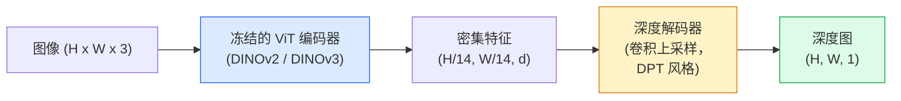

# 单目深度与几何估计

> 深度图是一张单通道图像，其中每个像素值代表该像素到相机的距离。仅凭一帧 RGB 图像预测深度图，在以前没有立体视觉或 LiDAR 的情况下是几乎不可能的。但在 2026 年，一个冻结的 ViT 编码器加上一个轻量级解码头，就能达到与真实值相差仅百分之几的精度。

**类型：** 构建 + 使用
**语言：** Python
**前置知识：** Phase 4 Lesson 14（ViT）、Phase 4 Lesson 17（自监督视觉）、Phase 4 Lesson 07（U-Net）
**预计时间：** 约 60 分钟

## 学习目标

- 区分相对深度与度量深度，并说明 MiDaS、Marigold、Depth Anything V3、ZoeDepth 等生产模型分别解决哪种深度
- 使用 Depth Anything V3（DINOv2 骨干）对任意单张图像预测深度，无需相机标定
- 解释为什么从单张图像就能估计深度（透视线索、纹理梯度、学习到的先验），以及它的局限性（无法恢复绝对尺度、被遮挡的几何结构）
- 利用深度图和针孔相机内参将 2D 检测框提升为 3D 点

## 问题背景

深度是 2D 计算机视觉中缺失的那个维度。给定 RGB 图像，你只知道物体在图像平面上出现在哪里；你不知道它们离相机有多远。深度传感器（立体相机、LiDAR、飞行时间相机）可以直接解决这个问题，但它们昂贵、脆弱且有效距离有限。

单目深度估计——从单帧 RGB 图像预测深度——过去会产生模糊且不可靠的结果。到 2026 年，大型预训练编码器改变了这一切：Depth Anything V3 使用冻结的 DINOv2 骨干，能够生成在室内、户外、医疗和卫星等不同域中都泛化良好的深度图。Marigold 将深度估计重新定义为条件扩散问题。ZoeDepth 回归真实的度量距离。

深度也是连接 2D 检测和 3D 理解的桥梁：将检测框的像素乘以深度值，就能把 2D 物体提升为 3D 点云。这是所有 AR 遮挡系统、所有避障管线以及所有"拿起杯子"机器人的核心。

## 核心概念

### 相对深度 vs 度量深度

- **相对深度**——有序但不带真实世界单位的 `z` 值。"像素 A 比像素 B 更近，但距离之比不与米制单位绑定。"
- **度量深度**——从相机出发的绝对距离（单位：米）。需要模型学到图像线索与实际距离之间的统计关系。

MiDaS 和 Depth Anything V3 输出相对深度。Marigold 输出相对深度。ZoeDepth、UniDepth 和 Metric3D 输出度量深度。度量模型对相机内参敏感；相对模型则不敏感。

### 编码器-解码器模式



Depth Anything V3 冻结编码器，仅训练 DPT 风格的解码器。编码器提供丰富的特征；解码器将其插值回图像分辨率并回归深度。

### 为什么单张图像能产生深度

2D 图像中包含许多与深度相关的单目线索：

- **透视**——3D 中的平行线在 2D 中会汇聚。
- **纹理梯度**——远处的表面具有更小、更密集的纹理。
- **遮挡顺序**——较近的物体会遮挡较远的物体。
- **大小恒常性**——已知物体（汽车、人）提供近似尺度。
- **大气透视**——在户外场景中，远处的物体看起来更朦胧、偏蓝。

在数十亿张图像上训练的 ViT 已经将上述线索内化。只要有足够多的数据和强大的骨干网络，单目深度就能在没有显式 3D 监督的情况下达到合理的精度。

### 单目深度做不到的事情

- **绝对度量尺度**——如果没有内参或场景中的已知物体，就无法确定。网络可以预测"杯子比勺子远两倍"，但不知道杯子到底是 1 米还是 10 米远。
- **被遮挡的几何**——椅子的背面是不可见的，无法可靠推断。
- **真正无纹理/高反射表面**——镜子、玻璃、纯色墙壁。网络会给出看起来合理但实际错误的深度值。

### 2026 年的 Depth Anything V3

- 原始 DINOv2 ViT-L/14 作为编码器（冻结）。
- DPT 解码器。
- 在多样化的已配准图像对上训练（除光度一致性外无需显式深度监督）。
- 能够从**任意数量的视觉输入**中预测空间一致的几何结构，无论是否有已知的相机位姿。
- 在单目深度、任意视角几何、视觉渲染、相机位姿估计等任务上均达到 SOTA。

这是 2026 年你需要深度时的即插即用模型。

### Marigold——基于扩散的深度估计

Marigold（Ke 等，CVPR 2024）将深度估计重新定义为条件图像到图像的扩散过程。条件输入：RGB。目标输出：深度图。使用预训练的 Stable Diffusion 2 U-Net 作为骨干。输出的深度图在物体边界处异常清晰。权衡：推理速度比前馈模型慢（需要 10-50 步去噪）。

### 内参与针孔相机模型

要将带深度 `d` 的像素 `(u, v)` 提升到相机坐标系中的 3D 点 `(X, Y, Z)`：

```
fx, fy, cx, cy = 相机内参
X = (u - cx) * d / fx
Y = (v - cy) * d / fy
Z = d
```

内参可以来自 EXIF 元数据、标定板，或单目内参估计器（Perspective Fields、UniDepth）。没有内参时，你也可以假设 60-70° FOV 和中等分辨率的主点来渲染点云——可用于可视化，不适合测量。

### 评估指标

两个标准指标：

- **AbsRel**（绝对相对误差）：`mean(|d_pred - d_gt| / d_gt)`。越低越好。生产级模型约为 0.05-0.1。
- **delta < 1.25**（阈值精度）：满足 `max(d_pred/d_gt, d_gt/d_pred) < 1.25` 的像素比例。越高越好。SOTA 模型可达 0.9+。

对于相对深度（Depth Anything V3、MiDaS），评估使用这两种指标的尺度与平移不变版本。

```figure
depth-sweep
```

## 动手实践

### 步骤 1：深度评估指标

```python
import torch

def abs_rel_error(pred, target, mask=None):
    if mask is not None:
        pred = pred[mask]
        target = target[mask]
    return (torch.abs(pred - target) / target.clamp(min=1e-6)).mean().item()


def delta_accuracy(pred, target, threshold=1.25, mask=None):
    if mask is not None:
        pred = pred[mask]
        target = target[mask]
    ratio = torch.maximum(pred / target.clamp(min=1e-6), target / pred.clamp(min=1e-6))
    return (ratio < threshold).float().mean().item()
```

评估前务必屏蔽无效深度像素（零值、NaN、饱和值）。

### 步骤 2：尺度与平移对齐

对于相对深度模型，在计算指标前将预测对齐到真实值。通过最小二乘法拟合 `a * pred + b = target`：

```python
def align_scale_shift(pred, target, mask=None):
    if mask is not None:
        p = pred[mask]
        t = target[mask]
    else:
        p = pred.flatten()
        t = target.flatten()
    A = torch.stack([p, torch.ones_like(p)], dim=1)
    coeffs, *_ = torch.linalg.lstsq(A, t.unsqueeze(-1))
    a, b = coeffs[:2, 0]
    return a * pred + b
```

评估 MiDaS / Depth Anything 时，在调用 `abs_rel_error` 前先运行 `align_scale_shift`。

### 步骤 3：将深度提升为点云

```python
import numpy as np

def depth_to_point_cloud(depth, intrinsics):
    H, W = depth.shape
    fx, fy, cx, cy = intrinsics
    v, u = np.meshgrid(np.arange(H), np.arange(W), indexing="ij")
    z = depth
    x = (u - cx) * z / fx
    y = (v - cy) * z / fy
    return np.stack([x, y, z], axis=-1)


depth = np.random.uniform(0.5, 4.0, (240, 320))
intr = (320.0, 320.0, 160.0, 120.0)
pc = depth_to_point_cloud(depth, intr)
print(f"点云形状：{pc.shape}  (H, W, 3)")
```

一个函数，适用于所有 3D 提升场景。将点云导出为 `.ply` 格式，用 MeshLab 或 CloudCompare 打开即可查看。

### 步骤 4：用合成深度场景进行冒烟测试

```python
def synthetic_depth(size=96):
    yy, xx = np.meshgrid(np.arange(size), np.arange(size), indexing="ij")
    # 地面：从前（顶部）到后（底部）的线性渐变
    depth = 1.0 + (yy / size) * 4.0
    # 中间的盒子：更近
    mask = (np.abs(xx - size / 2) < size / 6) & (np.abs(yy - size * 0.6) < size / 6)
    depth[mask] = 2.0
    return depth.astype(np.float32)


gt = torch.from_numpy(synthetic_depth(96))
pred = gt + 0.3 * torch.randn_like(gt)  # 模拟预测值
aligned = align_scale_shift(pred, gt)
print(f"对齐前  absRel = {abs_rel_error(pred, gt):.3f}")
print(f"对齐后  absRel = {abs_rel_error(aligned, gt):.3f}")
```

### 步骤 5：Depth Anything V3 使用示例（参考）

```python
import torch
from transformers import pipeline
from PIL import Image

pipe = pipeline(task="depth-estimation", model="LiheYoung/depth-anything-v2-large")

image = Image.open("street.jpg").convert("RGB")
out = pipe(image)
depth_np = np.array(out["depth"])
```

三行代码即可。`out["depth"]` 是 PIL 灰度图；转换为 numpy 数组以进行数学运算。针对 Depth Anything V3，模型 ID 发布后替换一次即可；API 保持不变。

## 如何使用

- **Depth Anything V3**（Meta AI / ByteDance，2024-2026）——相对深度的首选。生产环境中最快的 ViT-large 骨干模型。
- **Marigold**（ETH，2024）——视觉质量最高，推理速度较慢。
- **UniDepth**（ETH，2024）——带相机内参估计的度量深度。
- **ZoeDepth**（Intel，2023）——度量深度；较旧但仍可靠。
- **MiDaS v3.1**——经典但稳定；适合用作对比基线。

典型集成流程：

1. RGB 帧到达。
2. 深度模型生成深度图。
3. 检测器生成检测框。
4. 通过深度将检测框中心点提升至 3D；如有点云则与之融合。
5. 下游任务：AR 遮挡、路径规划、物体尺寸估计、立体替换。

对于实时应用，Depth Anything V2 Small（INT8 量化版）在消费级 GPU 上以 518×518 分辨率可实现约 30 fps。

## 交付成果

本课将产出：

- `outputs/prompt-depth-model-picker.md`——根据延迟、度量/相对需求、场景类型在 Depth Anything V3、Marigold、UniDepth、MiDaS 之间做出选择。
- `outputs/skill-depth-to-pointcloud.md`——一个技能模块，从深度图构建点云，正确处理内参并导出为 `.ply` 格式。

## 练习

1. **（简单）** 对桌面拍摄的 10 张图像运行 Depth Anything V2。将深度保存为灰度 PNG 并仔细观察。找出一个预测深度看起来错误的物体，并解释单目线索为何失效。
2. **（中等）** 给定 Depth Anything V2 的 RGB + 深度，提升为点云并用 `open3d` 渲染。比较两个场景（室内 / 户外），指出哪个看起来更可信。
3. **（困难）** 取五对图像对，仅在已知物体的位置上有差异（例如瓶子移近 30 cm）。使用 UniDepth 对两张图像分别预测度量深度。报告预测的距离差与真实 30 cm 的差异。

## 关键术语

| 术语 | 人们怎么说 | 实际含义 |
|------|-----------|---------|
| 单目深度 | "单图像深度" | 从单个 RGB 帧估计深度，无需立体视觉或 LiDAR |
| 相对深度 | "有序深度" | 有序但不带真实世界单位的 z 值 |
| 度量深度 | "绝对距离" | 以米为单位的深度；需要标定或用度量监督训练的模型 |
| AbsRel | "绝对相对误差" | \|d_pred - d_gt\| / d_gt 的均值；标准深度评估指标 |
| Delta 精度 | "delta < 1.25" | 预测值在真实值 25% 以内的像素比例 |
| 针孔相机 | "fx, fy, cx, cy" | 将 (u, v, d) 提升至 (X, Y, Z) 所使用的相机模型 |
| DPT | "稠密预测 Transformer" | 在冻结 ViT 编码器之上使用的基于卷积的解码器，用于深度估计 |
| DINOv2 骨干 | "它之所以有效的根本原因" | 自监督特征，无需深度标签即可跨域泛化 |

## 延伸阅读

- [Depth Anything V3 论文页面](https://depth-anything.github.io/)——使用 DINOv2 编码器的 SOTA 单目深度模型
- [Marigold (Ke 等，CVPR 2024)](https://marigoldmonodepth.github.io/)——基于扩散的深度估计
- [UniDepth (Piccinelli 等，2024)](https://arxiv.org/abs/2403.18913)——带内参估计的度量深度
- [MiDaS v3.1 (Intel ISL)](https://github.com/isl-org/MiDaS)——经典的相对深度基线
- [DINOv3 博客文章 (Meta)](https://ai.meta.com/blog/dinov3-self-supervised-vision-model/)——带来深度精度飞跃的编码器系列
