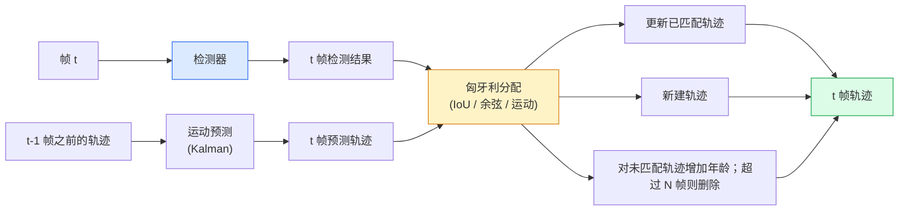

# 多目标跟踪与视频记忆

> 跟踪 = 检测 + 关联。逐帧检测，通过将本帧检测与上一帧的轨迹按 ID 匹配来关联。

**类型：** 实践项目
**语言：** Python
**前置知识：** Phase 4 Lesson 06（YOLO 检测）、Phase 4 Lesson 08（Mask R-CNN）、Phase 4 Lesson 24（SAM 3）
**预计时间：** 约 60 分钟

## 学习目标

- 区分"检测后跟踪"（tracking-by-detection）与基于查询的跟踪，并列举各算法家族（SORT、DeepSORT、ByteTrack、BoT-SORT、SAM 2 记忆跟踪器、SAM 3.1 Object Multiplex）
- 从零实现 IoU + 匈牙利算法的匹配逻辑，用于经典跟踪
- 解释 SAM 2 的记忆库及其为何比基于 IoU 的关联更能处理遮挡
- 理解三项跟踪指标（MOTA、IDF1、HOTA）并能为给定用例选择合适指标

## 问题背景

检测器告诉你某一帧中物体在哪里。跟踪器告诉你 `t` 帧中的哪个检测对应 `t-1` 帧中的同一物体。没有这一步，你就无法统计穿越警戒线的物体数量、追踪被遮挡的球，或判断"#4 号车已在车道中行驶 8 秒"。

跟踪是每一个视频类产品的基础：体育分析、安防监控、自动驾驶、医学视频分析、野生动物监测、商标计数。核心模块高度通用：逐帧检测器、运动模型（卡尔曼滤波或更复杂的模型）、关联步骤（在 IoU / 余弦相似度 / 学习特征上运行匈牙利算法）、以及轨迹生命周期（生成、更新、消亡）。

2026 年出现了两种新模式：**SAM 2 基于记忆的跟踪**（使用特征记忆而非运动模型关联）和 **SAM 3.1 Object Multiplex**（共享同一概念的多实例记忆）。本课先讲解经典方案，再讲解基于记忆的跟踪方案。

## 概念讲解

### Tracking-by-detection



你在 2026 年遇到的每一个跟踪器都是该循环的变体。区别如下：

- **SORT**（2016）：卡尔曼滤波 + IoU 匈牙利分配。简单快速，无外观模型。
- **DeepSORT**（2017）：SORT + 基于 CNN 的每个轨迹外观特征（ReID 嵌入）。更好地处理交叉场景。
- **ByteTrack**（2021）：将低置信度检测结果作为第二阶段候选进行关联；无需外观特征，但在 MOT17 上表现优异。
- **BoT-SORT**（2022）：ByteTrack + 相机运动补偿 + ReID。
- **StrongSORT / OC-SORT**：ByteTrack 的后代，改进了运动和外观建模。

### 卡尔曼滤波（一段式概括）

卡尔曼滤波器为每条轨迹维护状态 `(x, y, w, h, dx, dy, dw, dh)` 及协方差矩阵。在每一帧中，先用恒定速度模型**预测**状态，再用匹配到的检测结果**更新**。当预测不确定性较高时，更新过程更信任检测结果。这带来了平滑的轨迹预测能力，并能在短时遮挡（1-5 帧）中维持轨迹。

所有经典跟踪器都在运动预测阶段使用卡尔曼滤波。

### 匈牙利算法

给定一个 `M x N` 的代价矩阵（轨迹 × 检测结果），找出总代价最小的一对一匹配方案。代价通常定义为 `1 - IoU(轨迹框, 检测框)` 或外观特征的负余弦相似度。时间复杂度为 O((M+N)^3)；当 M、N 不超过 ~1000 时，通过 `scipy.optimize.linear_sum_assignment` 在 Python 中运行足够快。

### ByteTrack 的核心思路

标准跟踪器会丢弃低置信度检测结果（< 0.5）。ByteTrack 将它们保留为**第二阶段候选**：在将轨迹与高置信度检测结果匹配后，未匹配的轨迹会以略宽松的 IoU 阈值尝试匹配低置信度检测结果。可有效恢复短时遮挡、减少人群附近的 ID 切换。

### SAM 2 基于记忆的跟踪

SAM 2 通过为每个实例维护**记忆库**（per-instance spatio-temporal features）来处理视频。在某一帧上给定一个提示（点击、框选或文本），它将实例编码进记忆。在后续帧中，记忆会与新帧特征做交叉注意力（cross-attended），解码器输出同一实例在新帧中的掩码。

无需卡尔曼滤波，无需匈牙利分配。关联隐含在记忆 - 注意力操作中。

优点：
- 对大面积遮挡鲁棒（记忆可在多帧间携带实例身份）
- 与 SAM 3 的文本提示结合后可实现开放词汇跟踪
- 无需单独的motion model

缺点：
- 对多目标跟踪而言，速度慢于 ByteTrack
- 记忆库会随帧增长而膨胀；限制了上下文窗口大小

### SAM 3.1 Object Multiplex

早期 SAM 2 / SAM 3 的跟踪方案为每个实例维护独立的记忆库。50 个物体就需要 50 个记忆库。Object Multiplex（2026 年 3 月）将其合并为一个共享记忆，配合**逐实例查询 token**。代价随实例数量次线性增长。

Multiplex 是 2026 年人群跟踪的新默认方案：演唱会人群、仓库工人、交通路口。

### 三项关键指标

- **MOTA（Multi-Object Tracking Accuracy）** — 1 - (FN + FP + ID 切换数) / GT。按错误类型加权；一个综合指标，将检测失败和关联失败混在一起。
- **IDF1（ID F1）** — ID 精确率和召回率的调和平均。专门衡量每个真实轨迹在多长时间内保持其 ID。比 MOTA 更适合对 ID 切换敏感的任务。
- **HOTA（Higher Order Tracking Accuracy）** — 分解为检测精度（DetA）和关联精度（AssA）。自 2020 年起成为社区标准，最为全面。

安防场景（识别"谁是谁"）：报告 IDF1。体育分析（统计传球）：HOTA。一般学术对比：HOTA。

```figure
cv3-track-assoc
```

## 实践操作

### 步骤 1：基于 IoU 的代价矩阵

```python
import numpy as np


def bbox_iou(a, b):
    """
    a, b: 形状为 (N, 4) 的数组，格式为 [x1, y1, x2, y2]。
    返回 (N_a, N_b) 的 IoU 矩阵。
    """
    ax1, ay1, ax2, ay2 = a[:, 0], a[:, 1], a[:, 2], a[:, 3]
    bx1, by1, bx2, by2 = b[:, 0], b[:, 1], b[:, 2], b[:, 3]
    inter_x1 = np.maximum(ax1[:, None], bx1[None, :])
    inter_y1 = np.maximum(ay1[:, None], by1[None, :])
    inter_x2 = np.minimum(ax2[:, None], bx2[None, :])
    inter_y2 = np.minimum(ay2[:, None], by2[None, :])
    inter = np.clip(inter_x2 - inter_x1, 0, None) * np.clip(inter_y2 - inter_y1, 0, None)
    area_a = (ax2 - ax1) * (ay2 - ay1)
    area_b = (bx2 - bx1) * (by2 - by1)
    union = area_a[:, None] + area_b[None, :] - inter
    return inter / np.clip(union, 1e-8, None)
```

### 步骤 2：极简 SORT 风格跟踪器

为简洁起见省略固定恒定速度的卡尔曼预测——此处仅使用 IoU 关联；生产环境中的卡尔曼预测至关重要。完整版本可直接使用 `sort` Python 包。

```python
from scipy.optimize import linear_sum_assignment


class Track:
    def __init__(self, tid, bbox, frame):
        self.id = tid
        self.bbox = bbox
        self.last_frame = frame
        self.hits = 1

    def update(self, bbox, frame):
        self.bbox = bbox
        self.last_frame = frame
        self.hits += 1


class SimpleTracker:
    def __init__(self, iou_threshold=0.3, max_age=5):
        self.tracks = []
        self.next_id = 1
        self.iou_threshold = iou_threshold
        self.max_age = max_age

    def step(self, detections, frame):
        if not self.tracks:
            for d in detections:
                self.tracks.append(Track(self.next_id, d, frame))
                self.next_id += 1
            return [(t.id, t.bbox) for t in self.tracks]

        track_boxes = np.array([t.bbox for t in self.tracks])
        det_boxes = np.array(detections) if len(detections) else np.empty((0, 4))

        iou = bbox_iou(track_boxes, det_boxes) if len(det_boxes) else np.zeros((len(track_boxes), 0))
        cost = 1 - iou
        cost[iou < self.iou_threshold] = 1e6

        matched_track = set()
        matched_det = set()
        if cost.size > 0:
            row, col = linear_sum_assignment(cost)
            for r, c in zip(row, col):
                if cost[r, c] < 1.0:
                    self.tracks[r].update(det_boxes[c], frame)
                    matched_track.add(r); matched_det.add(c)

        for i, d in enumerate(det_boxes):
            if i not in matched_det:
                self.tracks.append(Track(self.next_id, d, frame))
                self.next_id += 1

        self.tracks = [t for t in self.tracks if frame - t.last_frame <= self.max_age]
        return [(t.id, t.bbox) for t in self.tracks]
```

60 行代码。接收每帧检测结果，输出每帧轨迹 ID。真实系统还会加入卡尔曼预测、ByteTrack 的第二阶段重匹配，以及外观特征。

### 步骤 3：合成轨迹测试

```python
def synthetic_frames(num_frames=20, num_objects=3, H=240, W=320, seed=0):
    rng = np.random.default_rng(seed)
    starts = rng.uniform(20, 200, size=(num_objects, 2))
    velocities = rng.uniform(-5, 5, size=(num_objects, 2))
    frames = []
    for f in range(num_frames):
        dets = []
        for i in range(num_objects):
            cx, cy = starts[i] + f * velocities[i]
            dets.append([cx - 10, cy - 10, cx + 10, cy + 10])
        frames.append(dets)
    return frames


tracker = SimpleTracker()
for f, dets in enumerate(synthetic_frames()):
    tracks = tracker.step(dets, f)
```

三个沿直线运动的物体应在全部 20 帧内保持各自的 ID。

### 步骤 4：ID 切换指标

```python
def count_id_switches(tracks_per_frame, gt_per_frame):
    """
    tracks_per_frame:  每帧预测轨迹列表，格式为 list of [(track_id, bbox)]
    gt_per_frame:      每帧真实轨迹列表，格式为 list of [(gt_id, bbox)]
    返回 ID 切换次数。
    """
    prev_assignment = {}
    switches = 0
    for tracks, gts in zip(tracks_per_frame, gt_per_frame):
        if not tracks or not gts:
            continue
        t_boxes = np.array([b for _, b in tracks])
        g_boxes = np.array([b for _, b in gts])
        iou = bbox_iou(g_boxes, t_boxes)
        for g_idx, (gt_id, _) in enumerate(gts):
            j = iou[g_idx].argmax()
            if iou[g_idx, j] > 0.5:
                t_id = tracks[j][0]
                if gt_id in prev_assignment and prev_assignment[gt_id] != t_id:
                    switches += 1
                prev_assignment[gt_id] = t_id
    return switches
```

这是一个简化的 IDF1 近似指标：统计真实物体被分配的预测轨迹 ID 发生变化的次数。真实的 MOTA / IDF1 / HOTA 工具链请参考 `py-motmetrics` 和 `TrackEval`。

## 生产使用

2026 年的生产级跟踪器：

- `ultralytics` —— 内置 YOLOv8 + ByteTrack / BoT-SORT。`results = model.track(source, tracker="bytetrack.yaml")`，即默认方案。
- `supervision`（Roboflow）—— ByteTrack 封装及标注工具。
- SAM 2 / SAM 3.1 —— 通过 `processor.track()` 实现基于记忆的跟踪。
- 自定义方案：检测器（YOLOv8 / RT-DETR）+ `sort-tracker` / `OC-SORT` / `StrongSORT`。

如何选择：

- 行人 / 车辆 / 箱体，30+ fps：使用 **ByteTrack + ultralytics**
- 人群中有大量同类实例：**SAM 3.1 Object Multiplex**
- 重度遮挡且有明显外观特征：**DeepSORT / StrongSORT**（依赖 ReID 特征）
- 体育 / 复杂交互场景：**BoT-SORT** 或学习式跟踪器（如 MOTRv3）

## 交付物

本课将产出：

- `outputs/prompt-tracker-picker.md` —— 根据场景类型、遮挡模式和延迟预算，为 SORT / ByteTrack / BoT-SORT / SAM 2 / SAM 3.1 提供选型建议。
- `outputs/skill-mot-evaluator.md` —— 编写完整的 MOTA / IDF1 / HOTA 评估流水线，对接真实轨迹 ground-truth。

## 练习

1. **(简单)** 用上述合成跟踪器分别跑 3、10、30 个物体，报告各情况下的 ID 切换次数，指出纯 IoU 关联在何时开始失效。
2. **(中等)** 在关联前加入恒定速度卡尔曼预测步骤，验证短时（2-3 帧）遮挡不再导致 ID 切换。
3. **(困难)** 通过 `transformers` 集成 SAM 2 基于记忆的跟踪器作为备选后端。在 30 秒人群片段上分别运行 SimpleTracker 和 SAM 2，手动标注 5 个显著人物的真实 ID，对比两者的 ID 切换次数。

## 关键术语

| 术语 | 通常的说法 | 实际含义 |
|------|-----------|---------|
| Tracking-by-detection | "检测后再关联" | 逐帧检测 + 在 IoU / 外观上运行匈牙利分配 |
| Kalman filter | "运动预测" | 线性动力学模型 + 协方差，用于平滑轨迹预测和处理遮挡 |
| Hungarian algorithm | "最优分配" | 求解最小代价二分图匹配；对应 `scipy.optimize.linear_sum_assignment` |
| ByteTrack | "低置信度第二阶段" | 将未匹配轨迹与低置信度检测再次匹配，以恢复短时遮挡 |
| DeepSORT | "SORT + 外观" | 引入 ReID 特征进行跨帧匹配，更利于保持 ID 一致性 |
| Memory bank | "SAM 2 的 trick" | 跨帧存储的逐实例时空特征；交叉注意力替代显式关联 |
| Object Multiplex | "SAM 3.1 共享记忆" | 单一共享记忆 + 逐实例查询，实现快速的多目标跟踪 |
| HOTA | "现代跟踪指标" | 分解为检测精度和关联精度；社区主流标准 |

## 延伸阅读

- [SORT (Bewley et al., 2016)](https://arxiv.org/abs/1602.00763) —— 最简 tracking-by-detection 论文
- [DeepSORT (Wojke et al., 2017)](https://arxiv.org/abs/1703.07402) —— 引入外观特征
- [ByteTrack (Zhang et al., 2022)](https://arxiv.org/abs/2110.06864) —— 低置信度第二阶段匹配
- [BoT-SORT (Aharon et al., 2022)](https://arxiv.org/abs/2206.14651) —— 相机运动补偿
- [HOTA (Luiten et al., 2020)](https://arxiv.org/abs/2009.07736) —— 分解式跟踪指标
- [SAM 2 video segmentation (Meta, 2024)](https://ai.meta.com/sam2/) —— 基于记忆的跟踪器
- [SAM 3.1 Object Multiplex (Meta, March 2026)](https://ai.meta.com/blog/segment-anything-model-3/)
