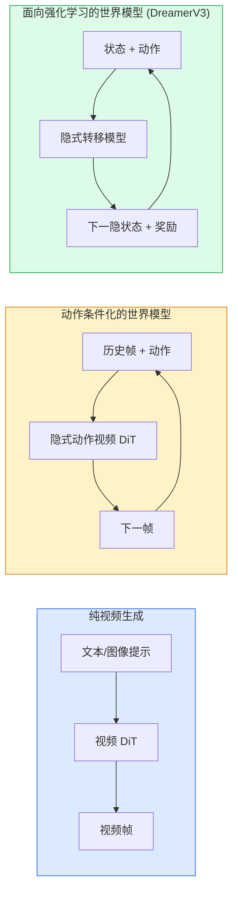

# 世界模型与视频扩散

> 能够预测场景接下来几秒的 video 模型就是一个世界模拟器。若将这一预测基于动作进行条件化，你就得到了一个可学习的游戏引擎。

**类型：** 学习 + 构建
**语言：** Python
**前置要求：** 第4阶段 第10课（扩散模型）、第4阶段 第12课（视频理解）、第4阶段 第23课（DiT + 整流流）
**时间：** ~75 分钟

## 学习目标

- 说明纯视频生成模型（Sora 2）与动作条件化的世界模型（Genie 3、DreamerV3）之间的区别
- 描述视频 DiT 架构：空时图块、3D 位置编码、跨 (T, H, W) token 的联合注意力
- 追溯世界模型如何接入机器人系统：VLM 规划 → 视频模型仿真 → 逆动力学发出动作
- 针对给定用例（创意视频、交互式仿真、自动驾驶合成）在 Sora 2、Genie 3、Runway GWM-1 Worlds、Wan-Video、HunyuanVideo 之间做出选择

## 问题背景

2026 年，视频生成与世界建模走向融合。一个能够生成长达一分钟连贯视频的模型，从某种意义上说已经学会了世界如何运动：客体永久性、重力、因果关系、风格。如果将这些预测以动作为条件（向左走、开门），视频模型就变成一个可学习的仿真器，可以替代游戏引擎、驾驶模拟器或机器人环境。

 stakes 是具体的。Genie 3 能从单张图片生成可玩环境。Runway GWM-1 Worlds 合成无限可探索场景。Sora 2 能生成长达一分钟、音频同步且带有物理建模的视频。NVIDIA Cosmos-Drive、Wayve Gaia-2、Tesla DrivingWorld 为自动驾驶训练数据生成逼真驾驶视频。世界模型范式正在悄然接管机器人的 sim-to-real 训练。

本课是第4阶段的"大图景"课程，它将图像生成、视频理解与智能体推理串联起来，连接到当前主流研究正在趋向的架构模式。

## 概念

### 世界建模的三个家族



- **Sora 2** 是纯视频生成模型，仅以提示词为条件。没有动作接口，你无法在生成过程中"操控"它。
- **Genie 3**、**GWM-1 Worlds**、**Mirage / Magica** 是动作条件化的世界模型。从连续帧对中判别性地推断隐式动作，再以该动作对下一帧预测进行条件化。具有交互性——你按下按键或移动摄像头，场景即响应。
- **DreamerV3** 及经典 RL 世界模型家族在隐空间中预测，并以显式动作为条件，通过奖励信号进行训练。视觉表现较弱，但对样本高效的 RL 更有用。

### 视频 DiT 架构

```
视频隐变量：          (C, T, H, W)
空间图块化：           每帧划分为 P_h x P_w 的网格图块
时间图块化：           将 P_t 帧聚合成一个时间图块
所得 token：          (T / P_t) * (H / P_h) * (W / P_w) 个 token
```

位置编码是 3D 的：每个 (t, h, w) 坐标对应一个 rotary 或学习型嵌入。注意力可以是：

- **全联合**——所有 token 互相注意。复杂度为 O(N^2)，N 为 token 数。长视频下不可行。
- **分区**——交替使用时间注意力（同一空间位置，跨时间：`(H*W) * T^2`）和空间注意力（同一时刻，跨空间：`T * (H*W)^2`）。TimeSformer 和大多数视频 DiT 均采用此方案。
- **窗口**——(t, h, w) 上的局部窗口。Video Swin 使用此方案。

2026 年的每个视频扩散模型均使用上述三种模式之一，加上 AdaLN 条件化（第23课）和整流流。

### 动作条件化：隐式动作模型

Genie 通过对连续帧对判别性地预测动作，逐帧学习一个**隐式动作**。模型的解码器以推断出的隐式动作为条件——而非直接以键盘按键为条件。推理时，用户可以指定一个隐式动作（或从一个全新先验中采样），模型即生成与该动作一致的下一帧。

Sora 完全跳过了动作接口。其解码器从过去的空时 token 预测未来的空时 token。提示词仅控制起始；生成过程中没有任何东西对其进行操控。

### 物理合理性

Sora 2 于 2026 年的发布明确宣传了**物理合理性**：重量、平衡、客体永久性、因果关系。团队通过人工评分衡量——与 Sora 1 相比，模型在物体掉落、角色碰撞、故意失误（如跳跃失败）等场景上有了明显改进。

合理性不足仍是主要的失败模式。2024-2025 年人们吃意大利面或用杯子喝水的视频暴露了模型缺乏持久客体表征的问题。2026 年的模型（Sora 2、Runway Gen-5、HunyuanVideo）有所减少但并未根除此类问题。

### 自动驾驶世界模型

驾驶世界模型以轨迹、边界框或导航地图为条件生成逼真的道路场景。典型用途：

- **Cosmos-Drive-Dreams**（NVIDIA）——生成用于 RL 训练的分钟级驾驶视频。
- **Gaia-2**（Wayve）——以轨迹为条件的场景合成，用于策略评估。
- **DrivingWorld**（Tesla）——模拟不同天气、时段、交通状况。
- **Vista**（ByteDance）——反应式驾驶场景合成。

它们取代了针对极端案例的昂贵真实数据采集——如夜间行人横穿马路、结冰路口、不常见的车辆类型——否则就需要数百万英里驾驶数据才能覆盖这些场景。

### 机器人系统栈：VLM + 视频模型 + 逆动力学

新兴的三组件机器人闭环：

1. **VLM** 解析目标（"拿起红色杯子"），规划高层动作序列。
2. **视频生成模型** 仿真执行每个动作会呈现什么样——预测 N 帧之后的观测结果。
3. **逆动力学模型** 提取能够产生这些观测的具体电机命令。

这取代了奖励塑形和样本消耗巨大的 RL。世界模型负责想象；逆动力学完成执行回路。Genie Envisioner 是其中的一个实例；许多研究团队正朝着这一结构收敛。

### 评估指标

- **视觉质量**——FVD（Fréchet Video Distance）、用户研究。
- **提示对齐**——逐帧 CLIPScore、类 VQA 评估。
- **物理合理性**——在基准套件上人工评分（Sora 2 的内部基准、VBench）。
- **可控性**（针对交互式世界模型）——动作→观测的一致性；能否回到之前的状态？

### 2026 年模型图谱

| 模型 | 用途 | 参数量 | 输出 | 许可证 |
|-------|-----|------------|--------|---------|
| Sora 2 | 文生视频、音频 | — | 1 分钟 1080p + 音频 | 仅 API |
| Runway Gen-5 | 文/图生视频 | — | 10 秒片段 | API |
| Runway GWM-1 Worlds | 交互式世界 | — | 无限 3D 回滚 | API |
| Genie 3 | 从图像生成交互式世界 | 11B+ | 可玩帧 | 研究预览版 |
| Wan-Video 2.1 | 开源文生视频 | 14B | 高质量片段 | 非商用 |
| HunyuanVideo | 开源文生视频 | 13B | 10 秒片段 | 宽松许可 |
| Cosmos / Cosmos-Drive | 自动驾驶仿真 | 7-14B | 驾驶场景 | NVIDIA 开源 |
| Magica / Mirage 2 | AI 原生游戏引擎 | — | 可修改的世界 | 商业产品 |

```figure
v4-world-rollout
```

## 动手构建

### 步骤 1：视频的 3D 图块化

```python
import torch
import torch.nn as nn


class VideoPatch3D(nn.Module):
    def __init__(self, in_channels=4, dim=64, patch_t=2, patch_h=2, patch_w=2):
        super().__init__()
        self.proj = nn.Conv3d(
            in_channels, dim,
            kernel_size=(patch_t, patch_h, patch_w),
            stride=(patch_t, patch_h, patch_w),
        )
        self.patch_t = patch_t
        self.patch_h = patch_h
        self.patch_w = patch_w

    def forward(self, x):
        # x: (N, C, T, H, W)
        x = self.proj(x)
        n, c, t, h, w = x.shape
        tokens = x.reshape(n, c, t * h * w).transpose(1, 2)
        return tokens, (t, h, w)
```

步幅等于核大小的 3D 卷积充当空时图块化器。(T, H, W) -> (T/2, H/2, W/2) 的 token 网格。

### 步骤 2：3D rotary 位置编码

沿 `t`、`h`、`w` 轴分别应用 Rotary Position Embeddings（RoPE）：

```python
def rope_3d(tokens, t_dim, h_dim, w_dim, grid):
    """
    tokens: (N, T*H*W, D)
    grid: (T, H, W) 尺寸
    t_dim + h_dim + w_dim == D
    """
    T, H, W = grid
    n, seq, d = tokens.shape
    if t_dim + h_dim + w_dim != d:
        raise ValueError(f"t_dim+h_dim+w_dim ({t_dim}+{h_dim}+{w_dim}) 必须等于 D={d}")
    assert seq == T * H * W
    t_idx = torch.arange(T, device=tokens.device).repeat_interleave(H * W)
    h_idx = torch.arange(H, device=tokens.device).repeat_interleave(W).repeat(T)
    w_idx = torch.arange(W, device=tokens.device).repeat(T * H)
    # 简化版：仅按频率缩放通道。真正的 RoPE 旋转成对通道。
    freqs_t = torch.exp(-torch.log(torch.tensor(10000.0)) * torch.arange(t_dim // 2, device=tokens.device) / (t_dim // 2))
    freqs_h = torch.exp(-torch.log(torch.tensor(10000.0)) * torch.arange(h_dim // 2, device=tokens.device) / (h_dim // 2))
    freqs_w = torch.exp(-torch.log(torch.tensor(10000.0)) * torch.arange(w_dim // 2, device=tokens.device) / (w_dim // 2))
    emb_t = torch.cat([torch.sin(t_idx[:, None] * freqs_t), torch.cos(t_idx[:, None] * freqs_t)], dim=-1)
    emb_h = torch.cat([torch.sin(h_idx[:, None] * freqs_h), torch.cos(h_idx[:, None] * freqs_h)], dim=-1)
    emb_w = torch.cat([torch.sin(w_idx[:, None] * freqs_w), torch.cos(w_idx[:, None] * freqs_w)], dim=-1)
    return tokens + torch.cat([emb_t, emb_h, emb_w], dim=-1)
```

简化加法形式。真正的 RoPE 以频率旋转成对通道；位置信息是相同的。

### 步骤 3：分区注意力块

```python
class DividedAttentionBlock(nn.Module):
    def __init__(self, dim=64, heads=2):
        super().__init__()
        self.time_attn = nn.MultiheadAttention(dim, heads, batch_first=True)
        self.space_attn = nn.MultiheadAttention(dim, heads, batch_first=True)
        self.ln1 = nn.LayerNorm(dim)
        self.ln2 = nn.LayerNorm(dim)
        self.ln3 = nn.LayerNorm(dim)
        self.mlp = nn.Sequential(nn.Linear(dim, 4 * dim), nn.GELU(), nn.Linear(4 * dim, dim))

    def forward(self, x, grid):
        T, H, W = grid
        n, seq, d = x.shape
        # 时间注意力：同一 (h, w)，跨 t
        xt = x.view(n, T, H * W, d).permute(0, 2, 1, 3).reshape(n * H * W, T, d)
        a, _ = self.time_attn(self.ln1(xt), self.ln1(xt), self.ln1(xt), need_weights=False)
        xt = (xt + a).reshape(n, H * W, T, d).permute(0, 2, 1, 3).reshape(n, seq, d)
        # 空间注意力：同一 t，跨 (h, w)
        xs = xt.view(n, T, H * W, d).reshape(n * T, H * W, d)
        a, _ = self.space_attn(self.ln2(xs), self.ln2(xs), self.ln2(xs), need_weights=False)
        xs = (xs + a).reshape(n, T, H * W, d).reshape(n, seq, d)
        xs = xs + self.mlp(self.ln3(xs))
        return xs
```

时间注意力在时间维度上对每个空间位置进行关注；空间注意力在空间维度上对每帧内的位置进行关注。两次 O(T^2 + (HW)^2) 操作取代了一次 O((THW)^2)。这是 TimeSformer 和所有现代视频 DiT 的核心。

### 步骤 4：组合一个微型视频 DiT

```python
class TinyVideoDiT(nn.Module):
    def __init__(self, in_channels=4, dim=64, depth=2, heads=2):
        super().__init__()
        self.patch = VideoPatch3D(in_channels=in_channels, dim=dim, patch_t=2, patch_h=2, patch_w=2)
        self.blocks = nn.ModuleList([DividedAttentionBlock(dim, heads) for _ in range(depth)])
        self.out = nn.Linear(dim, in_channels * 2 * 2 * 2)

    def forward(self, x):
        tokens, grid = self.patch(x)
        for blk in self.blocks:
            tokens = blk(tokens, grid)
        return self.out(tokens), grid
```

这不是一个可运行的视频生成器；是一个结构性演示，确保每个组件都正确塑造。

### 步骤 5：检查张量形状

```python
vid = torch.randn(1, 4, 8, 16, 16)  # (N, C, T, H, W)
model = TinyVideoDiT()
out, grid = model(vid)
print(f"input  {tuple(vid.shape)}")
print(f"tokens grid {grid}")
print(f"output {tuple(out.shape)}")
```

预期得到 `grid = (4, 8, 8)` 和 `out = (1, 256, 32)`，经过图块化后；输出头再将每个 token 投影到空时图块上，准备反图块化回视频。

## 使用它

2026 年的生产访问模式：

- **Sora 2 API**（OpenAI）——文生视频、音频同步。高级定价。
- **Runway Gen-5 / GWM-1**（Runway）——图生视频、交互式世界。
- **Wan-Video 2.1 / HunyuanVideo**——开源自托管。
- **Cosmos / Cosmos-Drive**（NVIDIA）——驾驶仿真开源权重。
- **Genie 3**——研究预览版，需申请访问权限。

构建交互式世界模型演示：从 Wan-Video 起步以获得高质量，叠加隐式动作适配器以实现交互。对于自动驾驶仿真：Cosmos-Drive 是 2026 年的开源参考方案。

对于机器人，现有系统的典型栈：

1. 语言目标 → VLM（Qwen3-VL）→ 高层规划。
2. 规划 → 隐式动作视频模型 → 想象回滚。
3. 回滚 → 逆动力学模型 → 底层动作。
4. 动作执行 → 观测反馈回第 1 步。

## 交付成果

本课产出：

- `outputs/prompt-video-model-picker.md`——根据任务、许可证和延迟需求，在 Sora 2 / Runway / Wan / HunyuanVideo / Cosmos 之间做出选择。
- `outputs/skill-physical-plausibility-checks.md`——一项技能，定义了可在任何生成视频上线前运行的自动化检查（客体永久性、重力、连续性）。

## 练习

1. **（简单）** 计算 patch-t=2、patch-h=8、patch-w=8 时，一段 5 秒 360p 视频的 token 数量。估算在此规模下注意力的内存消耗。
2. **（中等）** 将上述分区注意力块替换为全联合注意力块，测量张量形状和参数量。解释为什么真实视频模型需要分区注意力。
3. **（困难）** 构建一个最小隐式动作视频模型：取一个 (frame_t, action_t, frame_{t+1}) 三元组数据集（任意简单的 2D 游戏），训练一个以动作嵌入为条件的微型视频 DiT，并展示不同动作产生不同的下一帧。

## 关键术语

| 术语 | 人们怎么说 | 实际含义 |
|------|----------------|----------------------|
| 世界模型 | "可学习仿真器" | 给定状态和动作后预测未来观测的模型 |
| 视频 DiT | "空时 transformer" | 采用 3D 图块化和分区注意力的扩散 transformer |
| 隐式动作 | "推断控制" | 从帧对中推断的离散或连续动作隐变量；用于条件化下一帧生成 |
| 分区注意力 | "先时间后空间" | 每个块内两次注意力操作——跨时间然后跨空间——以保持 O(N^2) 可控 |
| 客体永久性 | "物体始终存在" | 视频模型必须学会的场景属性；食物、玻璃器皿是经典失败模式 |
| FVD | "Fréchet Video Distance" | FID 的视频等价物；主要视觉质量指标 |
| 逆动力学模型 | "观测到动作" | 给定 (状态, 下一状态)，输出连接两者的动作；闭合机器人回路 |
| Cosmos-Drive | "NVIDIA 驾驶仿真" | 面向 RL 和评估的开源权重自动驾驶世界模型 |

## 延伸阅读

- [Sora 技术报告（OpenAI）](https://openai.com/index/video-generation-models-as-world-simulators/)
- [Genie: Generative Interactive Environments（Bruce 等，2024）](https://arxiv.org/abs/2402.15391)——隐式动作世界模型
- [TimeSformer（Bertasius 等，2021）](https://arxiv.org/abs/2102.05095)——面向视频 transformer 的分区注意力
- [DreamerV3（Hafner 等，2023）](https://arxiv.org/abs/2301.04104)——面向 RL 的世界模型
- [Cosmos-Drive-Dreams（NVIDIA，2025）](https://research.nvidia.com/labs/toronto-ai/cosmos-drive-dreams/)——驾驶世界模型
- [2026 年前 10 名视频生成模型（DataCamp）](https://www.datacamp.com/blog/top-video-generation-models)
- [从视频生成到世界模型——综述仓库](https://github.com/ziqihuangg/Awesome-From-Video-Generation-to-World-Model/)
