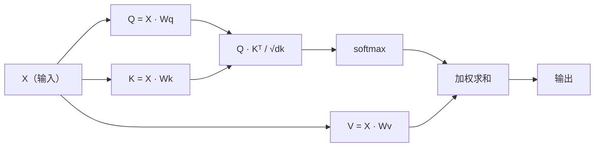

# 从零实现自注意力机制

> 注意力是一张查找表，每个词都在问"谁对我重要？"——然后学会回答。

**类型：** 动手构建
**语言：** Python
**前置知识：** 第3阶段（深度学习基础）、第5阶段第10课（序列到序列）
**时间：** 约90分钟

## 学习目标

- 仅使用 NumPy 从零实现缩放点积自注意力，包括查询/键/值投影和 softmax 加权求和
- 构建多头注意力层，将头拆分、并行计算注意力并拼接结果
- 追踪注意力矩阵如何捕获 token 关系，并解释为什么除以 sqrt(dk) 可防止 softmax 饱和
- 应用因果掩码将双向注意力转换为自回归（解码器风格）注意力

## 问题所在

RNN 一次处理一个 token。当你到达第50个 token 时，来自第1个 token 的信息已经经过了50次压缩步骤。长距离依赖被挤压进固定大小的隐状态——这是一个瓶颈，LSTM 的门控机制无法完全解决。

2014年 Bahdanau 的注意力论文展示了修复方案：让解码器回看每个编码器位置，并决定哪些对当前步骤重要。但它仍然是附加在 RNN 上的。2017年《Attention Is All You Need》论文提出了一个更尖锐的问题：如果注意力是*唯一*的机制会怎样？没有递归，没有卷积，只有注意力。

自注意力让序列中的每个位置在一次并行步骤中都能关注序列中的其他所有位置。这就是 Transformer 快速、可扩展且占据主导地位的原因。

## 概念解析

### 数据库查找类比

将注意力想象成一次软数据库查找：

```
传统数据库：
  查询："法国的首都"  -->  精确匹配  -->  "巴黎"

注意力机制：
  查询："法国的首都"  -->  与所有键的相似度  -->  所有值的加权混合
```

每个 token 生成三个向量：
- **查询 (Q)**："我在寻找什么？"
- **键 (K)**："我包含什么？"
- **值 (V)**："如果被选中，我提供什么信息？"

查询与所有键的点积产生注意力分数。高分意味着"这个键与我的查询匹配。"这些分数对值进行加权。输出是值的加权和。

### Q、K、V 的计算

每个 token 嵌入通过三个学习权重矩阵进行投影：

```
输入嵌入（n个token的序列，每个维度为d）：

  X = [x1, x2, x3, ..., xn]       形状：(n, d)

三个权重矩阵：

  Wq  形状：(d, dk)
  Wk  形状：(d, dk)
  Wv  形状：(d, dv)

投影操作：

  Q = X @ Wq    形状：(n, dk)      每个token的查询
  K = X @ Wk    形状：(n, dk)      每个token的键
  V = X @ Wv    形状：(n, dv)      每个token的值
```

从视觉上看，对于一个token：

```
             Wq
  x_i ------[*]------> q_i    "我在寻找什么？"
       |
       |     Wk
       +----[*]------> k_i    "我包含什么？"
       |
       |     Wv
       +----[*]------> v_i    "我提供什么？"
```

### 注意力矩阵

一旦你拥有所有 token 的 Q、K、V，注意力分数就形成一个矩阵：

```
分数 = Q @ K^T    形状：(n, n)

              k1    k2    k3    k4    k5
        +-----+-----+-----+-----+-----+
   q1   | 2.1 | 0.3 | 0.1 | 0.8 | 0.2 |   <- q1 对每个键的关注程度
        +-----+-----+-----+-----+-----+
   q2   | 0.4 | 1.9 | 0.7 | 0.1 | 0.3 |
        +-----+-----+-----+-----+-----+
   q3   | 0.2 | 0.6 | 2.3 | 0.5 | 0.1 |
        +-----+-----+-----+-----+-----+
   q4   | 0.9 | 0.1 | 0.4 | 1.7 | 0.6 |
        +-----+-----+-----+-----+-----+
   q5   | 0.1 | 0.3 | 0.2 | 0.5 | 2.0 |
        +-----+-----+-----+-----+-----+

每一行：一个 token 对整个序列的注意力分布
```

逐个观察查询扫过键：每行对每个 token 打分，softmax 将分数转化为权重，上下文向量是值的加权混合。

```figure
attention-matrix
```

### 为什么要缩放？

点积随维度 dk 增长。如果 dk = 64，点积可能达到数十的范围，将 softmax 推到梯度消失的区域。解决方案：除以 sqrt(dk)。

```
缩放后分数 = (Q @ K^T) / sqrt(dk)
```

这使数值保持在 softmax 能产生有效梯度的范围内。

### Softmax 将分数转化为权重

Softmax 将原始分数转换为每行的概率分布：

```
q1 的原始分数：   [2.1, 0.3, 0.1, 0.8, 0.2]
                            |
                         softmax
                            |
注意力权重：   [0.52, 0.09, 0.07, 0.14, 0.08]   （总和约等于1.0）
```

现在每个 token 都有一组权重，表示它应该关注其他每个 token 的程度。

### 值的加权求和

每个 token 的最终输出是所有值向量的加权和：

```
output_i = sum( attention_weight[i][j] * v_j  对所有j求和 )

对于token 1：
  output_1 = 0.52 * v1 + 0.09 * v2 + 0.07 * v3 + 0.14 * v4 + 0.08 * v5
```

### 完整流程



一行公式：

```
Attention(Q, K, V) = softmax( Q @ K^T / sqrt(dk) ) @ V
```

```figure
softmax-attention-scaling
```

## 动手构建

### 步骤1：从零实现 Softmax

Softmax 将原始对数转化为概率。减去最大值以保证数值稳定性。

```python
import numpy as np

def softmax(x):
    shifted = x - np.max(x, axis=-1, keepdims=True)
    exp_x = np.exp(shifted)
    return exp_x / np.sum(exp_x, axis=-1, keepdims=True)

logits = np.array([2.0, 1.0, 0.1])
print(f"logits:  {logits}")
print(f"softmax: {softmax(logits)}")
print(f"sum:     {softmax(logits).sum():.4f}")
```

### 步骤2：缩放点积注意力

核心函数。接收 Q、K、V 矩阵并返回注意力输出和权重矩阵。

```python
def scaled_dot_product_attention(Q, K, V):
    dk = Q.shape[-1]
    scores = Q @ K.T / np.sqrt(dk)
    weights = softmax(scores)
    output = weights @ V
    return output, weights
```

### 步骤3：带有学习投影的自注意力类

完整的自注意力模块，包含使用类 Xavier 缩放初始化的 Wq、Wk、Wv 权重矩阵。

```python
class SelfAttention:
    def __init__(self, d_model, dk, dv, seed=42):
        rng = np.random.default_rng(seed)
        scale = np.sqrt(2.0 / (d_model + dk))
        self.Wq = rng.normal(0, scale, (d_model, dk))
        self.Wk = rng.normal(0, scale, (d_model, dk))
        scale_v = np.sqrt(2.0 / (d_model + dv))
        self.Wv = rng.normal(0, scale_v, (d_model, dv))
        self.dk = dk

    def forward(self, X):
        Q = X @ self.Wq
        K = X @ self.Wk
        V = X @ self.Wv
        output, weights = scaled_dot_product_attention(Q, K, V)
        return output, weights
```

### 步骤4：在句子上运行

为句子创建假嵌入，观察注意力权重。

```python
sentence = ["The", "cat", "sat", "on", "the", "mat"]
n_tokens = len(sentence)
d_model = 8
dk = 4
dv = 4

rng = np.random.default_rng(42)
X = rng.normal(0, 1, (n_tokens, d_model))

attn = SelfAttention(d_model, dk, dv, seed=42)
output, weights = attn.forward(X)

print("注意力权重（每行：该token看向哪里）：\n")
print(f"{'':>6}", end="")
for token in sentence:
    print(f"{token:>6}", end="")
print()

for i, token in enumerate(sentence):
    print(f"{token:>6}", end="")
    for j in range(n_tokens):
        w = weights[i][j]
        print(f"{w:6.3f}", end="")
    print()
```

### 步骤5：使用 ASCII 热力图可视化注意力

将注意力权重映射为字符以便快速可视化。

```python
def ascii_heatmap(weights, tokens, chars=" ░▒▓█"):
    n = len(tokens)
    print(f"\n{'':>6}", end="")
    for t in tokens:
        print(f"{t:>6}", end="")
    print()

    for i in range(n):
        print(f"{tokens[i]:>6}", end="")
        for j in range(n):
            level = int(weights[i][j] * (len(chars) - 1) / weights.max())
            level = min(level, len(chars) - 1)
            print(f"{'  ' + chars[level] + '   '}", end="")
        print()

ascii_heatmap(weights, sentence)
```

## 实际应用

PyTorch 的 `nn.MultiheadAttention` 实现了我们构建的所有功能，外加多头拆分和输出投影：

```python
import torch
import torch.nn as nn

d_model = 8
n_heads = 2
seq_len = 6

mha = nn.MultiheadAttention(embed_dim=d_model, num_heads=n_heads, batch_first=True)

X_torch = torch.randn(1, seq_len, d_model)

output, attn_weights = mha(X_torch, X_torch, X_torch)

print(f"输入形状：            {X_torch.shape}")
print(f"输出形状：           {output.shape}")
print(f"注意力权重形状：{attn_weights.shape}")
print(f"\n注意力权重（按头平均）：")
print(attn_weights[0].detach().numpy().round(3))
```

关键区别：多头注意力并行运行多个注意力函数，每个函数拥有独立的 Q、K、V 投影（大小为 dk = d_model / n_heads），然后拼接结果。这使模型能够同时关注不同类型的关系。

## 交付成果

本课产出：
- `outputs/prompt-attention-explainer.md` - 通过数据库查找类比解释注意力的提示词

## 练习

1. 修改 `scaled_dot_product_attention` 以接受可选的掩码矩阵，在 softmax 之前将某些位置设为负无穷（这是因果/解码器掩码的工作原理）
2. 从零实现多头注意力：将 Q、K、V 拆分为 `n_heads` 个块，对每个块运行注意力，拼接结果，并通过最终权重矩阵 Wo 进行投影
3. 取两个相同长度的不同句子，通过同一个 SelfAttention 实例，比较它们的注意力模式。什么变了？什么保持不变？

## 关键术语

| 术语 | 人们常说的 | 实际含义 |
|------|-----------|---------|
| 查询 (Q) | "问题向量" | 输入的 learned projection，表示该 token 正在寻找什么信息 |
| 键 (K) | "标签向量" | learned projection，表示该 token 包含什么信息，用于与查询匹配 |
| 值 (V) | "内容向量" | 携带实际信息的 learned projection，根据注意力分数进行聚合 |
| 缩放点积注意力 | "注意力公式" | softmax(QK^T / sqrt(dk)) @ V —— 缩放可防止高维下的 softmax 饱和 |
| 自注意力 | "token 关注自身及其他" | Q、K、V 均来自同一序列的注意力机制，使每个位置都能关注其他所有位置 |
| 注意力权重 | "关注程度" | 位置上的概率分布，由缩放点积经 softmax 产生 |
| 多头注意力 | "并行注意力" | 使用不同投影运行多个注意力函数，然后拼接结果以获得更丰富的表示 |

## 延伸阅读

- [Attention Is All You Need (Vaswani 等人, 2017)](https://arxiv.org/abs/1706.03762) - 原始 Transformer 论文
- [图解 Transformer (Jay Alammar)](https://jalammar.github.io/illustrated-transformer/) - 最佳的全架构可视化导览
- [标注版 Transformer (哈佛 NLP)](https://nlp.seas.harvard.edu/annotated-transformer/) - 逐行 PyTorch 实现并附解释
