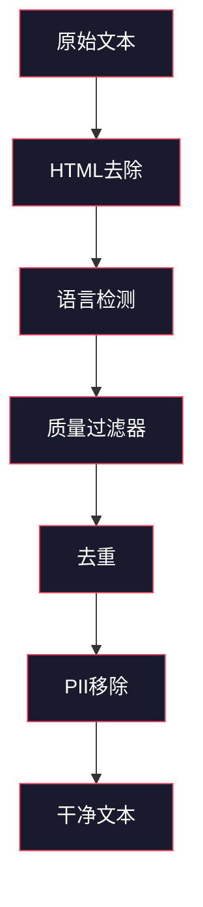
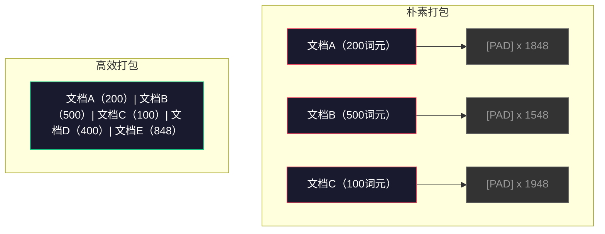

# 预训练数据管道

> 模型是一面镜子。它反射你喂给它的一切数据。喂给它垃圾，它就会以完美的流利度反射垃圾。

**类型：** 构建
**语言：** Python
**前置要求：** 第10阶段，第01-02课（词元化器、构建词元化器）
**时间：** 约90分钟

## 学习目标

- 构建一个流式数据管道，对TB级文本进行词元化、分块、打乱和批处理，而无需全部加载到内存中
- 实现实际预训练管道中使用的数据质量过滤器（去重、语言检测、内容过滤）
- 使用正确的注意力遮罩和文档边界处理创建固定长度的训练序列
- 分析管道吞吐量，确保数据加载器能够跟上GPU训练速度

## 问题所在

你已经有了词元化器。现在你需要数据。

不是数据集。不是CSV文件。而是TB级的文本——经过清理、去重、过滤质量、词元化为固定长度序列，并以足够快的速度提供随机批次，让你的8卡GPU集群永远不会等待下一个批次。

大多数人的想法是，训练大语言模型的关键在于模型架构。事实并非如此。Llama 3使用了15.6万亿个词元。GPT-3使用了3000亿。DeepSeek-V2使用了8.1万亿。这三者的架构大致相同：堆叠的transformer模块，包含注意力层和前馈层。输出质量的差异主要来自数据。

DeepMind的Chinchilla论文对此做出了精确的阐述。在固定的计算预算下，模型参数数量与训练词元数量之间存在一个最优比例。Chinchilla表明，2022年的大多数模型都存在严重的训练不足——相对于它们所见的训练数据量而言，参数太多了。一个700亿参数的模型训练了1.4万亿词元（符合Chinchilla最优），表现优于一个2800亿参数但只训练了3000亿词元的模型（Gopher）。

你的数据管道决定了你的模型是学习语言还是学习噪声。

## 概念

### 数据来源

每一个大型语言模型都是在多种来源的混合数据上训练的。具体的组成比例对于大多数实验室来说都是严格保密的，但我们有足够的了解来理解这些类别。

| 来源 | 大小 | 质量 | 使用者 |
|--------|------|---------|---------|
| Common Crawl | 约250 TB原始数据 | 低（需要重度过滤） | GPT-3、Llama、大多数开源模型 |
| Wikipedia | 约20 GB | 高 | 所有主要LLM |
| GitHub代码 | 约1 TB+ | 中等（大量重复、死代码） | StarCoder、CodeLlama、DeepSeek-Coder |
| 书籍（BookCorpus、The Pile） | 约100 GB | 高 | GPT-2、GPT-3、早期模型 |
| 学术论文（arXiv、S2ORC） | 约100 GB | 对STEM领域为高 | Llama、Galactica |
| StackOverflow、Reddit | 约100 GB | 中等 | Llama、Falcon |
| 精选网络（C4、RefinedWeb） | 约5 TB | 中高（预过滤） | T5、Falcon |

Llama 3公开了其数据配比：约50%网络数据、25%代码、13%书籍和学术论文、8%数学数据、4%多语言网络数据。总计15.6万亿词元，来源超过5 TB的原始文本。

比例与总规模同样重要。网络数据过多，模型会成为Reddit的复读机。代码过少，模型就无法编程。数学过少，模型在推理方面就会失败。正确调整这个配比是训练LLM最难的部分之一，没有公式——需要实验和评估。

### 数据清洗

原始网络数据非常脏乱。典型的Common Crawl转储文件包含：

- HTML标签和JavaScript
- 样板页眉、页脚、导航菜单
- 重复页面（完全重复和近似重复）
- 机器生成的垃圾信息
- 个人身份信息（PII）
- 低质量文本（关键词列表、SEO垃圾）
- 编码为文本的非文本内容

清洗这些数据不是可选的。这是决定模型生成连贯段落还是输出HTML标签混在产品列表之间的关键。



每一步都消除了特定类别的噪声：

**HTML去除：** 移除所有标记。只保留可见文本内容。`trafilatura`或`readability`等库可以提取文章内容，同时丢弃导航、广告和样板内容。

**语言检测：** 使用fastText的语言识别模型（lid.176.bin）对每个文档进行分类。过滤到你目标的语言。一个被分类为英语但置信度低于0.8的文档可能不是干净的英语。

**质量过滤：** 这是最有趣的部分。RefinedWeb（Falcon背后的数据集）使用基于困惑度的过滤器：在Wikipedia上训练一个小语言模型，然后对每个文档进行评分。高困惑度意味着该文档不像Wikipedia——很可能是垃圾、关键词列表或机器生成内容。困惑度超过阈值的文档会被移除。

**去重：** 最具影响力的清洗步骤。Common Crawl包含大量重复页面——法律声明、Cookie通知、服务条款。训练重复数据会浪费计算资源，并可能导致模型死记硬背并逐字复述特定段落。

**PII移除：** 姓名、电子邮件地址、电话号码、社会保障号。使用基于正则表达式的结构化PII检测，以及基于上下文的NER模型。

### 使用MinHash进行去重

精确去重很容易：对每个文档计算哈希值，移除重复项。但真正的挑战是近似重复。两篇带有略有不同广告的同款新闻文章就是近似重复。内容95%相同，但字节级别并不相同。

MinHash + 局部敏感哈希（LSH）可以高效解决此问题。


思路如下：

1. **分词：** 将每个文档转换为一组n-gram（例如5-gram的单词或字符）。「the quick brown fox」使用3词分词后变为{"the quick brown", "quick brown fox"}。

2. **MinHash：** 对于每个文档的分词集合，计算k个哈希值。每个哈希值是在不同哈希函数下所有分词的最小哈希。这生成了一个固定大小的「签名」，用于近似任意两个文档之间的Jaccard相似度。

3. **LSH：** 根据MinHash签名的分段将文档分组到桶中。在同一桶中的文档是近似的重复候选。这避免了两两比较——你只需要比较候选对。

4. **验证：** 对于每对候选，计算精确的Jaccard相似度。如果相似度超过阈值（通常为0.8），则移除其中一个。

Llama团队报告称通过去重移除了约38%的网络数据。这不是小数目。超过三分之一的Common Crawl内容是重复或近似重复的。

### 序列打包

你的模型期望固定长度的输入序列。而你的文档长度不一。有的只有50个词元，有的有5万个词元。

朴素的方法：将每个文档填充到最大序列长度。这会浪费大量计算资源在零贡献的填充词元上。

更好的方法：将多个文档打包到一个序列中，用结束词元分隔。一个2048词元的序列可能包含三个短文档，中间用[EOS]词元连接。



必须正确设置注意力遮罩。同一打包序列中的文档A的词元不应关注文档B的词元。这需要块对角注意力遮罩。

长文档会被截断或在序列边界处拆分为块。拆分点很重要：在句子中间拆分会迫使模型看到不完整的思想。某些管道在可能时将拆分点对齐到段落或句子边界。

### Chinchilla缩放定律

对于固定的计算预算C（以FLOPs度量），最优模型大小N和数据集大小D遵循：

```
N_opt ~ C^0.5
D_opt ~ C^0.5
```

在实践中，这意味着你应该大致平等地扩展模型大小和数据集大小。一个拥有10倍参数的模型需要大约10倍的训练词元才能达到相同的损失。

| 模型 | 参数 | 训练词元 | 符合Chinchilla最优？ |
|-------|-----------|----------------|-------------------|
| GPT-3 | 175B | 300B | 否（训练不足3-4倍） |
| Chinchilla | 70B | 1.4T | 是（设计如此） |
| Llama 2 | 70B | 2T | 过度训练（有意为之） |
| Llama 3 | 70B | 15T | 严重过度训练 |

Llama 3有意违反了Chinchilla定律。Meta发现，在远超计算最优比例的数据上进行过度训练可以产生更好的推理模型。额外的训练成本只支付一次，但更小的模型永远更便宜地服务。这有时被称为「推理最优」缩放方法，自2024年以来已成为行业标准。

```figure
l5-data-pipeline
```

## 构建

### 步骤1：文本清洗

去除HTML、规范化空白、移除非文本内容。我们将使用公有领域文本（古腾堡计划）作为小型语料库。

```python
import re

def clean_text(text):
    text = re.sub(r"<[^>]+>", "", text)
    text = re.sub(r"http\S+", "", text)
    text = re.sub(r"[^\x20-\x7E\n]", "", text)
    text = re.sub(r"\n{3,}", "\n\n", text)
    text = re.sub(r" {2,}", " ", text)
    return text.strip()

def quality_filter(text, min_words=50, max_ratio_caps=0.3, max_ratio_special=0.1):
    words = text.split()
    if len(words) < min_words:
        return False
    caps_ratio = sum(1 for w in words if w.isupper()) / len(words)
    if caps_ratio > max_ratio_caps:
        return False
    special_chars = sum(1 for c in text if not c.isalnum() and not c.isspace())
    if special_chars / max(len(text), 1) > max_ratio_special:
        return False
    return True
```

质量过滤器可以捕捉SEO垃圾（全部大写）、机器生成噪声（高特殊字符比例）和残缺页面（太短）。仅这三项检查就能从网络抓取中移除大量垃圾。

### 步骤2：MinHash去重

从零实现MinHash。无需外部库——只需要`hashlib`。

```python
import hashlib
from collections import defaultdict

def get_shingles(text, k=5):
    words = text.lower().split()
    if len(words) < k:
        return set()
    return {" ".join(words[i:i+k]) for i in range(len(words) - k + 1)}

def minhash_signature(shingles, num_hashes=128):
    signature = []
    for i in range(num_hashes):
        min_hash = float("inf")
        for shingle in shingles:
            h = int(hashlib.sha256(f"{i}:{shingle}".encode()).hexdigest(), 16)
            min_hash = min(min_hash, h)
        signature.append(min_hash)
    return signature

def lsh_buckets(signature, bands=16):
    rows_per_band = len(signature) // bands
    buckets = []
    for b in range(bands):
        start = b * rows_per_band
        band_data = tuple(signature[start:start + rows_per_band])
        bucket_hash = hashlib.md5(str(band_data).encode()).hexdigest()
        buckets.append((b, bucket_hash))
    return buckets

def deduplicate(documents, threshold=0.8, num_hashes=128, bands=16):
    signatures = []
    shingle_sets = []
    for doc in documents:
        shingles = get_shingles(doc)
        shingle_sets.append(shingles)
        signatures.append(minhash_signature(shingles, num_hashes))

    bucket_map = defaultdict(list)
    for doc_idx, sig in enumerate(signatures):
        for band_id, bucket_hash in lsh_buckets(sig, bands):
            bucket_map[(band_id, bucket_hash)].append(doc_idx)

    duplicate_pairs = set()
    for bucket_docs in bucket_map.values():
        if len(bucket_docs) < 2:
            continue
        for i in range(len(bucket_docs)):
            for j in range(i + 1, len(bucket_docs)):
                duplicate_pairs.add((bucket_docs[i], bucket_docs[j]))

    removed = set()
    for i, j in duplicate_pairs:
        if i in removed or j in removed:
            continue
        s1, s2 = shingle_sets[i], shingle_sets[j]
        if not s1 or not s2:
            continue
        jaccard = len(s1 & s2) / len(s1 | s2)
        if jaccard >= threshold:
            removed.add(j)

    return [doc for idx, doc in enumerate(documents) if idx not in removed], len(removed)
```

`num_hashes=128`和`bands=16`参数控制精度-召回率的权衡。更多的哈希值可以提供更准确的相似度估计。更多的分带可以提高召回率（捕获更多重复），但代价是更多的误报。这些值对于典型的网络文本效果良好。

### 步骤3：词元化与序列打包

获取干净、去重的文本，进行词元化，并打包成固定长度序列用于训练。

```python
def tokenize_corpus(documents, tokenizer):
    all_tokens = []
    for doc in documents:
        tokens = tokenizer.encode(doc)
        all_tokens.extend(tokens)
        all_tokens.append(tokenizer.eos_id)
    return all_tokens

def pack_sequences(token_ids, seq_length, pad_id=0):
    sequences = []
    attention_masks = []
    for i in range(0, len(token_ids), seq_length):
        seq = token_ids[i:i + seq_length]
        mask = [1] * len(seq)
        if len(seq) < seq_length:
            pad_count = seq_length - len(seq)
            seq = seq + [pad_id] * pad_count
            mask = mask + [0] * pad_count
        sequences.append(seq)
        attention_masks.append(mask)
    return sequences, attention_masks
```

### 步骤4：训练数据加载器

产出随机批次的打包序列。这是训练循环所消费的。

```python
import random

class PreTrainingDataLoader:
    def __init__(self, sequences, attention_masks, batch_size, shuffle=True):
        self.sequences = sequences
        self.attention_masks = attention_masks
        self.batch_size = batch_size
        self.shuffle = shuffle

    def __len__(self):
        return (len(self.sequences) + self.batch_size - 1) // self.batch_size

    def __iter__(self):
        indices = list(range(len(self.sequences)))
        if self.shuffle:
            random.shuffle(indices)
        for start in range(0, len(indices), self.batch_size):
            batch_idx = indices[start:start + self.batch_size]
            batch_seqs = [self.sequences[i] for i in batch_idx]
            batch_masks = [self.attention_masks[i] for i in batch_idx]
            yield batch_seqs, batch_masks
```

### 步骤5：数据集统计

计算关键数字：总词元数、唯一词元数、压缩比、文档长度分布。

```python
from collections import Counter

def compute_statistics(documents, token_ids, sequences, tokenizer_vocab_size):
    total_chars = sum(len(d) for d in documents)
    total_tokens = len(token_ids)
    unique_tokens = len(set(token_ids))
    compression_ratio = total_chars / total_tokens

    doc_lengths = [len(d.split()) for d in documents]
    avg_doc_length = sum(doc_lengths) / max(len(doc_lengths), 1)
    max_doc_length = max(doc_lengths) if doc_lengths else 0
    min_doc_length = min(doc_lengths) if doc_lengths else 0

    token_counts = Counter(token_ids)
    top_tokens = token_counts.most_common(10)

    non_pad_tokens = sum(sum(1 for t in seq if t != 0) for seq in sequences)
    total_positions = sum(len(seq) for seq in sequences)
    utilization = non_pad_tokens / max(total_positions, 1)

    stats = {
        "total_documents": len(documents),
        "total_characters": total_chars,
        "total_tokens": total_tokens,
        "unique_tokens": unique_tokens,
        "vocab_utilization": unique_tokens / tokenizer_vocab_size,
        "compression_ratio": compression_ratio,
        "avg_doc_length_words": avg_doc_length,
        "max_doc_length_words": max_doc_length,
        "min_doc_length_words": min_doc_length,
        "num_sequences": len(sequences),
        "sequence_utilization": utilization,
        "top_10_tokens": top_tokens,
    }
    return stats
```

压缩比告诉你词元化器在该语料库上的效率。英文文本通常压缩到每个词元约3-4个字符。如果你看到每个词元1.5个字符，说明你的词元化器分裂过于激进。如果你看到8+，说明它学习了非常领域特定的合并。

序列利用率告诉你你的打包序列中多少是真实数据，多少是填充。低于90%意味着你的打包效率低下——你在填充词元上浪费了计算资源。

## 使用

### 与HuggingFace数据集对比

通过HuggingFace的datasets库加载同一语料库，并对比管道速度。

```python
from datasets import load_dataset
from transformers import AutoTokenizer

ds = load_dataset("wikitext", "wikitext-2-raw-v1", split="train")
tokenizer = AutoTokenizer.from_pretrained("meta-llama/Meta-Llama-3-8B")

import time

start = time.time()
tokenized = ds.map(
    lambda x: tokenizer(x["text"], truncation=True, max_length=2048),
    batched=True,
    num_proc=4,
)
hf_time = time.time() - start
total_tokens = sum(len(t) for t in tokenized["input_ids"])
print(f"HuggingFace: {total_tokens:,} 词元 in {hf_time:.2f}s ({total_tokens/hf_time:,.0f} 词元/秒)")
```

HuggingFace管道在底层使用Rust词元化器和跨4核的并行处理。你的纯Python管道会慢10-50倍。这就是为什么生产团队使用编译型词元化器的原因。算法是相同的。实现语言的差异造成了速度差距。

## 交付

本课生成一个用于验证和调试LLM训练管道数据质量提示词。参见`outputs/prompt-data-quality-checker.md`。

## 练习

1. **简单：** 使用简单的启发式方法（字符集分析）向清洗管道添加语言检测。仅过滤英语文档，并测量移除了多少文档。
2. **中等：** 实现使用SHA-256哈希的精确去重，并与MinHash近似去重并行。在网页抓取语料库上比较每种方法捕获的重复数量。
3. **困难：** 构建基于困惑度的质量过滤器。在Wikipedia文本上训练一个小的二元语言模型，通过困惑度对每个文档评分，并移除最差的20%。对比在过滤后的数据与未过滤数据上训练时的模型输出质量。

## 关键术语

| 术语 | 人们常说的 | 实际含义 |
|------|----------------|----------------------|
| Common Crawl | "互联网" | 一个非营利组织，每月抓取网络——约250TB原始数据，是大多数LLM训练数据的起点 |
| MinHash | "某种哈希技巧" | 一种使用固定大小签名估计集合间Jaccard相似度的技术——使大规模近似重复检测成为可能 |
| LSH | "局部敏感哈希" | 一种将相似项目分组到同一桶中的方法——将对 pairwise 比较从O(n^2)降低到接近线性 |
| 序列打包 | "拼接文档" | 将多个文档放入固定长度序列并附带正确的注意力遮罩——消除填充浪费 |
| Chinchilla缩放 | "在多数据上训练" | 对于固定的计算预算，最优性能需要大致平等地扩展模型大小和训练词元 |
| 词元密度 | "每词的词元数" | 平均每词产生的词元数——GPT-4中为1.3，非拉丁脚本更高 |
| 数据混合 | "选择训练数据" | 代码与文本与数学与多语言数据的比例——没有公式，需要实验 |
| 困惑度过滤器 | "质量评分" | 使用小型语言模型对文档进行评分——高困惑度意味着文本不像干净的参考数据 |
| 去重 | "移除副本" | 消除精确和近似重复的文档——通常移除30-40%的原始网络数据 |
| 注意力遮罩 | "关注哪些词元" | 一个二值遮罩，防止在打包序列中跨文档边界的注意力 |

## 延伸阅读

- [Hoffmann 等人，2022 —— 训练计算最优的大语言模型（Chinchilla）](https://arxiv.org/abs/2203.15556) —— 改变了我们对数据规模看法的论文
- [Penedo 等人，2023 —— Falcon LLM的RefinedWeb数据集](https://arxiv.org/abs/2306.01116) —— 如何过滤Common Crawl以获得高质量数据
- [Touvron 等人，2023 —— Llama 2：开放基础与微调聊天模型](https://arxiv.org/abs/2307.09288) —— Llama 2的数据管道细节
- [Lee 等人，2022 —— 去重训练数据能使语言模型更好](https://arxiv.org/abs/2107.06499) —— 为什么去重比你想象的重要
- [Broder，1997 —— 论文档的相似性与包含关系](https://ieeexplore.ieee.org/document/666900) —— 原始MinHash论文
- [Meta，2024 —— Llama 3技术报告](https://arxiv.org/abs/2407.21783) —— 15.6T词元、数据混合比例、过滤管道
