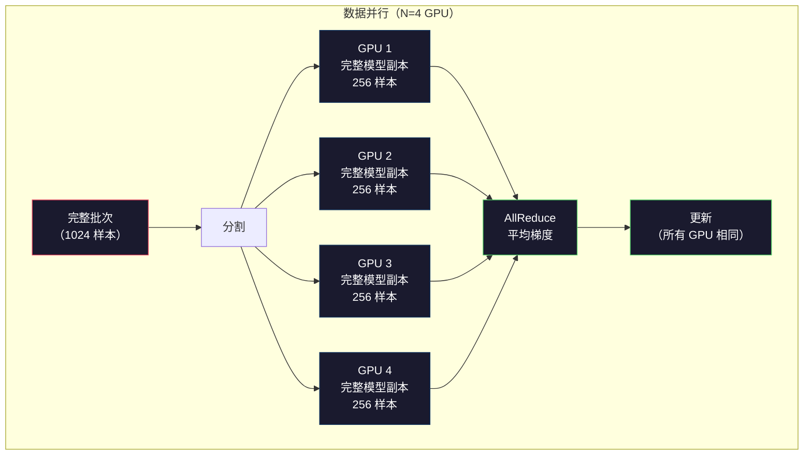
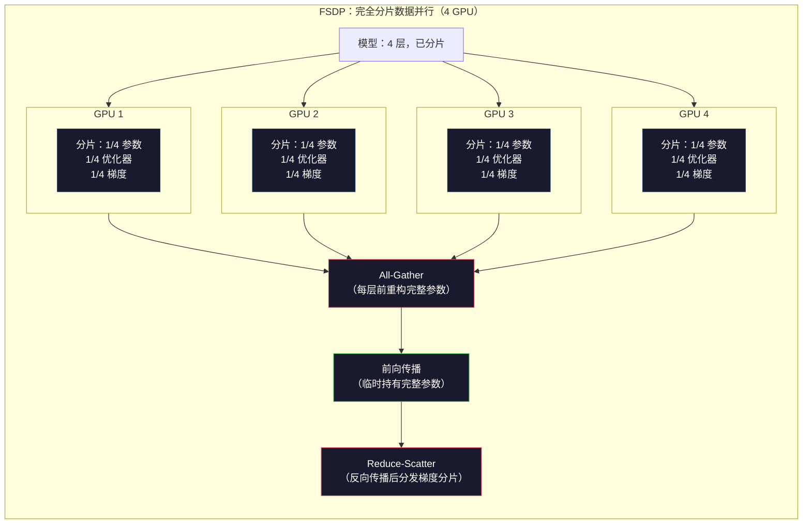
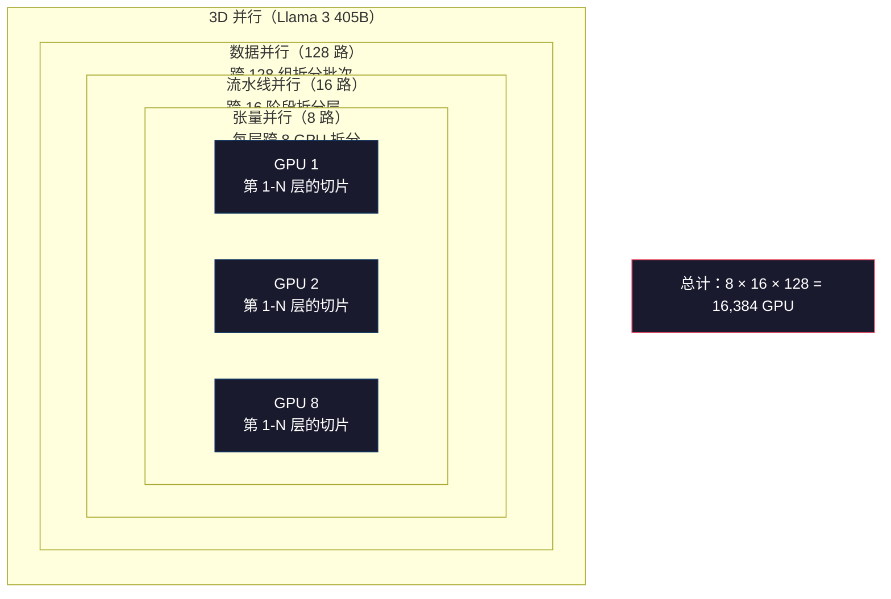

# 扩展：分布式训练、FSDP、DeepSpeed

> 你用一张 GPU 训练了 124M 参数的模型。现在试试 70 亿参数。模型装不进显存。数据在单机上训练要几周时间。在大规模训练下，分布式训练不是可选项。它是唯一的前路。

**类型：** 实战
**语言：** Python
**前置知识：** 第一阶段第 10 课（预训练 Mini GPT）
**时长：** 约 120 分钟

## 学习目标

- 解释三种并行方式（数据并行、张量并行、流水线并行）以及根据模型和集群规模何时需要每种方式
- 使用 PyTorch DDP 实现数据并行训练，在多个 GPU 间同步梯度
- 为给定模型规模计算显存预算（权重 + 优化器状态 + 梯度 + 激活值），以确定最低硬件要求
- 配置 FSDP 或 DeepSpeed ZeRO 阶段，在 GPU 间分片模型状态，使超出单卡显存的模型得以训练

## 问题所在

一个 FP16 格式的 7B 参数模型，仅权重就需要 14GB。Adam 优化器为每个参数存储两个额外副本（一阶和二阶矩估计）。这又是 28GB。反向传播中的梯度又增加 14GB。在存储任何激活值之前，就已经达到 56GB。

一块 NVIDIA A100 有 80GB 显存。

56GB / 80GB = 已消耗。留给激活值（前向传播中计算、反向传播时必须保留的中间值）的只有 24GB。对于长度为 2048 token、维度为 4096 的序列，单个层的激活值约占用 64MB。32 层总共需要每样本 2GB。批次大小（batch size）为 8 时需要 16GB。你只剩 24GB。批次大小到 12 就爆了。

现在试试 700 亿参数。仅权重：FP16 下需要 140GB。一张 GPU 装不下。至少需要 2 块 A100（2 x 80GB = 160GB）才能放下权重。加上优化器状态和梯度，需要的 GPU 远不止这些：至少 3 块，实际上取决于分片策略，可能需要 8-16 块。

Llama 3 405B 在 16,384 块 NVIDIA H100 GPU 上训练。训练成本估计为 1 亿美元。DeepSeek V3 通过巧妙的架构（专家混合 MoE 意味着每个 token 只激活一部分参数）和训练效率，以约 560 万美元训练了同等规模的模型。

本教程涵盖四种使大规模训练成为可能的策略：数据并行、张量并行、流水线并行和完全分片数据并行（FSDP）。你会先用纯 Python 模拟每一种，在真正接触分布式训练框架之前理解其原理。

## 概念解析

### 为什么需要分布式

以下是真实模型的显存数学，每一个数字都是计算得出的，而非估算。

| 模型 | 参数规模 | 权重（FP16） | Adam 状态 | 梯度（FP16） | 总计（不含激活） |
|------|----------|-------------|----------|-------------|----------------|
| GPT-2 Small | 1.24 亿 | 248 MB | 992 MB | 248 MB | 1.5 GB |
| Llama 3 8B | 80 亿 | 16 GB | 64 GB | 16 GB | 96 GB |
| Llama 3 70B | 700 亿 | 140 GB | 560 GB | 140 GB | 840 GB |
| Llama 3 405B | 4050 亿 | 810 GB | 3,240 GB | 810 GB | 4,860 GB |

"Adam 状态"这一列是杀手。Adam 为每个参数存储运行均值（m）和运行方差（v），均以 FP32 格式。对于 700 亿参数模型，那就是 70B × 4 字节 × 2 = 560GB。仅优化器就需要七块 A100。

一块 H100 有 80GB 显存。Llama 3 405B 至少需要 61 块 H100 来存放权重、优化器和梯度。加上激活值，数量还会增长。Meta 使用 16,384 块 GPU 不是因为他们想——而是因为他们必须。

### 数据并行

最简单的分布式策略。将整个模型复制到 N 块 GPU 上。将每个训练批次均分为 N 份。每块 GPU 在自己的数据分片上执行前向和反向传播。反向传播完成后，在所有 GPU 上平均梯度。每块 GPU 使用相同的平均梯度更新其权重副本，保持所有副本同步。

**优点：** 吞吐量线性扩展。N 块 GPU 每步处理 N 倍的数据量。通信仅限于梯度平均，可与计算重叠。

**缺点：** 每块 GPU 持有完整的模型、优化器状态和梯度副本。对于 700 亿参数模型，每块 GPU 需要 840GB。数据并行不能减少单卡显存占用，它只缩短训练时间。

**公式：** 有效批次大小 = 每 GPU 批次大小 × N。对于 N=64 块 GPU、每 GPU 批次为 16 的情况，有效批次为 1,024。Llama 3 使用的有效批次大小为每步 1600 万 token。



### 张量并行

将单个层拆分到多块 GPU 上。一次矩阵乘法被分配到多块 GPU 上，每块 GPU 计算结果的一部分。

考虑前馈层中形状为 (8192, 8192) 的权重矩阵。使用 4 路张量并行，每块 GPU 持有 (8192, 2048) 的分片。每块 GPU 将输入乘以其分片，产生部分结果。部分结果通过 all-reduce 或 all-gather 组合，产生完整输出。

**优点：** 减少单卡权重显存占用。700 亿参数模型拆分到 8 块 GPU 上，每块 GPU 仅持有约 87.5 亿参数的权重。

**缺点：** 每层之后都需要高速 GPU 间通信。每次矩阵乘法后的 all-reduce 会增加延迟。这在 NVLink 下效果很好（同节点 GPU 间 900 GB/s），但在 InfiniBand 互联的节点之间效果较差（400 Gb/s，约 50 GB/s）。张量并行几乎总是限制在单个节点内（8 块 GPU）。

**实际应用：** Megatron-LM 开创了张量并行。Llama 3 405B 在每个节点内使用 8 路张量并行。

### 流水线并行

按层拆分模型。GPU 1 运行第 1-8 层，GPU 2 运行第 9-16 层，GPU 3 运行第 17-24 层，GPU 4 运行第 25-32 层。数据流经流水线：GPU 1 计算其层并将激活值发送给 GPU 2，GPU 2 计算其层后发送给 GPU 3，依此类推。

**优点：** GPU 间通信量最小——仅在层边界传输激活值，相比梯度或权重来说很小。适合跨节点部署，因为带宽需求低。

**缺点：** 流水线气泡。当 GPU 4 正在对微批次 1 进行前向传播时，GPU 1、2、3 处于空闲状态（它们已经转发了自己的部分）。反向传播时模式反转。使用朴素流水线时，GPU 利用率仅为 1/N（N 为流水线条数）。

**GPipe 和 PipeDream** 通过将批次拆分为微批次来解决气泡问题。GPU 1 在完成微批次 1 的转发后立即开始处理微批次 2。这让流水线的各阶段计算重叠。对于 M 个微批次和 N 个阶段，气泡占比降至 (N-1)/M。使用 M=16 个微批次、N=4 个阶段，气泡为 3/16 = 18.75% 的空闲时间。

### FSDP：完全分片数据并行

FSDP 结合了数据并行的可扩展性和分片的显存效率。每块 GPU 不再持有完整模型副本，而是只持有 1/N 的参数、梯度和优化器状态。

在某层前向传播前，FSDP 执行 **all-gather** 操作，从所有 GPU 收集完整参数到每块 GPU 的显存中。前向传播后，每块 GPU 丢弃非本地参数。反向传播时，all-gather 再次运行以重构参数用于梯度计算。反向传播后，**reduce-scatter** 分发梯度分片，使每块 GPU 只存储 1/N 的梯度。

**700 亿参数模型在 8 块 GPU 上的显存计算：**

| 组件 | 无 FSDP | 有 FSDP |
|------|---------|---------|
| 权重（FP16） | 每 GPU 140 GB | 每 GPU 17.5 GB |
| Adam 状态（FP32） | 每 GPU 560 GB | 每 GPU 70 GB |
| 梯度（FP16） | 每 GPU 140 GB | 每 GPU 17.5 GB |
| **总计** | **每 GPU 840 GB** | **每 GPU 105 GB** |

不使用 FSDP 时，单块 80GB GPU 无法放下 700 亿参数模型。使用 FSDP 在 8 块 GPU 上，每 GPU 仍需 105GB——等等，这仍然放不下。你需要至少 16 块 GPU 才能使每 GPU 显存低于 80GB，或者将 FSDP 与激活检查点（反向传播时重新计算激活值而非存储）结合使用。

通信成本高于普通数据并行，因为每层前都需要 all-gather。但显存节省使之前不可能完成的训练成为可能。



### DeepSpeed ZeRO

DeepSpeed 的 ZeRO（Zero Redundancy Optimizer，零冗余优化器）在概念上与 FSDP 相同，但由微软独立开发。它定义了三个阶段，每个阶段分片更激进：

| 阶段 | 分片内容 | 显存节省 | 通信量 |
|------|---------|---------|-------|
| ZeRO-1 | 仅优化器状态 | 约 4 倍减少 | 与数据并行相同 |
| ZeRO-2 | + 梯度 | 约 8 倍减少 | 略多 |
| ZeRO-3 | + 参数 | 约 N 倍减少（N 为 GPU 数） | 每层 all-gather |

ZeRO-3 等价于 FSDP。命名不同，机制相同。PyTorch 在 DeepSpeed 验证了该概念后，将其作为原生实现加入了 FSDP。

DeepSpeed 还引入了 ZeRO-Offload（将优化器状态卸载到 CPU RAM，容量更大且成本更低）和 ZeRO-Infinity（卸载到 NVMe SSD）。这些技术用计算速度换取显存容量——卸载的操作较慢，但能释放 GPU 显存。

### 混合精度训练

现代训练同时使用多种浮点格式：

- **前向传播：** FP16 或 BF16（16 位）。显存为 FP32 的一半。在 Tensor Core 上矩阵乘法速度提升 2 倍。
- **主权重：** FP32（32 位）。由优化器维护，用于权重更新时的数值精度。
- **损失缩放：** 在反向传播前将损失乘以一个大常数，防止 FP16 梯度下溢为零。在优化器步骤前除以相同的常数。

BF16（Brain Float 16）与 FP32 具有相同的指数范围（8 位指数位），但精度较低（7 位尾数位，对比 FP32 的 23 位）。它通常不需要损失缩放，因为它可以表示相同范围的数值。FP16 有 5 位指数位和 10 位尾数位——它可以表示精细数值，但在极端大小时会溢出/下溢。

Google 的 TPU 原生支持 BF16。NVIDIA 的 A100 和 H100 均支持 FP16 和 BF16。业界已普遍转向 BF16，因为它消除了损失缩放的麻烦。

**7B 模型显存对比：**

| 精度 | 权重 | 优化器 | 梯度 | 总计 |
|------|-----|-------|-----|-----|
| 全程 FP32 | 28 GB | 56 GB | 28 GB | 112 GB |
| 混合（BF16 + FP32 主权重） | 14 GB | 56 GB | 14 GB | 84 GB |

混合精度在此模型上节省 28GB。优化器状态始终保持 FP32——这是显存的主要开销。

### Megatron-LM 与 3D 并行

实际的大规模训练结合所有三种并行方式：

- **数据并行：** 跨节点组（扩展批次大小）
- **张量并行：** 节点内（在 8 块 GPU 上拆分层）
- **流水线并行：** 跨节点（在机器间拆分层组）

Llama 3 405B 在 16,384 块 H100 上：
- 每个节点内 8 路张量并行（每节点 8 块 GPU）
- 跨节点 16 路流水线并行（16 个流水线阶段）
- 剩余维度上 128 路数据并行（16,384 / 8 / 16 = 128）

这种 3D 分解（8 × 16 × 128 = 16,384）是将训练扩展到数千块 GPU 的方式。每块 GPU 看到不同的数据分片（数据并行），持有每层的一个切片（张量并行），并计算不同的层组（流水线并行）。

DeepSeek V3 采取了不同的方法。它们的专家混合（MoE）架构每个 token 只激活 370 亿参数中的 370 亿。这意味着每块 GPU 只需计算（并存储激活值）活跃参数。它们在 2,048 块 H800 GPU 上训练——不到 Meta GPU 数量的 1/8——成本约 560 万美元，对比 Meta 估计的 1 亿美元。



```figure
paged-kv-cache
```

## 动手实现

### 步骤 1：模拟数据并行

将批次拆分到模拟 GPU 上。每块 GPU 在其分片上执行前向传播。平均"梯度"（我们将其模拟为损失值）。

```python
import numpy as np

def simulate_data_parallelism(data, num_gpus, model_fn):
    batch_size = len(data)
    shard_size = batch_size // num_gpus
    remainder = batch_size % num_gpus

    gpu_losses = []
    gpu_gradients = []

    offset = 0
    for gpu_id in range(num_gpus):
        extra = 1 if gpu_id < remainder else 0
        shard = data[offset:offset + shard_size + extra]
        offset += shard_size + extra

        loss, grad = model_fn(shard)
        gpu_losses.append(loss)
        gpu_gradients.append(grad)

    avg_loss = np.mean(gpu_losses)
    avg_gradient = np.mean(gpu_gradients, axis=0)

    return avg_loss, avg_gradient
```

all-reduce 操作（平均梯度）是数据并行中唯一的通信。在实际中，这使用 NVIDIA GPU 上的 NCCL 库实现，该库实现了环形 all-reduce：每块 GPU 将 1/N 的梯度发送给邻居，从另一侧邻居接收 1/N，经过 N-1 步后每块 GPU 都有完整的平均值。总通信量：2 × 梯度大小 × (N-1)/N，当 N 较大时趋近于 2 倍梯度大小。

### 步骤 2：模拟张量并行

将权重矩阵拆分到多块 GPU 上。每块 GPU 计算部分矩阵乘法。组合结果。

```python
def simulate_tensor_parallelism(input_data, weight_matrix, num_gpus):
    d_in, d_out = weight_matrix.shape
    assert d_out % num_gpus == 0, f"d_out {d_out} 不能被 num_gpus {num_gpus} 整除"
    shard_size = d_out // num_gpus

    partial_results = []
    for gpu_id in range(num_gpus):
        start = gpu_id * shard_size
        end = start + shard_size
        weight_shard = weight_matrix[:, start:end]

        partial = input_data @ weight_shard
        partial_results.append(partial)

    full_output = np.concatenate(partial_results, axis=-1)

    direct_output = input_data @ weight_matrix
    error = np.abs(full_output - direct_output).max()

    return full_output, error
```

误差应精确为零（或机器精度 epsilon）。张量并行在数学上是精确的——它与在单块 GPU 上计算完整矩阵乘法的结果相同。拆分沿输出维度进行，因此每块 GPU 产生不同列的块，拼接后重构完整结果。

对于列并行线性层（拆分输出维度），你拼接结果。对于行并行（拆分输入维度），你求和。在 Transformer 的 FFN 中，第一个线性层（扩张）使用列并行，第二个线性层（收缩）使用行并行。这样可以避免两层之间的 all-reduce。

### 步骤 3：模拟流水线并行

将模型的层拆分到虚拟 GPU 上。展示气泡问题——早期阶段在后期阶段计算时处于空闲状态。

```python
def simulate_pipeline_parallelism(num_layers, num_stages, num_microbatches):
    layers_per_stage = num_layers // num_stages

    timeline = {}
    clock = 0

    for mb in range(num_microbatches):
        for stage in range(num_stages):
            start_time = max(
                timeline.get((stage, mb - 1, "fwd"), (0, 0))[1] if mb > 0 else 0,
                timeline.get((stage - 1, mb, "fwd"), (0, 0))[1] if stage > 0 else 0,
            )
            end_time = start_time + layers_per_stage
            timeline[(stage, mb, "fwd")] = (start_time, end_time)

    last_fwd_end = max(v[1] for v in timeline.values())

    for mb in range(num_microbatches - 1, -1, -1):
        for stage in range(num_stages - 1, -1, -1):
            deps = [last_fwd_end]
            if mb < num_microbatches - 1 and (stage, mb + 1, "bwd") in timeline:
                deps.append(timeline[(stage, mb + 1, "bwd")][1])
            if stage < num_stages - 1 and (stage + 1, mb, "bwd") in timeline:
                deps.append(timeline[(stage + 1, mb, "bwd")][1])
            start_time = max(deps)
            end_time = start_time + layers_per_stage
            timeline[(stage, mb, "bwd")] = (start_time, end_time)

    total_time = max(v[1] for v in timeline.values())
    compute_time = num_microbatches * num_stages * layers_per_stage * 2
    bubble_fraction = 1.0 - compute_time / (total_time * num_stages)

    return timeline, total_time, bubble_fraction
```

使用 4 个阶段和 1 个微批次，气泡占比为 75%——任何时候三块 GPU 处于空闲状态。使用 16 个微批次时，降至约 19%。消除气泡的代价是显存：你必须同时存储所有正在进行的微批次的激活值。

### 步骤 4：显存计算器

计算训练任意模型规模的精确显存需求。

```python
def memory_calculator(
    params_billions,
    precision_bytes=2,
    optimizer="adam",
    num_gpus=1,
    sharding="none",
    sequence_length=2048,
    batch_size_per_gpu=1,
    hidden_dim=None,
    num_layers=None,
):
    params = params_billions * 1e9

    weight_memory = params * precision_bytes

    if optimizer == "adam":
        optimizer_memory = params * 4 * 2
    elif optimizer == "sgd":
        optimizer_memory = params * 4
    else:
        optimizer_memory = 0

    gradient_memory = params * precision_bytes

    total_no_activation = weight_memory + optimizer_memory + gradient_memory

    if hidden_dim and num_layers:
        activation_per_layer = (
            sequence_length * batch_size_per_gpu * hidden_dim * precision_bytes * 4
        )
        activation_memory = activation_per_layer * num_layers
    else:
        activation_memory = params * precision_bytes * 0.5

    if sharding == "fsdp" or sharding == "zero3":
        weight_memory /= num_gpus
        optimizer_memory /= num_gpus
        gradient_memory /= num_gpus
    elif sharding == "zero2":
        optimizer_memory /= num_gpus
        gradient_memory /= num_gpus
    elif sharding == "zero1":
        optimizer_memory /= num_gpus

    per_gpu_total = weight_memory + optimizer_memory + gradient_memory + activation_memory

    return {
        "params_billions": params_billions,
        "weights_gb": weight_memory / 1e9,
        "optimizer_gb": optimizer_memory / 1e9,
        "gradients_gb": gradient_memory / 1e9,
        "activations_gb": activation_memory / 1e9,
        "per_gpu_total_gb": per_gpu_total / 1e9,
        "total_across_gpus_gb": per_gpu_total * num_gpus / 1e9,
        "fits_on_80gb": per_gpu_total / 1e9 <= 80,
        "num_gpus": num_gpus,
        "sharding": sharding,
    }
```

这个计算器回答了每个 ML 工程师都会问的问题："我需要多少 GPU？"输入模型规模，查看是否能放下。调整分片策略，直到每 GPU 总计降至 80GB 以下。

### 步骤 5：混合精度模拟

比较 FP32、FP16 和混合精度训练之间的显存使用。

```python
def mixed_precision_comparison(params_billions):
    params = params_billions * 1e9

    fp32_weights = params * 4
    fp32_optimizer = params * 4 * 2
    fp32_gradients = params * 4
    fp32_total = fp32_weights + fp32_optimizer + fp32_gradients

    fp16_weights = params * 2
    fp16_master = params * 4
    fp16_optimizer = params * 4 * 2
    fp16_gradients = params * 2
    fp16_total = fp16_weights + fp16_master + fp16_optimizer + fp16_gradients

    mixed_weights = params * 2
    mixed_optimizer = params * 4 * 2
    mixed_gradients = params * 2
    mixed_total = mixed_weights + mixed_optimizer + mixed_gradients

    return {
        "fp32_total_gb": fp32_total / 1e9,
        "fp16_with_master_gb": fp16_total / 1e9,
        "mixed_bf16_gb": mixed_total / 1e9,
        "savings_vs_fp32": 1 - mixed_total / fp32_total,
    }
```

大多数人的最大惊喜：混合精度并不能使显存减半。优化器状态（Adam 的 m 和 v）无论精度如何都保持 FP32。对于 7B 模型，FP32 训练使用 112GB。混合精度使用 84GB。这是 25% 的节省，而非 50%。优化器占据大头。

## 运行示例

### 运行所有模拟

```python
def run_all_demos():
    print("=" * 70)
    print("数据并行模拟")
    print("=" * 70)

    np.random.seed(42)
    data = np.random.randn(64, 32)
    weight = np.random.randn(32, 16)

    def model_fn(batch):
        output = batch @ weight
        loss = np.mean(output ** 2)
        grad = 2 * batch.T @ (batch @ weight) / len(batch)
        return loss, grad

    for n_gpus in [1, 2, 4, 8]:
        loss, grad = simulate_data_parallelism(data, n_gpus, model_fn)
        print(f"  {n_gpus} GPU：loss={loss:.4f}, grad_norm={np.linalg.norm(grad):.4f}")

    print()
    print("=" * 70)
    print("张量并行模拟")
    print("=" * 70)

    x = np.random.randn(4, 8192)
    W = np.random.randn(8192, 8192)

    for n_gpus in [1, 2, 4, 8]:
        output, error = simulate_tensor_parallelism(x, W, n_gpus)
        print(f"  {n_gpus} GPU：output_shape={output.shape}, max_error={error:.2e}")

    print()
    print("=" * 70)
    print("流水线并行模拟")
    print("=" * 70)

    for n_mb in [1, 4, 8, 16, 32]:
        _, total_t, bubble = simulate_pipeline_parallelism(32, 4, n_mb)
        print(f"  {n_mb:2d} 微批次：total_time={total_t:4d}, bubble={bubble:.1%}")

    print()
    print("=" * 70)
    print("显存计算器")
    print("=" * 70)

    configs = [
        (7, "none", 1),
        (7, "fsdp", 8),
        (70, "none", 1),
        (70, "fsdp", 8),
        (70, "fsdp", 16),
        (405, "fsdp", 64),
        (405, "fsdp", 128),
    ]

    print(f"  {'模型':>8} {'分片':>8} {'GPU数':>5} {'每GPU':>10} {'适合80GB':>10}")
    print("  " + "-" * 50)
    for params, shard, gpus in configs:
        result = memory_calculator(params, num_gpus=gpus, sharding=shard)
        fits = "是" if result["fits_on_80gb"] else "否"
        print(f"  {params:>6}B {shard:>8} {gpus:>5} {result['per_gpu_total_gb']:>8.1f}GB {fits:>10}")

    print()
    print("=" * 70)
    print("混合精度对比")
    print("=" * 70)

    for params_b in [7, 13, 70, 405]:
        result = mixed_precision_comparison(params_b)
        print(f"  {params_b}B：FP32={result['fp32_total_gb']:.0f}GB, "
              f"混合BF16={result['mixed_bf16_gb']:.0f}GB, "
              f"节省={result['savings_vs_fp32']:.0%}")
```

## 交付成果

本教程产出 `outputs/prompt-distributed-training-planner.md`——一个提示词，接收模型规模和可用硬件，然后生成完整的分布式训练计划：并行策略、显存预算、通信开销和预期吞吐量。

## 练习题

1. 修改显存计算器以包含激活检查点。使用检查点后，仅在每隔 K 层存储激活值（典型 K=1，即重新计算全部）。展示显存-计算权衡：检查点节省多少显存，又使训练慢多少（完全检查点约增加 33% 计算量）？

2. 扩展流水线并行模拟以实现 PipeDream 使用的 1F1B（一次前向、一次反向）调度。对比朴素调度的气泡占比（4 个阶段、8 个微批次）。1F1B 调度应具有较小的峰值显存，因为它更早启动反向传播。

3. 实现梯度累积模拟器。不在每个微批次后 all-reduce，而是在本地累积 K 步梯度后再 all-reduce。展示这如何将通信量减少 K 倍，同时产生完全相同的最终梯度（从而产生相同的训练效果）。

4. 构建成本估算器。给定模型规模、目标 token 数、GPU 类型（A100 每小时 $2、H100 每小时 $3.50）和并行策略，估算总训练成本（美元）。用已知成本验证：Llama 3 405B 据报道成本约 $1 亿，DeepSeek V3 成本约 $560 万。

5. 在显存计算器中添加 ZeRO-Offload。假设每个节点 CPU RAM 为 512GB，NVMe 为 2TB。展示将优化器状态卸载到 CPU 如何使 700 亿参数模型从 16 块 GPU 降至 4 块 GPU 训练，代价是优化器步骤慢 30-50%。

## 关键术语

| 术语 | 人们怎么说 | 实际含义 |
|------|-----------|---------|
| 数据并行 | "把模型复制到每块 GPU" | 每块 GPU 处理不同的数据分片；每步后通过 all-reduce 平均梯度 |
| 张量并行 | "跨 GPU 拆分层" | 分区权重矩阵，使每块 GPU 计算部分矩阵乘法；需要高速 NVLink 互联 |
| 流水线并行 | "跨 GPU 拆分层" | 每块 GPU 运行不同的层组；数据流经流水线，使用微批次减少气泡 |
| FSDP | "把所有东西分片" | 完全分片数据并行——每块 GPU 持有 1/N 的权重、梯度和优化器状态；计算前 all-gather |
| ZeRO | "DeepSpeed 版的 FSDP" | 零冗余优化器，分三个阶段：分片优化器（阶段 1）、+ 梯度（阶段 2）、+ 参数（阶段 3） |
| All-reduce | "跨 GPU 平均" | 集合操作，每块 GPU 最终以所有 GPU 输入的总和（或平均值）结束——通常实现为环形 all-reduce |
| All-gather | "从所有 GPU 收集" | 集合操作，每块 GPU 最终以所有 GPU 数据的拼接结束——用于 FSDP 重构完整参数 |
| Reduce-scatter | "求和并分发" | 集合操作，先归约（求和）数据，再将不同块分发到不同 GPU——用于 FSDP 梯度分片 |
| 混合精度 | "用半精度训练" | 前向/反向使用 FP16/BF16，优化器状态使用 FP32——节省约 25% 显存，而非 50%，因为优化器占大头 |
| 流水线气泡 | "流水线中的空闲时间" | GPU 等待前一阶段数据的空闲时间占比——通过使用更多微批次减少 |

## 延伸阅读

- [Rajbhandari 等，2020 ——《ZeRO：面向训练万亿参数模型的显存优化》](https://arxiv.org/abs/1910.02054) —— 定义三阶段分片的 DeepSpeed ZeRO 论文
- [Shoeybi 等，2020 ——《Megatron-LM：使用模型并行训练数十亿参数语言模型》](https://arxiv.org/abs/1909.08053) —— NVIDIA 的 Transformer 张量并行
- [Narayanan 等，2021 ——《使用 Megatron-LM 在 GPU 集群上高效训练大规模语言模型》](https://arxiv.org/abs/2104.04473) —— 结合数据、张量和流水线并行的 3D 并行
- [Zhao 等，2023 ——《PyTorch FSDP：扩展完全分片数据并行的经验》](https://arxiv.org/abs/2304.11277) —— PyTorch 的原生 FSDP 实现
- [Llama 3 技术报告](https://arxiv.org/abs/2407.21783) —— 16,384 GPU 上的 3D 并行细节
- [DeepSeek-V3 技术报告](https://arxiv.org/abs/2412.19437) —— MoE 架构如何将训练成本降低一个数量级
