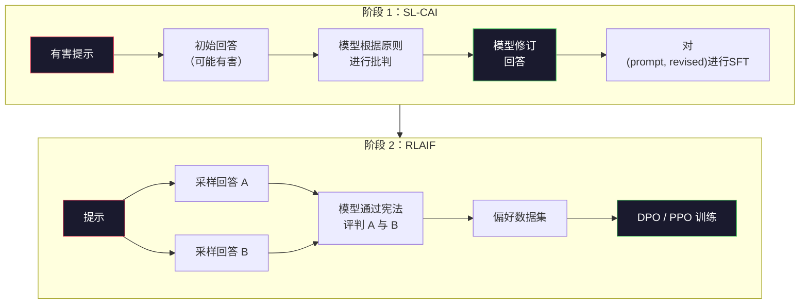
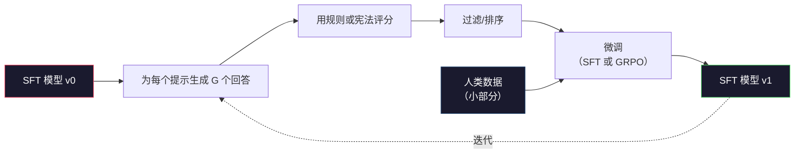

# 宪法AI与自我改进

> RLHF 需要人类参与。宪法 AI 用模型自身取代了大部分人类工作。编写一份原则清单，让模型根据这些原则批判自己的输出，然后在批判结果上训练。DeepSeek-R1 在 2025 年将此推进到了新高度：让模型生成数百万条推理轨迹，用一条规则打分，然后在结果上运行 GRPO。2026 年前沿模型中绝大部分"对齐工作"本身就是模型自身的对齐。本课同时构建这两个循环。

**类型：** 构建
**语言：** Python（标准库 + numpy）
**前置要求：** 第 10 阶段、课程 06-08（SFT、RLHF、DPO）
**时间：** 约 45 分钟

## 学习目标

- 实现宪法 AI 的两阶段循环：自我批判加自我修订，然后在修订后的配对上进行偏好训练
- 推导 GRPO 目标函数（DeepSeek-R1 的组相对策略优化），并将其与 PPO 的价值函数基线进行对比
- 用基于规则的结局奖励生成可验证的推理轨迹，并在无需独立奖励模型的情况下对其进行评分
- 判断何时自我改进优于人类偏好数据，以及何时会陷入模式崩塌

## 问题背景

你在第 07 课中构建了 RLHF，在第 08 课中构建了 DPO。两者都依赖同一个昂贵的输入：人类偏好配对。Anthropic 的 InstructGPT 管线大约使用了 33,000 次比较。Llama 2 Chat 使用了超过 150 万次。Claude 3 用了更多。这些数据生成缓慢、成本高昂，并且偏向于标注员在评分当天恰好持有的观点。

2022 年的宪法 AI 论文提出了一个简单的问题：如果模型自己生成偏好标签呢？给模型一份书面原则列表——即"宪法"——让它在宪法框架下批判自己的回答。这些批判就成为训练信号。

2024 年，DeepSeek 将这个想法更进一步。他们证明，对于任何具有可验证结果的任务（有已知答案的数学题、能通过测试或失败的代码、能赢或输的游戏），你可以完全跳过批判者。生成大量候选解答，用确定性规则对每个解答评分，然后在奖励上运行策略梯度算法。DeepSeek-R1 就是用这种方式训练的，几乎没有人类偏好数据，却达到了与 o1 相当的推理性能。

这两个循环——用于主观行为的宪法 AI，以及用于可验证行为的基于规则的 RL——是 2026 年的主流对齐配方。过去用于 RLHF 的人类偏好预算现在只需花费在一个更小的步骤上：选择宪法和选择奖励规则。

## 概念讲解

### 宪法 AI 循环

Bai 等人（2022）将管线分为两个阶段来构建。

**阶段 1：来自 AI 反馈的监督学习（SL-CAI）。** 从一个有益但可能有害的 SFT 模型开始。用可能有害的请求提示它。对每个回答，让*同一个模型*根据宪法原则批判自己的回答，然后修订。在修订后的回答上进行微调。数据集由 (prompt, revised_response) 配对组成。

**阶段 2：来自 AI 反馈的强化学习（RLAIF）。** 采样成对的回答。让模型判断哪个回答更好地遵循了宪法。这些成对偏好用于训练一个奖励模型。然后在模型上使用 PPO 或 DPO 进行训练。与 RLHF 的关键区别在于：偏好来自模型本身，而非人类。



宪法是关键杠杆。Anthropic 最初的版本有 16 条原则（后来有所扩展）。一条原则的表述类似于"请选择最不可能让来自各种文化背景的人感到反感的那个回答"。你在每个步骤中选择原则，有时随机选择，有时基于提示类别来选择。

### 宪法实际上做了什么

宪法将对齐契约从*数据*转移到了*文本*。在 RLHF 下改变行为需要重新标注数千个配对。在 CAI 下改变行为只需编辑一段文字。这是最主要的实践收益。

但它也有成本。模型的自我判断质量取决于其初始校准水平。如果 SFT 模型存在盲区——例如，它无法识别操纵性措辞——那么批判步骤就会继承这些盲区。CAI 压缩了对齐循环，但无法超越基础模型的上限来放大信号。这就是为什么每个生产级 CAI 管线仍然使用一些人类偏好数据，通常是纯 RLHF 数据量的 5%-10%。

### GRPO：组相对策略优化

DeepSeek 在 DeepSeekMath 论文（2024）中引入了 GRPO，并将其作为 DeepSeek-R1（2025）的核心。GRPO 是 PPO 的一个变体，移除了价值函数。

回顾 PPO 的目标函数（来自第 07 课）：

```
L_PPO = E[min(r(theta) * A, clip(r(theta), 1-eps, 1+eps) * A)]
```

其中 `A` 是优势函数，通常用 GAE 估算，依赖一个学习到的价值网络 `V(s)`。价值网络是一个与策略模型同规模的第二个模型。它使内存需求翻倍，并引入了自己的训练循环。

GRPO 丢弃了价值函数。对于每个提示，它采样一组 G 个回答（通常 G=16 或 64）。计算每个回答的奖励，然后在组内进行归一化：

```
A_i = (r_i - mean(r_1, ..., r_G)) / std(r_1, ..., r_G)
```

优势函数是该回答的奖励相对于其同组样本的 z-score。没有价值函数。组本身充当基线。

```
L_GRPO = E[min(r(theta) * A_group, clip(r(theta), 1-eps, 1+eps) * A_group)] - beta * KL(pi || pi_ref)
```

相对于参考模型的 KL 惩罚仍然存在，与 PPO 相同。截断比率也存在。消失的是独立的外部评论者。

### 为什么 GRPO 对推理任务很重要

对于推理任务，奖励往往是稀疏且二值的：最终答案要么正确要么错误。在稀疏二值奖励上训练的价值函数是一种浪费——它无法学习有用的中间估计值，因为几乎所有状态在最终步骤之前都具有相同的期望回报。GRPO 的组归一化为你提供了一个即时的相对信号：在同一道数学题的 16 次尝试中，哪些尝试高于平均水平？

这正是基于规则奖励所能提供的信号形状：

- **数学**：sympy 或符号检查器判定最终答案是否匹配。
- **代码**：测试套件判定通过/失败。
- **格式**：正则表达式判定答案是否在要求的 XML 标签内。
- **多步证明**：证明助手（Lean、Coq）判定有效性。

DeepSeek-R1-Zero 仅用两个奖励进行训练：数学基准的准确率和格式合规性（答案位于 `<answer>` 标签内）。没有人类偏好，没有评论者模型。DeepSeek 论文中所描述的"顿悟时刻"——模型自发学会自我检查和回溯——正是从仅靠 GRPO 和稀疏规则奖励中涌现出来的。

### 过程奖励模型 vs 结局奖励模型

你仍然面临一个设计选择：奖励最终答案（结局奖励模型，ORM）还是奖励每个中间步骤（过程奖励模型，PRM）。

| 维度 | ORM | PRM |
|------|-----|-----|
| 每条轨迹的信号 | 1 个数值 | N 个数值（每步一个） |
| 监督来源 | 最终答案检查 | 步骤级标签或自我判断 |
| 训练成本 | 便宜 | 昂贵 |
| 信用分配 | 稀疏、有噪声 | 密集、精准 |
| 奖励黑客风险 | 较低 | 较高（模型会优化 PRM 的人工产物） |
| 使用方 | DeepSeek-R1、R1-Zero | OpenAI o1（据称）、Math-Shepherd |

2024-2025 年的共识是：ORM + GRPO 比 PRM 更具可扩展性。PRM 在每个 token 上的样本效率更高，但需要昂贵的步骤标注数据，且容易退化为捷径行为（写出看起来对 PRM 友好但并不推进证明的步骤）。对于大多数团队来说，ORM + GRPO 应该是首选方案。

### 自我改进：反馈乘数

一旦掌握了双循环模式（批判/修订，以及带规则奖励的组相对 RL），你就可以将它们串联起来。

1. 从一个 SFT 模型开始。
2. 为每个提示生成大量候选回答。
3. 用基于规则的奖励（对于可验证任务）或宪法批判者（对于主观任务）进行评分。
4. 保留最优候选作为新的 SFT 数据或偏好配对。
5. 微调。回到第 2 步，使用改进后的模型。

DeepSeek 在将其应用于 R1-Zero 之后时称此为"拒绝采样微调"。Anthropic 称更早的版本为"宪法 AI 蒸馏"。这个模式是：每次迭代放大模型中已有的信号。它不会引入新信号。如果模型根本无法解决某类问题 X，那么任何数量的自我改进都无法创造出这种能力。

危险在于模式崩塌。自我生成的数据分布总是比训练语料更窄。经过 3-5 轮自我蒸馏后，模型通常在创造性任务上丧失多样性，变得过度自信，并表现出典型的"AI 腔调"（重复措辞、公式化结构）。生产管线会将自我生成的数据与一小部分新鲜的人类数据进行混合，以保持分布的真实性。



### 何时使用哪种方案

- **纯 CAI**：主观行为（语气、安全性、拒绝风格）。你有定义良好的宪法，但没有干净的可验证结果。
- **GRPO + ORM**：可验证任务（数学、代码、结构化提取）。你能以低成本检查正确性。奖励是稀疏且二值的。
- **在自我生成配对上的 DPO**：混合方案。用宪法生成偏好配对，然后用 DPO（第 08 课）而不是 PPO/GRPO 进行训练。
- **完整 RLHF**：当你需要任何一个规则或简短宪法都无法表达的多元目标权衡时，仍然适用。

大多数 2026 年的前沿管线会同时运行以上四种。CAI 用于安全层。GRPO 用于推理后训练阶段。DPO 用于偏好打磨。少量 RLHF 步骤用于处理其他方法难以解决的残留行为。

```figure
自我批判循环
```

## 动手实现

代码仅用 Python + numpy 实现了三样东西：一个宪法 AI 自我批判循环、一个用于简单算术的规则奖励检查器、一个在第 04 课的微型语言模型上运行的最小 GRPO 训练器。

### 步骤 1：宪法

一份原则清单。在生产环境中，每一行都会更加丰富并带有类别标签。本课中保持简短即可。

```python
CONSTITUTION = [
    "回答必须直接回应所提问题，不加模棱两可的修饰。",
    "回答不得包含不必要的填充内容。",
    "如果问题有单一数值答案，应直接陈述该数字。",
    "回答不得拒绝合理且无害的请求。",
]
```

### 步骤 2：自我批判与修订

在真实系统中，模型自身会进行批判。在本课中，我们用手工编写的评分标准来模拟批判者，使管线无需调用 LLM 即可运行。

```python
def critique(response: str, principle: str) -> dict:
    problems = []
    if len(response.split()) > 40 and "plainly" in principle:
        problems.append("答案被淹没在冗余文字中")
    if response.strip().lower().startswith(("i can't", "i cannot", "as an ai")):
        problems.append("无端的拒绝")
    if response.count(",") > 4:
        problems.append("过多的保留措辞")
    return {"principle": principle, "problems": problems}

def revise(response: str, critique_result: dict) -> str:
    if "answer buried" in " ".join(critique_result["problems"]):
        return response.split(".")[-2].strip() + "."
    if "unwarranted refusal" in " ".join(critique_result["problems"]):
        return "答案是：" + response.split(":")[-1].strip()
    return response
```

修订函数只是一个替身。使用真实 LLM 时，它会是一个第二提示："根据批判结果重写回答。"

### 步骤 3：基于规则的奖励

对于可验证任务，完全替换掉批判者。这个检查器对算术答案进行评分。

```python
import re

def reward_math(prompt: str, response: str) -> float:
    try:
        expected = eval(prompt.replace("What is ", "").replace("?", "").strip())
    except Exception:
        return 0.0
    numbers = re.findall(r"-?\d+", response)
    if not numbers:
        return 0.0
    return 1.0 if int(numbers[-1]) == expected else 0.0

def reward_format(response: str) -> float:
    return 1.0 if re.search(r"<answer>.*</answer>", response) else 0.0
```

两条确定性规则。无需训练数据。无需人类标注。组合奖励为 `reward_math + 0.1 * reward_format`，在不淹没正确性的前提下惩罚格式缺失。

### 步骤 4：组相对优势

给定同一提示的一组回答的奖励列表，计算 z-score：

```python
import numpy as np

def group_relative_advantage(rewards: list[float]) -> np.ndarray:
    r = np.array(rewards, dtype=float)
    if r.std() < 1e-8:
        return np.zeros_like(r)
    return (r - r.mean()) / (r.std() + 1e-8)
```

如果组内所有样本的奖励相同，优势为零，没有梯度信号。这是有意为之的设计。它在告诉你：这道题对于当前策略而言要么过于简单，要么过于困难，该步骤应当跳过。

### 步骤 5：GRPO 更新

一步，符号梯度。在生产环境中，这会是一次 torch autograd 前向/反向传播。这里直接展示更新规则。

```python
def grpo_step(policy_logprobs: np.ndarray, ref_logprobs: np.ndarray,
              advantages: np.ndarray, beta: float = 0.01, clip_eps: float = 0.2) -> dict:
    ratios = np.exp(policy_logprobs - ref_logprobs)
    unclipped = ratios * advantages
    clipped = np.clip(ratios, 1 - clip_eps, 1 + clip_eps) * advantages
    policy_loss = -np.minimum(unclipped, clipped).mean()
    kl = (ref_logprobs - policy_logprobs).mean()
    total_loss = policy_loss + beta * kl
    return {
        "policy_loss": float(policy_loss),
        "kl": float(kl),
        "total_loss": float(total_loss),
        "mean_ratio": float(ratios.mean()),
    }
```

这是 PPO 的截断代理目标，只有一个改动：优势函数来自组相对 z-score，而非价值函数。无需训练 V(s)。无需 GAE。组本身就是基线。

### 步骤 6：自我改进轮次

将各部分串联起来。采样一个组，用规则对每个回答评分，计算优势，输出你会喂入真实优化器的指标。

```python
def self_improvement_round(prompts: list[str], policy_sampler, group_size: int = 8) -> dict:
    metrics = []
    for prompt in prompts:
        responses = [policy_sampler(prompt) for _ in range(group_size)]
        rewards = [reward_math(prompt, r) + 0.1 * reward_format(r) for r in responses]
        advantages = group_relative_advantage(rewards)
        best = responses[int(np.argmax(rewards))]
        metrics.append({
            "prompt": prompt,
            "mean_reward": float(np.mean(rewards)),
            "best_reward": float(np.max(rewards)),
            "std_reward": float(np.std(rewards)),
            "best_response": best,
            "advantages": advantages.tolist(),
        })
    return {"per_prompt": metrics,
            "overall_mean": float(np.mean([m["mean_reward"] for m in metrics]))}
```

## 使用方式

运行 `code/main.py` 将完整跑通两个循环。CAI 循环生成一小批 (initial, revised) 配对，你可以对其微调。GRPO 循环生成算术问题的每提示奖励统计，展示组相对优势如何让一个弱采样器在没有价值函数或人类标注的情况下实现改进。

数字本身不是重点。在使用已训练模型的真正运行中，奖励均值应随轮次上升，奖励标准差应保持稳定（如果坍缩为零，说明策略已发生模式崩塌，应停止训练），且相对于参考模型的 KL 散度应缓慢增长。这三条曲线——均值奖励上升、标准差稳定、KL 有界——是 GRPO 或 CAI 管线的生产环境健康检查指标。

## 交付物

本课产出 `outputs/skill-self-improvement-auditor.md`。给它一个拟议的自我改进管线，它会强制执行不可妥协的关卡：一个真正可验证的奖励规则、相对于参考模型的 KL 预算、多样性下限，以及人类数据配额。它会拒绝批准任何声称是"纯自我改进"却没有任何外部锚定的循环。

## 练习

1. 将步骤 2 中的手工批判者替换为 LLM 调用。使用任意本地对话模型。衡量批判和修订实际改善回答的频率， versus 保持不变。

2. 添加第三条关于事实准确性的宪法原则。在需要事实声明的提示上运行管线（首都、日期），衡量多少修订消除了事实错误，又引入了多少新错误。

3. 在 CAI 阶段 2 产生的偏好配对上实现 DPO。取 20 个提示，每个生成两个回答，让批判者为每对挑选胜者，然后运行第 08 课的 DPO 损失函数。与在同一数据上的 GRPO 路径进行比较。

4. 为 GRPO 目标添加熵正则化项。项 `-alpha * entropy(policy)`，其中 alpha=0.01，鼓励多样化采样。衡量它在 5 轮自我改进中是否延缓了模式崩塌。

5. 为两步算术问题构建过程奖励评分器。给定"What is (3+4)*5?"，模型必须展示中间步骤 3+4=7。分别对中间步骤和最终答案评分，比较 PRM 加权 GRPO 与纯 ORM 加权 GRPO 在 10 轮中的表现。

## 关键术语

| 术语 | 人们怎么说 | 实际含义 |
|------|-----------|---------|
| 宪法 AI | "模型自我对齐" | 一个两阶段管线（自我批判 + RLAIF），用模型对照书面宪法的自我判断来替代大部分人类偏好标签 |
| RLAIF | "无人参与版 RLHF" | 来自 AI 反馈的强化学习——在模型自身生成的偏好上运行 PPO 或 DPO |
| GRPO | "去掉价值函数的 PPO" | 组相对策略优化——为每个提示采样 G 个回答，用 z-scored 组奖励作为优势 |
| ORM | "奖励最终答案" | 结局奖励模型——仅在最终答案上给出一个标量奖励 |
| PRM | "奖励每一步" | 过程奖励模型——对每个中间推理步骤给予奖励，通常从步骤标注数据中训练 |
| 基于规则的奖励 | "确定性评分器" | 一个验证器（正则表达式、sympy、测试套件），返回二值或数值分数，无需学习到的模型 |
| 拒绝采样微调 | "保留优胜者，重新训练" | 采样大量回答，过滤到最高奖励的，加入 SFT 数据，重新训练 |
| 模式崩塌 | "模型不再多样化" | 后训练策略集中在回答空间的狭窄区域；表现为组内奖励标准差下降 |
| KL 预算 | "你能漂移多远" | 优化器在训练停止前允许累积的相对于参考模型的最大 KL 散度 |
| R1 时刻 | "模型学会了回溯" | DeepSeek 报告的涌现行为：仅在结局奖励上训练的策略，自发在其思维链中发展出自我检查和回溯能力 |

## 延伸阅读

- [Bai 等，2022 ——《宪法 AI：来自 AI 反馈的危害消除》](https://arxiv.org/abs/2212.08073) —— Anthropic 原始的 CAI 论文，含两阶段 SL-CAI + RLAIF 管线
- [Shao 等，2024 ——《DeepSeekMath：推动开放语言模型的数学推理极限》](https://arxiv.org/abs/2402.03300) —— 引入 GRPO
- [DeepSeek-AI，2025 ——《DeepSeek-R1：通过强化学习激励 LLM 的推理能力》](https://arxiv.org/abs/2501.12948) —— R1 和 R1-Zero，GRPO + 规则奖励规模化应用
- [Lightman 等，2023 ——《让我们逐步验证》](https://arxiv.org/abs/2305.20050) —— OpenAI 的 PRM800K 及过程奖励模型的论点
- [Wang 等，2024 ——《Math-Shepherd：无需人工标注的逐步验证与强化 LLM》](https://arxiv.org/abs/2312.08935) —— 通过蒙特卡洛 rollout 的自动标注 PRM
- [Huang 等，2024 ——《大型语言模型尚不能自我纠正推理》](https://arxiv.org/abs/2310.01798) —— 对无外部锚定自我改进的怀疑主义反论点
