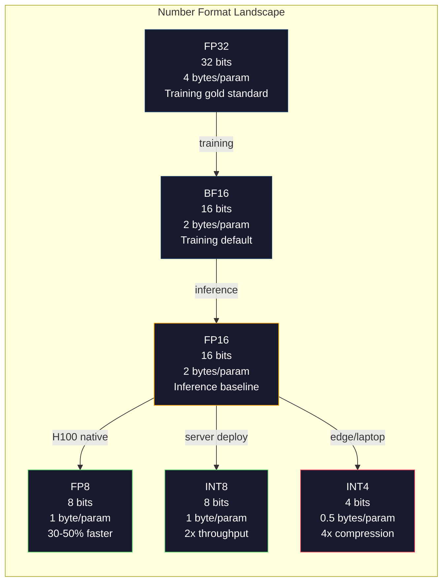
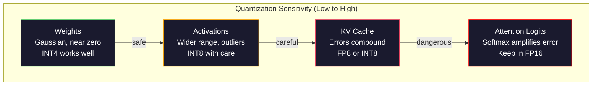
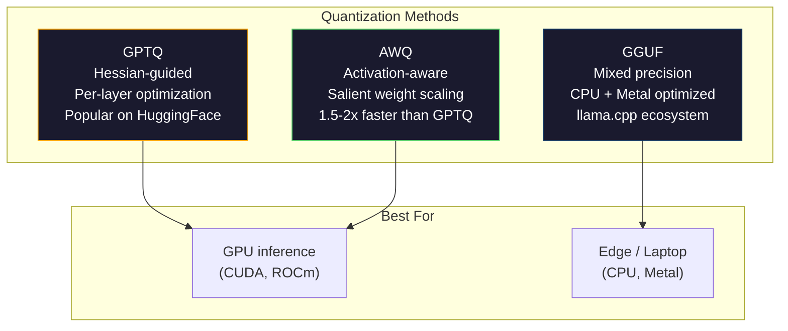

# 量化：让模型瘦身

> FP16 的 70B 模型需要 140GB 内存。仅权重就需要两块 A100。量化到 FP8：一块 80GB 的 GPU 就够了。INT4：一台 MacBook 就能跑。

**类型：** Build
**语言：** Python (with numpy)
**前置要求：** Phase 10, Lessons 01-10 (LLMs from Scratch)
**时间：** ~120 分钟

## 学习目标

- 从 FP16 到 INT8 和 INT4 实现对称和非对称量化，包括 per-tensor 和 per-channel 缩放
- 计算量化带来的内存节省，并确定哪种精度适合给定 GPU 的 VRAM
- 解释 post-training quantization (PTQ) 和 quantization-aware training (QAT) 之间的区别
- 应用 GPTQ 或 AWQ 对真实模型进行量化，并在基准测试上衡量准确性与内存的权衡

## 问题所在

Llama 3 70B 拥有 700 亿参数。每个参数是一个 16 位浮点数。那就是 1400 亿字节，140GB。一块 A100 只有 80GB 的 VRAM。你甚至无法在一个 GPU 上加载权重，更不用说运行推理了。你需要两块 A100，每小时每块 2 美元，才能服务一个模型。

但每个参数 16 位是浪费的。神经网络中的大多数权重聚集在零附近。FP16 的完整动态范围（从 0.000000059 到 65,504）几乎完全未被使用。如果你测量 Llama 3 70B 中权重的实际分布，95% 的权重落在 -0.1 到 +0.1 之间。你正在用 16 位来表示本可以放入 4 位的值。

量化用低精度数字替换高精度数字。FP16 到 FP8 将内存减半。FP16 到 INT4 将其降至四分之一。那个 140GB 的模型变成了 35GB。它可以在单个消费级 GPU 上运行。推至 2-bit 量化（激进、有损，但对某些任务可用），同样的模型可以在 16GB 的笔记本电脑上运行。

代价是准确性。你去除的每一位都会摧毁信息。问题是你损失了多少准确性，以及在何处损失。一个经过良好量化的 INT4 模型在大多数基准测试上保留了原始模型 95-99% 的质量。一个 naïve 的 INT4 量化可能会完全毁掉模型。区别在于技术。

使用 GPTQ 将 Llama 3 量化到 INT4 的社区版本在 WikiText 上大约损失 1-2 个 perplexity 点。Mistral 发布了 Mixtral 8x22B 的 FP8 checkpoints，在 MMLU 上没有可测量的质量损失。GGUF 格式支撑着 llama.cpp，在配备 M 系列芯片的 MacBook 上运行 70B 模型。量化不是一个 hack。它是每个大于 7B 的模型的标准化部署路径。

## 概念

### 数字格式：每个比特做什么

每个浮点数都有三个部分：符号（sign）、指数（exponent）和尾数（mantissa，也称为 significand）。符号是一位。指数决定范围（数字可以多大或多小）。尾数决定精度（你能得到多少位小数）。

```
FP32:  [1 sign] [8 exponent] [23 mantissa]  = 32 bits
FP16:  [1 sign] [5 exponent] [10 mantissa]  = 16 bits
BF16:  [1 sign] [8 exponent] [7  mantissa]  = 16 bits
FP8:   [1 sign] [4 exponent] [3  mantissa]  = 8  bits (E4M3)
FP8:   [1 sign] [5 exponent] [2  mantissa]  = 8  bits (E5M2)
INT8:  [1 sign] [7 value]                   = 8  bits (uniform steps)
INT4:  [1 sign] [3 value]                   = 4  bits (16 levels total)
```

**FP32** 是全精度。23 位尾数给你大约 7 位十进制精度。范围：大约是 1.2 x 10^-38 到 3.4 x 10^38。训练过去 exclusively 在 FP32 中进行。它在累加（矩阵乘法期间的运行总和）时仍然如此。

**FP16** 将位数减半。10 位尾数给出大约 3.3 位十进制精度。指数缩减到 5 位，大幅降低了范围（最大值约 65,504）。这对于权重（聚集在零附近）是可以的，但对于在训练期间可能尖峰的激活和梯度来说很危险。FP16 训练需要 loss scaling 来防止下溢。

**BF16** (Brain Float 16) 保留了 FP32 的 8 位指数，但将尾数缩减到 7 位。与 FP32 相同的范围，比 FP16 精度低。Google 专门为深度学习设计了它。直觉是：对于神经网络，范围比精度更重要。一个在 FP16 中下溢为零的 10^-20 梯度在 BF16 中得以存活。一个四舍五入到 0.0734 的 0.07342 权重在 BF16 中已经足够接近。每个现代训练运行都使用 BF16 或 BF16/FP32 混合。

**FP8** 有两种变体。E4M3（4 位指数，3 位尾数）用于推理期间的权重和激活。E5M2（5 位指数，2 位尾数）用于训练期间的梯度，那里范围比精度更重要。H100 GPU 上的 FP8 推理比 FP16 快 30-50%，质量损失可忽略不计。

**INT8** 是整数格式。没有指数，没有尾数。只是从 -128 到 127 的 256 个均匀间隔的值。你需要一个 scale factor 将浮点权重映射到这个范围。优点是：整数算术比浮点更快、更省电。A100 上的 INT8 矩阵乘法运行速度为 624 TOPS，而 FP16 为 312 TFLOPS。

**INT4** 更进一步。只有 16 个可能的值。scale factor 做大量工作。质量完全取决于你如何选择 scale 以及量化哪些权重。最先进的 INT4 方法（GPTQ、AWQ）保留了 95% 以上的原始模型质量。



### 量化如何工作

核心操作很简单。取一个浮点值张量，找到一个 scale factor，乘以，四舍五入到最近的整数，并存储整数加上 scale factor。

**量化：**
```
scale = max(abs(tensor)) / max_int_value
quantized = round(tensor / scale)
```

**反量化：**
```
reconstructed = quantized * scale
```

对于对称范围的 INT8（-127 到 127）：
```
scale = max(abs(tensor)) / 127
quantized = clamp(round(tensor / scale), -128, 127)
```

误差是舍入误差。每个值最多可以偏差 `scale / 2`。一个层中的总误差取决于你有多少权重以及模型对这些权重的微扰的敏感程度。

**Per-tensor 与 per-channel 量化。** Per-tensor 对整个权重矩阵使用一个 scale factor。简单但有损：如果一列有大值而另一列有小值，小值会失去大部分精度。Per-channel 为每个输出通道（权重矩阵的每一行或列）使用一个 scale factor。开销更多（你存储 N 个 scale factors 而不是 1 个），但质量显著更好。每个生产量化方法都使用 per-channel 或更细粒度的量化。

**非对称量化** 添加了一个 zero-point 偏移：`quantized = round(tensor / scale) + zero_point`。这处理了不以零为中心分布的情况。例如，ReLU 激活总是非负的。对称量化浪费了一半的整数范围在非负值上，而这些值永远不会出现。非对称量化将实际范围 [min, max] 映射到完整的整数范围。

### 敏感性层级

模型中的所有内容对量化的容忍度并不相同。有一个清晰的层级。

**权重（最稳健）。** 模型权重在训练期间变化缓慢，并遵循大致以零为中心的高斯分布。它们量化效果好。具有 per-channel scales 的 INT8 权重产生几乎无损的结果。INT4 需要更复杂的方法但可以工作。

**激活（中等敏感性）。** 激活是推理期间在网络中流动的中间值。它们比权重具有更宽的动态范围，并包含异常值。一个单独的 attention head 可能产生比均值大 100 倍的激活值。这些异常值对模型质量至关重要。naïve 地量化它们会摧毁信息。解决方案：保持异常值通道处于更高精度（LLM.int8()），或使用 per-token 或 per-channel 激活 scales。

**KV cache（高敏感性）。** Key-value cache 存储所有先前 token 的注意力状态。在长上下文长度下，KV cache 主导内存。对于 32K 上下文下的 70B 模型，仅 KV cache 在 FP16 中就有 40GB。将 KV cache 量化到 FP8 或 INT8 可以节省大量内存，但任何误差都会在后续所有注意力计算中累积。质量影响随序列长度缩放。

**注意力 logits（最敏感）。** 注意力中的 softmax 对其输入的微小变化高度敏感。pre-softmax logit 中 0.01 的量化误差可能会显著改变注意力分布。大多数量化方案即使在其他所有内容都被量化时，也保持注意力计算在更高精度（FP16 或 BF16）下。



### PTQ 与 QAT

**Post-Training Quantization (PTQ)** 量化一个已经训练好的模型。无需重新训练。你取出 FP16 权重，计算 scale factors，四舍五入，然后部署。快速（几分钟到几小时）且便宜。对 INT8 和 FP8 效果很好。对于 INT4，naïve PTQ 经常失败得很惨，因为舍入误差会累积。先进的 PTQ 方法（GPTQ、AWQ）使用校准数据来最小化量化误差。

**Quantization-Aware Training (QAT)** 在训练期间的正向传递中插入伪量化操作。模型学习将其权重放置在舍入误差较小的位置。梯度通过使用 straight-through estimator (STE) 流过伪量化：假装舍入操作的梯度为 1。QAT 产生的 INT4 和 INT2 模型比 PTQ 更好，但需要完整的训练运行。Google 为 Gemini 的高效服务使用了 QAT。Meta 为一些 Llama 部署目标使用了 QAT。

| 方面 | PTQ | QAT |
|--------|-----|-----|
| 成本 | 几分钟到几小时 | 完整训练运行 |
| INT8 质量 | 优秀（< 0.1% 损失） | 优秀 |
| INT4 质量 | 使用 GPTQ/AWQ 良好（1-3% 损失） | 更好（< 1% 损失） |
| INT2 质量 | 差 | 可用于某些任务 |
| 校准数据 | 128-1024 个示例 | 完整训练数据集 |
| 使用时机 | 部署、迭代 | 低比特宽度下的最大质量 |

### GPTQ、AWQ、GGUF

**GPTQ (GPT Quantization)** 是一种一次性 PTQ 方法。它逐层量化权重，使用小的校准数据集（典型的是 128 个示例）来测量 Hessian（关于输出对每个权重敏感性的二阶信息）。Hessian 说重要的权重会被更仔细地量化。GPTQ 是第一个使 INT4 量化对 LLMs 实用的方法。Hugging Face 上的 TheBloke 通过发布数百个模型的量化版本而普及了 GPTQ。

**AWQ (Activation-Aware Weight Quantization)** 观察到一小部分权重（约 1%）不成比例地重要，因为它们与大的激活值相乘。AWQ 使用校准数据识别这些显著权重，并在量化前将它们缩放（然后相应地缩放激活值）。这将重要权重保持在 INT4 量化准确的范围内。AWQ 通常匹配或略优于 GPTQ 质量，同时应用速度比 GPTQ 快 1.5-2 倍。

**GGUF (GPT-Generated Unified Format)** 是 llama.cpp 及其生态系统使用的文件格式。它支持混合量化：不同层获得不同的比特宽度。第一层和最后一层（embedding 和 output head）通常保持更高精度。中间层获得 INT4 或 INT3。GGUF 文件是自包含的：权重、tokenizer、元数据都在一个文件中。该格式专为 CPU 推理和 Apple Silicon 设计，在那里将整个模型加载到内存中并在 CPU 或 Metal GPU 上运行矩阵乘法是标准路径。Q4_K_M 是最流行的 GGUF 量化变体，平衡了质量和大小。



### 质量测量

你怎么知道你的量化模型是否仍然好？

**Perplexity。** 最常用的指标。越低越好。在保留数据集（WikiText-2 是标准的）上为原始模型和量化模型计算 perplexity。delta 告诉你量化摧毁了多少信息。经验法则：delta < 0.5 是优秀，0.5-1.0 是良好，1.0-2.0 对大多数任务可接受，> 2.0 意味着出错了。

**任务特定基准。** 在 MMLU、HumanEval、GSM8K 或你的自定义评估套件上运行量化模型。与原始模型比较。量化对不同能力的影响不均匀。数学和代码任务比一般知识对精度损失更敏感。

**输出比较。** 从两个模型在同一提示上生成响应并比较。LLM-as-judge (Lesson 10) 在这里效果很好。计算胜率：量化模型匹配或胜过原始模型的提示占比是多少？

**延迟和吞吐量。** 量化存在是为了让模型更快、更便宜。测量每秒 token 数、首 token 时间和内存使用。一个比原始模型更慢的量化模型比无用更糟。

| 模型 | 格式 | 大小 | Perplexity (WikiText-2) | MMLU | Tokens/sec (A100) |
|-------|--------|------|------------------------|------|-------------------|
| Llama 3 70B | FP16 | 140GB | 3.12 | 79.5% | 38 |
| Llama 3 70B | FP8 | 70GB | 3.14 | 79.3% | 55 |
| Llama 3 70B | GPTQ INT4 | 35GB | 4.32 | 77.8% | 72 |
| Llama 3 70B | AWQ INT4 | 35GB | 4.18 | 78.1% | 75 |
| Llama 3 70B | GGUF Q4_K_M | 40GB | 4.25 | 77.9% | 28 (CPU) |

模式是：FP8 几乎是免费的。INT4 花费 1-2 个 MMLU 点，但使吞吐量翻倍并使内存降至四分之一。这个权衡对几乎所有部署来说都值得。

### 真实数字

H100 上 FP16 到 FP8：30-50% 推理加速，< 0.1% 质量损失。这是不假思索的量化选择。每个 H100 部署都应该使用它。

FP16 到 INT8 (LLM.int8())：2 倍内存减少，< 0.5% 质量损失。混合精度方法将异常特征保持在 FP16，同时将其他所有内容量化到 INT8。

FP16 到 INT4 (GPTQ/AWQ)：4 倍内存减少，1-3% 质量损失取决于模型和方法。使 70B 模型可以在单个 48GB GPU 上运行。

FP16 到 INT4 (GGUF Q4_K_M)：3.5 倍内存减少，1-2% 质量损失。针对 CPU 推理优化。Q4_K_M 下的 70B 模型约为 40GB，在 64GB 的 M3 Max 上以 10-15 tokens/秒运行。

FP16 到 INT2：8 倍内存减少，5-15% 质量损失。仅适用于你可以容忍退化的特定狭窄任务。研究前沿，尚未达到通用生产的成熟度。

```figure
quantization
```

## 构建

### 步骤 1：数字格式表示

构建每种格式的位级别表示，以确切查看符号、指数和尾数做什么。

```python
import numpy as np


def float_to_fp32_bits(value):
    # 将 float32 值的位表示解包为符号、指数和尾数
    bits = np.float32(value).view(np.uint32)
    sign = (bits >> 31) & 1
    exponent = (bits >> 23) & 0xFF
    mantissa = bits & 0x7FFFFF
    return {"sign": int(sign), "exponent": int(exponent), "mantissa": int(mantissa),
            "exponent_bits": format(int(exponent), '08b'),
            "mantissa_bits": format(int(mantissa), '023b'),
            "value": float(value),
            "actual_exponent": int(exponent) - 127}


def float_to_fp16_bits(value):
    # 将 float16 值的位表示解包
    fp16 = np.float16(value)
    bits = fp16.view(np.uint16)
    sign = (bits >> 15) & 1
    exponent = (bits >> 10) & 0x1F
    mantissa = bits & 0x3FF
    return {"sign": int(sign), "exponent": int(exponent), "mantissa": int(mantissa),
            "exponent_bits": format(int(exponent), '05b'),
            "mantissa_bits": format(int(mantissa), '010b'),
            "value": float(fp16),
            "actual_exponent": int(exponent) - 15}


def float_to_bf16_bits(value):
    # 从 float32 截取高 16 位以获得 bf16 表示
    fp32_bits = np.float32(value).view(np.uint32)
    bf16_bits = (fp32_bits >> 16).astype(np.uint16)
    sign = (bf16_bits >> 15) & 1
    exponent = (bf16_bits >> 7) & 0xFF
    mantissa = bf16_bits & 0x7F
    reconstructed = np.uint32(bf16_bits.astype(np.uint32) << 16).view(np.float32)
    return {"sign": int(sign), "exponent": int(exponent), "mantissa": int(mantissa),
            "exponent_bits": format(int(exponent), '08b'),
            "mantissa_bits": format(int(mantissa), '07b'),
            "value": float(reconstructed),
            "actual_exponent": int(exponent) - 127}


def simulate_fp8_e4m3(value):
    # 手动模拟 FP8 E4M3 格式
    sign = 1 if value < 0 else 0
    abs_val = abs(value)
    max_val = 448.0
    abs_val = min(abs_val, max_val)
    if abs_val == 0:
        return {"sign": sign, "exponent": 0, "mantissa": 0, "value": 0.0,
                "exponent_bits": "0000", "mantissa_bits": "000"}
    exp = int(np.floor(np.log2(abs_val)))
    exp = max(-6, min(8, exp))
    mantissa_val = abs_val / (2.0 ** exp) - 1.0
    mantissa_quant = round(mantissa_val * 8) / 8
    mantissa_quant = max(0, min(0.875, mantissa_quant))
    reconstructed = (1.0 + mantissa_quant) * (2.0 ** exp)
    if sign:
        reconstructed = -reconstructed
    mantissa_int = int(round(mantissa_quant * 8))
    return {"sign": sign, "exponent": exp + 7, "mantissa": mantissa_int,
            "exponent_bits": format(exp + 7, '04b'),
            "mantissa_bits": format(mantissa_int, '03b'),
            "value": float(reconstructed),
            "actual_exponent": exp}


def display_format_comparison(value):
    # 并排显示所有格式的位分解
    fp32 = float_to_fp32_bits(value)
    fp16 = float_to_fp16_bits(value)
    bf16 = float_to_bf16_bits(value)
    fp8 = simulate_fp8_e4m3(value)

    print(f"\n  Value: {value}")
    print(f"  {'Format':<8} {'Stored Value':>14} {'Error':>12} {'Sign':>5} {'Exp Bits':>10} {'Man Bits':>25}")
    print(f"  {'-'*76}")
    print(f"  {'FP32':<8} {fp32['value']:>14.6f} {abs(fp32['value'] - value):>12.8f} {fp32['sign']:>5} {fp32['exponent_bits']:>10} {fp32['mantissa_bits']:>25}")
    print(f"  {'FP16':<8} {fp16['value']:>14.6f} {abs(fp16['value'] - value):>12.8f} {fp16['sign']:>5} {fp16['exponent_bits']:>10} {fp16['mantissa_bits']:>25}")
    print(f"  {'BF16':<8} {bf16['value']:>14.6f} {abs(bf16['value'] - value):>12.8f} {bf16['sign']:>5} {bf16['exponent_bits']:>10} {bf16['mantissa_bits']:>25}")
    print(f"  {'FP8e4m3':<8} {fp8['value']:>14.6f} {abs(fp8['value'] - value):>12.8f} {fp8['sign']:>5} {fp8['exponent_bits']:>10} {fp8['mantissa_bits']:>25}")
```

### 步骤 2：对称量化（Per-Tensor 和 Per-Channel）

基本的量化操作。Per-tensor 对整个矩阵使用一个 scale。Per-channel 为每行或每列使用一个 scale。

```python
def quantize_symmetric(tensor, num_bits=8):
    # 对称量化：将值映射到 [-qmax, qmax] 范围
    qmin = -(2 ** (num_bits - 1))
    qmax = 2 ** (num_bits - 1) - 1
    abs_max = np.max(np.abs(tensor))
    if abs_max == 0:
        return np.zeros_like(tensor, dtype=np.int32), 1.0
    scale = abs_max / qmax
    quantized = np.clip(np.round(tensor / scale), qmin, qmax).astype(np.int32)
    return quantized, float(scale)


def dequantize_symmetric(quantized, scale):
    # 反量化：乘以 scale 恢复近似值
    return quantized.astype(np.float64) * scale


def quantize_per_channel(tensor, num_bits=8, axis=0):
    # Per-channel 量化：每个输出通道一个 scale
    qmin = -(2 ** (num_bits - 1))
    qmax = 2 ** (num_bits - 1) - 1

    if axis == 0:
        abs_max = np.max(np.abs(tensor), axis=1, keepdims=True)
    else:
        abs_max = np.max(np.abs(tensor), axis=0, keepdims=True)

    abs_max = np.where(abs_max == 0, 1.0, abs_max)
    scales = abs_max / qmax
    quantized = np.clip(np.round(tensor / scales), qmin, qmax).astype(np.int32)
    return quantized, scales.squeeze()


def dequantize_per_channel(quantized, scales, axis=0):
    # Per-channel 反量化
    if axis == 0:
        return quantized.astype(np.float64) * scales.reshape(-1, 1)
    else:
        return quantized.astype(np.float64) * scales.reshape(1, -1)


def quantize_asymmetric(tensor, num_bits=8):
    # 非对称量化：引入 zero_point 偏移以处理非零中心分布
    qmin = 0
    qmax = 2 ** num_bits - 1
    t_min = np.min(tensor)
    t_max = np.max(tensor)
    if t_max == t_min:
        return np.zeros_like(tensor, dtype=np.int32), 1.0, 0
    scale = (t_max - t_min) / (qmax - qmin)
    zero_point = int(np.round(qmin - t_min / scale))
    zero_point = max(qmin, min(qmax, zero_point))
    quantized = np.clip(np.round(tensor / scale + zero_point), qmin, qmax).astype(np.int32)
    return quantized, float(scale), int(zero_point)


def dequantize_asymmetric(quantized, scale, zero_point):
    # 非对称反量化
    return (quantized.astype(np.float64) - zero_point) * scale
```

### 步骤 3：质量测量

衡量量化摧毁了多少信息。原始和重建张量之间的均方误差、信噪比和余弦相似度。

```python
def quantization_error(original, reconstructed):
    # 计算量化误差的多种度量
    diff = original - reconstructed
    mse = float(np.mean(diff ** 2))
    rmse = float(np.sqrt(mse))
    max_error = float(np.max(np.abs(diff)))
    signal_power = float(np.mean(original ** 2))
    snr_db = 10 * np.log10(signal_power / max(mse, 1e-20))

    orig_flat = original.flatten()
    recon_flat = reconstructed.flatten()
    norm_orig = np.linalg.norm(orig_flat)
    norm_recon = np.linalg.norm(recon_flat)
    if norm_orig == 0 or norm_recon == 0:
        cosine_sim = 0.0
    else:
        cosine_sim = float(np.dot(orig_flat, recon_flat) / (norm_orig * norm_recon))

    return {"mse": mse, "rmse": rmse, "max_error": max_error,
            "snr_db": float(snr_db), "cosine_similarity": cosine_sim}


def compare_quantization_methods(tensor, num_bits=8):
    # 比较 per-tensor、per-channel 和非对称量化的质量
    q_pt, s_pt = quantize_symmetric(tensor, num_bits)
    recon_pt = dequantize_symmetric(q_pt, s_pt)
    err_pt = quantization_error(tensor, recon_pt)

    q_pc, s_pc = quantize_per_channel(tensor, num_bits, axis=0)
    recon_pc = dequantize_per_channel(q_pc, s_pc, axis=0)
    err_pc = quantization_error(tensor, recon_pc)

    q_asym, s_asym, zp = quantize_asymmetric(tensor, num_bits)
    recon_asym = dequantize_asymmetric(q_asym, s_asym, zp)
    err_asym = quantization_error(tensor, recon_asym)

    print(f"\n  Quantization Comparison ({num_bits}-bit, tensor shape {tensor.shape}):")
    print(f"  {'Method':<20} {'MSE':>12} {'SNR (dB)':>10} {'Cosine Sim':>12} {'Max Error':>12}")
    print(f"  {'-'*68}")
    print(f"  {'Per-tensor sym':<20} {err_pt['mse']:>12.8f} {err_pt['snr_db']:>10.2f} {err_pt['cosine_similarity']:>12.8f} {err_pt['max_error']:>12.8f}")
    print(f"  {'Per-channel sym':<20} {err_pc['mse']:>12.8f} {err_pc['snr_db']:>10.2f} {err_pc['cosine_similarity']:>12.8f} {err_pc['max_error']:>12.8f}")
    print(f"  {'Asymmetric':<20} {err_asym['mse']:>12.8f} {err_asym['snr_db']:>10.2f} {err_asym['cosine_similarity']:>12.8f} {err_asym['max_error']:>12.8f}")

    return {"per_tensor": err_pt, "per_channel": err_pc, "asymmetric": err_asym}
```

### 步骤 4：比特宽度扫描

以不同的比特宽度（2、3、4、8、16）量化同一个张量，并在每个级别测量质量。这精确显示了质量悬崖在哪里。

```python
def bit_width_sweep(tensor):
    # 扫描不同比特宽度以显示质量压缩权衡
    print(f"\n  Bit-Width Sweep (tensor shape {tensor.shape}):")
    print(f"  {'Bits':>6} {'Levels':>8} {'MSE':>14} {'SNR (dB)':>10} {'Cosine Sim':>12} {'Compression':>12}")
    print(f"  {'-'*64}")

    results = []
    for bits in [2, 3, 4, 8, 16]:
        q, s = quantize_per_channel(tensor, bits, axis=0)
        recon = dequantize_per_channel(q, s, axis=0)
        err = quantization_error(tensor, recon)
        levels = 2 ** bits
        compression = 32.0 / bits

        print(f"  {bits:>6} {levels:>8} {err['mse']:>14.8f} {err['snr_db']:>10.2f} {err['cosine_similarity']:>12.8f} {compression:>11.1f}x")
        results.append({"bits": bits, "levels": levels, "error": err, "compression": compression})

    return results
```

### 步骤 5：敏感性实验

模拟量化 transformer 的不同部分并测量哪些组件最敏感。这演示了敏感性层级：权重 < 激活 < KV cache < 注意力。

```python
def simulate_transformer_layer(input_data, weights, kv_scale=1.0):
    # 模拟单层 transformer 的前向传递
    hidden = input_data @ weights["qkv"]
    seq_len = hidden.shape[1]
    d_model = weights["qkv"].shape[1] // 3
    q, k, v = hidden[:, :, :d_model], hidden[:, :, d_model:2*d_model], hidden[:, :, 2*d_model:]

    attn_scores = (q @ k.transpose(0, 2, 1)) / np.sqrt(d_model) * kv_scale
    attn_max = np.max(attn_scores, axis=-1, keepdims=True)
    attn_exp = np.exp(attn_scores - attn_max)
    attn_weights = attn_exp / np.sum(attn_exp, axis=-1, keepdims=True)

    attn_output = attn_weights @ v
    output = attn_output @ weights["out"]
    return output, {"q": q, "k": k, "v": v, "attn_scores": attn_scores,
                    "attn_weights": attn_weights, "attn_output": attn_output}


def sensitivity_experiment(batch_size=2, seq_len=16, d_model=64, num_bits=8):
    # 量化不同组件并测量输出质量变化
    np.random.seed(42)
    input_data = np.random.randn(batch_size, seq_len, d_model) * 0.1

    weights = {
        "qkv": np.random.randn(d_model, 3 * d_model) * (2.0 / d_model) ** 0.5,
        "out": np.random.randn(d_model, d_model) * (2.0 / d_model) ** 0.5,
    }

    baseline_output, baseline_internals = simulate_transformer_layer(input_data, weights)

    experiments = {}

    # 量化权重
    q_qkv, s_qkv = quantize_per_channel(weights["qkv"], num_bits, axis=0)
    q_out, s_out = quantize_per_channel(weights["out"], num_bits, axis=0)
    quantized_weights = {
        "qkv": dequantize_per_channel(q_qkv, s_qkv, axis=0),
        "out": dequantize_per_channel(q_out, s_out, axis=0),
    }
    weight_quant_output, _ = simulate_transformer_layer(input_data, quantized_weights)
    experiments["Weights only"] = quantization_error(baseline_output, weight_quant_output)

    # 量化激活
    _, fresh_internals = simulate_transformer_layer(input_data, weights)
    q_act, s_act = quantize_per_channel(
        fresh_internals["attn_output"].reshape(-1, d_model), num_bits, axis=0
    )
    quant_attn_out = dequantize_per_channel(q_act, s_act, axis=0).reshape(batch_size, seq_len, d_model)
    act_quant_output = quant_attn_out @ weights["out"]
    experiments["Activations only"] = quantization_error(baseline_output, act_quant_output)

    # 量化 KV cache
    q_k, s_k = quantize_per_channel(fresh_internals["k"].reshape(-1, d_model), num_bits, axis=0)
    q_v, s_v = quantize_per_channel(fresh_internals["v"].reshape(-1, d_model), num_bits, axis=0)
    quant_k = dequantize_per_channel(q_k, s_k, axis=0).reshape(batch_size, seq_len, d_model)
    quant_v = dequantize_per_channel(q_v, s_v, axis=0).reshape(batch_size, seq_len, d_model)
    attn_scores_kv = (fresh_internals["q"] @ quant_k.transpose(0, 2, 1)) / np.sqrt(d_model)
    attn_max_kv = np.max(attn_scores_kv, axis=-1, keepdims=True)
    attn_exp_kv = np.exp(attn_scores_kv - attn_max_kv)
    attn_weights_kv = attn_exp_kv / np.sum(attn_exp_kv, axis=-1, keepdims=True)
    kv_quant_output = (attn_weights_kv @ quant_v) @ weights["out"]
    experiments["KV cache only"] = quantization_error(baseline_output, kv_quant_output)

    # 向注意力 logits 添加噪声
    noise_scale = np.std(fresh_internals["attn_scores"]) * 0.05
    noisy_scores = fresh_internals["attn_scores"] + np.random.randn(*fresh_internals["attn_scores"].shape) * noise_scale
    noisy_max = np.max(noisy_scores, axis=-1, keepdims=True)
    noisy_exp = np.exp(noisy_scores - noisy_max)
    noisy_weights = noisy_exp / np.sum(noisy_exp, axis=-1, keepdims=True)
    attn_quant_output = (noisy_weights @ fresh_internals["v"]) @ weights["out"]
    experiments["Attention logits (5% noise)"] = quantization_error(baseline_output, attn_quant_output)

    print(f"\n  Sensitivity Experiment ({num_bits}-bit quantization):")
    print(f"  {'Component':<30} {'MSE':>14} {'SNR (dB)':>10} {'Cosine Sim':>12}")
    print(f"  {'-'*68}")
    for name, err in sorted(experiments.items(), key=lambda x: x[1]["mse"]):
        print(f"  {name:<30} {err['mse']:>14.8f} {err['snr_db']:>10.2f} {err['cosine_similarity']:>12.8f}")

    return experiments
```

### 步骤 6：模拟 GPTQ

GPTQ 一次量化一列，使用 Hessian 来决定如何分配舍入误差。这是一个简化版本，捕捉核心思想：使用校准数据测量权重重要性，然后更激进地量化最不重要的权重。

```python
def simulated_gptq(weight_matrix, calibration_inputs, num_bits=4):
    # 模拟 GPTQ：按列量化并使用 Hessian 估计重要性
    n_in, n_out = weight_matrix.shape
    qmin = -(2 ** (num_bits - 1))
    qmax = 2 ** (num_bits - 1) - 1

    # 使用校准输入计算 Hessian（二阶信息）
    H = np.zeros((n_in, n_in))
    for x in calibration_inputs:
        x = x.reshape(-1, 1) if x.ndim == 1 else x
        for row in range(x.shape[0]):
            xi = x[row].reshape(-1, 1)
            H += xi @ xi.T
    H /= len(calibration_inputs)
    H += np.eye(n_in) * 1e-4

    weight_importance = np.diag(H)

    quantized = np.zeros_like(weight_matrix, dtype=np.int32)
    scales = np.zeros(n_out)
    errors = np.zeros(n_out)

    W = weight_matrix.copy()

    # 逐列量化
    for col in range(n_out):
        w_col = W[:, col]
        abs_max = np.max(np.abs(w_col))
        if abs_max == 0:
            scales[col] = 1.0
            continue
        scale = abs_max / qmax
        scales[col] = scale

        q_col = np.clip(np.round(w_col / scale), qmin, qmax).astype(np.int32)
        quantized[:, col] = q_col

        quant_error = w_col - q_col * scale
        errors[col] = np.sqrt(np.mean(quant_error ** 2))

        # 将误差补偿传播到后续列
        if col < n_out - 1:
            importance_weights = weight_importance / (np.max(weight_importance) + 1e-10)
            for next_col in range(col + 1, min(col + 4, n_out)):
                compensation = quant_error * importance_weights * 0.1
                W[:, next_col] += compensation

    return quantized, scales, {"column_errors": errors,
                               "mean_error": float(np.mean(errors)),
                               "max_error": float(np.max(errors))}


def dequantize_gptq(quantized, scales):
    # 逐列反量化
    result = np.zeros_like(quantized, dtype=np.float64)
    for col in range(quantized.shape[1]):
        result[:, col] = quantized[:, col] * scales[col]
    return result
```

### 步骤 7：AWQ 模拟

AWQ 识别显著权重（那些与大量激活相乘的权重）并通过在量化前缩放来保护它们。

```python
def simulated_awq(weight_matrix, calibration_inputs, num_bits=4, salient_fraction=0.01):
    # 模拟 AWQ：检测显著权重并保护它们
    n_in, n_in = weight_matrix.shape
    qmin = -(2 ** (num_bits - 1))
    qmax = 2 ** (num_bits - 1) - 1

    # 使用校准数据估计激活幅度
    activation_magnitudes = np.zeros(n_in)
    for x in calibration_inputs:
        if x.ndim == 1:
            activation_magnitudes += np.abs(x)
        else:
            activation_magnitudes += np.mean(np.abs(x), axis=0)
    activation_magnitudes /= len(calibration_inputs)

    # 识别 top-k 最显著权重
    n_salient = max(1, int(n_in * salient_fraction))
    salient_indices = np.argsort(activation_magnitudes)[-n_salient:]

    # 为显著权重创建放大因子
    scale_factors = np.ones(n_in)
    for idx in salient_indices:
        col_max = np.max(np.abs(weight_matrix[idx, :]))
        if col_max > 0:
            scale_factors[idx] = min(4.0, 1.0 / (col_max + 1e-8) * np.mean(np.abs(weight_matrix)))

    scaled_weights = weight_matrix * scale_factors.reshape(-1, 1)

    # 量化缩放后的权重
    quantized, scales = quantize_per_channel(scaled_weights, num_bits, axis=0)
    dequantized = dequantize_per_channel(quantized, scales, axis=0)

    # 反缩放以获得最终权重
    result = dequantized / scale_factors.reshape(-1, 1)

    err = quantization_error(weight_matrix, result)

    return result, {"salient_indices": salient_indices,
                    "scale_factors": scale_factors[salient_indices],
                    "error": err,
                    "n_salient": n_salient}
```

### 步骤 8：完整管道

将所有内容连接在一起。在同一权重矩阵上比较 naïve 量化、per-channel、GPTQ 和 AWQ。

```python
def full_quantization_comparison(d_in=256, d_out=512, num_bits=4, n_calibration=32):
    np.random.seed(42)

    # 创建带有异常值的权重矩阵
    weight = np.random.randn(d_in, d_out) * 0.02
    outlier_rows = np.random.choice(d_in, size=5, replace=False)
    weight[outlier_rows] *= 10

    calibration = [np.random.randn(8, d_in) * 0.1 for _ in range(n_calibration)]

    # Naïve per-tensor 量化
    q_naive, s_naive = quantize_symmetric(weight, num_bits)
    recon_naive = dequantize_symmetric(q_naive, s_naive)
    err_naive = quantization_error(weight, recon_naive)

    # Per-channel 量化
    q_pc, s_pc = quantize_per_channel(weight, num_bits, axis=0)
    recon_pc = dequantize_per_channel(q_pc, s_pc, axis=0)
    err_pc = quantization_error(weight, recon_pc)

    # GPTQ 量化
    q_gptq, s_gptq, gptq_info = simulated_gptq(weight, calibration, num_bits)
    recon_gptq = dequantize_gptq(q_gptq, s_gptq)
    err_gptq = quantization_error(weight, recon_gptq)

    # AWQ 量化
    recon_awq, awq_info = simulated_awq(weight, calibration, num_bits)
    err_awq = awq_info["error"]

    print(f"\n  Full Quantization Comparison ({num_bits}-bit, {d_in}x{d_out} matrix)")
    print(f"  Matrix has {len(outlier_rows)} outlier rows (10x scale)")
    print()
    print(f"  {'Method':<20} {'MSE':>14} {'SNR (dB)':>10} {'Cosine Sim':>12}")
    print(f"  {'-'*58}")
    print(f"  {'Naive per-tensor':<20} {err_naive['mse']:>14.8f} {err_naive['snr_db']:>10.2f} {err_naive['cosine_similarity']:>12.8f}")
    print(f"  {'Per-channel':<20} {err_pc['mse']:>14.8f} {err_pc['snr_db']:>10.2f} {err_pc['cosine_similarity']:>12.8f}")
    print(f"  {'Simulated GPTQ':<20} {err_gptq['mse']:>14.8f} {err_gptq['snr_db']:>10.2f} {err_gptq['cosine_similarity']:>12.8f}")
    print(f"  {'Simulated AWQ':<20} {err_awq['mse']:>14.8f} {err_awq['snr_db']:>10.2f} {err_awq['cosine_similarity']:>12.8f}")

    # 端到端 matmul 测试
    test_input = np.random.randn(4, d_in) * 0.1
    baseline = test_input @ weight
    output_naive = test_input @ recon_naive
    output_pc = test_input @ recon_pc
    output_gptq = test_input @ recon_gptq
    output_awq = test_input @ recon_awq

    print(f"\n  End-to-End Output Error (matmul with test input):")
    print(f"  {'Method':<20} {'Output MSE':>14} {'Output Cosine':>14}")
    print(f"  {'-'*50}")
    for name, output in [("Naive", output_naive), ("Per-channel", output_pc),
                          ("GPTQ", output_gptq), ("AWQ", output_awq)]:
        out_err = quantization_error(baseline, output)
        print(f"  {name:<20} {out_err['mse']:>14.8f} {out_err['cosine_similarity']:>14.8f}")

    return {"naive": err_naive, "per_channel": err_pc, "gptq": err_gptq, "awq": err_awq}


def memory_calculator(num_params_billions, bits_per_param):
    # 根据参数数量和比特宽度计算内存需求
    bytes_per_param = bits_per_param / 8
    total_bytes = num_params_billions * 1e9 * bytes_per_param
    total_gb = total_bytes / (1024 ** 3)
    return total_gb


def print_memory_table():
    # 打印不同精度下的内存需求表
    print("\n  Memory Requirements by Model and Precision:")
    print(f"  {'Model':<15} {'FP32':>8} {'FP16':>8} {'FP8':>8} {'INT8':>8} {'INT4':>8} {'INT2':>8}")
    print(f"  {'-'*64}")
    for name, params in [("7B", 7), ("13B", 13), ("34B", 34), ("70B", 70), ("405B", 405)]:
        fp32 = memory_calculator(params, 32)
        fp16 = memory_calculator(params, 16)
        fp8 = memory_calculator(params, 8)
        int8 = memory_calculator(params, 8)
        int4 = memory_calculator(params, 4)
        int2 = memory_calculator(params, 2)
        print(f"  {name:<15} {fp32:>7.1f}G {fp16:>7.1f}G {fp8:>7.1f}G {int8:>7.1f}G {int4:>7.1f}G {int2:>7.1f}G")


if __name__ == "__main__":
    np.random.seed(42)

    print("=" * 70)
    print("QUANTIZATION: MAKING MODELS FIT")
    print("=" * 70)

    print("\nSTEP 1: Number Format Comparison")
    print("-" * 50)
    for val in [0.1, 3.14159, -0.00073, 42.5, 0.0000012]:
        display_format_comparison(val)

    print("\n\nSTEP 2: Memory Requirements")
    print("-" * 50)
    print_memory_table()

    print("\n\nSTEP 3: Quantization Methods Comparison")
    print("-" * 50)
    weight_matrix = np.random.randn(128, 256) * 0.02
    weight_matrix[0] *= 15
    weight_matrix[42] *= 8
    compare_quantization_methods(weight_matrix, num_bits=8)
    compare_quantization_methods(weight_matrix, num_bits=4)

    print("\n\nSTEP 4: Bit-Width Sweep")
    print("-" * 50)
    sweep_tensor = np.random.randn(64, 128) * 0.05
    bit_width_sweep(sweep_tensor)

    print("\n\nSTEP 5: Sensitivity Experiment")
    print("-" * 50)
    print("\n  INT8:")
    sensitivity_experiment(num_bits=8)
    print("\n  INT4:")
    sensitivity_experiment(num_bits=4)

    print("\n\nSTEP 6: GPTQ vs AWQ vs Naive (INT4)")
    print("-" * 50)
    full_quantization_comparison(d_in=256, d_out=512, num_bits=4)

    print("\n\nSTEP 7: Distribution Analysis")
    print("-" * 50)
    np.random.seed(0)
    simulated_weights = np.random.randn(1000) * 0.02
    abs_vals = np.abs(simulated_weights)
    pct_in_range = np.mean(abs_vals < 0.1) * 100
    print(f"\n  Simulated weight distribution (1000 params, std=0.02):")
    print(f"  Weights in [-0.1, 0.1]: {pct_in_range:.1f}%")
    print(f"  Weights in [-0.05, 0.05]: {np.mean(abs_vals < 0.05) * 100:.1f}%")
    print(f"  Weights in [-0.01, 0.01]: {np.mean(abs_vals < 0.01) * 100:.1f}%")
    print(f"  Max absolute value: {np.max(abs_vals):.6f}")
    print(f"  Mean absolute value: {np.mean(abs_vals):.6f}")

    histogram = np.histogram(simulated_weights, bins=20)
    print(f"\n  Weight histogram:")
    max_count = max(histogram[0])
    for i in range(len(histogram[0])):
        bar_len = int(histogram[0][i] / max_count * 40)
        lo = histogram[1][i]
        hi = histogram[1][i + 1]
        print(f"  [{lo:>7.4f}, {hi:>7.4f}] {'#' * bar_len} ({histogram[0][i]})")

    print("\n\n" + "=" * 70)
    print("DONE")
    print("=" * 70)
```

## 使用

### 使用 AutoGPTQ 进行量化

```python
# pip install auto-gptq transformers
# from auto_gptq import AutoGPTQForCausalLM, BaseQuantizeConfig
# from transformers import AutoTokenizer
#
# model_id = "meta-llama/Llama-3.1-8B"
# quantize_config = BaseQuantizeConfig(
#     bits=4,
#     group_size=128,
#     desc_act=False,
# )
#
# tokenizer = AutoTokenizer.from_pretrained(model_id)
# model = AutoGPTQForCausalLM.from_pretrained(model_id, quantize_config)
#
# calibration = [tokenizer(t, return_tensors="pt") for t in calibration_texts[:128]]
# model.quantize(calibration)
# model.save_quantized("llama-8b-gptq-int4")
```

### 使用 AutoAWQ 进行量化

```python
# pip install autoawq
# from awq import AutoAWQForCausalLM
# from transformers import AutoTokenizer
#
# model_id = "meta-llama/Llama-3.1-8B"
# model = AutoAWQForCausalLM.from_pretrained(model_id)
# tokenizer = AutoTokenizer.from_pretrained(model_id)
#
# model.quantize(tokenizer, quant_config={"zero_point": True, "q_group_size": 128, "w_bit": 4})
# model.save_quantized("llama-8b-awq-int4")
```

### 转换为 GGUF

```bash
# pip install llama-cpp-python
# python convert_hf_to_gguf.py meta-llama/Llama-3.1-8B --outtype q4_k_m --outfile llama-8b-q4km.gguf
# llama-server -m llama-8b-q4km.gguf -c 4096 -ngl 99
```

### 服务量化模型

```python
# pip install vllm
# vllm serve model-awq --quantization awq --dtype half --max-model-len 8192
```

vLLM 原生支持 AWQ 和 GPTQ 模型。它在矩阵乘法期间处理反量化，并使用 paged attention 处理 KV cache。对于 H100 上的 FP8，添加 `--dtype float8_e4m3fn`。

## 交付

这节课产出 `outputs/skill-quantization.md`，一个用于选择正确量化策略的决策框架。鉴于你的模型大小、目标硬件和质量要求，它告诉你使用哪种格式、方法和验证步骤。它包括内存预算计算、per-component 精度推荐，以及针对 vLLM、llama.cpp 和 TensorRT-LLM 的部署配方。

## 练习

1. 实现 group 量化。不是每个通道一个 scale，而是在通道内每 128 个权重使用一个 scale。这是 GPTQ 和 AWQ 实际使用的方法。比较相同的 32、64、128 和 256 的 group 大小。较小的 group 给出更好的质量，但 scale factors 的存储开销更多。

2. 构建混合精度量化器。在 INT8 下量化多层网络的第一层和最后一层，同时在 INT4 下量化中间层。将端到端输出质量与均匀的 INT4 和均匀的 INT8 进行比较。测量与全 INT8 相比的内存节省。

3. 为实现量化感知训练的 straight-through estimator (STE)。在训练回归任务简单两层网络的前向传递中插入伪量化/反量化操作。比较正常训练的模型（然后 PTQ 到 INT4）与从一开始就使用 QAT 训练的模型之间的最终 loss。

4. 构建一个受 LLM.int8() 启发的异常值感知量化器。检测激活幅度超过均值 6 倍的通道。保持这些通道在 FP16，并将其他所有内容量化到 INT8。在不同的异常值阈值（3x、6x、10x）下，在步骤 5 的 transformer 层上测量端到端质量。

5. 实现量化质量仪表板。给定一个权重矩阵，计算并显示：权重分布直方图、量化误差分布、per-channel scale factors、量化最差的通道（最高重建误差），以及在 100 个随机输入上原始和量化输出之间的余弦相似度。确定哪些通道应该保持在更高精度。

## 关键术语

| 术语 | 人们说什么 | 实际含义 |
|------|----------------|----------------------|
| FP16 | "半精度" | 16 位浮点数，具有 5 位指数和 10 位尾数，最大值 65,504，标准推理格式 |
| BF16 | "脑浮点" | 16 位浮点数，具有 8 位指数（与 FP32 相同范围）和 7 位尾数，由 Google 为训练设计 |
| FP8 | "八位浮点" | 两种变体：E4M3（推理，更高精度）和 E5M2（训练，更高范围），在 H100 上原生支持 |
| INT8 | "八位整数" | 256 个均匀间隔的值，从 -128 到 127，需要 scale factor 从浮点数映射 |
| INT4 | "四位整数" | 总共 16 个级别，需要复杂的方法（GPTQ、AWQ）来保持质量 |
| Per-channel 量化 | "每行一个 scale" | 为每个输出通道使用单独的 scale factor 而不是整个张量的一个，大幅减少误差 |
| GPTQ | "Hessian 方法" | 使用二阶信息最小化输出误差的 post-training 量化，逐层进行 |
| AWQ | "激活感知" | 在量化前缩放显著权重（那些与大量激活相乘的）以保护它们 |
| GGUF | "llama.cpp 格式" | 自包含的模型文件，具有混合精度层，针对 CPU 和 Apple Silicon 推理优化 |
| PTQ | "训练后量化" | 无需重新训练即可将训练好的模型权重转换为更低精度，快速但在极端压缩下有限制 |
| QAT | "训练中量化" | 将伪量化插入前向传递，使模型学习容忍舍入，在 INT4/INT2 下更好 |
| 校准数据 | "128 个示例" | 通过模型运行的小数据集，用于计算激活统计信息以设置 scale factors |
| Scale factor | "乘数" | 在浮点范围和整数范围之间转换：`float_val = int_val * scale` |
| Perplexity delta | "变差多少" | 原始模型和量化模型之间 perplexity 的差异，< 0.5 是优秀，> 2.0 是问题 |

## 进一步阅读

- [Frantar et al., 2022 -- "GPTQ: Accurate Post-Training Quantization for Generative Pre-trained Transformers"](https://arxiv.org/abs/2210.17323) -- 使用 Hessian 引导的权重舍入使 INT4 量化对 LLMs 实用的论文
- [Lin et al., 2023 -- "AWQ: Activation-aware Weight Quantization for LLM Compression and Acceleration"](https://arxiv.org/abs/2306.00978) -- 通过在量化前缩放来保护显著权重，匹配或超越 GPTQ
- [Dettmers et al., 2022 -- "LLM.int8(): 8-bit Matrix Multiplication for Transformers at Scale"](https://arxiv.org/abs/2208.07339) -- 混合精度 INT8，将异常特征保持在 FP16，实现无需质量损失的 INT8 推理
- [Xiao et al., 2023 -- "SmoothQuant: Accurate and Efficient Post-Training Quantization for Large Language Models"](https://arxiv.org/abs/2211.10438) -- 将量化难度从激活迁移到权重以实现 W8A8 部署
- [Micikevicius et al., 2022 -- "FP8 Formats for Deep Learning"](https://arxiv.org/abs/2209.05433) -- 定义现在在 H100 上原生支持的 E4M3 和 E5M2 格式的 NVIDIA/ARM/Intel 论文
