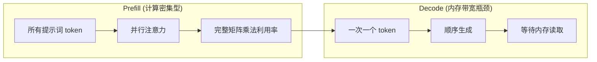
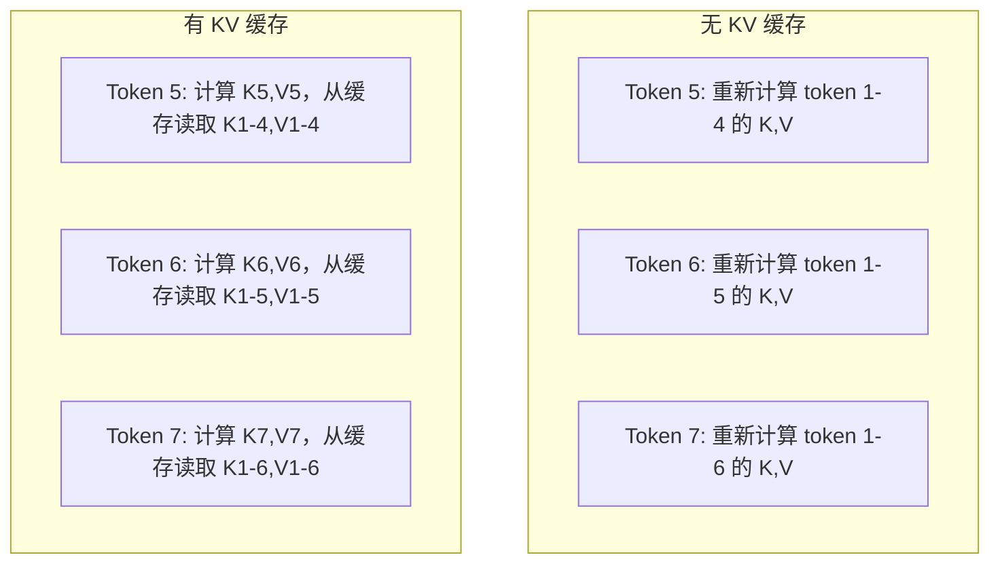
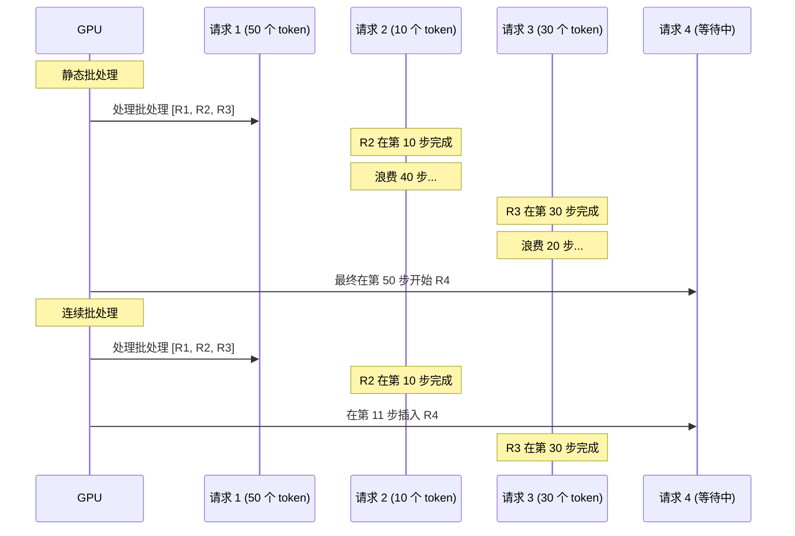
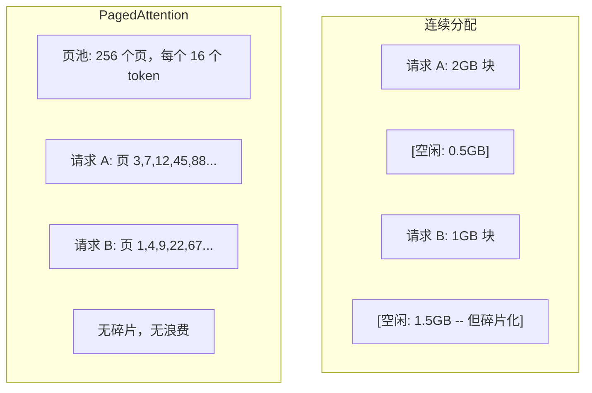
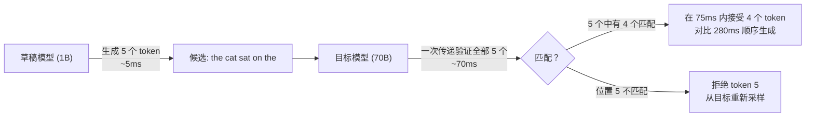

# 推理优化

> 大语言模型推理分为两个阶段。Prefill（预填充）并行处理你的提示词 -- 计算密集型。Decode（解码）一次生成一个 token -- 内存带宽瓶颈。所有的优化都针对其中一个或两个阶段。

**类型：** 构建
**语言：** Python
**前置要求：** Phase 10，第 01-08 课（Transformer 架构、注意力机制）
**时间：** ~120 分钟

## 学习目标

- 实现 KV 缓存以消除自回归 token 生成过程中的冗余计算
- 解释 LLM 推理中 prefill 和 decode 两个阶段的区别，以及为什么它们有不同的瓶颈（计算密集型 vs 内存带宽瓶颈）
- 实现连续批处理和 PagedAttention 概念，以最大化并发请求下的 GPU 利用率
- 比较各种推理优化技术（KV 缓存、投机解码、flash attention）在吞吐量和延迟方面的权衡

## 问题所在

你将 Llama 3 70B 部署在 4 张 A100 GPU 上。单个用户大约获得 50 tokens/秒的生成速度。感觉很快。但当 100 个用户同时访问端点时，吞吐量降至每个用户 3 tokens/秒。你的 25,000 美元/月的 GPU 账单，服务的响应速度比人类打字还慢。

从一个用户到 100 个用户，模型本身没有变化。相同的权重、相同的架构、相同的数学运算。变化的是你如何调度工作。原始的推理方式浪费了 90% 以上的可用 GPU 算力。一个等待第 47 个 token 的用户占用了一个完整的批处理槽位，而 GPU 显存在矩阵乘法之间处于空闲状态。与此同时，一个新用户的 2,000 token 提示词本可以用这些无效时间来完成有用的计算。

这不是一个扩展问题，而是一个调度问题。本课中的技术 -- KV 缓存、连续批处理、PagedAttention、投机解码、前缀缓存 -- 是将每月 25,000 美元的推理账单降低到服务相同流量的 5,000 美元的关键。

vLLM 在 4xA100-80GB 上服务 Llama 3 70B，在低并发下可实现 ~50 tokens/秒/用户，并通过连续批处理和 PagedAttention 在 100 个并发请求下维持 15-25 TPS/用户。没有这些优化，相同的硬件在该并发量下只能达到 5 TPS/用户。同样的 GPU、同样的模型，吞吐量提升 4 倍。

## 概念解析

### Prefill vs Decode

每个 LLM 推理请求都有两个不同的阶段。

**Prefill** 处理整个输入提示词。所有 token 都是已知的，因此可以在完整序列上并行计算注意力。这是一个大型矩阵乘法 -- GPU 核心保持繁忙。瓶颈是计算能力：硬件每秒能交付多少 FLOPS。一块 A100 能处理 312 TFLOPS（BF16）。在单块 A100 上，对 4,096 token 的提示词进行 prefill（70B 模型）大约需要 400ms。

**Decode** 一次生成一个输出 token。每个新 token 都关注所有之前的 token，但每次前向传播只生成一个 token。权重矩阵的尺寸与 prefill 时相同，但你是将乘以一个向量而不是矩阵。GPU 核心在微秒内完成计算，然后等待下一批权重从内存到达。瓶颈是内存带宽：你能以多快的速度从 HBM 向计算单元流式传输模型权重。一块 A100 有 2 TB/s 的带宽。一个 FP16 格式的 70B 模型为 140 GB。读取整个模型一次需要 70ms -- 这就是单次 decode 步骤的下限。



**ops:byte 比率**（也称为算术强度）捕捉了这种权衡。它衡量的是从内存加载每个字节时执行的操作数量。

```
ops:byte 比率 = 每 token 的 FLOPs / 从内存读取的字节数
```

在预 fill 期间，批大小为 4,096 个 token 时，你每加载一个权重就执行约 4,096 次乘加操作。比率很高 -- 你处于计算密集型状态。在 decode 期间，批大小为 1 时，你每加载一个权重的操作约等于 1。比率很低 -- 你处于内存带宽瓶颈状态。

基本洞察：*decode 之所以是内存带宽瓶颈，是因为你读取整个模型只为生成一个 token*。下面所有的优化要么减少你读取的内容，要么增加每次读取处理的 token 批大小，要么完全避免读取。

### KV 缓存

在注意力机制中，每个 token 的 query 都会关注之前所有 token 的 key 和 value 向量。如果没有缓存，生成第 N 个 token 需要重新计算所有前 N-1 个 token 的 key 和 value 投影。生成 token 2 时会投影 token 1，生成 token 3 时再次投影 token 1，生成 token 4 时又一次。到 token 1,000 时，你已经投影了 999 次 token 1。

KV 缓存存储来自所有之前 token 的 key 和 value 投影。当生成 token N 时，你只需要计算 token N 的 key 和 value，然后将它们与 token 1 到 N-1 的缓存 K/V 拼接起来。



**KV 缓存内存公式：**

```
KV 缓存大小 = 2 * num_layers * num_kv_heads * head_dim * seq_len * bytes_per_param
```

对于 Llama 3 70B（80 层，GQA 下 8 个 KV 头，head_dim=128，BF16）：

```
每个 token: 2 * 80 * 8 * 128 * 2 字节 = 327,680 字节 = 320 KB
4,096 个 token 时: 320 KB * 4,096 = 1.28 GB
128K 个 token 时: 320 KB * 131,072 = 40 GB
```

Llama 3 70B 的单个 128K 上下文对话会消耗 40 GB 的 KV 缓存 -- 相当于半块 A100 的显存。100 个并发用户各 4K token 时，仅 KV 缓存就需要 128 GB。这就是为什么 KV 缓存管理是推理优化的核心挑战。

### 连续批处理

静态批处理等待 N 个请求的批处理到达，将它们一起处理，并等待 *所有请求* 完成后再接受新请求。如果一个请求需要 500 个 token，而另一个只需要 10 个，那么短请求在完成后的 490 个 decode 步骤中处于空闲状态。

连续批处理（也称为迭代级批处理）在任何请求完成时立即将新请求插入批处理中。在每个 decode 步骤重新评估批处理。在 10 个 token 后完成的请求会立即被等待中的请求替换。



吞吐量的提升取决于输出长度的变化程度。如果长度均匀，连续批处理与静态批处理相同。如果长度可变（常见情况），连续批处理可以提供 2-5 倍的更高吞吐量，因为 GPU 槽位从不空闲。

### PagedAttention

每个请求的 KV 缓存是一个连续的内存块。随着请求的到达和离开，内存会碎片化 -- 就像操作系统中的 RAM 碎片一样。一个 4K token 的请求需要 1.28 GB 的连续空间。即使你有总共 2 GB 的可用空间，你也可能没有 1.28 GB 的 *连续* 空间。你要么浪费内存，要么拒绝请求。

PagedAttention（来自 vLLM）将操作系统的虚拟内存概念应用于 KV 缓存。它不是为每个请求分配一个连续的块，而是分配固定大小的"页"（通常每个页 16 个 token）。页可以位于物理 GPU 内存的任何位置。页表将每个请求的逻辑序列位置映射到物理页位置。



PagedAttention 还实现了共享前缀的 **写时复制**。如果 50 个请求共享相同的系统提示词，那么该系统的 KV 缓存页只存储一次，并被所有 50 个请求引用。只有当请求出现分歧（不同的用户消息）时，它才会获得自己的页。这大大减少了共享系统提示词的应用的内存使用。

vLLM 通过 PagedAttention 报告接近零的内存浪费（~4% vs 原始分配的 ~60-80%）。

### 投机解码

Decode 很慢，因为它是顺序的 -- 你生成一个 token，将其反馈，再生成下一个。但如果你能廉价地猜测接下来的 5 个 token，然后一次性验证它们呢？

投机解码使用一个小而快的 **草稿模型** 来生成 K 个候选 token。大型 **目标模型** 在一个前向传播中处理所有 K 个候选（看起来像 prefill -- 并行、计算密集型、高效）。如果目标模型与草稿模型的预测一致，你在一次目标前向传播的时间内接受所有 K 个 token。如果它在位置 j 处不匹配，你接受 token 1 到 j-1 并丢弃其余的。



加速取决于 **接受率** -- 草稿模型的预测与目标匹配的频率。对于使用 Llama 3 8B 起草 Llama 3 70B 的情况，在自然语言中典型的接受率为 70-85%。这转化为 2-3 倍的 decode 加速。

投机解码的三种方法：

| 方法 | 草稿来源 | 接受率 | 开销 |
|--------|-------------|-----------------|----------|
| 草稿-目标 (Leviathan 等) | 分离的小型模型 | 70-85% | 草稿模型内存 |
| EAGLE (Li 等) | 目标上的轻量级头 | 75-90% | ~1% 额外参数 |
| N-gram 查找 | Token n-gram 表 | 40-60% | 可忽略 |

**EAGLE** 在目标模型的隐藏状态之上训练一个小型自回归头。它使用目标模型的倒数第二层特征来预测下一个 token 的嵌入。因为它操作的是目标模型自身的表示（而不是分离模型的表示），所以它以极少的额外内存实现了更高的接受率。EAGLE-2 添加了一个动态草稿树，根据上下文调整候选数量。

**N-gram 投机解码** 维护一个来自当前上下文或预建语料库的 n-gram 续体的表。如果草稿匹配之前在相同对话中出现的模式（重复模式、代码、结构化输出），它会在零神经网络开销的情况下触发。平均接受率较低，但每次投机的成本几乎是免费的。

投机解码在 *数学上是精确的* -- 输出分布与目标模型的分布完全相同。它不是近似。验证步骤确保每个接受的 token 都具有目标模型会分配的确切概率。

### 前缀缓存

许多请求共享相同的前缀。聊天机器人的系统提示词。RAG 上下文块。少样本示例集。没有前缀缓存时，每个请求都会从头开始重新计算这些共享 token 的 KV 缓存。

前缀缓存存储公共前缀的 KV 缓存，并在请求之间重用。当带有已知前缀的新请求到达时，系统复制（或引用）缓存的 KV 条目，并且只计算唯一后缀的 KV。

对于跨所有请求共享的 2,000 token 系统提示词，前缀缓存消除了每个请求的 ~400ms 预 fill。在每秒 100 个请求的情况下，这每秒节省了 40 秒的 GPU 计算 -- 超过一个 GPU 的工作量。

SGLang 的 RadixAttention 使用 radix 树（字典树）实现前缀缓存，按 token 内容索引前缀。任何与存储的前缀匹配的请求都会免费获得其 KV 缓存。该树支持部分前缀匹配 -- 如果你与缓存条目共享 2,000 个前缀 token 中的 1,500 个，你可以重用那 1,500 个并仅重新计算 500 个。

### 推理引擎

三种引擎主导生产环境 LLM 服务：

| 引擎 | 关键创新 | 最佳适用 |
|--------|---------------|----------|
| vLLM | PagedAttention、连续批处理 | 通用服务、最高兼容性 |
| SGLang | RadixAttention（前缀缓存）、结构化生成 | 多轮聊天机器人、约束解码 |
| TensorRT-LLM | NVIDIA 内核融合、FP8 量化 | NVIDIA 硬件上的最大单 GPU 吞吐量 |

**vLLM** 是默认的起点。它支持最广泛范围的模型，可在任何 GPU 供应商（NVIDIA、AMD、Intel）上运行，并通过 PagedAttention + 连续批处理实现强大的吞吐量。OpenAI 兼容的 API 意味着你可以直接将其作为任何 OpenAI API 调用的替代品。

**SGLang** 建立在与 vLLM 相同的基础上，但添加了 RadixAttention 用于前缀缓存和用于结构化 LLM 程序的领域特定语言。如果你的工作负载涉及多轮对话、工具使用或约束解码（JSON 输出、正则表达式引导生成），SGLang 通常通过前缀重用比 vLLM 快 2-5 倍。

**TensorRT-LLM** 将模型编译为优化的 NVIDIA GPU 内核。它在单个内核中融合操作（注意力 + 线性 + 激活），在 H100 GPU 上使用 FP8，并与 NVIDIA Triton 推理服务器集成用于生产部署。它在 NVIDIA 硬件上实现了最高的单 GPU 吞吐量，但需要更多设置且仅在 NVIDIA GPU 上工作。

Llama 3 70B 的真实世界数据（4xA100-80GB，BF16）：

| 指标 | vLLM | SGLang | TensorRT-LLM |
|--------|------|--------|---------------|
| 吞吐量（1 用户） | ~50 TPS | ~55 TPS | ~65 TPS |
| 吞吐量（100 用户） | ~2,500 总 TPS | ~3,200 总 TPS | ~3,000 总 TPS |
| 首个 token 时间 | ~400ms | ~300ms（前缀命中） | ~350ms |
| 最大上下文 | 128K | 128K | 128K |

### Ops:Byte 框架

你无法优化你没有衡量的东西。ops:byte 比率告诉你处于计算密集型还是内存带宽瓶颈状态，这决定了哪些优化至关重要。

```
计算上限：GPU 的峰值 FLOPS
内存上限：峰值带宽 * ops:byte 比率
```

当 ops:byte 较低时（decode、小批量），你达到了内存带宽上限。增加更多计算（更高的时钟频率、更多的核心）没有帮助。你需要减少内存读取（量化、KV 缓存压缩）或增加批大小，以便将读取分摊到更多有用工作上。

当 ops:byte 较高时（prefill、大批量），你达到了计算上限。内存带宽优化没有帮助。你需要更快的 GPU、内核融合或降低精度来榨取更多 FLOPS。

| 场景 | ops:byte | 瓶颈类型 | 优化方式 |
|----------|----------|-------|----------|
| Prefill，batch=1 | ~4,096 | 计算 | 内核融合、FP8 |
| Decode，batch=1 | ~1 | 内存 | 量化、KV 压缩 |
| Decode，batch=32 | ~32 | 内存 | 更大批次、连续批处理 |
| Decode，batch=256 | ~256 | 过渡 | 两者都重要 |
| Decode，batch=1024 | ~1,024 | 计算 | 内核融合、张量并行 |

A100 上的交叉点大约在 ops:byte = 156（312 TFLOPS / 2 TB/s）。低于 156，你处于内存带宽瓶颈。高于 156，你处于计算瓶颈。连续批处理通过将更多 token 打包到每次迭代中，将 decode 推向这个交叉点。

```figure
context-window-slide
```

## 动手实现

### 第 1 步：从零实现 KV 缓存

我们构建一个多头 KV 缓存，按层和头存储 key 和 value 投影，并展示内存增长模式。

```python
import numpy as np

class KVCache:
    def __init__(self, num_layers, num_heads, head_dim, max_seq_len, dtype=np.float16):
        self.num_layers = num_layers
        self.num_heads = num_heads
        self.head_dim = head_dim
        self.max_seq_len = max_seq_len
        self.dtype = dtype

        self.k_cache = np.zeros(
            (num_layers, num_heads, max_seq_len, head_dim), dtype=dtype
        )
        self.v_cache = np.zeros(
            (num_layers, num_heads, max_seq_len, head_dim), dtype=dtype
        )
        self.seq_len = 0

    def update(self, layer_idx, new_keys, new_values):
        num_new = new_keys.shape[1]
        end = self.seq_len + num_new
        self.k_cache[layer_idx, :, self.seq_len:end, :] = new_keys
        self.v_cache[layer_idx, :, self.seq_len:end, :] = new_values
        return (
            self.k_cache[layer_idx, :, :end, :],
            self.v_cache[layer_idx, :, :end, :]
        )

    def advance(self, num_tokens):
        self.seq_len += num_tokens

    def memory_bytes(self):
        return self.k_cache.nbytes + self.v_cache.nbytes

    def used_bytes(self):
        per_token = 2 * self.num_layers * self.num_heads * self.head_dim * np.dtype(self.dtype).itemsize
        return per_token * self.seq_len
```

### 第 2 步：带 KV 缓存的注意力机制

一个简化的多头注意力，在 decode 步骤中使用 KV 缓存。

```python
def scaled_dot_product_attention(query, keys, values):
    head_dim = query.shape[-1]
    scores = np.matmul(query, keys.transpose(0, 1, 3, 2)) / np.sqrt(head_dim)
    seq_len_q = scores.shape[-2]
    seq_len_k = scores.shape[-1]
    if seq_len_q > 1:
        mask = np.triu(np.ones((seq_len_q, seq_len_k), dtype=np.float32), k=seq_len_k - seq_len_q + 1)
        scores = scores + mask * (-1e9)
    max_scores = np.max(scores, axis=-1, keepdims=True)
    exp_scores = np.exp(scores - max_scores)
    attn_weights = exp_scores / np.sum(exp_scores, axis=-1, keepdims=True)
    return np.matmul(attn_weights, values)


class MultiHeadAttention:
    def __init__(self, d_model, num_heads):
        self.num_heads = num_heads
        self.head_dim = d_model // num_heads
        scale = np.sqrt(2.0 / d_model)
        self.W_q = np.random.randn(d_model, d_model).astype(np.float32) * scale
        self.W_k = np.random.randn(d_model, d_model).astype(np.float32) * scale
        self.W_v = np.random.randn(d_model, d_model).astype(np.float32) * scale
        self.W_o = np.random.randn(d_model, d_model).astype(np.float32) * scale

    def forward(self, x, kv_cache=None, layer_idx=0):
        batch, seq_len, d_model = x.shape
        Q = np.matmul(x, self.W_q).reshape(batch, seq_len, self.num_heads, self.head_dim).transpose(0, 2, 1, 3)
        K = np.matmul(x, self.W_k).reshape(batch, seq_len, self.num_heads, self.head_dim).transpose(0, 2, 1, 3)
        V = np.matmul(x, self.W_v).reshape(batch, seq_len, self.num_heads, self.head_dim).transpose(0, 2, 1, 3)

        if kv_cache is not None:
            K_full, V_full = kv_cache.update(layer_idx, K[0], V[0])
            K = K_full[np.newaxis, :, :, :]
            V = V_full[np.newaxis, :, :, :]
            if seq_len == 1:
                kv_cache.advance(1)

        attn_out = scaled_dot_product_attention(Q, K, V)
        attn_out = attn_out.transpose(0, 2, 1, 3).reshape(batch, -1, d_model)
        return np.matmul(attn_out, self.W_o)
```

### 第 3 步：连续批处理模拟器

这模拟了静态批处理和连续批处理之间的调度差异。

```python
import heapq

class Request:
    def __init__(self, request_id, prompt_tokens, output_tokens, arrival_step):
        self.request_id = request_id
        self.prompt_tokens = prompt_tokens
        self.output_tokens = output_tokens
        self.arrival_step = arrival_step
        self.tokens_generated = 0
        self.start_step = None
        self.end_step = None

    def is_done(self):
        return self.tokens_generated >= self.output_tokens


def simulate_static_batching(requests, batch_size):
    step = 0
    completed = []
    queue = list(requests)
    queue.sort(key=lambda r: r.arrival_step)

    while queue:
        batch = []
        while queue and len(batch) < batch_size:
            r = queue.pop(0)
            r.start_step = max(step, r.arrival_step)
            batch.append(r)

        if batch:
            step = max(step, max(r.start_step for r in batch))
            max_output = max(r.output_tokens for r in batch)
            for r in batch:
                r.tokens_generated = r.output_tokens
                r.end_step = step + max_output
            step += max_output
            completed.extend(batch)

    return completed


def simulate_continuous_batching(requests, batch_size):
    step = 0
    completed = []
    queue = sorted(requests, key=lambda r: r.arrival_step)
    queue_idx = 0
    active = []
    waiting = []

    while queue_idx < len(queue) or active or waiting:
        while queue_idx < len(queue) and queue[queue_idx].arrival_step <= step:
            waiting.append(queue[queue_idx])
            queue_idx += 1

        while waiting and len(active) < batch_size:
            r = waiting.pop(0)
            r.start_step = step
            active.append(r)

        if not active:
            if waiting:
                step += 1
                continue
            elif queue_idx < len(queue):
                step = queue[queue_idx].arrival_step
                continue
            else:
                break

        for r in active:
            r.tokens_generated += 1

        done = [r for r in active if r.is_done()]
        for r in done:
            r.end_step = step + 1
            completed.append(r)
        active = [r for r in active if not r.is_done()]

        step += 1

    return completed


def batching_stats(completed):
    latencies = [r.end_step - r.arrival_step for r in completed]
    total_time = max(r.end_step for r in completed) - min(r.arrival_step for r in completed)
    total_tokens = sum(r.output_tokens for r in completed)
    return {
        "avg_latency": np.mean(latencies),
        "p50_latency": np.median(latencies),
        "p99_latency": np.percentile(latencies, 99),
        "total_time": total_time,
        "throughput": total_tokens / total_time if total_time > 0 else 0,
    }
```

### 第 4 步：前缀缓存

基于 trie 的前缀缓存，为共享前缀存储 KV 条目。

```python
class TrieNode:
    def __init__(self):
        self.children = {}
        self.kv_data = None
        self.hit_count = 0


class PrefixCache:
    def __init__(self, max_entries=1000):
        self.root = TrieNode()
        self.max_entries = max_entries
        self.total_entries = 0
        self.hits = 0
        self.misses = 0

    def _walk(self, token_ids):
        node = self.root
        depth = 0
        for tid in token_ids:
            if tid not in node.children:
                break
            node = node.children[tid]
            depth += 1
        return node, depth

    def lookup(self, token_ids):
        node, depth = self._walk(token_ids)
        if depth > 0:
            self.hits += 1
            current = self.root
            for tid in token_ids[:depth]:
                current = current.children[tid]
                current.hit_count += 1
            kv_entries = []
            current = self.root
            for tid in token_ids[:depth]:
                current = current.children[tid]
                if current.kv_data is not None:
                    kv_entries.append(current.kv_data)
            return depth, kv_entries
        self.misses += 1
        return 0, []

    def insert(self, token_ids, kv_per_token):
        node = self.root
        for i, tid in enumerate(token_ids):
            if tid not in node.children:
                if self.total_entries >= self.max_entries:
                    return i
                node.children[tid] = TrieNode()
                self.total_entries += 1
            node = node.children[tid]
            if i < len(kv_per_token):
                node.kv_data = kv_per_token[i]
        return len(token_ids)

    def hit_rate(self):
        total = self.hits + self.misses
        return self.hits / total if total > 0 else 0.0
```

### 第 5 步：投机解码模拟器

我们模拟可配置接受率的草稿-目标投机解码。

```python
class DraftModel:
    def __init__(self, vocab_size, acceptance_rate=0.8):
        self.vocab_size = vocab_size
        self.acceptance_rate = acceptance_rate

    def generate(self, context, num_tokens):
        tokens = np.random.randint(0, self.vocab_size, size=num_tokens)
        return tokens

    def get_probs(self, context, token):
        probs = np.random.dirichlet(np.ones(self.vocab_size))
        return probs


class TargetModel:
    def __init__(self, vocab_size):
        self.vocab_size = vocab_size

    def get_probs(self, context, tokens=None):
        if tokens is not None:
            return [np.random.dirichlet(np.ones(self.vocab_size)) for _ in tokens]
        return np.random.dirichlet(np.ones(self.vocab_size))


def speculative_decode(draft_model, target_model, context, num_speculative=5,
                       draft_cost=1.0, target_cost=10.0, verify_cost=12.0):
    total_tokens = 0
    total_cost = 0.0
    accepted_counts = []
    context = list(context)

    max_tokens = 100

    while total_tokens < max_tokens:
        draft_tokens = draft_model.generate(context, num_speculative)
        total_cost += draft_cost * num_speculative

        target_probs = target_model.get_probs(context, draft_tokens)
        total_cost += verify_cost

        accepted = 0
        for i, token in enumerate(draft_tokens):
            draft_p = draft_model.get_probs(context + list(draft_tokens[:i]), token)
            target_p = target_probs[i]

            r = np.random.random()
            acceptance_prob = min(1.0, target_p[token] / (draft_p[token] + 1e-10))

            if r < draft_model.acceptance_rate:
                accepted += 1
                context.append(token)
                total_tokens += 1
            else:
                new_token = np.random.choice(draft_model.vocab_size, p=target_p)
                context.append(new_token)
                total_tokens += 1
                break

        accepted_counts.append(accepted)

        if accepted == num_speculative:
            bonus_probs = target_model.get_probs(context)
            bonus_token = np.random.choice(draft_model.vocab_size, p=bonus_probs)
            context.append(bonus_token)
            total_tokens += 1

    sequential_cost = total_tokens * target_cost
    return {
        "total_tokens": total_tokens,
        "speculative_cost": total_cost,
        "sequential_cost": sequential_cost,
        "speedup": sequential_cost / total_cost if total_cost > 0 else 1.0,
        "avg_accepted": np.mean(accepted_counts),
        "acceptance_rate": np.mean(accepted_counts) / num_speculative,
    }


def compare_speculation_strategies(vocab_size=1000, num_trials=20):
    results = {}

    for name, acceptance_rate, spec_tokens in [
        ("草稿-目标 (8B->70B)", 0.78, 5),
        ("EAGLE", 0.85, 6),
        ("N-gram", 0.50, 4),
        ("无投机", 0.0, 0),
    ]:
        if spec_tokens == 0:
            results[name] = {
                "speedup": 1.0,
                "acceptance_rate": 0.0,
                "avg_accepted": 0.0,
            }
            continue

        trial_results = []
        for _ in range(num_trials):
            draft = DraftModel(vocab_size, acceptance_rate=acceptance_rate)
            target = TargetModel(vocab_size)
            context = list(np.random.randint(0, vocab_size, size=10))
            result = speculative_decode(draft, target, context, num_speculative=spec_tokens)
            trial_results.append(result)

        results[name] = {
            "speedup": np.mean([r["speedup"] for r in trial_results]),
            "acceptance_rate": np.mean([r["acceptance_rate"] for r in trial_results]),
            "avg_accepted": np.mean([r["avg_accepted"] for r in trial_results]),
        }

    return results
```

### 第 6 步：KV 缓存内存分析器

计算真实模型配置的 KV 缓存内存需求。

```python
MODEL_CONFIGS = {
    "Llama-3-8B": {
        "num_layers": 32, "num_kv_heads": 8, "head_dim": 128,
        "model_params_b": 8, "gqa": True,
    },
    "Llama-3-70B": {
        "num_layers": 80, "num_kv_heads": 8, "head_dim": 128,
        "model_params_b": 70, "gqa": True,
    },
    "Llama-3-405B": {
        "num_layers": 126, "num_kv_heads": 8, "head_dim": 128,
        "model_params_b": 405, "gqa": True,
    },
    "Mistral-7B": {
        "num_layers": 32, "num_kv_heads": 8, "head_dim": 128,
        "model_params_b": 7, "gqa": True,
    },
    "GPT-4-est": {
        "num_layers": 120, "num_kv_heads": 96, "head_dim": 128,
        "model_params_b": 1800, "gqa": False,
    },
}


def kv_cache_memory(config, seq_len, dtype_bytes=2):
    per_token = 2 * config["num_layers"] * config["num_kv_heads"] * config["head_dim"] * dtype_bytes
    total = per_token * seq_len
    return {
        "per_token_bytes": per_token,
        "per_token_kb": per_token / 1024,
        "total_bytes": total,
        "total_mb": total / (1024 ** 2),
        "total_gb": total / (1024 ** 3),
    }


def memory_budget(config, gpu_memory_gb, model_dtype_bytes=2, kv_dtype_bytes=2):
    model_memory_gb = config["model_params_b"] * 1e9 * model_dtype_bytes / (1024 ** 3)
    overhead_gb = gpu_memory_gb * 0.1
    available_for_kv = gpu_memory_gb - model_memory_gb - overhead_gb

    if available_for_kv <= 0:
        return {"error": "模型无法放入 GPU 显存", "model_memory_gb": model_memory_gb}

    per_token = 2 * config["num_layers"] * config["num_kv_heads"] * config["head_dim"] * kv_dtype_bytes
    max_tokens = int(available_for_kv * (1024 ** 3) / per_token)

    return {
        "gpu_memory_gb": gpu_memory_gb,
        "model_memory_gb": round(model_memory_gb, 1),
        "overhead_gb": round(overhead_gb, 1),
        "available_for_kv_gb": round(available_for_kv, 1),
        "max_total_tokens": max_tokens,
        "max_users_at_2k": max_tokens // 2048,
        "max_users_at_4k": max_tokens // 4096,
        "max_users_at_32k": max_tokens // 32768,
    }
```

## 实际应用

使用 vLLM：

```python
from vllm import LLM, SamplingParams

llm = LLM(
    model="meta-llama/Llama-3-70B-Instruct",
    tensor_parallel_size=4,
    enable_prefix_caching=True,
    max_model_len=8192,
    gpu_memory_utilization=0.9,
)

params = SamplingParams(temperature=0.7, max_tokens=256)
outputs = llm.generate(["用一段话解释推理优化。"], params)
```

使用 SGLang 实现前缀缓存 + 结构化输出：

```python
import sglang as sgl

@sgl.function
def classify(s, text):
    s += sgl.system("你是一个分类器。只输出 JSON。")
    s += sgl.user(f"对以下文本进行分类：{text}")
    s += sgl.assistant(sgl.gen("result", regex=r'\{"label": "(positive|negative|neutral)"\}'))

runtime = sgl.Runtime(model_path="meta-llama/Llama-3-70B-Instruct", tp_size=4)
sgl.set_default_backend(runtime)

results = classify.run_batch([
    {"text": "这款产品太棒了！"},
    {"text": "糟糕的体验。"},
    {"text": "我觉得还行吧。"},
])
```

使用 TensorRT-LLM：

```python
import tensorrt_llm
from tensorrt_llm.runtime import ModelRunner

runner = ModelRunner.from_dir("./llama-70b-trt-engine/", rank=0)

outputs = runner.generate(
    batch_input_ids=[tokenizer.encode("解释 KV 缓存。")],
    max_new_tokens=256,
    temperature=0.7,
)
```

## 交付成果

本课产出：
- `outputs/skill-inference-optimization.md` -- 用于诊断和优化 LLM 推理服务的技能指南

## 练习

1. 修改 KV 缓存分析器，比较 FP16、FP8 和 INT4 的 KV 缓存量化。对于 4K 上下文下的 Llama 3 70B，计算 4xA100-80GB 上每种格式的并发用户最大值。KV 量化到 INT4 应该大约将用户容量提高 4 倍。

2. 扩展连续批处理模拟器，跟踪 GPU 利用率（每个步骤填充的批处理槽位比例）。在静态和连续批处理下绘制 50 个请求的利用率随时间变化图，其输出长度遵循 Pareto 分布（形状=1.5，比例=20）。连续批处理应保持 >80% 的利用率。

3. 实现分组查询注意力（GQA）版本的 KV 缓存，其中 `num_kv_heads < num_query_heads`。Llama 3 70B 使用 64 个查询头但只有 8 个 KV 头。计算与完整多头注意力相比的内存节省（KV 缓存大小减少 8 倍）。

4. 构建使用 LRU 淘汰策略的前缀缓存。设置 max_entries 为 500，生成 1,000 个请求，其中 60% 共享 5 个公共前缀中的一个。测量命中率并与无限缓存进行比较。通过良好的淘汰策略，命中率应保持在 55% 以上。

5. 扩展投机解码模拟器以实现基于树的投机（EAGLE-2 风格）。不是单一链式的 K 个草稿 token，而是生成候选树（例如，3 层中每层 2 个分支 = 8 个叶子候选）。将每次验证轮次中接受的总 token 数与线性投机进行比较。

## 关键术语

| 术语 | 人们怎么说 | 实际含义 |
|------|----------------|----------------------|
| Prefill | "处理提示词" | 并行计算所有输入 token 的注意力 -- 计算密集型，因为完整的矩阵乘法让 GPU 核心保持繁忙 |
| Decode | "生成 token" | 每次前向传播生成一个 token，每次都读取完整的模型权重 -- 内存带宽瓶颈，因为计算在下一个权重到达之前完成 |
| KV 缓存 | "缓存注意力状态" | 存储所有之前 token 的 key 和 value 投影，避免在每次 decode 步骤中重新计算 -- 以内存换取计算 |
| 连续批处理 | "动态批处理" | 在任何请求完成后立即将其插入运行中的批处理，在每个 decode 迭代时评估，而不是等待整个批处理完成 |
| PagedAttention | "KV 缓存的虚拟内存" | 将 KV 缓存分配为固定大小的页而不是连续块，消除内存碎片并启用共享前缀的写时复制 |
| 投机解码 | "草稿和验证" | 使用快速草稿模型提议多个 token，然后在一次目标模型前向传播中验证它们 -- 数学上精确，加速 2-3 倍 |
| EAGLE | "自投机解码" | 一种投机解码变体，在目标模型自身的隐藏状态上训练轻量级头，实现比分离草稿模型更高的接受率 |
| 前缀缓存 | "复用系统提示词的 KV" | 存储常见前缀（系统提示词、少样本示例）的已计算 KV 缓存条目，并在请求之间重用它们以跳过冗余的 prefill |
| Ops:byte 比率 | "算术强度" | 计算操作与内存读取字节的比率 -- 决定工作负载是计算密集型（高比率）还是内存带宽瓶颈（低比率） |
| 首个 token 时间 | "TTFT" | 从接收到请求到生成第一个输出 token 的延迟 -- 对于长提示词，主要由 prefill 时间主导 |

## 延伸阅读

- Kwon 等，《Efficient Memory Management for Large Language Model Serving with PagedAttention》（2023）-- 引入分页 KV 缓存管理的 vLLM 论文，现已成为推理服务的行业标准
- Leviathan 等，《Fast Inference from Transformers via Speculative Decoding》（2023）-- 证明草稿-验证投机产生精确目标模型分布并实现 2-3 倍加速的基础论文
- Li 等，《EAGLE: Speculative Sampling Requires Rethinking Feature Uncertainty》（2024）-- 通过在目标模型自身特征上训练头而非使用分离草稿模型来实现更高的接受率
- Zheng 等，《SGLang: Efficient Execution of Structured Language Model Programs》（2024）-- 介绍 RadixAttention 用于前缀缓存以及多调用 LLM 程序的编程模型
- Williams 等，《Roofline: An Insightful Visual Performance Model for Multicore Architectures》（2009）-- 原始 roofline 论文，形式化了 ops:byte 框架以推理计算与内存瓶颈
