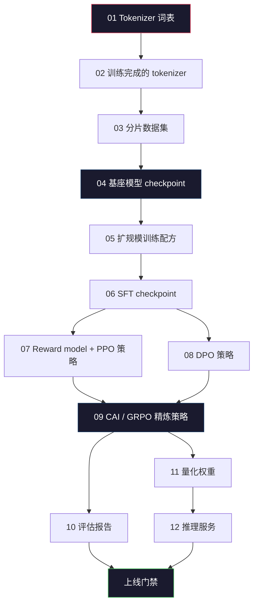
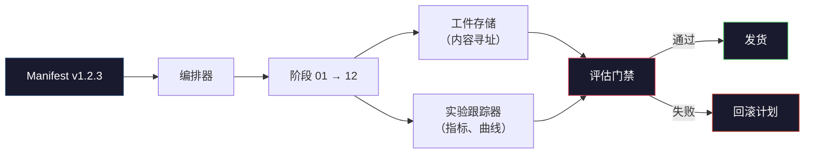

# 构建完整的 LLM 流水线

> Lessons 01 到 12 的内容合起来是流水线的某一个阶段。本课是整个管道的脚手架，把这些阶段串成一次端到端运行：分词、预训练、扩规模、SFT、对齐、评估、量化、服务部署。你不会在笔记本上训练 70B 模型。你会产出编排层、清单文件、评估门禁和回滚计划——这正是 2026 年前沿团队用来决定什么能上线的一套方法论。这是压轴课。

**类型：** Build
**语言：** Python (stdlib)
**前置课程：** Phase 10 全部 01-12 课
**时间：** ~120 分钟

## 学习目标

- 将前十一课（tokenizer、数据、预训练、扩规模、SFT、RLHF、DPO、CAI、评估、量化、推理）组合成一个可复现的流水线规格
- 定义各阶段之间的工件契约：每个阶段消费什么、产出什么、下一阶段的输入如何验证
- 构建一个能跟踪实验、哈希工件、基于评估阈值做出放行决定的编排器
- 设计回滚计划：哪些工件成本低可重跑、哪些成本高、损坏的 checkpoint 代价是什么

## 问题所在

前面的课程各自都能工作。Tokenizer 训练完成。Tiny GPT 预训练完成。SFT 数据集组装完毕。Reward model 训练完成。DPO 运行完成。评估指标记录完毕。量化权重导出。推理服务启动。但每门课都是一个 notebook，各有自己的约定、输出路径、随机种子。

前沿训练任务不是一个 notebook。Llama 3 405B 用了约 3000 万 H100 小时，历时大约 54 天。DeepSeek-V3 用了约 280 万 H800 小时。在此期间，一个损坏的 checkpoint、一段数据污染、一次评估回退都足以让团队损失一周的墙钟时间和一个月的 GPU 预算。团队能扛住这种风险的唯一方式就是通过流水线纪律：每个阶段都有确定性输入、确定性输出、清单文件、哈希校验和门禁。

这是压轴课。你不会在笔记本上完整运行这套流水线。你会写出：协调各阶段的编排器、描述整次运行的清单文件、把关上线决策的校验器、以及让第三方从单一文件起就能复现你工作的重跑计划。代码量很小；纪律要求很高。

这套模式从 1 亿参数到 1 万亿参数无需改动。相同的四个组件——清单文件、编排器、评估门禁、工件存储——既跑得了 Llama 3，也跑得了你的业余 GPT。差别只在于各阶段配置里的数字大小，而不是流水线的形态。

## 核心概念

### 十二个阶段

Phase 10 的每门课都是一个阶段。完整依赖图如下。



阶段 07 和 08 可以并行。其余都是硬性依赖。阶段 02（tokenizer）的任何变更会使所有下游工件失效。阶段 10（评估）的变更只会影响上线决策。

### 清单文件

清单文件是一个能完整描述一次运行、且足以重跑的单一文件。流水线产出的任何内容都不应依赖于清单文件之外的状态。字段看起来无聊但是必须。

```
pipeline_version: 1.2.3
seed: 42
git_commit: a1b2c3d4
stages:
  01_tokenizer:
    recipe: bpe_32k
    input_hash: sha256:...
    output_hash: sha256:...
    wall_clock_sec: 3600
    cost_usd: 12
```

阶段 N 的输出哈希就是阶段 N+1 的输入哈希。任何偏差都会导致流水线停止。这样你就能尽早捕获数据损坏。这也是大洋彼岸的队友能验证他们的复跑产出与你产出同一工件的方式。

实践中团队会使用一份小型 YAML  schema 加上一个清单检查器，并与上一次成功运行做差异比对。超出预期字段（成本、墙钟时间）的任何增量都会触发红旗警报。

### 工件类型化

每个阶段的产出都是类型化的工件。不是目录 blob，不是 pickle，而是具有已知 schema 的命名类型。

| 阶段 | 工件类型 | 关键字段 |
|------|----------|---------|
| 01-02 | Tokenizer | vocab.json, merges.txt, config.json, hash |
| 03 | Dataset | shards[], 行数, token 数, 去重统计 |
| 04-05 | Checkpoint | weights.safetensors, config.json, optimizer 状态, step 数 |
| 06 | SFT 模型 | checkpoint + SFT 配方 + 数据配比 |
| 07 | Reward Model | RM checkpoint + 偏好数据 hash |
| 08-09 | Policy | checkpoint + reference hash + beta + 已消耗的 KL 预算 |
| 10 | Eval Report | benchmark 分数 + 回归差异 + 评估数据 hash |
| 11 | 量化模型 | 量化权重 + 校准数据 + 相对 FP16 的精度偏差 |
| 12 | 服务端规格 | endpoint + model hash + config + 可观测性 hook |

类型化能防止最常见的一种故障模式：把阶段 08 的产出当作阶段 06 的输入，把 DPO 训练的模型经 SFT 路径发版。类型化的工件加类型化的阶段签名能让这些错误在编译期就失败，而不是跑到第五天才暴露。

### 评估门禁

上线不是"训练完成了"。上线是"训练完成了且评估门禁通过"。门禁在运行开始前就定义好。

```
gates:
  mmlu:      >= baseline + 0.5   # 不允许回退
  humaneval: >= baseline + 1.0
  truthfulqa: >= baseline         # 不允许下降
  safety_refusal_rate: <= 0.05
  kl_from_reference: <= 25.0
  cost_total_usd: <= 50000
```

每个门禁都是数值阈值。没有"看起来不错"的门禁。没有主观签字放行。所有门禁通过，工件标记为可发货。任一门禁未通过，运行挂起等待指定审阅者的显式覆盖，覆盖本身也会在清单中记录。

两个门禁能拦截大多数灾难。*回退门禁*（新模型在核心基准上必须不低于上一版本）能捕获训练 bug。*KL 预算门禁*（对齐后的策略不能偏离参考模型超过 X）能捕获过度对齐。每条生产流水线都必须同时具备这两者。

### 编排器

一段小程序：读取清单文件、分发阶段、跟踪工件、遇到任何契约违反即停止。这不是 Airflow。这不是 Kubeflow。对流水线纪律而言，你需要的是你自己写的一段枯燥无奇的东西。

编排器的职责很窄：

1. 从清单文件中解析 DAG。
2. 对每个阶段，检查期望的输出是否已存在于正确的哈希下（若是则跳过）。
3. 运行该阶段，捕获 stdout/stderr，测量墙钟时间和成本。
4. 将输出哈希与下游阶段期望的输入哈希做比对。
5. 失败时，写一份包含确切失败阶段的部分清单文件并以非零退出码退出。

这只是 200 行 Python。它就像本课的 `code/main.py` 文件。底层真正的流水线会调用 `torchrun` 或 `ray` 在集群上执行单个阶段，但编排器本身运行在单机上。

### 实验跟踪与工件存储

两个外部系统为流水线锚定。

**实验跟踪器（wandb、neptune、mlflow）。** 按阶段记录损失曲线、评估指标、系统遥测。当你需要三周后拿 A 运行跟 B 运行对比时，就去这里。团队几乎总会使用托管式跟踪器——自己写会浪费本应用于训练的时间。

**工件存储（S3、R2、GCS）。** 用于 checkpoint、数据集、tokenizer、评估报告的不可变对象存储。工件通过哈希寻址，而不是文件名。`latest.pt` 这种文件名是踩雷；`ckpt-7b-step-20000-sha256:abc123.safetensors` 才是契约。

编排器会同时写入两者。跟踪器是给人类看图表用的。工件存储是给下一阶段查找输入用的。

### 成本核算

一次前沿运行都有一个美元数字。预算纪律体现在两处。

**运行前估算。** 从清单文件出发，计算期望 FLOPs（预训练：6 × params × tokens）、期望 GPU 小时数（FLOPs / 峰值吞吐 / 利用率），并按当前租赁价算出美元成本。如果估算超出预算门禁，流水线拒绝启动。

**运行中跟踪。** 每个阶段的墙钟时间和成本都会写入清单。每完成一个阶段就检查剩余预算。如果某阶段超支，下一阶段门禁会基于新的剩余预算重新评估。你不会等到 VC 打电话来才意识到钱已经没了。

Llama 3 的报告成本是 6100 万美元。DeepSeek-V3 报告主预训练阶段成本为 560 万美元。这个比值主要是硬件效率和 mixture-of-experts 造成的——但具体成本之所以可见，是因为两家团队都是按阶段跟踪的，而不是按整个运行跟踪。

### 可复现 vs 确定性

这两者并不相同。*可复现*意味着同样的清单文件 + 同样的代码 + 同样的基础设施能产生具有等价下游指标的 checkpoint。*确定性*意味着位级完全相同的输出。

现代 LLM 训练是可复现但不确定性的。分布式训练中的 reduce 顺序、GPU kernel 的非确定性（cuBLAS、flash-attn）以及混合精度舍入综合在一起，会让两次运行在 1e-5 级别出现浮点差异。这对最终指标而言没问题（它们不会因此漂移）。但如果你在做位级 diff 调试，这就致命了。解法是记录每个阶段的输入哈希、输出哈希和关键指标——只要这些匹配，这次运行就算"复现"，即使权重并非位级相同。



### 回滚计划

运行开始前就写下每个阶段失败时的应对方案。三类。

- **低成本重跑**（小时级）：tokenizer、评估、量化、推理服务。直接重跑即可。
- **中等成本**（天级）：SFT、DPO、CAI。保留基座模型，只重跑对齐阶段。
- **高成本**（周级、数百万美元）：预训练。这里的回滚计划不是"重跑"，而是"使用最后一个正常 checkpoint，并用修订过的数据重跑下游低成本阶段"。

由于阶段依赖是类型化且带哈希的，编排器可以自动计算回滚集合：失效阶段及其所有后代。阶段 06（SFT）失败会无效化 06、07、08、09、10、11、12。阶段 11（量化）失败只无效化 11 和 12。提前命名这些情况能避免在凌晨四点团队精疲力竭时临时发挥。

### 2026 年观察到的生产配方

大多数前沿团队收敛到了相同的骨架。

- Tokenizer：128k BPE + byte fallback。在小型、均衡的多语言切片上训练。
- 预训练：10-20T tokens，主要是网页 + 代码 + 合成数据。Muon 或 AdamW 优化器。FSDP2 或 DeepSpeed ZeRO-3。梯度 checkpointing。BF16 权重、FP32 master。
- SFT：500k-2M 指令对，人工与合成混合，严格与评估集去重。
- 对齐：DPO 或 CAI + GRPO。仅当偏好信号太多维、DPO 难以表达时才用 RLHF。
- 评估：MMLU-Pro、MATH、HumanEval+、GPQA、SWE-Bench Verified、LiveBench，外加一份私有的留集（公众永远看不到）。
- 量化：4-bit GPTQ 或 AWQ 用于服务，8-bit 用于精度偏差敏感的的安全评估。
- 服务：vLLM、TensorRT-LLM 或自研。Continuous batching。投机解码。KV cache 驱逐。

数字每六个月会变。骨架不变。

```figure
beam-search
```

## 动手做

本课的代码是编排器和清单检查器，而不是十二个训练脚本。每个阶段用占位符模拟，占位符会产出形状正确、哈希正确的输出工件。端到端运行编排器能验证流水线的管道在真正烧 GPU 钱之前是否通畅。

完整实现见 `code/main.py`。关键组件：

- `Manifest` 数据类：pipeline 版本、seed、git commit、阶段、门禁。
- `Stage` 数据类：名称、类型、输入（哈希）、输出（哈希）、墙钟时间、成本。
- `Orchestrator.run()`：解析 DAG、分发阶段、校验哈希、更新清单文件。
- `EvalGate.check()`：读取阈值、与最新评估报告对比、返回通过/失败。
- `ArtifactStore`（内存 stub）：按哈希 put/get，模拟 S3。
- `CostTracker`：按阶段和累计，超出上限即停止。

`main.py` 中的流水线运行十二个占位阶段、生成清单文件，并模拟一个失败的评估门禁来展示挂起状态的运行长什么样。把每个占位符替换为对应课程里的真实训练脚本，你就拥有了真实前沿流水线使用的骨架。

## 如何使用

标准工作流有三个命令。

```
python code/main.py plan    # 校验清单文件、估算成本、打印 DAG
python code/main.py run     # 执行阶段，写入 manifest.out.yaml
python code/main.py gate    # 读取 manifest.out.yaml、应用评估门禁、发货或挂起
```

每次都先跑 `plan`。大多数流水线 bug 在 plan 阶段暴露——缺失的门禁阈值、过期的哈希、超预算。`plan` 免费。`run` 昂贵。在便宜的那一侧抓住 bug，省钱。

`gate` 的输出要么是 `SHIP`，要么是 `HOLD: <reason>`。挂起的运行不是失败——它是一个决策点。指定的审阅者要么覆盖（覆盖会被记录），要么批准回滚。

## 交付

本课产出 `outputs/skill-llm-pipeline-reviewer.md`。给它一份拟议的流水线清单文件，它会检查所有契约：阶段类型化、哈希链、门禁、回滚计划、成本估算。对于缺少评估门禁、KL 预算无界、或将评估数据与训练数据混用的清单文件，它拒绝批准。

## 练习

1. 扩展编排器以支持阶段 07 和 08 的并行执行。使用 stdlib 的 `concurrent.futures` 模块。确认最终清单文件记录了两个阶段的输出，并确认阶段 09 的输入哈希是两个输出的确定性组合。

2. 新增"污染检查"门禁。给定评估数据集哈希和训练数据集分片，计算重叠（精确字符串匹配或 13-gram 匹配）。如果重叠超过 0.1%，门禁失败。喂入一份被污染的训练集并确认门禁会挂起运行。

3. 从零实现成本估算器。对于阶段 04（预训练），按 6 × params × tokens 估算 FLOPs，假设在 H100 上达到 40% MFU（989 TFLOPs BF16，租赁价 $2.50/GPU-hour）。给出 7B 模型在 2T tokens 上的估算值，并与公开发布的 Llama 2 数据对比。

4. 构建部分回滚。模拟阶段 09（CAI）失败，然后重跑 09 到 12 阶段，同时让 01-08 保持缓存。编排器应通过哈希检测缓存工件并跳过。测量相对完整重跑的墙钟节省量。

5. 添加可观测性。为每个阶段发射 OpenTelemetry spans，属性包含参数量、看到的 token 数、loss、成本。将 spans 接入本地 collector。目的不是仪表盘；目的是每个阶段的健康度都能通过单一 trace ID 追溯。

## 关键术语

| 术语 | 人们怎么说 | 实际含义 |
|------|-----------|---------|
| Manifest | "配方文件" | YAML 或 JSON，描述 pipeline 版本、seed、各阶段配置和门禁阈值——足以重跑一次运行 |
| Content-addressed | "按哈希不按名字" | 工件按其内容的 SHA-256 存储，永远无法把版本 A 和版本 B 搞混 |
| Eval gate | "发货条件" | 基准指标和安全评分上的数值阈值，通过后才标记工件为可发货 |
| KL budget | "对齐漂移了多少" | 对齐阶段累积 KL(policy \|\| reference) 的上限，作为门禁强制执行 |
| MFU | "GPU 用了多少" | Model FLOPs Utilization——实测 FLOPs 除以理论峰值。70B 规模典型 40%，7B 规模典型 55% |
| Rollback plan | "坏了怎么办" | 按阶段预先写好的失败应对动作集合：重跑、回退、用修订输入重新训练 |
| Orchestrator | "指挥者" | 读取清单文件、分发阶段、校验哈希、遇到任何契约违反即停止的流程 |
| Artifact store | "权重的版本化 S3" | 不可变的 content-addressed 对象存储——checkpoint、数据集、评估报告的单一事实来源 |
| Reproducible | "重跑后指标一致" | 位级权重不同但下游指标等价——分布式 LLM 训练的务实目标 |
| Cost gate | "不能超过 X" | 运行前成本估算 + 运行中跟踪——估算超预算则流水线拒绝启动 |

## 延伸阅读

- [Dubey et al., 2024 -- "The Llama 3 Herd of Models"](https://arxiv.org/abs/2407.21783) -- 公开可见的最详细的前沿流水线描述，涵盖数据、训练、对齐、评估
- [DeepSeek-AI, 2024 -- "DeepSeek-V3 Technical Report"](https://arxiv.org/abs/2412.19437) -- 效率优先的流水线，成本约为 Llama 3 级别的十分之一
- [Kaplan et al., 2020 -- "Scaling Laws for Neural Language Models"](https://arxiv.org/abs/2001.08361) -- 最初的计算-数据-参数缩放关系
- [Hoffmann et al., 2022 -- "Training Compute-Optimal Large Language Models (Chinchilla)"](https://arxiv.org/abs/2203.15556) -- 对 Kaplan 的修正，重新校准了现代数据预算
- [PyTorch FSDP2 documentation](https://pytorch.org/docs/stable/fsdp.html) -- PyTorch 2.4+ 中替代 FSDP1 的分布式训练原语
- [Weights & Biases LLM Reports](https://wandb.ai/site/llms) -- 开源 LLM 运行的真实清单文件和实验跟踪器输出，可作为可借鉴的模板
