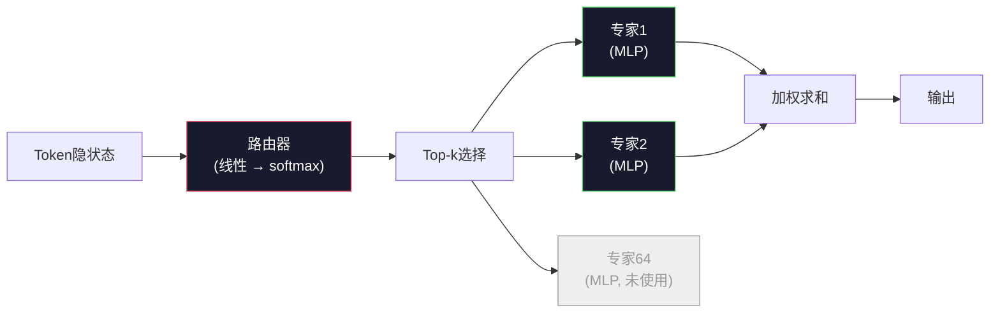

# 开源模型：架构详解

> 你在第4课从零实现了一个GPT-2 Small。2026年的前沿开源模型同属一个家族，只有五六处具体改动：用RMSNorm替代LayerNorm，用SwiGLU替代GELU，用RoPE替代学习型位置编码，用GQA或MLA替代完整多头注意力，以及大规模Mixture-of-Experts。你已经掌握的数学知识覆盖了其中95%的内容。本课将并排解读Llama 3、DeepSeek-V3、Mixtral、Qwen和Gemma的架构，明确指出每个模型在哪一行开始与GPT-2分道扬镳。

**类型：** 学习
**语言：** Python (标准库)
**前置条件：** 阶段10，第4、5、12课（预训练、扩展、推理）
**时间：** 约45分钟

## 学习目标

- 阅读Llama 3、Mistral、Mixtral、Gemma 2、Qwen 2.5和DeepSeek-V3的config.json，并解释每个字段
- 说出每个模型相对于GPT-2 Small所做的具体架构改动，并从第一性原理出发论证其合理性
- 仅凭配置文件计算任意开源模型的参数量、KV缓存大小和激活内存
- 在延迟、内存和能力约束下，为部署目标选择合适的开源模型

## 问题所在

在第4课中，你写了350行numpy代码就得到了一个GPT-2形状模型。Llama 3 405B有200页的技术报告。你的直觉告诉你这两者截然不同。但其实不然。那200页描述的依然是同一个对象，只是带有五六处动机充分的改动，外加千余项关于扩展规模的实现细节。骨架——嵌入层、Transformer块、注意力、MLP、归一化、输出头——完全未变。

本课是一份差异对照表。对于每个主要的开源模型系列，我们列出相对于GPT-2的具体改动、原因以及代价。学完后，当你阅读一份新的模型卡片时，就能在脑中将其还原为GPT-2基线。

实际收益是：当Meta发布Llama 5或DeepSeek发布V4时，你无需构建新的思维模型。你只需查看配置文件，看哪些已知旋钮被调整，就能知道下游影响。2026年的架构是一个有限的工具箱，每个新模型只是选择了不同的子集。

## 核心概念

### 不变的主体

所有自回归开源模型共享：

- Token嵌入矩阵（vocab_size × hidden_dim）。
- N个解码器块的堆叠：归一化、自注意力、残差、归一化、MLP、残差。
- 最终的归一化和线性头，映射到vocab_size（通常与嵌入层权重共享）。
- 因果掩码、下一词交叉熵损失。

这就是基本形状。其余都是旋钮。

### 真正变化的六个旋钮

在所有2024-2026年前沿开源模型中，同样的六个设计选择反复出现：

1. **归一化。** LayerNorm → RMSNorm。
2. **位置编码。** 学习型绝对位置 → RoPE（以及变体：YaRN、NTK）。
3. **激活函数。** GELU → SwiGLU（或GeGLU）。
4. **注意力头共享。** MHA → GQA → MQA → MLA。
5. **稠密 vs 稀疏MLP。** 稠密 → Mixture-of-Experts。
6. **前置归一化位置。** 前置归一化延续，后置归一化已淘汰。

其余一切（学习率调度、数据混合、批次大小、上下文长度）都存在于训练配置中，而非架构里。六个旋钮。

### 旋钮1：RMSNorm

LayerNorm减去均值、除以标准差、再缩放和偏移。RMSNorm只保留缩放：

```
RMSNorm(x) = x / sqrt(mean(x^2) + eps) * gamma
```

不减去均值，不加偏置。每token少一次矩阵乘法。Zhang和Sennrich（2019）论证了它在机器翻译上与LayerNorm相当，但速度快10%。每个现代开源模型都运行它。

代价：无。收益：小幅吞吐量提升、代码更简洁。

### 旋钮2：RoPE

GPT-2的学习型位置嵌入是一个1024槽位的查找表。上下文1025就是表末尾之后的内容了。模型无法外推超过其训练长度。

旋转位置编码（RoPE，Su等人2021）在每个Q和K向量对进行注意力点积之前，通过旋转注入位置信息。旋转角度是位置的确定性函数，因此无需学习，也不会用完。借助缩放技巧（NTK感知插值、YaRN），一个在8k上下文上训练的模型可以在推理时拉伸到128k，而仅有轻微精度损失。

```
q_rotated = rotate(q, angle(pos))
k_rotated = rotate(k, angle(pos))
score = q_rotated · k_rotated
```

每个Llama、Mistral、Qwen、DeepSeek和Gemma都使用RoPE。Gemma 2使用混合方案（大部分层用RoPE，其他层用局部滑动窗口注意力）。

### 旋钮3：SwiGLU

GPT-2的MLP是 `x -> gelu(xW1 + b1) -> (...)W2 + b2`。SwiGLU（Shazeer 2020）用门控乘积替换激活函数：

```
SwiGLU(x) = (xW1) * sigmoid(xW1) * xV
```

两个并行投影，由Swish激活门控。经验上，每个参数的困惑度更低。Llama 2采用了它，随后众人效仿。MLP的隐藏层大小通常设定为使总参数量与原稠密MLP匹配：如果GPT-2使用 `ff_dim = 4 * hidden`，那么SwiGLU使用 `ff_dim = (2/3) * 4 * hidden = 8/3 * hidden`。

### 旋钮4：注意力头共享

GPT-2使用**多头注意力（MHA）**：每个头都有自己的Q、K、V投影。

**多查询注意力（MQA，Shazeer 2019）**在所有头上共享一个K和一个V。将KV缓存减少num_heads倍，在典型模型上相当于12倍到32倍的减少。在难基准测试上精度略有下降。

**分组查询注意力（GQA，Ainslie等人2023）**是中间方案：G组Q头共享一个K和一个V。Llama 3 8B使用GQA，有32个Q头和8个KV头（G=8），因此KV缓存相比完整MHA缩小4倍。

**多头潜注意力（MLA，DeepSeek 2024）**将K和V压缩成共享的低秩潜变量，再按头投影回高维。进一步减少KV缓存同时保持每头的表达能力。DeepSeek-V2和V3依赖此项技术实现长上下文性能。

| 方案 | KV头数 | KV缓存 | 精度 |
|------|--------|--------|------|
| MHA | num_heads | 完整 | 最佳 |
| GQA | num_groups（G < num_heads） | 减少num_heads / G倍 | 接近MHA |
| MQA | 1 | 减少num_heads倍 | 轻微下降 |
| MLA | 潜变量，每头解压 | 小于MQA | 接近MHA |

对于任何超过13B参数的模型，GQA或MLA实际上都是必需的。大规模使用完整MHA会导致KV缓存灾难。

### 旋钮5：混合专家（MoE）

稠密MLP对每个token激活其所有参数。MoE MLP在每个块中有K个专家，以及一个路由器，为每个token选择top-k个专家（通常为top-2）。只有被选中的专家权重才会对该token进行前向传播。

```
router_logits = xW_r
indices, weights = top_k(router_logits, k=2)
output = sum_i weights[i] * expert[indices[i]](x)
```

吸引力在于：你可以有64个大小为7B的专家（所以总参数量巨大），但每个token只运行其中2个（所以每token计算量与稠密7B模型相当）。Mixtral 8x7B有47B总参数，但每个token只激活13B。DeepSeek-V3有671B总参数，但每个token只激活37B。



优点：相同计算量、更多参数、更好容量。缺点：专家内存仍需存在于某处（因此服务所需VRAM高于同等稠密模型）、路由器负载均衡困难、对齐过程中微调路由器本身就是一个独立的研究领域。

### 旋钮6：前置归一化延续

原始Transformer在每个子层后应用层归一化。自GPT-2以来的每个开源模型都将归一化放在*每个子层之前*。深度较大时，前置归一化严格来说更容易训练。无需争辩。

### 逐模型差异表

以下是使这一切具体化的表格。

| 模型 | 年份 | 总参数 | 激活参数 | 归一化 | 激活函数 | 位置编码 | 注意力 | MoE | 上下文 |
|------|------|--------|----------|--------|----------|----------|--------|-----|--------|
| GPT-2 Small | 2019 | 1.24亿 | 1.24亿 | LayerNorm | GELU | 学习型 | MHA（12头） | 否 | 1k |
| Llama 3 8B | 2024 | 8B | 8B | RMSNorm | SwiGLU | RoPE | GQA（32/8） | 否 | 128k |
| Llama 3 70B | 2024 | 70B | 70B | RMSNorm | SwiGLU | RoPE | GQA（64/8） | 否 | 128k |
| Llama 3 405B | 2024 | 405B | 405B | RMSNorm | SwiGLU | RoPE | GQA（128/16） | 否 | 128k |
| Mistral 7B | 2023 | 7.2B | 7.2B | RMSNorm | SwiGLU | RoPE | GQA | 否 | 32k |
| Mixtral 8x7B | 2023 | 47B | 13B | RMSNorm | SwiGLU | RoPE | GQA | 是（8专家，top-2） | 32k |
| Gemma 2 9B | 2024 | 9B | 9B | RMSNorm（前置+后置） | GeGLU | RoPE + 滑动 | GQA | 否 | 8k |
| Qwen 2.5 72B | 2024 | 72B | 72B | RMSNorm | SwiGLU | RoPE（YaRN） | GQA（64/8） | 否 | 128k |
| DeepSeek V2 236B | 2024 | 236B | 21B | RMSNorm | SwiGLU | RoPE | MLA | 是（160专家，top-6） | 128k |
| DeepSeek V3 | 2024 | 671B | 37B | RMSNorm | SwiGLU | RoPE | MLA | 是（256专家，top-8） | 128k |

扫描这些列。RMSNorm是通用的。SwiGLU或其GeGLU表亲是通用的。RoPE是通用的。7B以上的模型GQA是通用的，除非被MLA替代。MoE是顶级模型的差异化因素。

### 阅读config.json

Llama 3 8B配置：

```
{
  "hidden_size": 4096,
  "intermediate_size": 14336,
  "num_hidden_layers": 32,
  "num_attention_heads": 32,
  "num_key_value_heads": 8,
  "max_position_embeddings": 131072,
  "rope_theta": 500000.0,
  "rms_norm_eps": 1e-5,
  "vocab_size": 128256
}
```

每个字段都对应你已经实现过的内容。

- `hidden_size`：嵌入维度。
- `intermediate_size`：MLP隐藏层大小（3.5倍hidden——SwiGLU数学）。
- `num_hidden_layers`：堆叠深度。
- `num_attention_heads`：Q头数。
- `num_key_value_heads`：KV头数（GQA）。
- `max_position_embeddings`：训练上下文长度。
- `rope_theta`：RoPE基础频率。Meta将其从默认的10k提升到500k以实现长上下文外推。
- `rms_norm_eps`：数值稳定性。
- `vocab_size`：词表大小。

仅凭这些就能计算总参数、KV缓存和峰值激活内存。确切公式见`code/main.py`。

### 激活内存预算

在数十亿参数以上时，激活内存主导训练内存。预训练的经验法则（含梯度检查点）：

```
activation_mem ~ batch_size * seq_len * hidden_size * num_layers * bytes_per_element
```

对于Llama 3 8B，批次大小1，序列长度8192，BF16，32层，hidden 4096：仅激活内存约8 GB（含检查点），不含检查点约40 GB。这就是flash-attention和ring-attention重要的原因——它们重写注意力计算以使激活内存可控。

### KV缓存预算

在最大上下文推理时：

```
kv_cache = 2 * num_layers * num_kv_heads * head_dim * max_seq_len * bytes_per_element
```

Llama 3 8B在128k上下文、BF16、head_dim = hidden / num_heads = 128：
`2 * 32 * 8 * 128 * 131072 * 2 = 17.2 GB` 每条序列。

8B权重在BF16下为16 GB。单条128k序列的KV缓存比权重大。这就是驱动GQA、MLA和KV缓存量化研究的内存压力来源。

### 各模型的适用场景

- **单张80GB GPU，无MoE**：Llama 3 8B、Mistral 7B、Gemma 2 9B。易于服务，工具链广泛。
- **单节点（8×80GB），大容量**：Llama 3 70B、Qwen 2.5 72B。最高稠密开源能力。
- **最大开源能力，接受MoE复杂度**：DeepSeek V3、Mixtral 8x22B。每激活FLOP的最佳能力。
- **长上下文需求**：Llama 3（128k配合RoPE缩放）、DeepSeek（MLA优势）。
- **低延迟服务**：Gemma 2 9B（滑动窗口削减长上下文计算）。

```figure
rmsnorm-vs-layernorm
```

## 动手实现

本课的代码是一个计算器。给定任意config.json，它会打印各组件参数量、最大上下文下的KV缓存、SwiGLU MLP比例，以及对架构的简短评判（稠密/GQA/MLA/MoE）。

```python
config = {
    "hidden_size": 4096, "intermediate_size": 14336,
    "num_hidden_layers": 32, "num_attention_heads": 32,
    "num_key_value_heads": 8, "vocab_size": 128256,
    "max_position_embeddings": 131072,
}
```

脚本逐字段遍历架构字段，计算嵌入层、注意力（含GQA缩减）、MLP（含SwiGLU扩展）、层归一化和输出头的参数量。然后计算指定上下文长度下的KV缓存并打印摘要。

实现见`code/main.py`。

## 使用它

对脚本中捆绑的Llama 3 8B、Mistral 7B、Mixtral 8x7B和DeepSeek V3配置运行计算器。比较参数量分解。注意MoE模型的总参数量远超稠密模型，但激活参数量往往更小。注意DeepSeek V3的KV缓存比Llama 3 405B更小，尽管其总参数更多——这就是MLA的效果。

然后将本地任意模型的配置代入，阅读摘要，判断是否适合你的GPU。

## 交付物

本课产出`outputs/skill-open-model-picker.md`。给定部署目标（GPU类型、显存、上下文长度、延迟预算）和任务画像（对话、代码、推理、长上下文），它会推荐一个开源模型、来自第11课的量化方案，以及来自第12课的推理栈，并明确阐述六个架构旋钮的推理过程。

## 练习题

1. 从HuggingFace读取Qwen 2.5 72B配置。从零计算总参数。与HF报告的数值对比，识别任何差异的来源（头维度取整、KV共享因子等）。

2. DeepSeek V3使用256个专家配合top-8路由。计算激活专家数与总专家数的比值，并与Mixtral 8x7B的top-2/8对比。从稀疏（25%）到更稠密的稀疏（3%）的转变，对每FLOP的容量意味着什么？

3. 计算Llama 3 405B在128k上下文下的FP8和BF16 KV缓存。FP8是BF16的一半。你能在单个8×H100节点（每张80GB，共640GB，减去权重内存）上服务多少条并行序列？

4. Gemma 2交替使用全量注意力和滑动窗口注意力层。写出当一半层使用4096-token滑动窗口而非完整上下文时的KV缓存数学。在8k总上下文下节省多少内存？

5. 找到一本在本课编写之后发布的近期前沿开源模型。指出它选择了六个旋钮中的哪些，以及是否引入了第七个旋钮。新课架构发布的那一刻课程就会过时——目标是更新你的对照表，而不是重建你的思维模型。

## 关键术语

| 术语 | 人们怎么说 | 实际含义 |
|------|-----------|---------|
| RMSNorm | "不带均值的LayerNorm" | 仅通过均方根归一化，带学习到的缩放——更廉价且与LayerNorm相当 |
| RoPE | "旋转位置" | 将每个Q和K向量在2D对中以依赖位置的角度旋转——配合缩放技巧可外推超越训练长度 |
| SwiGLU | "新的MLP激活函数" | 带Swish的门控线性单元：`(xW1) * sigmoid(xW1) * xV`——2024+开源模型的标准配置 |
| GQA | "中间方案注意力" | 分组查询注意力：G组Q头共享一个K和一个V头——缩小KV缓存而不像MQA那样损失精度 |
| MLA | "DeepSeek的注意力" | 多头潜注意力：将K/V压缩为共享低秩潜变量，每头解压——大模型中KV缓存最小 |
| MoE | "稀疏专家" | 混合专家：每块N个MLP，路由器为每token选top-k——总参数量巨大，激活参数量小 |
| Top-k路由 | "每token选k个专家" | 路由器为每个专家计算分数并激活最高的k个——典型k值为2（Mixtral）到8（DeepSeek） |
| YaRN | "拉伸RoPE" | 另一种RoPE扩展——插值旋转角度以在推理时将上下文从8k扩展到128k+ |
| 滑动窗口注意力 | "不关注所有内容" | 每个token仅关注最后W个token——将注意力成本封顶为每token O(W)，Gemma 2和早期Mistral使用 |
| 激活参数 | "每token运行的参数" | 对MoE模型而言，每token前向传播所见到的参数数量（远小于总参数）——决定每token FLOPs |

## 延伸阅读

- [Dubey等人, 2024 —— "Llama 3模型群"](https://arxiv.org/abs/2407.21783) —— 稠密Llama 3系列的架构和训练参考
- [DeepSeek-AI, 2024 —— "DeepSeek-V3技术报告"](https://arxiv.org/abs/2412.19437) —— MLA加辅助损失-free负载均衡加上671B MoE
- [Jiang等人, 2024 —— "混合专家"](https://arxiv.org/abs/2401.04088) —— 经典的MoE开源模型论文
- [Su等人, 2021 —— "RoFormer：增强版Transformer与旋转位置嵌入"](https://arxiv.org/abs/2104.09864) —— RoPE论文
- [Shazeer, 2020 —— "GLU变体改进Transformer"](https://arxiv.org/abs/2002.05202) —— SwiGLU、GeGLU及其伙伴
- [Ainslie等人, 2023 —— "GQA：训练泛化多查询Transformer模型"](https://arxiv.org/abs/2305.13245) —— GQA论文
- [Gemma 2团队, 2024 —— "Gemma 2：以实用规模改进开源语言模型"](https://arxiv.org/abs/2408.00118) —— 混合全量+滑动注意力，前置+后置归一化
- [Qwen团队, 2024 —— "Qwen 2.5技术报告"](https://arxiv.org/abs/2412.15115) —— YaRN上下文扩展和长上下文训练配方
