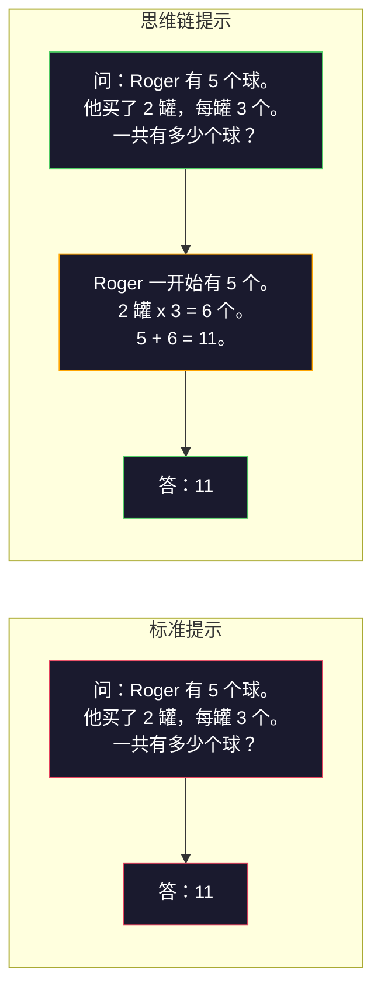
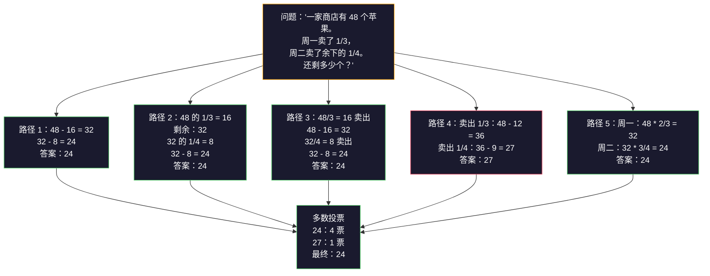
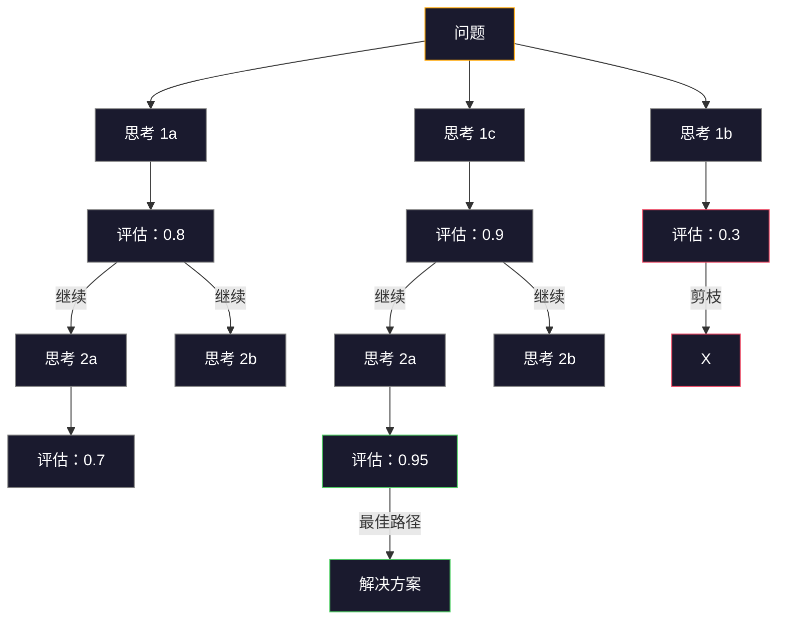

# 少样本、思维链、思维树

> 告诉模型要做什么，这是提示。展示它如何思考，这是工程。同一个模型、同一项任务、同一份数据，准确率从 78% 到 91% 的差距，不是更好的模型，而是更好的推理策略。

**类型：** 动手实践
**语言：** Python
**前置知识：** 第 11.01 课（提示工程）
**时间：** 约 45 分钟

## 学习目标

- 通过选择和格式化最大化任务准确率的示例演示来实现少样本提示
- 应用思维链（CoT）推理来提高多步骤问题（如数学应用题）的准确率
- 构建探索多条推理路径并选择最佳路径的思维树提示
- 在标准基准上测量零样本与少样本与 CoT 之间的准确率提升

## 问题所在

你正在构建一个数学辅导应用。你的提示写着："解决这个应用题。" GPT-5 在 GSM8K（标准小学数学基准测试）上的正确率是 94%。你以为已经到头了。但其实没有——思维链仍然能带来 3-4 个百分点的提升。

加上五个字——"让我们一步步思考"——准确率就飙升到 91%。再加上几个详细演算的示例，就达到了 95%。同样的模型。同样的温度。同样的 API 成本。唯一的区别是你给了模型一张草稿纸。

这不是技巧。这是推理的工作原理。人类并不是用一个思维跳跃就解决多步骤问题的。transformers 也一样。当你强制模型生成中间 token 时，这些 token 会成为下一个 token 的上下文的一部分。每一个推理步骤都在推动下一步。模型实际上是逐步计算得出答案的。

但"一步步思考"只是开始。如果你采样五条推理路径并取多数票呢？如果你让模型探索一个可能性树，评估并剪枝呢？如果你将推理与工具使用交替进行呢？这些不是假设。它们是已有发表、有测量改进的技术，而你会在本课中全部构建出来。

## 概念

### 零样本与少样本：何时示例胜过指令

零样本提示给模型一个任务，除此之外什么都不给。少样本提示先给它看示例。

Wei 等人（2022）在 8 个基准测试中测量了这一点。对于情感分类等简单任务，零样本和少样本的表现相差不超过 2%。对于多步算术和符号推理等复杂任务，少样本将准确率提高了 10-25%。

直觉理解：示例是压缩的指令。与其描述输出格式，不如直接展示。与其解释推理过程，不如演示一遍。模型在示例上进行模式匹配比解释抽象指令更可靠。


**少样本占优的场景：** 格式敏感的任务、分类、结构化提取、领域特定术语、任何模型需要匹配特定模式的场景。

**零样本占优的场景：** 简单事实性问题、创造性任务（示例会限制创造力）、找到好示例比写好指令更困难的任务。

### 示例选择：相似性优于随机

并非所有示例都同等重要。选择与目标输入相似的示例比随机选择在分类任务上能提升 5-15% 的准确率（Liu 等人，2022）。三个原则：

1. **语义相似性**：在嵌入空间中挑选最接近输入的示例
2. **标签多样性**：在示例中覆盖所有输出类别
3. **难度匹配**：匹配目标问题的复杂度级别

大多数任务的最优示例数量是 3-5 个。少于 3 个时，模型不足以提取模式。多于 5 个时，边际效益递减并浪费上下文窗口 token。对于标签很多的分类任务，每个标签用一个示例。

### 思维链：给模型草稿纸

思维链（CoT）提示由 Google Brain 的 Wei 等人（2022）提出。思路很简单：不要只问模型要答案，而是先让它展示推理步骤。



这在机械原理上为何有效？transformer 生成的每个 token 都会成为下一个 token 的上下文。没有 CoT 时，模型必须在单次前向传播的隐藏状态中压缩所有推理。有了 CoT，模型将中间计算外化为 token。每个推理 token 都扩展了有效的计算深度。

**GSM8K 基准（小学数学，8500 道题）：**

| 模型 | 零样本 | 零样本 CoT | 少样本 CoT |
|-------|-----------|---------------|--------------|
| GPT-4o | 78% | 91% | 95% |
| GPT-5 | 94% | 97% | 98% |
| o4-mini（推理模型） | 97% | — | — |
| Claude Opus 4.7 | 93% | 97% | 98% |
| Gemini 3 Pro | 92% | 96% | 98% |
| Llama 4 70B | 80% | 89% | 94% |
| DeepSeek-V3.1 | 89% | 94% | 96% |

**关于推理模型。** 像 OpenAI 的 o 系列（o3、o4-mini）和 DeepSeek-R1 这样的模型会在发出答案之前在内部运行思维链。向推理模型添加"让我们一步步思考"是多余的，有时甚至适得其反——它们已经自己做过了。

两种 CoT 变体：

**零样本 CoT**：在提示后附加"让我们一步步思考"。不需要示例。Kojima 等人（2022）表明这个简单的句子就能在算术、常识和符号推理任务上提高准确率。

**少样本 CoT**：提供包含推理步骤的示例。比零样本 CoT 更有效，因为模型能看到你期望的确切推理格式。

**CoT 有害的情况**：简单事实回忆（"法国的首都是哪里？"）、单步分类、速度比准确率更重要的任务。CoT 每次查询会增加 50-200 个 token 的推理开销。对于高吞吐量、低复杂度的任务，这是浪费的成本。

### 自洽性：采样多次，投票一次

Wang 等人（2023）提出了自洽性。核心洞察：单一的 CoT 路径可能包含推理错误。但如果你采样 N 条独立的推理路径（使用 temperature > 0），并对最终答案取多数票，错误就会相互抵消。



自洽性将 PaLM 540B 原始实验中 GSM8K 的准确率从 56.5%（单次 CoT）提升到了 74.4%（N=40）。在 GPT-5 上提升幅度很小（97% → 98%），因为基础准确率已经饱和。该技术最适合基础 CoT 准确率为 60-85% 的模型——即单条路径错误频繁但非系统性错误的甜蜜点。对于推理模型（o 系列、R1），自洽性已被内置的内部采样所涵盖。

权衡之处：N 个样本意味着 Nx 的 API 成本和延迟。实践中，N=5 能捕获大部分收益。N=3 是有效投票的最低要求。N > 10 对大多数任务来说边际效益递减。

### 思维树：分支探索

Yao 等人（2023）提出了思维树（ToT）。当 CoT 遵循一条线性推理路径时，ToT 探索多个分支并在继续之前评估哪些最有希望。



ToT 有三个组件：

1. **思考生成**：产生多个候选下一步
2. **状态评估**：为每个候选打分（可以使用 LLM 本身作为评估器）
3. **搜索算法**：通过树进行 BFS 或 DFS，剪枝低分分支

在"24 点"游戏任务（用算术组合 4 个数字得到 24）上，GPT-4 用标准提示只能解决 7.3% 的问题。用 CoT，4.0%（这里 CoT 反而有害，因为搜索空间很大）。用 ToT，74%。

ToT 成本高昂。树中的每个节点都需要一次 LLM 调用。 branching factor 为 3、深度为 3 的树最多需要 39 次 LLM 调用。仅在对搜索空间大但可评估的问题使用——规划、解谜、有约束的创造性问题解决。

### ReAct：思考 + 行动

Yao 等人（2022）将推理轨迹与行动结合起来。模型在思考（生成推理）和行动（调用工具、搜索、计算）之间交替。

```mermaid
graph LR
    Q["问题：\n埃菲尔铁塔所在\n国家的\n人口是多少？"]
    T1["思考：我需要\n找出埃菲尔铁塔\n在哪个国家"]
    A1["行动：搜索\n'埃菲尔铁塔位置'"]
    O1["观察：\n巴黎，法国"]
    T2["思考：现在我需要\n法国的人口"]
    A2["行动：搜索\n'法国人口 2024'"]
    O2["观察：\n6840 万"]
    T3["思考：我已经\n得到答案了"]
    F["答案：\n6840 万"]

    Q --> T1 --> A1 --> O1 --> T2 --> A2 --> O2 --> T3 --> F

    style Q fill:#1a1a2e,stroke:#ffa500,color:#fff
    style T1 fill:#1a1a2e,stroke:#51cf66,color:#fff
    style A1 fill:#1a1a2e,stroke:#e94560,color:#fff
    style O1 fill:#1a1a2e,stroke:#808080,color:#fff
    style T2 fill:#1a1a2e,stroke:#51cf66,color:#fff
    style A2 fill:#1a1a2e,stroke:#e94560,color:#fff
    style O2 fill:#1a1a2e,stroke:#808080,color:#fff
    style T3 fill:#1a1a2e,stroke:#51cf66,color:#fff
    style F fill:#1a1a2e,stroke:#51cf66,color:#fff
```



ReAct 在知识密集型任务上优于纯 CoT，因为它可以将推理建立在真实数据上。在 HotpotQA（多跳问答）上，ReAct 配合 GPT-4 实现了 35.1% 的精确匹配，而纯 CoT 只有 29.4%。真正的威力在于推理错误会被观察纠正——模型可以在执行中途更新计划。

ReAct 是现代 AI 智能体的基础。每个智能体框架（LangChain、CrewAI、AutoGen）都实现了 Thought-Action-Observation 循环的某种变体。你将在第 14 阶段构建完整的智能体。本课讲解的是提示模式。

### 结构化提示：XML 标签、分隔符、标题

随着提示变得复杂，结构化可以防止模型混淆各个部分。三种方法：

**XML 标签**（与 Claude 配合最佳，其他模型也稳健）：
```python
<context>
你正在审核一个 pull request。
代码库使用 TypeScript 和 React。
</context>

<task>
审核以下 diff 中的 bug、安全问题和风格违规。
</task>

<diff>
{diff_content}
</diff>

<output_format>
列出每个问题，包含：文件、行号、严重程度（critical/warning/info）、描述。
</output_format>
```

**Markdown 标题**（通用）：
```python
## 角色
金融科技公司的资深安全工程师。

## 任务
分析这个 API 端点的漏洞。

## 输入
{api_code}

## 规则
- 专注于 OWASP Top 10
- 对每个发现评级：critical、high、medium、low
- 包含修复步骤
```

**分隔符**（简洁但有效）：
```python
---INPUT---
{user_text}
---END INPUT---

---INSTRUCTIONS---
用 3 个要点总结上述内容。
---END INSTRUCTIONS---
```

### 提示链：顺序分解

某些任务对于一个提示来说太复杂了。提示链将它们分解为多个步骤，前一个提示的输出成为后一个提示的输入。


链式提示胜过单次提示的三个原因：

1. **每步更简单**：模型处理一个聚焦的任务，而不是同时兼顾一切
2. **中间输出可检查**：你可以在步骤之间验证和纠正
3. **不同步骤可以使用不同的模型**：用便宜的模型做提取，用昂贵的模型做推理

### 性能对比

| 技术 | 最佳用途 | GSM8K 准确率（GPT-5） | API 调用次数 | Token 开销 | 复杂度 |
|-----------|----------|------------------------|-----------|----------------|------------|
| 零样本 | 简单任务 | 94% | 1 | 无 | 极低 |
| 少样本 | 格式匹配 | 96% | 1 | 200-500 tokens | 低 |
| 零样本 CoT | 快速推理提升 | 97% | 1 | 50-200 tokens | 极低 |
| 少样本 CoT | 单次调用最高准确率 | 98% | 1 | 300-600 tokens | 低 |
| 自洽性（N=5） | 高风险推理 | 98.5% | 5 | 5x token 成本 | 中等 |
| 推理模型（o4-mini） | 即插即用 CoT 替代 | 97% | 1 | 隐藏（内部 2-10x） | 极低 |
| 思维树 | 搜索/规划问题 | 不适用（24 点游戏 74%） | 10-40+ | 10-40x token 成本 | 高 |
| ReAct | 知识 grounding 推理 | 不适用（HotpotQA 35.1%） | 3-10+ | 可变 | 高 |
| 提示链 | 复杂多步任务 | 96%（流水线） | 2-5 | 2-5x token 成本 | 中等 |

正确的技术取决于三个因素：准确率要求、延迟预算和成本容忍度。对于大多数生产系统，少样本 CoT 配合 3 样本的自洽性回退能覆盖 90% 的使用场景。

```figure
few-shot-curve
```

## 动手构建

我们将构建一个数学问题求解器，将少样本提示、思维链推理和自洽性投票整合到一个流水线中。然后我们会为难题添加工思维树。

完整实现在 `code/advanced_prompting.py` 中。以下是关键组件。

### 步骤 1：少样本示例存储

第一个组件管理少样本示例，并为给定问题选择最相关的示例。

```python
GSM8K_EXAMPLES = [
    {
        "question": "Janet 的鸭子每天产 16 个蛋。她每天早上吃 3 个做早餐，每天用 4 个给朋友烤松饼。她在农贸市场以每个 2 美元的价格卖掉所有鸡蛋。她在农贸市场每天赚多少钱？",
        "reasoning": "Janet 的鸭子每天产 16 个蛋。她吃了 3 个，用了 4 个，共用了 3 + 4 = 7 个蛋。所以她还剩 16 - 7 = 9 个蛋。她以每个 2 美元卖掉，每天赚 9 * 2 = 18 美元。",
        "answer": "18"
    },
    ...
]
```

每个示例有三个部分：问题、推理链和最终答案。推理链是将普通少样本示例转化为 CoT 少样本示例的关键。

### 步骤 2：思维链提示构建器

提示构建器将系统消息、包含推理链的少样本示例和目标问题组装成单个提示。

```python
def build_cot_prompt(question, examples, num_examples=3):
    system = (
        "你是一个数学问题求解器。"
        "对于每个问题，展示你的分步推理，"
        "然后在最后一行给出最终数值答案，"
        "格式为：'答案是 [数字]'。"
    )

    example_text = ""
    for ex in examples[:num_examples]:
        example_text += f"问题：{ex['question']}\n"
        example_text += f"答案：{ex['reasoning']} 答案是 {ex['answer']}。\n\n"

    user = f"{example_text}问题：{question}\n答案："
    return system, user
```

格式约束（"答案是 [数字]"）很关键。没有它，自洽性无法跨样本提取和比较答案。

### 步骤 3：自洽性投票

采样 N 条推理路径并取多数答案。

```python
def self_consistency_solve(question, examples, client, model, n_samples=5):
    system, user = build_cot_prompt(question, examples)

    answers = []
    reasonings = []
    for _ in range(n_samples):
        response = client.chat.completions.create(
            model=model,
            messages=[
                {"role": "system", "content": system},
                {"role": "user", "content": user}
            ],
            temperature=0.7
        )
        text = response.choices[0].message.content
        reasonings.append(text)
        answer = extract_answer(text)
        if answer is not None:
            answers.append(answer)

    vote_counts = Counter(answers)
    best_answer = vote_counts.most_common(1)[0][0] if vote_counts else None
    confidence = vote_counts[best_answer] / len(answers) if best_answer else 0

    return best_answer, confidence, reasonings, vote_counts
```

temperature 0.7 很重要。在 temperature 0.0 时，所有 N 个样本都会相同，失去了意义。你需要足够的随机性来产生多样化的推理路径，但又不能多到让模型产生乱码。

### 步骤 4：思维树求解器

对于线性推理失败的问题，ToT 探索多种方法并评估哪条路径最有希望。

```python
def tree_of_thought_solve(question, client, model, breadth=3, depth=3):
    thoughts = generate_initial_thoughts(question, client, model, breadth)
    scored = [(t, evaluate_thought(t, question, client, model)) for t in thoughts]
    scored.sort(key=lambda x: x[1], reverse=True)

    for current_depth in range(1, depth):
        next_thoughts = []
        for thought, score in scored[:2]:
            extensions = extend_thought(thought, question, client, model, breadth)
            for ext in extensions:
                ext_score = evaluate_thought(ext, question, client, model)
                next_thoughts.append((ext, ext_score))
        scored = sorted(next_thoughts, key=lambda x: x[1], reverse=True)

    best_thought = scored[0][0] if scored else ""
    return extract_answer(best_thought), best_thought
```

评估器本身也是一个 LLM 调用。你问模型："在 0.0 到 1.0 的范围内，这条推理路径解决这个问题的希望有多大？"这就是 ToT 的核心洞察——模型评估自身的部分解决方案。

### 步骤 5：完整流水线

流水线将所有技术与升级策略结合起来。

```python
def solve_with_escalation(question, examples, client, model):
    system, user = build_cot_prompt(question, examples)
    single_response = call_llm(client, model, system, user, temperature=0.0)
    single_answer = extract_answer(single_response)

    sc_answer, confidence, _, _ = self_consistency_solve(
        question, examples, client, model, n_samples=5
    )

    if confidence >= 0.8:
        return sc_answer, "self_consistency", confidence

    tot_answer, _ = tree_of_thought_solve(question, client, model)
    return tot_answer, "tree_of_thought", None
```

升级逻辑：先尝试便宜的（单次 CoT）。如果自洽性置信度低于 0.8（5 个样本中不到 4 个一致），则升级到 ToT。这平衡了成本和准确率——大多数问题用便宜的方式解决，难题获得更多计算资源。

## 使用它

### 模板驱动的少样本提示

LangChain 提供了对提示模板和输出解析的内置支持，简化了少样本和 CoT 模式：

```python
from langchain_core.prompts import FewShotPromptTemplate, PromptTemplate
from langchain_openai import ChatOpenAI

example_prompt = PromptTemplate(
    input_variables=["question", "reasoning", "answer"],
    template="问题：{question}\n答案：{reasoning} 答案是 {answer}。"
)

few_shot_prompt = FewShotPromptTemplate(
    examples=examples,
    example_prompt=example_prompt,
    suffix="问题：{input}\n答案：让我们一步步思考。",
    input_variables=["input"]
)

llm = ChatOpenAI(model="gpt-4o", temperature=0.7)
chain = few_shot_prompt | llm
result = chain.invoke({"input": "如果火车 2 小时行驶 120 公里..."})
```

LangChain 还提供了用于语义相似性选择的 `ExampleSelector` 类：

```python
from langchain_core.example_selectors import SemanticSimilarityExampleSelector
from langchain_openai import OpenAIEmbeddings

selector = SemanticSimilarityExampleSelector.from_examples(
    examples,
    OpenAIEmbeddings(),
    k=3
)
```

### 编译提示

DSPy 将提示策略视为可优化的模块。与其手工编排 CoT 提示，不如定义一个签名，让 DSPy 来优化提示：

```python
import dspy

dspy.configure(lm=dspy.LM("openai/gpt-4o", temperature=0.7))

class MathSolver(dspy.Module):
    def __init__(self):
        self.solve = dspy.ChainOfThought("question -> answer")

    def forward(self, question):
        return self.solve(question=question)

solver = MathSolver()
result = solver(question="Janet 的鸭子每天产 16 个蛋...")
```

DSPy 的 `ChainOfThought` 会自动添加推理轨迹。`dspy.majority` 实现了自洽性：

```python
result = dspy.majority(
    [solver(question=q) for _ in range(5)],
    field="answer"
)
```

### 对比：从零构建 vs 框架

| 特性 | 从零构建（本课） | LangChain | DSPy |
|---------|--------------------------|-----------|------|
| 对提示格式的控制 | 完全控制 | 基于模板 | 自动 |
| 自洽性 | 手动投票 | 手动 | 内置（`dspy.majority`） |
| 示例选择 | 自定义逻辑 | `ExampleSelector` | `dspy.BootstrapFewShot` |
| 思维树 | 自定义树搜索 | 社区链 | 未内置 |
| 提示优化 | 手动迭代 | 手动 | 自动编译 |
| 适用场景 | 学习、自定义流水线 | 标准工作流 | 研究、优化 |

## 交付成果

本课产生两个工件。

**1. 推理链提示**（`outputs/prompt-reasoning-chain.md`）：一个面向生产的少样本 CoT 提示模板，带有自洽性。填入你的示例和问题领域即可使用。

**2. CoT 模式选择技能**（`outputs/skill-cot-patterns.md`）：一个决策框架，根据任务类型、准确率要求和成本约束来选择正确的推理技术。

## 练习

1. **测量差距**：取 10 道 GSM8K 题目。分别用零样本、少样本、零样本 CoT 和少样本 CoT 求解。记录每种技术的准确率。在你的模型上，哪种技术提升最大？

2. **示例选择实验**：对于同样的 10 道题，比较随机选择示例与手动挑选的相似示例。测量准确率差异。示例质量在什么时候比示例数量更重要？

3. **自洽性成本曲线**：在 20 道 GSM8K 题目上运行自洽性，N=1、3、5、7、10。绘制准确率与成本（总 token）的关系图。你的模型上曲线的拐点在哪里？

4. **构建 ReAct 循环**：用计算器工具扩展流水线。当模型生成数学表达式时，用 Python 的 `eval()` 在沙箱中执行，并将结果反馈回去。测量工具 grounding 推理是否优于纯 CoT。

5. **创意任务的 ToT**：将思维树求解器适配到创意写作任务："写一个 6 词故事，既要好笑又要感人。"使用 LLM 作为评估器。分支探索是否比单次生成产生更好的创意输出？

## 关键术语

| 术语 | 人们怎么说 | 实际含义 |
|------|----------------|----------------|
| 少样本提示 | "给它一些示例" | 在提示中包含输入-输出演示，以锚定模型的输出格式和行为 |
| 思维链 | "让它一步步思考" | 激发中间推理 token，在产生最终答案之前扩展模型的有效计算 |
| 自洽性 | "多次运行它" | 在 temperature > 0 下采样 N 条多样化的推理路径，并通过多数投票选择最常见的最终答案 |
| 思维树 | "让它探索选项" | 对推理分支进行结构化搜索，其中每个部分解决方案都被评估，只有有希望的路径才会被扩展 |
| ReAct | "思考 + 工具使用" | 在 Thought-Action-Observation 循环中将推理轨迹与外部行动（搜索、计算、API 调用）交替进行 |
| 提示链 | "分解成步骤" | 将复杂任务分解为顺序提示，每个输出成为下一个输入 |
| 零样本 CoT | "只是加上'一步步思考'" | 在提示后附加一个推理触发短语，没有任何示例，依靠模型的潜在推理能力 |

## 进一步阅读

- [Chain-of-Thought Prompting Elicits Reasoning in Large Language Models](https://arxiv.org/abs/2201.11903) -- Wei 等人，2022。Google Brain 的原始 CoT 论文。阅读第 2-3 节了解核心结果。
- [Self-Consistency Improves Chain of Thought Reasoning in Language Models](https://arxiv.org/abs/2203.11171) -- Wang 等人，2023。自洽性论文。表 1 包含了你所需的所有数据。
- [Tree of Thoughts: Deliberate Problem Solving with Large Language Models](https://arxiv.org/abs/2305.10601) -- Yao 等人，2023。ToT 论文。第 4 节的 24 点游戏结果是亮点。
- [ReAct: Synergizing Reasoning and Acting in Language Models](https://arxiv.org/abs/2210.03629) -- Yao 等人，2022。现代 AI 智能体的基础。第 3 节解释了 Thought-Action-Observation 循环。
- [Large Language Models are Zero-Shot Reasoners](https://arxiv.org/abs/2205.11916) -- Kojima 等人，2022。"Let's think step by step" 论文。 surprising effective，尽管极其简单。
- [DSPy: Compiling Declarative Language Model Calls into Self-Improving Pipelines](https://arxiv.org/abs/2310.03714) -- Khattab 等人，2023。将提示视为编译问题。如果你想超越手工提示工程，推荐阅读。
- [OpenAI — Reasoning models guide](https://platform.openai.com/docs/guides/reasoning) -- 供应商指南，说明何时思维链成为内部的、按 token 计费的"推理"模式，而非提示层面的技巧。
- [Lightman 等人，"Let's Verify Step by Step"（2023）](https://arxiv.org/abs/2305.20050) -- 过程奖励模型（PRM），对链中的每一步进行评分；成功超越仅结果奖励的推理监督信号。
- [Snell 等人，"Scaling LLM Test-Time Compute Optimally"（2024）](https://arxiv.org/abs/2408.03314) -- 对 CoT 长度、自洽性采样和 MCTS 的系统研究；当准确率比延迟更重要时，"一步步思考"应该走多远。
