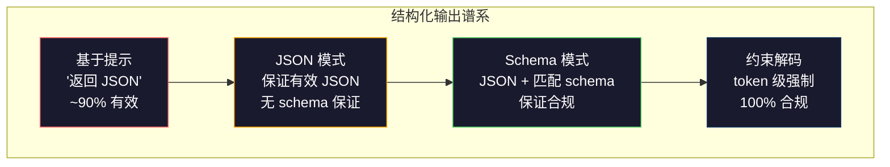
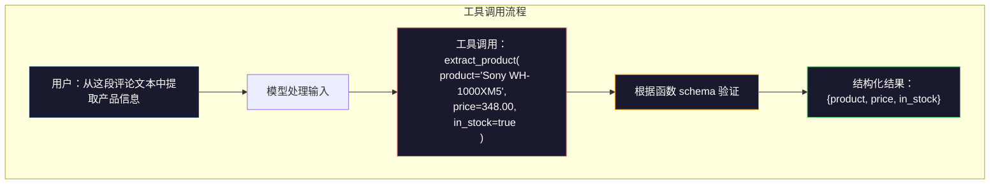

# 结构化输出：JSON、Schema 验证与约束解码

> 你的 LLM 返回一段字符串。你的应用需要 JSON。这条鸿沟毁掉的线上系统比任何幻觉都多。结构化输出是自然语言与类型化数据之间的桥梁。做对了，LLM 就成了可靠的 API；做错了，你只能在凌晨三点用正则表达式解析自由文本。

**类型：** 构建
**语言：** Python
**前置知识：** 第 10 阶段，课程 01-05（从头构建 LLM）
**预计时长：** 约 90 分钟
**相关：** 第 5 阶段 · 20（结构化输出与约束解码）涵盖了解码器层面的理论（FSM/CFG logit 处理器、Outlines、XGrammar）。本课程聚焦于生产 SDK 接口（OpenAI `response_format`、Anthropic 工具调用、Instructor）——如果想理解 API 底层发生了什么，请先阅读第 5 阶段 · 20。

## 学习目标

- 使用 OpenAI 和 Anthropic API 参数实现 JSON 模式和 schema 约束输出
- 构建一个 Pydantic 验证层，用于拒绝格式错误的 LLM 输出并通过错误反馈重试
- 解释约束解码如何在无需后处理的情况下在 token 层面强制生成有效 JSON
- 设计健壮的抽取提示词，可靠地将非结构化文本转换为类型化数据结构

## 问题所在

你让 LLM："从这段文本中提取产品名称、价格和库存状态。"它回复：

```
该产品是 Sony WH-1000XM5 耳机，售价 $348.00，目前有货。
```

这是一个完全正确的答案。但它对你的应用毫无用处。你的库存系统需要的是 `{"product": "Sony WH-1000XM5", "price": 348.00, "in_stock": true}`。你需要一个具有特定键、特定类型和特定值约束的 JSON 对象，而不是一句话。

 naive 的解决方案：在提示中加上"以 JSON 格式回复"。这 90% 的情况下有效。但剩下 10% 的情况，模型会把 JSON 包裹在 markdown 代码围栏中，或者添加类似"以下是 JSON："的前缀，或者因为提前关闭了括号而产生语法无效的 JSON。你的 JSON 解析器崩溃了，流水线断裂了。你加上了 try/except 和一个重试循环。重试有时会产生不同的数据。现在你在解析问题之上又有了consistency 问题。

这不是一个 prompt 工程问题。这是一个解码问题。模型从左到右生成 token。在每个位置，它从 10 万 + 的词汇表中选择概率最高的下一个 token。其中大多数选项在任何给定位置都会产生无效的 JSON。如果模型输出了 `{"price":`，下一个 token 必须是数字、引号（用于字符串）、`null`、`true`、`false` 或负号。任何其他 token 都会产生无效 JSON。如果没有约束，模型可能会选一个在语义上很合理但在句法上灾难性错误的英文单词。

## 概念解析

### 结构化输出谱系

有四个层级的结构化输出控制，每一级都比前一级更可靠。



**基于提示**（"以有效 JSON 格式回复"）：无强制保障。模型通常会遵守但有时不会。可靠性：~90%。失败模式：markdown 围栏、前缀文本、截断输出、结构错误。

**JSON 模式**：API 保证输出是有效 JSON。OpenAI 的 `response_format: { type: "json_object" }` 启用此功能。输出可以无错误地解析。但它可能不匹配你预期的 schema——可能存在多余键、错误类型或缺少字段。

**Schema 模式**：API 接受一个 JSON Schema 并保证输出与其匹配。在 2026 年，每个主流提供商都原生支持此功能：OpenAI 的 `response_format: { type: "json_schema", json_schema: {...} }`（也作为 `tool_choice="required"`），Anthropic 的工具调用配合 `input_schema`，以及 Gemini 的 `response_schema` + `response_mime_type: "application/json"`。输出具有你指定的精确键、类型和约束。

**约束解码**：在生成过程中的每个 token 位置，解码器会将所有会产生无效输出的 token 屏蔽掉。如果 schema 要求一个数字而模型即将输出一个字母，该 token 的概率会被设为零。模型只能产生导向有效输出的 token。这正是 OpenAI 的结构化输出模式和 Outlines、Guidance 等库在底层所实现的功能。

### JSON Schema：契约语言

JSON Schema 是你告诉模型（或验证层）输出必须具有什么形状的方式。每个主流结构化输出系统都使用它。

```json
{
  "type": "object",
  "properties": {
    "product": { "type": "string" },
    "price": { "type": "number", "minimum": 0 },
    "in_stock": { "type": "boolean" },
    "categories": {
      "type": "array",
      "items": { "type": "string" }
    }
  },
  "required": ["product", "price", "in_stock"]
}
```

这个 schema 表示：输出必须是一个包含字符串 `product`、非负数字 `price`、布尔值 `in_stock` 和可选的字符串数组 `categories` 的对象。任何不匹配的输出都会被拒绝。

Schema 处理那些困难场景：嵌套对象、带类型项的数组、枚举（将字符串约束为特定值）、模式匹配（字符串上的正则表达式）以及组合器（oneOf、anyOf、allOf 用于多态输出）。

### Pydantic 模式

在 Python 中，你不需要手写 JSON Schema。你定义一个 Pydantic 模型，它会为你自动生成 schema。

```python
from pydantic import BaseModel

class Product(BaseModel):
    product: str
    price: float
    in_stock: bool
    categories: list[str] = []
```

这会生成与上面相同的 JSON Schema。Instructor 库（以及 OpenAI 的 SDK）直接接受 Pydantic 模型：传入模型类，返回经过验证的实例。如果 LLM 输出不匹配，Instructor 会自动重试。

### 函数调用 / 工具调用

这是解决同一问题的另一种接口。与其让模型直接生成 JSON，不如定义带有类型化参数的"工具"（函数）。模型输出带有结构化参数的函数调用。OpenAI 称之为"函数调用"。Anthropic 称之为"工具调用"。结果相同：结构化数据。



当模型需要选择调用哪个函数（而不仅仅是填充参数）时，推荐使用工具调用。如果你有 10 种不同的抽取 schema 且模型必须根据输入选择正确的一个，工具调用可以同时提供 schema 选择和结构化输出。

### 常见失败模式

即使有 schema 强制保障，结构化输出也可能以微妙的方式失败。

**幻觉值**：输出符合 schema 但包含虚构数据。模型输出 `{"price": 299.99}` 而文本说的是 $348。Schema 验证无法检测到这一点——类型正确，值错误。

**枚举混淆**：你将一个字段约束为 `["in_stock", "out_of_stock", "preorder"]`。模型输出 `"available"`——语义正确，但不在允许集合中。好的约束解码可以防止这一点。基于提示的方法则不能。

**嵌套对象深度**：深层嵌套的 schema（4+ 层）会产生更多错误。每一层嵌套都是模型可能迷失结构的地方。

**数组长度**：模型可能在数组中产生过多或过少的项。Schema 支持 `minItems` 和 `maxItems`，但并非所有提供商都在解码层面强制执行它们。

**可选字段遗漏**：模型会省略技术上可选但对你的用例语义上重要的字段。即使数据有时缺失，也在 schema 中将它们设为 required——强制模型显式生成 `null`。

```figure
mx-schema-funnel
```

## 动手构建

### 步骤 1：JSON Schema 验证器

从零开始构建一个验证器，检查 Python 对象是否匹配 JSON Schema。这是在输出端运行以验证合规性的核心逻辑。

```python
import json

def validate_schema(data, schema):
    errors = []
    _validate(data, schema, "", errors)
    return errors

def _validate(data, schema, path, errors):
    schema_type = schema.get("type")

    if schema_type == "object":
        if not isinstance(data, dict):
            errors.append(f"{path}: expected object, got {type(data).__name__}")
            return
        for key in schema.get("required", []):
            if key not in data:
                errors.append(f"{path}.{key}: required field missing")
        properties = schema.get("properties", {})
        for key, value in data.items():
            if key in properties:
                _validate(value, properties[key], f"{path}.{key}", errors)

    elif schema_type == "array":
        if not isinstance(data, list):
            errors.append(f"{path}: expected array, got {type(data).__name__}")
            return
        min_items = schema.get("minItems", 0)
        max_items = schema.get("maxItems", float("inf"))
        if len(data) < min_items:
            errors.append(f"{path}: array has {len(data)} items, minimum is {min_items}")
        if len(data) > max_items:
            errors.append(f"{path}: array has {len(data)} items, maximum is {max_items}")
        items_schema = schema.get("items", {})
        for i, item in enumerate(data):
            _validate(item, items_schema, f"{path}[{i}]", errors)

    elif schema_type == "string":
        if not isinstance(data, str):
            errors.append(f"{path}: expected string, got {type(data).__name__}")
            return
        enum_values = schema.get("enum")
        if enum_values and data not in enum_values:
            errors.append(f"{path}: '{data}' not in allowed values {enum_values}")

    elif schema_type == "number":
        if not isinstance(data, (int, float)):
            errors.append(f"{path}: expected number, got {type(data).__name__}")
            return
        minimum = schema.get("minimum")
        maximum = schema.get("maximum")
        if minimum is not None and data < minimum:
            errors.append(f"{path}: {data} is less than minimum {minimum}")
        if maximum is not None and data > maximum:
            errors.append(f"{path}: {data} is greater than maximum {maximum}")

    elif schema_type == "boolean":
        if not isinstance(data, bool):
            errors.append(f"{path}: expected boolean, got {type(data).__name__}")

    elif schema_type == "integer":
        if not isinstance(data, int) or isinstance(data, bool):
            errors.append(f"{path}: expected integer, got {type(data).__name__}")
```

### 步骤 2：Pydantic 风格模型转 Schema

构建一个最小化的类到 schema 转换器。定义一个 Python 类并自动生成其 JSON Schema。

```python
class SchemaField:
    def __init__(self, field_type, required=True, default=None, enum=None, minimum=None, maximum=None):
        self.field_type = field_type
        self.required = required
        self.default = default
        self.enum = enum
        self.minimum = minimum
        self.maximum = maximum

def python_type_to_schema(field):
    type_map = {
        str: "string",
        int: "integer",
        float: "number",
        bool: "boolean",
    }

    schema = {}

    if field.field_type in type_map:
        schema["type"] = type_map[field.field_type]
    elif field.field_type == list:
        schema["type"] = "array"
        schema["items"] = {"type": "string"}
    elif isinstance(field.field_type, dict):
        schema = field.field_type

    if field.enum:
        schema["enum"] = field.enum
    if field.minimum is not None:
        schema["minimum"] = field.minimum
    if field.maximum is not None:
        schema["maximum"] = field.maximum

    return schema

def model_to_schema(name, fields):
    properties = {}
    required = []

    for field_name, field in fields.items():
        properties[field_name] = python_type_to_schema(field)
        if field.required:
            required.append(field_name)

    return {
        "type": "object",
        "properties": properties,
        "required": required,
    }
```

### 步骤 3：约束 Token 过滤器

模拟约束解码。给定一个部分 JSON 字符串和一个 schema，确定当前位置哪些 token 类别是合法的。

```python
def next_valid_tokens(partial_json, schema):
    stripped = partial_json.strip()

    if not stripped:
        return ["{"]

    try:
        json.loads(stripped)
        return ["<EOS>"]
    except json.JSONDecodeError:
        pass

    last_char = stripped[-1] if stripped else ""

    if last_char == "{":
        return ['"', "}"]
    elif last_char == '"':
        if stripped.endswith('":'):
            return ['"', "0-9", "true", "false", "null", "[", "{"]
        return ["a-z", '"']
    elif last_char == ":":
        return [" ", '"', "0-9", "true", "false", "null", "[", "{"]
    elif last_char == ",":
        return [" ", '"', "{", "["]
    elif last_char in "0123456789":
        return ["0-9", ".", ",", "}", "]"]
    elif last_char == "}":
        return [",", "}", "]", "<EOS>"]
    elif last_char == "]":
        return [",", "}", "<EOS>"]
    elif last_char == "[":
        return ['"', "0-9", "true", "false", "null", "{", "[", "]"]
    else:
        return ["any"]

def demonstrate_constrained_decoding():
    partial_states = [
        '',
        '{',
        '{"product"',
        '{"product":',
        '{"product": "Sony"',
        '{"product": "Sony",',
        '{"product": "Sony", "price":',
        '{"product": "Sony", "price": 348',
        '{"product": "Sony", "price": 348}',
    ]

    print(f"{'Partial JSON':<45} {'Valid Next Tokens'}")
    print("-" * 80)
    for state in partial_states:
        valid = next_valid_tokens(state, {})
        display = state if state else "(empty)"
        print(f"{display:<45} {valid}")
```

### 步骤 4：抽取流水线

将所有组件组合成一个抽取流水线：定义 schema、模拟 LLM 生成结构化输出、验证输出并处理重试。

```python
def simulate_llm_extraction(text, schema, attempt=0):
    if "headphones" in text.lower() or "sony" in text.lower():
        if attempt == 0:
            return '{"product": "Sony WH-1000XM5", "price": 348.00, "in_stock": true, "categories": ["audio", "headphones"]}'
        return '{"product": "Sony WH-1000XM5", "price": 348.00, "in_stock": true}'

    if "laptop" in text.lower():
        return '{"product": "MacBook Pro 16", "price": 2499.00, "in_stock": false, "categories": ["computers"]}'

    return '{"product": "Unknown", "price": 0, "in_stock": false}'

def extract_with_retry(text, schema, max_retries=3):
    for attempt in range(max_retries):
        raw = simulate_llm_extraction(text, schema, attempt)

        try:
            data = json.loads(raw)
        except json.JSONDecodeError as e:
            print(f"  Attempt {attempt + 1}: JSON parse error -- {e}")
            continue

        errors = validate_schema(data, schema)
        if not errors:
            return data

        print(f"  Attempt {attempt + 1}: Schema validation errors -- {errors}")

    return None

product_schema = {
    "type": "object",
    "properties": {
        "product": {"type": "string"},
        "price": {"type": "number", "minimum": 0},
        "in_stock": {"type": "boolean"},
        "categories": {"type": "array", "items": {"type": "string"}},
    },
    "required": ["product", "price", "in_stock"],
}
```

### 步骤 5：运行完整流水线

```python
def run_demo():
    print("=" * 60)
    print("  结构化输出流水线演示")
    print("=" * 60)

    print("\n--- Schema 定义 ---")
    product_fields = {
        "product": SchemaField(str),
        "price": SchemaField(float, minimum=0),
        "in_stock": SchemaField(bool),
        "categories": SchemaField(list, required=False),
    }
    generated_schema = model_to_schema("Product", product_fields)
    print(json.dumps(generated_schema, indent=2))

    print("\n--- Schema 验证 ---")
    test_cases = [
        ({"product": "Test", "price": 10.0, "in_stock": True}, "有效对象"),
        ({"product": "Test", "price": -5.0, "in_stock": True}, "负价格"),
        ({"product": "Test", "in_stock": True}, "缺少 price"),
        ({"product": "Test", "price": "ten", "in_stock": True}, "字符串作为价格"),
        ("not an object", "字符串而非对象"),
    ]

    for data, label in test_cases:
        errors = validate_schema(data, product_schema)
        status = "PASS" if not errors else f"FAIL: {errors}"
        print(f"  {label}: {status}")

    print("\n--- 约束解码模拟 ---")
    demonstrate_constrained_decoding()

    print("\n--- 抽取流水线 ---")
    texts = [
        "The Sony WH-1000XM5 headphones are priced at $348 and currently available.",
        "The new MacBook Pro 16-inch laptop costs $2499 but is sold out.",
        "This is a random sentence with no product info.",
    ]

    for text in texts:
        print(f"\n  Input: {text[:60]}...")
        result = extract_with_retry(text, product_schema)
        if result:
            print(f"  Output: {json.dumps(result)}")
        else:
            print(f"  Output: FAILED after retries")
```

## 投入使用

### OpenAI 结构化输出

```python
# from openai import OpenAI
# from pydantic import BaseModel
#
# client = OpenAI()
#
# class Product(BaseModel):
#     product: str
#     price: float
#     in_stock: bool
#
# response = client.beta.chat.completions.parse(
#     model="gpt-5-mini",
#     messages=[
#         {"role": "system", "content": "Extract product information."},
#         {"role": "user", "content": "Sony WH-1000XM5, $348, in stock"},
#     ],
#     response_format=Product,
# )
#
# product = response.choices[0].message.parsed
# print(product.product, product.price, product.in_stock)
```

OpenAI 的结构化输出模式在内部使用约束解码。模型生成的每个 token 都保证产生匹配 Pydantic schema 的输出。无需重试，无需验证。约束被烘焙到解码过程中。

### Anthropic 工具调用

```python
# import anthropic
#
# client = anthropic.Anthropic()
#
# response = client.messages.create(
#     model="claude-opus-4-7",
#     max_tokens=1024,
#     tools=[{
#         "name": "extract_product",
#         "description": "Extract product information from text",
#         "input_schema": {
#             "type": "object",
#             "properties": {
#                 "product": {"type": "string"},
#                 "price": {"type": "number"},
#                 "in_stock": {"type": "boolean"},
#             },
#             "required": ["product", "price", "in_stock"],
#         },
#     }],
#     messages=[{"role": "user", "content": "Extract: Sony WH-1000XM5, $348, in stock"}],
# )
```

Anthropic 通过工具调用实现结构化输出。模型输出带有结构化参数的工具调用，这些参数与 input_schema 匹配。结果相同，API 接口不同。

### Instructor 库

```python
# pip install instructor
# import instructor
# from openai import OpenAI
# from pydantic import BaseModel
#
# client = instructor.from_openai(OpenAI())
#
# class Product(BaseModel):
#     product: str
#     price: float
#     in_stock: bool
#
# product = client.chat.completions.create(
#     model="gpt-5-mini",
#     response_model=Product,
#     messages=[{"role": "user", "content": "Sony WH-1000XM5, $348, in stock"}],
# )
```

Instructor 封装了任意 LLM 客户端并添加了带验证的自动重试。如果第一次尝试未通过验证，它会将错误作为上下文发送回模型并要求其修复输出。这不仅适用于 OpenAI，也适用于任何提供商。

## 交付物

本课程产出 `outputs/prompt-structured-extractor.md`——一个可复用的提示词模板，可根据 schema 定义从任意文本中抽取结构化数据。传入一个 JSON Schema 和非结构化文本，返回经过验证的 JSON。

同时还产出 `outputs/skill-structured-outputs.md`——一个决策框架，用于根据你的提供商、可靠性需求和 schema 复杂度选择最合适的结构化输出策略。

## 练习题

1. 扩展 schema 验证器以支持 `oneOf`（数据必须精确匹配多个 schema 中的一个）。这处理多态输出——例如，一个字段可以是 `Product` 或 `Service` 对象，两者结构不同。

2. 构建一个"schema diff"工具，比较两个 schema 并识别破坏性变更（删除的必填字段、变更的类型）与非破坏性变更（新增的可选字段、放宽的约束）。这对于在生产环境中对抽取 schema 进行版本管理至关重要。

3. 实现一个更真实的约束解码模拟器。给定一个 JSON Schema 和 100 个 token 的词汇表（字母、数字、标点、关键词），逐步 walkthrough 生成过程，在每个位置屏蔽无效 token。测量每一步有多少百分比的词汇表是合法的。

4. 构建一个抽取评测套件。创建 50 条带有手工标注 JSON 输出的产品描述。在你的抽取流水线上对所有 50 条运行测试，并衡量精确匹配率、字段级准确率和类型合规率。找出最难正确抽取的字段。

5. 为你的抽取流水线添加"置信度分数"。对于每个抽取字段，估算模型的置信度（基于 token 概率，或通过运行 3 次抽取并测量一致性）。为低置信度字段标记人工审查。

## 关键术语

| 术语 | 人们常说的 | 实际含义 |
|------|-----------|---------|
| JSON 模式 | "返回 JSON" | API 标志，保证输出在句法上是有效 JSON，但不强制执行任何特定 schema |
| 结构化输出 | "类型化 JSON" | 输出匹配特定的 JSON Schema，具有正确的键、类型和约束 |
| 约束解码 | "引导生成" | 在每个 token 位置屏蔽会产生无效输出的 token——保证 100% schema 合规 |
| JSON Schema | "JSON 模板" | 一种声明式语言，用于描述 JSON 数据的结构、类型和约束（被 OpenAPI、JSON Forms 等使用） |
| Pydantic | "Python dataclasses+" | Python 库，通过类型验证定义数据模型，被 FastAPI 和 Instructor 用于生成 JSON Schema |
| 函数调用 | "工具调用" | LLM 输出结构化的函数调用（名称 + 类型化参数）而非自由文本——OpenAI 和 Anthropic 均支持 |
| Instructor | "LLM 的 Pydantic" | Python 库，封装 LLM 客户端以返回经过验证的 Pydantic 实例，在验证失败时自动重试 |
| Token 屏蔽 | "过滤词汇表" | 在生成过程中将特定 token 概率设为零，使模型无法产生它们 |
| Schema 合规 | "匹配形状" | 输出包含所有必填字段、正确类型、值在约束范围内，且无多余的不允许字段 |
| 重试循环 | "重试直到成功" | 将验证错误发回模型并要求其修复输出——Instructor 自动完成此操作，最多 configurable max 次 |

## 延伸阅读

- [OpenAI 结构化输出指南](https://platform.openai.com/docs/guides/structured-outputs) —— OpenAI API 中基于 JSON Schema 的约束解码官方文档
- [Willard & Louf, 2023 ——《高效引导大语言模型生成》](https://arxiv.org/abs/2307.09702) —— Outlines 论文，描述如何将 JSON Schema 编译为有限状态机以实现 token 级约束
- [Instructor 文档](https://python.useinstructor.com/) —— 通过 Pydantic 验证和重试从任意 LLM 获取结构化输出的标准库
- [Anthropic 工具调用指南](https://docs.anthropic.com/en/docs/tool-use) —— Claude 如何通过带有 JSON Schema input_schema 的工具调用实现结构化输出
- [JSON Schema 规范](https://json-schema.org/) —— 每个主流结构化输出系统所用的 schema 语言的完整规范
- [Outlines 库](https://github.com/outlines-dev/outlines) —— 开源约束生成，将 regex 和 JSON Schema 编译为有限状态机
- [Dong et al.,《XGrammar：面向大语言模型的灵活高效结构化生成引擎》（MLSys 2025）](https://arxiv.org/abs/2411.15100) —— 当前最先进的语法引擎；基于下推自动机的编译，可在约 100 ns/token 的速度下屏蔽 token
- [Beurer-Kellner et al.,《提示即编程：大语言模型的查询语言》（LMQL）](https://arxiv.org/abs/2212.06094) —— LMQL 论文，将约束解码框架化为具有类型和值约束的查询语言
- [Microsoft Guidance（框架文档）](https://github.com/guidance-ai/guidance) —— 模板驱动的约束生成；与 Outlines 和 XGrammar 互补的厂商中立方案
