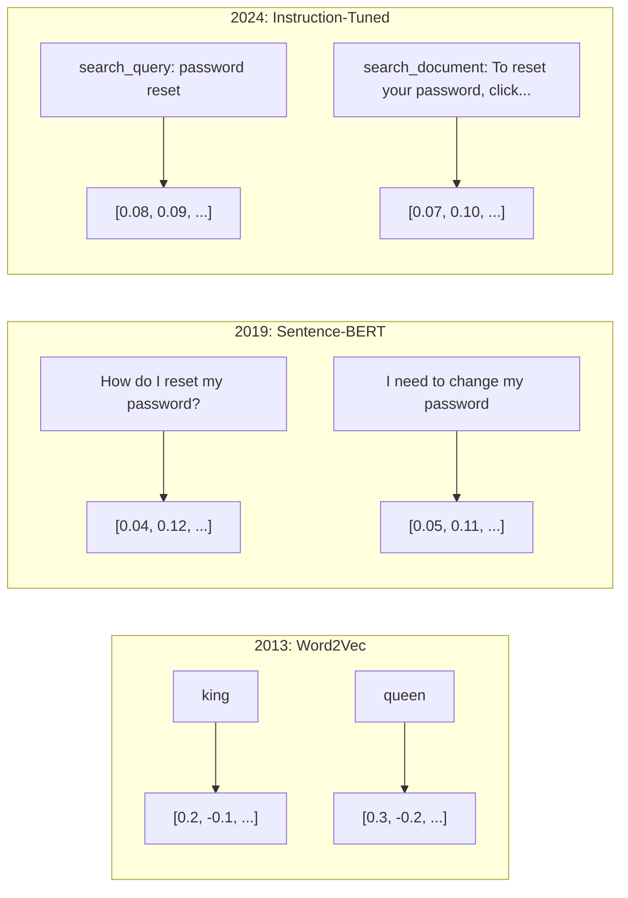
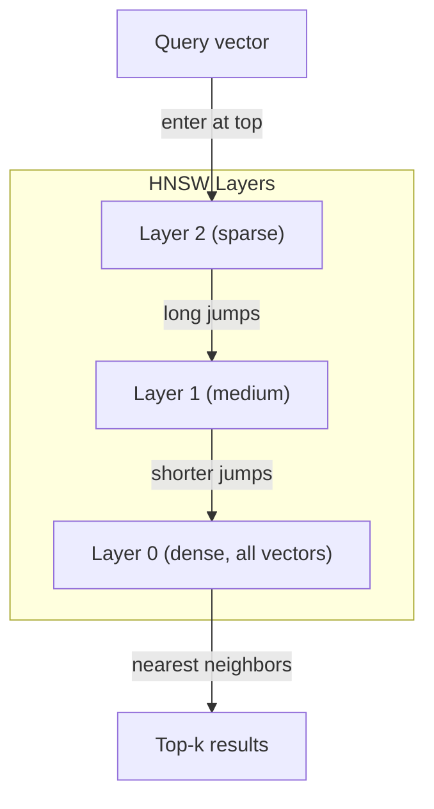

# 嵌入与向量表示

> 文本是离散的，数学是连续的。每当你让 LLM 查找“相似”文档、比较含义或进行关键词之外的搜索时，你都在依赖一座连接这两个世界的桥梁。这座桥梁就是嵌入（Embedding）。如果你不理解嵌入，你就没有理解现代 AI。你只是在使用它而已。

**类型：** 构建
**语言：** Python
**前置知识：** Phase 11, Lesson 01（提示工程）
**耗时：** 约 75 分钟
**相关：** Phase 5 · 22（Embedding Models Deep Dive）涵盖稠密 vs 稀疏 vs 多向量、Matryoshka 截断与逐轴模型选择。本课程聚焦生产级管道（向量数据库、HNSW、相似度数学）。选定模型前请先阅读 Phase 5 · 22。

## 学习目标

- 使用 API 提供商和开源模型生成文本嵌入，并计算它们之间的余弦相似度
- 解释为什么嵌入能解决关键词搜索无法处理的词汇不匹配问题
- 构建一个按语义而非精确关键词匹配检索文档的语义搜索索引
- 使用检索基准（precision@k、recall）评估嵌入质量，并为你的任务选择合适的嵌入模型

## 问题所在

你有 10,000 条客户支持工单。一位客户写道“我的付款没有成功”。你需要找到历史上相似的工单。关键词搜索会找到包含 "payment" 和 "didn't go through" 的工单。但它会漏掉 "transaction failed"、"charge was declined" 和 "billing error"。这些工单描述的是完全相同的问题，却使用了截然不同的措辞。

这就是词汇不匹配问题（vocabulary mismatch problem）。人类语言有几十种方式表达同一个意思。关键词搜索将每个词视为独立的符号，没有任何含义关联。它无法知道 "declined" 和 "didn't go through" 指的是同一个概念。

你需要一种文本表示方式，让含义而非拼写决定相似度。你需要一种方法，将 "my payment didn't go through" 和 "transaction was declined" 放在某个数学空间的相近位置，同时把 "my payment arrived on time" 推得很远，尽管它们共享 "payment" 这个词。

这种表示方式就是嵌入。

## 核心概念

### 什么是嵌入？

嵌入是一个代表文本含义的浮点数稠密向量。"Dense（稠密）"一词很重要——每个维度都携带信息，这与稀疏表示（词袋模型、TF-IDF）不同，后者大部分维度为零。

"The cat sat on the mat" 会变成类似 `[0.023, -0.041, 0.087, ..., 0.012]` 的东西——一长串 768 到 3072 个数字，具体取决于模型。这些数字编码了含义。你永远不会直接查看它们，你只会比较它们。

### Word2Vec 的突破

2013 年，Tomas Mikolov 及其 Google 同事发表了 Word2Vec。核心洞察是：训练一个神经网络，让它根据上下文预测某个词（或根据某个词预测上下文），那么隐藏层的权重就会变成有意义的向量表示。

著名的结论：

```
king - man + woman = queen
```

对词嵌入进行向量运算能够捕捉语义关系。从 "man" 到 "woman" 的方向大致等同于从 "king" 到 "queen" 的方向。这一刻，整个领域意识到几何可以编码含义。

Word2Vec 生成 300 维向量。无论上下文如何，每个词只对应一个向量。"Bank" 在 "river bank" 和 "bank account" 中拥有相同的嵌入。这一局限性推动了随后十年的研究。

### 从单词到句子

词嵌入表示单个 token。生产系统需要嵌入完整的句子、段落或文档。出现了四种方法：

**平均法**：取句子中所有词向量的均值。成本低、信息有损，但对于短文本效果出奇地好。完全丢失词序——"dog bites man" 和 "man bites dog" 会得到完全相同的嵌入。

**CLS token**：Transformer 模型（BERT，2018）输出一个特殊的 [CLS] token 嵌入，用于表示整个输入。比平均法更好，但 [CLS] token 是为下一个句子预测训练的，而非相似度任务。

**对比学习**：显式训练模型将相似对拉近、将不相似对推远。Sentence-BERT（Reimers & Gurevych，2019）采用了这种方法，成为现代嵌入模型的基础。给定 "How do I reset my password?" 和 "I need to change my password"，模型会学习到它们应该具有几乎相同的向量。

**指令微调嵌入**：最新的方法。E5 和 GTE 等模型接受任务前缀（如 "search_query:"、"search_document:"），告诉模型应生成何种类型的嵌入。这使得一个模型可以服务多个任务。



### 现代嵌入模型

市场已收敛为数不多的生产级选项（截至 2026 年初的 MTEB v2 分数）：

| 模型 | 提供商 | 维度 | MTEB | 上下文长度 | 成本 / 百万词元 |
|-------|----------|-----------|------|---------|------------------|
| Gemini Embedding 2 | Google | 3072 (Matryoshka) | 67.7 (retrieval) | 8192 | $0.15 |
| embed-v4 | Cohere | 1024 (Matryoshka) | 65.2 | 128K | $0.12 |
| voyage-4 | Voyage AI | 1024/2048 (Matryoshka) | 66.8 | 32K | $0.12 |
| text-embedding-3-large | OpenAI | 3072 (Matryoshka) | 64.6 | 8192 | $0.13 |
| text-embedding-3-small | OpenAI | 1536 (Matryoshka) | 62.3 | 8192 | $0.02 |
| BGE-M3 | BAAI | 1024 (dense+sparse+ColBERT) | 63.0 multilingual | 8192 | Open-weight |
| Qwen3-Embedding | Alibaba | 4096 (Matryoshka) | 66.9 | 32K | Open-weight |
| Nomic-embed-v2 | Nomic | 768 (Matryoshka) | 63.1 | 8192 | Open-weight |

MTEB（Massive Text Embedding Benchmark）v2 涵盖检索、分类、聚类、重排序和摘要等 100+ 项任务。分数越高越好。到 2026 年，开源模型（Qwen3-Embedding、BGE-M3）在大多数指标上已追平或超越闭源托管模型。Gemini Embedding 2 在纯检索上领先；Voyage/Cohere 在特定领域（金融、法律、代码）领先。提交前务必在自有查询集上进行基准测试。

### 相似度度量

给定两个嵌入向量，有三种衡量相似度的方式：

**余弦相似度（Cosine similarity）**：两个向量夹角的余弦值。范围从 -1（相反）到 1（方向完全相同）。忽略模长——如果指向同一方向，10 词句子和 500 词文档都可以得分为 1.0。这是 90% 用例的默认选择。

```
cosine_sim(a, b) = dot(a, b) / (||a|| * ||b||)
```

**点积（Dot product）**：两个向量的原始内积。当向量已归一化（单位长度）时，与余弦相似度等价。计算更快。OpenAI 的嵌入已归一化，因此点积和余弦给出相同的排序。

```
dot(a, b) = sum(a_i * b_i)
```

**欧氏距离（Euclidean / L2 distance）**：向量空间中的直线距离。越小越相似。对模长差异敏感。当空间中的绝对位置比方向更重要时使用。

```
L2(a, b) = sqrt(sum((a_i - b_i)^2))
```

何时使用哪种：

| 度量方式 | 适用场景 | 避免场景 |
|--------|----------|------------|
| 余弦相似度 | 比较不同长度的文本；大多数检索任务 | 模长携带信息时 |
| 点积 | 嵌入已归一化；追求极致速度 | 向量模长差异较大时 |
| 欧氏距离 | 聚类；空间最近邻问题 | 比较长度差异极大的文档时 |

### 向量数据库与 HNSW

暴力相似度搜索会将查询与每个存储的向量逐一比较。在 100 万个向量、1536 维的情况下，每次查询需要 15 亿次乘加运算。太慢了。

向量数据库通过近似最近邻（ANN）算法解决此问题。主流算法是 HNSW（Hierarchical Navigable Small World）：

1. 构建向量的多层图结构
2. 顶层较稀疏——远距离集群间的长程连接
3. 底层较稠密——相近向量间的细粒度连接
4. 搜索从顶层开始，贪婪地向下层细分
5. 以 O(log n) 时间返回近似 top-k 结果，而非 O(n)

HNSW 以微小的精度损失（通常为 95-99% recall）换取巨大的速度提升。在 1000 万向量规模下，暴力搜索需数秒，HNSW 仅需毫秒。



生产级选项：

| 数据库 | 类型 | 适用场景 | 最大规模 |
|----------|------|----------|-----------|
| Pinecone | 托管 SaaS | 零运维生产环境 | 十亿级 |
| Weaviate | 开源 | 自托管、混合搜索 | 1亿+ |
| Qdrant | 开源 | 高性能、过滤查询 | 1亿+ |
| ChromaDB | 嵌入式 | 原型开发、本地调试 | 100万 |
| pgvector | Postgres 扩展 | 已在使用 Postgres | 1000万 |
| FAISS | 库 | 进程内、研究用途 | 10亿+ |

### 分块策略

文档太长，无法作为单个向量嵌入。一份 50 页的 PDF 涵盖数十个主题——其嵌入会变成所有内容的平均值，结果类似什么都不像。你将文档拆分成块，然后分别嵌入每一块。

**固定尺寸分块**：每 N 个 token 切割一次，保留 M 个 token 的重叠。简单可预测。在文档无明确结构时效果良好。512 token 分块、50 token 重叠：块 1 是 token 0-511，块 2 是 token 462-973。

**基于句子的分块**：在句子边界处切割，将句子分组直至达到 token 上限。每个块至少包含一个完整句子。比固定尺寸更好，因为你永远不会把一个意思切断。

**递归分块**：优先尝试在最大的边界处切割（章节标题）。如果仍太大，尝试段落边界。然后是句子边界。最后是字符限制。这是 LangChain 的 `RecursiveCharacterTextSplitter`，对混合格式语料库效果良好。

**语义分块**：嵌入每个句子，然后将嵌入相似的连续句子分组。当嵌入相似度低于阈值时，开始新块。开销较大（需单独嵌入每个句子），但能生成最连贯的块。

| 策略 | 复杂度 | 质量 | 最佳适用 |
|----------|-----------|---------|----------|
| 固定尺寸 | 低 | 尚可 | 非结构化文本、日志 |
| 基于句子 | 低 | 良好 | 文章、邮件 |
| 递归 | 中 | 良好 | Markdown、HTML、混合文档 |
| 语义 | 高 | 最佳 | 对检索质量要求极高的场景 |

大多数系统的最优配置：256-512 token 的块大小，50 token 重叠。

### 双编码器 vs 交叉编码器

双编码器独立嵌入查询和文档，然后比较向量。速度快——你只需嵌入一次查询，再与预计算的文档嵌入进行比较。这正是检索所使用的。

交叉编码器将查询和文档作为单一输入传入，输出相关性分数。速度慢——它需要为每个查询-文档对完整运行一遍模型。但准确率高得多，因为它可以同时关注查询和文档的 token。

生产模式：双编码器检索 top-100 候选，交叉编码器将其重排序至 top-10。这就是 retrieve-then-rerank 管道。


重排序模型：Cohere Rerank 3.5（$2 / 1000 次查询）、BGE-reranker-v2（免费开源）、Jina Reranker v2（免费开源）。

### 套娃式嵌入（Matryoshka Embeddings）

传统嵌入是全有或全无的。1536 维向量使用 1536 个 float。如果不重新训练，无法截断到 256 维。

套娃表示学习（Matryoshka Representation Learning，Kusupati 等，2022）解决了这个问题。模型经过训练，前 N 个维度捕获最重要的信息，就像俄罗斯套娃。将 1536 维的 Matryoshka 嵌入截断到 256 维会损失一些精度，但仍可正常使用。

OpenAI 的 text-embedding-3-small 和 text-embedding-3-large 支持通过 `dimensions` 参数进行 Matryoshka 截断。请求 256 维而非 1536 维可将存储减少 6 倍，MTEB 基准上的精度损失约 3-5%。

### 二值量化

一个 1536 维的嵌入以 float32 存储需要 6,144 字节。乘以 1000 万份文档：向量本身就需要 61 GB。

二值量化将每个 float 转换为单个 bit：正值变 1，负值变 0。存储从 6,144 字节降至 192 字节——32 倍压缩。相似度通过汉明距离（统计不同位的数量）计算，CPU 可在单个指令内完成。

精度损失约为检索 recall 下降 5-10%。常见模式：用二值量化对百万级向量进行初筛，再用全精度向量对 top-1000 重新评分。这样能以 32 倍更少的内存获得 95%+ 的全精度精度。

```figure
cosine-similarity
```

## 构建它

我们从头构建一个语义搜索引擎。不使用向量数据库，不使用外部嵌入 API。纯 Python + numpy 实现数学运算。

### 步骤 1：文本分块

```python
def chunk_text(text, chunk_size=200, overlap=50):
    words = text.split()
    chunks = []
    start = 0
    while start < len(words):
        end = start + chunk_size
        chunk = " ".join(words[start:end])
        chunks.append(chunk)
        start += chunk_size - overlap
    return chunks


def chunk_by_sentences(text, max_chunk_tokens=200):
    sentences = text.replace("\n", " ").split(".")
    sentences = [s.strip() + "." for s in sentences if s.strip()]
    chunks = []
    current_chunk = []
    current_length = 0
    for sentence in sentences:
        sentence_length = len(sentence.split())
        if current_length + sentence_length > max_chunk_tokens and current_chunk:
            chunks.append(" ".join(current_chunk))
            current_chunk = []
            current_length = 0
        current_chunk.append(sentence)
        current_length += sentence_length
    if current_chunk:
        chunks.append(" ".join(current_chunk))
    return chunks
```

### 步骤 2：从零构建嵌入器

我们使用带 L2 归一化的 TF-IDF 实现一个简单的稠密嵌入器。这不是神经嵌入，但遵循相同的契约：文本输入，固定大小向量输出，相似文本产生相似向量。

```python
import math
import numpy as np
from collections import Counter

class SimpleEmbedder:
    def __init__(self):
        self.vocab = []
        self.idf = []
        self.word_to_idx = {}

    def fit(self, documents):
        vocab_set = set()
        for doc in documents:
            vocab_set.update(doc.lower().split())
        self.vocab = sorted(vocab_set)
        self.word_to_idx = {w: i for i, w in enumerate(self.vocab)}
        n = len(documents)
        self.idf = np.zeros(len(self.vocab))
        for i, word in enumerate(self.vocab):
            doc_count = sum(1 for doc in documents if word in doc.lower().split())
            self.idf[i] = math.log((n + 1) / (doc_count + 1)) + 1

    def embed(self, text):
        words = text.lower().split()
        count = Counter(words)
        total = len(words) if words else 1
        vec = np.zeros(len(self.vocab))
        for word, freq in count.items():
            if word in self.word_to_idx:
                tf = freq / total
                vec[self.word_to_idx[word]] = tf * self.idf[self.word_to_idx[word]]
        norm = np.linalg.norm(vec)
        if norm > 0:
            vec = vec / norm
        return vec
```

### 步骤 3：相似度函数

```python
def cosine_similarity(a, b):
    dot = np.dot(a, b)
    norm_a = np.linalg.norm(a)
    norm_b = np.linalg.norm(b)
    if norm_a == 0 or norm_b == 0:
        return 0.0
    return float(dot / (norm_a * norm_b))


def dot_product(a, b):
    return float(np.dot(a, b))


def euclidean_distance(a, b):
    return float(np.linalg.norm(a - b))
```

### 步骤 4：暴力搜索向量索引

```python
class VectorIndex:
    def __init__(self):
        self.vectors = []
        self.texts = []
        self.metadata = []

    def add(self, vector, text, meta=None):
        self.vectors.append(vector)
        self.texts.append(text)
        self.metadata.append(meta or {})

    def search(self, query_vector, top_k=5, metric="cosine"):
        scores = []
        for i, vec in enumerate(self.vectors):
            if metric == "cosine":
                score = cosine_similarity(query_vector, vec)
            elif metric == "dot":
                score = dot_product(query_vector, vec)
            elif metric == "euclidean":
                score = -euclidean_distance(query_vector, vec)
            else:
                raise ValueError(f"Unknown metric: {metric}")
            scores.append((i, score))
        scores.sort(key=lambda x: x[1], reverse=True)
        results = []
        for idx, score in scores[:top_k]:
            results.append({
                "text": self.texts[idx],
                "score": score,
                "metadata": self.metadata[idx],
                "index": idx
            })
        return results

    def size(self):
        return len(self.vectors)
```

### 步骤 5：语义搜索引擎

```python
class SemanticSearchEngine:
    def __init__(self, chunk_size=200, overlap=50):
        self.embedder = SimpleEmbedder()
        self.index = VectorIndex()
        self.chunk_size = chunk_size
        self.overlap = overlap

    def index_documents(self, documents, source_names=None):
        all_chunks = []
        all_sources = []
        for i, doc in enumerate(documents):
            chunks = chunk_text(doc, self.chunk_size, self.overlap)
            all_chunks.extend(chunks)
            name = source_names[i] if source_names else f"doc_{i}"
            all_sources.extend([name] * len(chunks))
        self.embedder.fit(all_chunks)
        for chunk, source in zip(all_chunks, all_sources):
            vec = self.embedder.embed(chunk)
            self.index.add(vec, chunk, {"source": source})
        return len(all_chunks)

    def search(self, query, top_k=5, metric="cosine"):
        query_vec = self.embedder.embed(query)
        return self.index.search(query_vec, top_k, metric)

    def search_with_scores(self, query, top_k=5):
        results = self.search(query, top_k)
        return [
            {
                "text": r["text"][:200],
                "source": r["metadata"].get("source", "unknown"),
                "score": round(r["score"], 4)
            }
            for r in results
        ]
```

### 步骤 6：对比相似度度量

```python
def compare_metrics(engine, query, top_k=3):
    results = {}
    for metric in ["cosine", "dot", "euclidean"]:
        hits = engine.search(query, top_k=top_k, metric=metric)
        results[metric] = [
            {"score": round(h["score"], 4), "preview": h["text"][:80]}
            for h in hits
        ]
    return results
```

## 使用它

使用生产级嵌入 API 时，架构保持不变。只需替换嵌入器：

```python
from openai import OpenAI

client = OpenAI()

def openai_embed(texts, model="text-embedding-3-small", dimensions=None):
    kwargs = {"model": model, "input": texts}
    if dimensions:
        kwargs["dimensions"] = dimensions
    response = client.embeddings.create(**kwargs)
    return [item.embedding for item in response.data]
```

配合 OpenAI 使用 Matryoshka 截断——同一模型，更少维度，更低存储：

```python
full = openai_embed(["semantic search query"], dimensions=1536)
compact = openai_embed(["semantic search query"], dimensions=256)
```

256 维向量使用 6 倍更少的存储。对于 1000 万份文档，那就是 10 GB vs 61 GB。精度损失在标准基准上约为 3-5%。

使用 Cohere 进行重排序：

```python
import cohere

co = cohere.ClientV2()

results = co.rerank(
    model="rerank-v3.5",
    query="What is the refund policy?",
    documents=["Full refund within 30 days...", "No refunds after 90 days..."],
    top_n=3
)
```

使用无需 API 依赖的本地嵌入：

```python
from sentence_transformers import SentenceTransformer

model = SentenceTransformer("BAAI/bge-small-en-v1.5")
embeddings = model.encode(["semantic search query", "another document"])
```

我们构建的 `VectorIndex` 类可与上述任意方案配合使用。交换嵌入函数，保留搜索逻辑。

## 交付物

本课产出：
- `outputs/prompt-embedding-advisor.md` -- 针对特定用例选择嵌入模型和策略的提示词
- `outputs/skill-embedding-patterns.md` -- 教授智能体如何在生产环境中有效使用嵌入的技能卡

## 练习

1. **度量对比**：使用余弦相似度、点积和欧氏距离对样本文档运行相同的 5 个查询。记录各自的 top-3 结果。哪些查询的度量结果会产生分歧？为什么？
2. **分块大小实验**：使用 50、100、200 和 500 词的块大小索引样本文档。对每种情况运行 5 个查询并记录 top-1 相似度分数。绘制块大小与检索质量之间的关系曲线。找到块变大开始损害质量的临界点。
3. **Matryoshka 模拟**：构建一个生成 500 维向量的 `SimpleEmbedder`。将其截断至 50、100、200 和 500 维。测量每个截断点的检索 recall 退化情况。这在无需真实训练技巧的情况下模拟了 Matryoshka 行为。
4. **二值量化**：取搜索引擎中的嵌入，将其转换为二值（正值为 1，负值为 0），并实现汉明距离搜索。将 top-10 结果与全精度余弦相似度进行对比。测量重叠百分比。
5. **基于句子的分块**：用 `chunk_by_sentences` 替换固定尺寸分块。运行相同的查询并对比检索分数。尊重句子边界是否能提升结果？

## 核心术语

| 术语 | 人们常说的 | 实际含义 |
|------|----------------|----------------------|
| Embedding | “文本转数字” | 一种稠密向量，其几何邻近性编码语义相似度 |
| Word2Vec | “最初的嵌入” | 2013 年模型，通过学习预测上下文词来生成词向量；证明向量运算可编码含义 |
| Cosine similarity | “两个向量有多相似” | 向量间夹角的余弦值；1 = 方向相同，0 = 正交，-1 = 相反 |
| HNSW | “快速向量搜索” | 层次可导航小世界图——多层结构实现 O(log n) 近似最近邻搜索 |
| Bi-encoder | “分开嵌入，快速比较” | 将查询和文档独立编码为向量；支持预计算和快速检索 |
| Cross-encoder | “慢但准确的重排器” | 将查询-文档对一起送入完整模型；精度更高，无法预计算 |
| Matryoshka embeddings | “可截断的向量” | 经过训练的嵌入，前 N 个维度捕获最重要信息，支持可变尺寸存储 |
| Binary quantization | “1-bit 嵌入” | 将 float 向量转换为二进制（仅保留符号位），配合汉明距离搜索实现 32 倍存储压缩 |
| Chunking | “拆分文档以便嵌入” | 将文档拆分为 256-512 token 的片段，使每个片段可独立嵌入和检索 |
| Vector database | “嵌入的搜索引擎” | 专为大规模存储向量和执行近似最近邻搜索而优化的数据存储 |
| Contrastive learning | “通过对比训练” | 训练方法，将相似对嵌入拉近，将不相似对嵌入推远 |
| MTEB | “嵌入基准测试” | Massive Text Embedding Benchmark——覆盖 8 类任务的 56 个数据集；用于比较嵌入模型的标准基准 |
| MTEB | “嵌入基准测试” | Massive Text Embedding Benchmark——覆盖 8 类任务的 56 个数据集；用于比较嵌入模型的标准基准 |

## 延伸阅读

- Mikolov 等，《Efficient Estimation of Word Representations in Vector Space》（2013）——开启嵌入革命的经典 Word2Vec 论文，包含著名的 king-queen 类比
- Reimers & Gurevych，《Sentence-BERT: Sentence Embeddings using Siamese BERT-Networks》（2019）——如何训练用于句子级相似度的双编码器，现代嵌入模型的基础
- Kusupati 等，《Matryoshka Representation Learning》（2022）——OpenAI 在 text-embedding-3 中采用的变维嵌入技术
- Malkov & Yashunin，《Efficient and Robust Approximate Nearest Neighbor using Hierarchical Navigable Small World Graphs》（2018）——HNSW 论文，多数生产级向量搜索背后的算法
- OpenAI Embeddings Guide（platform.openai.com/docs/guides/embeddings）——text-embedding-3 模型的实用参考，含 Matryoshka 降维说明
- MTEB Leaderboard（huggingface.co/spaces/mteb/leaderboard）——跨任务和语言的实时嵌入模型基准对比
- [Muennighoff 等，《MTEB: Massive Text Embedding Benchmark》（EACL 2023）](https://arxiv.org/abs/2210.07316) ——定义 leaderboard 所报告的 8 类任务（分类、聚类、配对分类、重排序、检索、STS、摘要、双语挖掘）的基准论文；在看到任何单一 MTEB 分数前请先阅读此文。
- [Sentence Transformers documentation](https://www.sbert.net/) ——双编码器 vs 交叉编码器、pooling 策略以及本课实现的 ingest-split-embed-store RAG 管道的权威参考。
