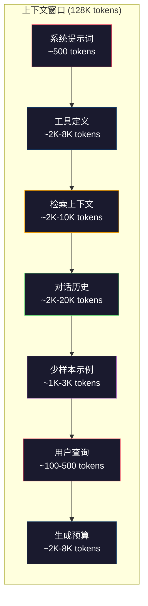
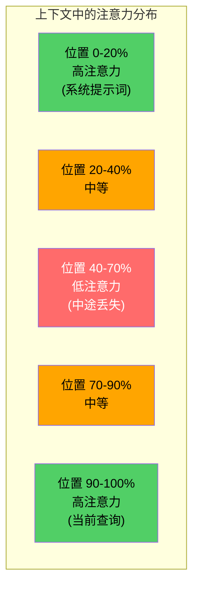
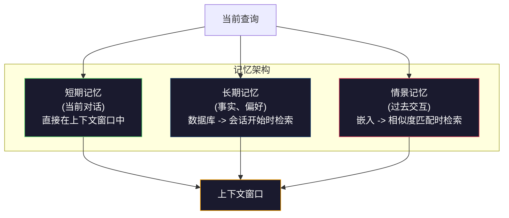

# 上下文工程：窗口、预算、记忆与检索

> 提示词工程是子集，上下文工程才是全部。提示词是你输入的一串字符串。上下文是进入模型窗口的一切：系统指令、检索到的文档、工具定义、对话历史、少样本示例以及提示词本身。2026年最顶尖的AI工程师是上下文工程师。他们决定什么放进窗口、什么留在外面、按什么顺序排列。

**类型：** 构建
**语言：** Python
**前置条件：** 阶段10（从零构建LLM）、阶段11 第01-02课
**时间：** 约90分钟
**相关：** 阶段11 · 15（提示词缓存）—— 缓存友好的布局是上下文工程的扩展。阶段5 · 28（长上下文评估）—— 了解如何用NIAH/RULER测量"中途丢失"。

## 学习目标

- 计算所有上下文窗口组件的token预算（系统提示词、工具、历史、检索文档、生成预留空间）
- 实现上下文窗口管理策略：对话历史的截断、摘要和滑动窗口
- 优先排序并排列上下文组件，以最大化模型对最相关信息注意力
- 构建上下文组装器，根据查询类型和可用窗口空间动态分配token

## 问题所在

Claude Opus 4.7 有 200K token 窗口（beta版1M）。GPT-5 有 400K。Gemini 3 Pro 有 2M。Llama 4 号称 10M。这些数字听起来巨大，直到你填满它们。

这是一个编码助手的真实分解。系统提示词：500 tokens。50个工具的定义：8,000 tokens。检索到的文档：4,000 tokens。对话历史（10轮）：6,000 tokens。当前用户查询：200 tokens。生成预算（最大输出）：4,000 tokens。总计：22,700 tokens。这仅占 128K 窗口的 18%。

但注意力并不随上下文长度线性增长。拥有 128K token 上下文的模型需要支付二次方注意力成本（vanilla transformer 中是 O(n^2)，尽管大多数生产模型使用高效的注意力变体）。更重要的是，检索准确率会下降。"干草堆中的针"测试表明，模型在长上下文中难以找到放在中间的信息。Liu 等人（2023）的研究显示，LLM 能以近乎完美的准确率检索长上下文开头和结尾的信息，但对于放在中间的信息（上下文40-70%的位置），准确率为下降10-20%。这种"中途丢失"效应因模型而异，但影响所有当前架构。

实际教训：拥有 200K token 并不意味着使用 200K token 是有效的。一个精心策划的 10K token 上下文通常胜过堆砌的 100K token 上下文。上下文工程是在上下文窗口中最大化信噪比的学科。

你放入窗口的每一个token都挤占了可能承载更相关信息的一个token。每一个无关的工具定义、每一个过时的对话轮次、每一块不能回答问题的检索文本片段——都会让模型略微降低完成任务的能力。

## 概念

### 上下文窗口是一种稀缺资源

把上下文窗口想象成RAM，而不是磁盘。它快速且可直接访问，但有限。你无法装下所有内容，你必须选择。



每个组件都在争夺空间。添加更多工具定义意味着对话历史的空间更少。添加更多检索上下文意味着少样本示例的空间更少。上下文工程是将此预算分配到最大化任务表现的艺术。

### 中途丢失

上下文工程中最重要的一项经验发现。模型更能关注上下文的开头和结尾的信息。中间的信息获得的注意力分数较低，更可能被忽略。

Liu 等人（2023）对此进行了系统性测试。他们在20个无关文档中放置一个相关文档在不同位置，并测量回答准确率。当相关文档排在第一或最后时，准确率为85-90%。当它排在中间（第10个，共20个）时，准确率下降到60-70%。

这对工程实践有直接影响：

- 把最重要的信息放在开头（系统提示词、关键指令）
- 把当前查询和最相关的上下文放在最后（近因效应有帮助）
- 将上下文的中间部分视为最低优先级区域
- 如果必须在中间包含信息，在末尾重复关键点



### 上下文组件

**系统提示词**：设定角色、约束和行为规则。它排在第一位，在各轮对话中保持不变。Claude Code 的系统提示词（包括工具定义和行为指令）大约使用 6,000 tokens。保持精简。系统提示词中的每个词都会在每次API调用中重复。

**工具定义**：每个工具增加 50-200 tokens（名称、描述、参数schema）。50个工具按每个150 tokens计算，在任何对话发生之前就已经消耗了 7,500 tokens。动态工具选择——只包含与当前查询相关的工具——可以减少 60-80%。

**检索上下文**：来自向量数据库的文档、搜索结果、文件内容。检索的质量直接决定响应的质量。糟糕的检索比不检索更糟——它用噪声填满窗口并 actively 误导模型。

**对话历史**：每个之前的用户消息和助手回复。随对话长度线性增长。50轮对话，每轮200 tokens，就有10,000 tokens的历史。其中大部分与当前查询无关。

**少样本示例**：展示期望行为的输入/输出对。两个或三个精心选择的示例，往往比数千token的指令更能提高输出质量。但它们占用空间。

**生成预算**：为模型响应保留的tokens。如果把窗口填满，模型就没有空间回答。为生成预留至少 2,000-4,000 tokens。

### 上下文压缩策略

**历史摘要**：与其逐字保留所有之前的轮次，不如定期摘要对话。"我们讨论了X，决定Y，用户想要Z"用100 tokens替换了花费2,000 tokens的10轮对话。当历史超过阈值时（例如5,000 tokens）运行摘要。

**相关性过滤**：根据当前查询对每个检索到的文档打分，丢弃低于阈值的文档。如果你检索了10个分块但只有3个相关，丢弃其他7个。有3个高度相关的分块比10个平庸的分块更好。

**工具剪枝**：分类用户查询意图，只包含与该意图相关的工具。代码问题不需要日历工具。日程问题不需要文件系统工具。这可以将工具定义从8,000 tokens减少到1,000。

**递归摘要**：对于非常长的文档，分阶段摘要。先摘要每个部分，然后摘要这些摘要。一份50页的文档可以变成500 tokens的精简摘要，捕捉关键点。

### 记忆系统

上下文工程跨越三个时间维度。

**短期记忆**：当前对话。直接存储在上下文窗口中。随每轮对话增长。通过摘要和截断管理。

**长期记忆**：跨对话持久化的事实和偏好。"用户偏好TypeScript。" "项目使用PostgreSQL。" 存储在数据库中，在会话开始时检索。Claude Code 将其存储在 CLAUDE.md 文件中。ChatGPT 将其存储在其记忆功能中。

**情景记忆**：可能相关的特定过去交互。"上周二，我们调试了auth模块中的类似问题。" 以嵌入形式存储，当当前对话与过去的情景匹配时检索。



### 动态上下文组装

关键洞察：不同的查询需要不同的上下文。静态系统提示词 + 静态工具 + 静态历史是浪费的。最好的系统针对每个查询动态组装上下文。

1. 分类查询意图
2. 选择相关工具（不是所有工具）
3. 检索相关文档（不是固定集合）
4. 包含相关历史轮次（不是全部历史）
5. 添加与任务类型匹配的少样本示例
6. 按重要性排序一切：关键在前，重要在后，可选的在中间

这就是优秀AI应用和卓越AI应用的区别。模型是相同的。上下文才是差异化因素。

```figure
lost-in-the-middle
```

## 构建它

### 步骤1：Token计数器

无法衡量就无法预算。构建一个简单的token计数器（使用空格分割的近似方法，因为精确计数取决于tokenizer）。

```python
import json
import numpy as np
from collections import OrderedDict

def count_tokens(text):
    if not text:
        return 0
    return int(len(text.split()) * 1.3)

def count_tokens_json(obj):
    return count_tokens(json.dumps(obj))
```

### 步骤2：上下文预算管理器

核心抽象。预算管理器跟踪每个组件使用的token数量并强制执行限制。

```python
class ContextBudget:
    def __init__(self, max_tokens=128000, generation_reserve=4000):
        self.max_tokens = max_tokens
        self.generation_reserve = generation_reserve
        self.available = max_tokens - generation_reserve
        self.allocations = OrderedDict()

    def allocate(self, component, content, max_tokens=None):
        tokens = count_tokens(content)
        if max_tokens and tokens > max_tokens:
            words = content.split()
            target_words = int(max_tokens / 1.3)
            content = " ".join(words[:target_words])
            tokens = count_tokens(content)

        used = sum(self.allocations.values())
        if used + tokens > self.available:
            allowed = self.available - used
            if allowed <= 0:
                return None, 0
            words = content.split()
            target_words = int(allowed / 1.3)
            content = " ".join(words[:target_words])
            tokens = count_tokens(content)

        self.allocations[component] = tokens
        return content, tokens

    def remaining(self):
        used = sum(self.allocations.values())
        return self.available - used

    def utilization(self):
        used = sum(self.allocations.values())
        return used / self.max_tokens

    def report(self):
        total_used = sum(self.allocations.values())
        lines = []
        lines.append(f"上下文预算报告 ({self.max_tokens:,} token 窗口)")
        lines.append("-" * 50)
        for component, tokens in self.allocations.items():
            pct = tokens / self.max_tokens * 100
            bar = "#" * int(pct / 2)
            lines.append(f"  {component:<25} {tokens:>6} tokens ({pct:>5.1f}%) {bar}")
        lines.append("-" * 50)
        lines.append(f"  {'已使用':<25} {total_used:>6} tokens ({total_used/self.max_tokens*100:.1f}%)")
        lines.append(f"  {'生成预留':<25} {self.generation_reserve:>6} tokens")
        lines.append(f"  {'剩余':<25} {self.remaining():>6} tokens")
        return "\n".join(lines)
```

### 步骤3：中途丢失重排序

实现重排序策略：最重要的项放开头和结尾，最不重要的放中间。

```python
def reorder_lost_in_middle(items, scores):
    paired = sorted(zip(scores, items), reverse=True)
    sorted_items = [item for _, item in paired]

    if len(sorted_items) <= 2:
        return sorted_items

    first_half = sorted_items[::2]
    second_half = sorted_items[1::2]
    second_half.reverse()

    return first_half + second_half

def score_relevance(query, documents):
    query_words = set(query.lower().split())
    scores = []
    for doc in documents:
        doc_words = set(doc.lower().split())
        if not query_words:
            scores.append(0.0)
            continue
        overlap = len(query_words & doc_words) / len(query_words)
        scores.append(round(overlap, 3))
    return scores
```

### 步骤4：对话历史压缩器

摘要旧的对话轮次以回收token预算。

```python
class ConversationManager:
    def __init__(self, max_history_tokens=5000):
        self.turns = []
        self.summaries = []
        self.max_history_tokens = max_history_tokens

    def add_turn(self, role, content):
        self.turns.append({"role": role, "content": content})
        self._compress_if_needed()

    def _compress_if_needed(self):
        total = sum(count_tokens(t["content"]) for t in self.turns)
        if total <= self.max_history_tokens:
            return

        while total > self.max_history_tokens and len(self.turns) > 4:
            old_turns = self.turns[:2]
            summary = self._summarize_turns(old_turns)
            self.summaries.append(summary)
            self.turns = self.turns[2:]
            total = sum(count_tokens(t["content"]) for t in self.turns)

    def _summarize_turns(self, turns):
        parts = []
        for t in turns:
            content = t["content"]
            if len(content) > 100:
                content = content[:100] + "..."
            parts.append(f"{t['role']}: {content}")
        return "之前: " + " | ".join(parts)

    def get_context(self):
        parts = []
        if self.summaries:
            parts.append("[对话摘要]")
            for s in self.summaries:
                parts.append(s)
        parts.append("[最近对话]")
        for t in self.turns:
            parts.append(f"{t['role']}: {t['content']}")
        return "\n".join(parts)

    def token_count(self):
        return count_tokens(self.get_context())
```

### 步骤5：动态工具选择器

只包含与当前查询相关的工具。分类意图，然后过滤。

```python
TOOL_REGISTRY = {
    "read_file": {
        "description": "读取文件内容",
        "tokens": 120,
        "categories": ["code", "files"],
    },
    "write_file": {
        "description": "向文件写入内容",
        "tokens": 150,
        "categories": ["code", "files"],
    },
    "search_code": {
        "description": "在代码库中搜索模式",
        "tokens": 130,
        "categories": ["code"],
    },
    "run_command": {
        "description": "执行shell命令",
        "tokens": 140,
        "categories": ["code", "system"],
    },
    "create_calendar_event": {
        "description": "创建新的日历事件",
        "tokens": 180,
        "categories": ["calendar"],
    },
    "list_emails": {
        "description": "列出最近的邮件",
        "tokens": 160,
        "categories": ["email"],
    },
    "send_email": {
        "description": "发送邮件消息",
        "tokens": 200,
        "categories": ["email"],
    },
    "web_search": {
        "description": "搜索网络信息",
        "tokens": 140,
        "categories": ["research"],
    },
    "query_database": {
        "description": "在数据库上运行SQL查询",
        "tokens": 170,
        "categories": ["code", "data"],
    },
    "generate_chart": {
        "description": "从数据生成图表",
        "tokens": 190,
        "categories": ["data", "visualization"],
    },
}

def classify_intent(query):
    query_lower = query.lower()

    intent_keywords = {
        "code": ["code", "function", "bug", "error", "file", "implement", "refactor", "debug", "test"],
        "calendar": ["meeting", "schedule", "calendar", "appointment", "event"],
        "email": ["email", "mail", "send", "inbox", "message"],
        "research": ["search", "find", "what is", "how does", "explain", "look up"],
        "data": ["data", "query", "database", "chart", "graph", "analytics", "sql"],
    }

    scores = {}
    for intent, keywords in intent_keywords.items():
        score = sum(1 for kw in keywords if kw in query_lower)
        if score > 0:
            scores[intent] = score

    if not scores:
        return ["code"]

    max_score = max(scores.values())
    return [intent for intent, score in scores.items() if score >= max_score * 0.5]

def select_tools(query, token_budget=2000):
    intents = classify_intent(query)
    relevant = {}
    total_tokens = 0

    for name, tool in TOOL_REGISTRY.items():
        if any(cat in intents for cat in tool["categories"]):
            if total_tokens + tool["tokens"] <= token_budget:
                relevant[name] = tool
                total_tokens += tool["tokens"]

    return relevant, total_tokens
```

### 步骤6：完整上下文组装管线

将一切串联起来。给定一个查询，动态组装最优上下文。

```python
class ContextEngine:
    def __init__(self, max_tokens=128000, generation_reserve=4000):
        self.budget = ContextBudget(max_tokens, generation_reserve)
        self.conversation = ConversationManager(max_history_tokens=5000)
        self.system_prompt = (
            "你是一个有用的AI助手。你可以使用工具进行代码编辑、文件管理、网络搜索和数据分析。"
            "为每个任务使用适当的工具。简洁且准确。"
        )
        self.knowledge_base = [
            "Python 3.12 引入了使用方括号表示法的泛型类类型参数语法。",
            "项目使用 PostgreSQL 16 配合 pgvector 进行嵌入存储。",
            "认证由 Supabase Auth 处理，使用 JWT 令牌。",
            "前端使用 Next.js 15 和 App Router 构建。",
            "API 速率限制设置为每个用户每分钟 100 次请求。",
            "部署管线使用 GitHub Actions 配合 Docker 多阶段构建。",
            "所有新模块的测试覆盖率必须高于 80%。",
            "代码库遵循仓库模式进行数据访问。",
        ]

    def assemble(self, query):
        self.budget = ContextBudget(self.budget.max_tokens, self.budget.generation_reserve)

        system_content, _ = self.budget.allocate("system_prompt", self.system_prompt, max_tokens=1000)

        tools, tool_tokens = select_tools(query, token_budget=2000)
        tool_text = json.dumps(list(tools.keys()))
        tool_content, _ = self.budget.allocate("tools", tool_text, max_tokens=2000)

        relevance = score_relevance(query, self.knowledge_base)
        threshold = 0.1
        relevant_docs = [
            doc for doc, score in zip(self.knowledge_base, relevance)
            if score >= threshold
        ]

        if relevant_docs:
            doc_scores = [s for s in relevance if s >= threshold]
            reordered = reorder_lost_in_middle(relevant_docs, doc_scores)
            doc_text = "\n".join(reordered)
            doc_content, _ = self.budget.allocate("retrieved_context", doc_text, max_tokens=3000)

        history_text = self.conversation.get_context()
        if history_text.strip():
            history_content, _ = self.budget.allocate("conversation_history", history_text, max_tokens=5000)

        query_content, _ = self.budget.allocate("user_query", query, max_tokens=500)

        return self.budget

    def chat(self, query):
        self.conversation.add_turn("user", query)
        budget = self.assemble(query)
        response = f"[回复：{query[:50]}...]"
        self.conversation.add_turn("assistant", response)
        return budget


def run_demo():
    print("=" * 60)
    print("  上下文工程管线演示")
    print("=" * 60)

    engine = ContextEngine(max_tokens=128000, generation_reserve=4000)

    print("\n--- 查询1：代码任务 ---")
    budget = engine.chat("修复auth模块中JWT令牌过早过期的bug")
    print(budget.report())

    print("\n--- 查询2：研究任务 ---")
    budget = engine.chat("在PostgreSQL中实现向量搜索的最佳方法是什么？")
    print(budget.report())

    print("\n--- 查询3：对话历史积累后 ---")
    for i in range(8):
        engine.conversation.add_turn("user", f"关于系统实现细节的跟进问题第{i+1}个")
        engine.conversation.add_turn("assistant", f"这是跟进问题{i+1}的回复，包含架构的技术细节")

    budget = engine.chat("现在实现我们讨论的更改")
    print(budget.report())

    print("\n--- 工具选择示例 ---")
    test_queries = [
        "修复auth.py中的bug",
        "安排周二与团队的会议",
        "展示数据库查询性能统计",
        "搜索错误处理的最佳实践",
    ]

    for q in test_queries:
        tools, tokens = select_tools(q)
        intents = classify_intent(q)
        print(f"\n  查询: {q}")
        print(f"  意图: {intents}")
        print(f"  工具: {list(tools.keys())} ({tokens} tokens)")

    print("\n--- 中途丢失重排序 ---")
    docs = ["文档A（最相关）", "文档B（有些相关）", "文档C（最无关）",
            "文档D（相关）", "文档E（中度相关）"]
    scores = [0.95, 0.60, 0.20, 0.80, 0.50]
    reordered = reorder_lost_in_middle(docs, scores)
    print(f"  原始顺序: {docs}")
    print(f"  分数:         {scores}")
    print(f"  重排序后:      {reordered}")
    print(f"  （最相关的在开头和结尾，最无关的在中间）")
```

## 使用它

### Harness管理的上下文

Claude Code 采用分层方式管理上下文。系统提示词包含行为规则和工具定义（约6K tokens）。当你打开文件时，其内容会被注入为上下文。当你搜索时，结果会被添加。旧的对话轮次会被摘要。CLAUDE.md 提供跨会话持久的长期记忆。

关键的工程决策：Claude Code 不会把你的整个代码库倾倒到上下文中。它按需检索相关文化。这就是上下文工程的实践。

### 动态上下文加载

Cursor 将整个代码库索引到嵌入中。当你输入查询时，它使用向量相似度检索最相关的文件和代码块。只有这些片段进入上下文窗口。50万行的代码库被压缩到最相关的5-10个代码块中。

这个模式是：嵌入所有内容，按需检索，只包含相关的。

### 助手长期记忆

ChatGPT 将用户偏好和事实存储为长期记忆。每次会话开始时，相关记忆被检索并包含在系统提示词中。"用户偏好Python"只花费5个tokens，但在跨会话中节省数百tokens的重复指令。

### RAG作为上下文工程

检索增强生成是经过形式化的上下文工程。你不是将知识塞入模型的权重（训练）或系统提示词（静态上下文）中，而是在查询时检索相关文档并将其注入上下文窗口。整个RAG管线——分块、嵌入、检索、重排序——都是为了一个目标：把正确的信息放入上下文窗口。

## 交付

本课产出 `outputs/prompt-context-optimizer.md`——一个可复用的提示词，用于审计上下文组装策略并推荐优化。输入你的系统提示词、工具数量、平均历史长度和检索策略，它会识别token浪费并提出改进建议。

它还产出 `outputs/skill-context-engineering.md`——基于任务类型、上下文窗口大小和延迟预算的设计上下文组装管线的决策框架。

## 练习

1. 为 ContextBudget 类添加一个"token浪费检测器"。它应标记使用超过预算30%的组件，并为每种组件类型建议特定的压缩策略（摘要历史、剪枝工具、重排序文档）。

2. 为检索上下文实现语义去重。如果两个检索到的文档相似度超过80%（通过词重叠或其嵌入的余弦相似度），只保留得分更高的那个。测量这回收了多少token预算。

3. 构建一个"上下文回放"工具。给定一个对话记录，通过ContextEngine回放并可视化预算分配如何逐轮变化。绘制每个组件随时间变化的token使用量。识别上下文开始被压缩的轮次。

4. 实现基于优先级的工具选择器。与其做二元包含/排除，不如为每个工具分配与当前查询的相关性分数。按降序相关性顺序包含工具，直到工具预算耗尽。比较包含5、10、20和50个工具时的任务表现。

5. 构建多策略上下文压缩器。实现三种压缩策略（截断、摘要、关键句子提取）并在20个文档集上基准测试。衡量压缩率与信息保留之间的权衡（压缩后的版本是否仍包含查询的答案？）。

## 关键术语

| 术语 | 人们说的 | 实际含义 |
|------|----------|----------|
| 上下文窗口 | "模型能读多少" | 模型在单次前向传播中处理的token最大数量（输入+输出）—— GPT-5为400K，Claude Opus 4.7为200K（beta版1M），Gemini 3 Pro为2M |
| 上下文工程 | "高级提示词工程" | 决定什么进入上下文窗口、按什么顺序、以什么优先级的学科——涵盖检索、压缩、工具选择和记忆管理 |
| 中途丢失 | "模型忘记中间的内容" | 经验发现，LLM更好地关注上下文的开头和结尾，放在中间的信息准确率下降10-20% |
| Token预算 | "还剩多少tokens" | 跨组件明确分配上下文窗口容量（系统提示词、工具、历史、检索、生成）并有每个组件的限制 |
| 动态上下文 | "即时加载内容" | 根据意图分类、相关工具选择和检索结果，为每个查询以不同方式组装上下文窗口 |
| 历史摘要 | "压缩对话" | 用简洁摘要替换逐字的旧对话轮次，在保留关键信息的同时降低token成本 |
| 工具剪枝 | "只包含相关工具" | 分类查询意图，只包含匹配的工具体定义，将工具token成本降低60-80% |
| 长期记忆 | "跨会话记住" | 存储在数据库中并在会话开始时检索的事实和偏好——CLAUDE.md、ChatGPT Memory 及类似系统 |
| 情景记忆 | "记住特定过去事件" | 以嵌入形式存储的过去交互，在当前查询与过去对话相似时检索 |
| 生成预算 | "回答的空间" | 为模型输出保留的tokens——如果上下文完全填满窗口，模型就没有空间响应 |

## 延伸阅读

- [Liu 等，2023——"迷失在中间：语言模型如何使用长上下文"](https://arxiv.org/abs/2307.03172)——关于位置依赖性注意力的权威研究，表明模型在长上下文中间的信息处理上有困难
- [Anthropic的上下文检索博客文章](https://www.anthropic.com/news/contextual-retrieval)——Anthropic如何处理上下文感知的分块检索，将检索失败减少49%
- [Simon Willison的"上下文工程"](https://simonwillison.net/2025/Jun/27/context-engineering/)——命名该学科并将其与提示词工程区分开的博客文章
- [LangChain关于RAG的文档](https://python.langchain.com/docs/tutorials/rag/)——检索增强生成作为上下文工程模式的实际实现
- [Greg Kamradt的干草堆中的针测试](https://github.com/gkamradt/LLMTest_NeedleInAHaystack)——揭示所有主流模型位置依赖性检索失败基准
- [Pope 等，《高效缩放Transformer推理》(2022)](https://arxiv.org/abs/2211.05102)——为什么上下文长度驱动内存和延迟，以及KV cache、MQA和GQA如何改变预算计算
- [Agrawal 等，《SARATHI：通过拼接解码与分块预填充实现高效LLM推理》(2023)](https://arxiv.org/abs/2308.16369)——使长提示词在TTFT中昂贵但在TPOT中便宜的两阶段推理；上下文打包权衡背后的真相
- [Ainslie 等，《GQA：从多头检查点训练广义多查询Transformer模型》(EMNLP 2023)](https://arxiv.org/abs/2305.13245)——分组查询注意力论文，在不损失质量的情况下将生产解码器中的KV内存减少8倍
