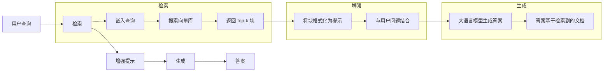
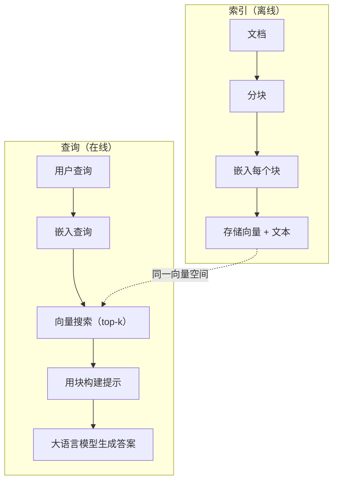

# RAG（检索增强生成）

> 你的大语言模型知道截至其训练截止日期的所有知识。但它对公司文档、代码库或上周的会议记录一无所知。RAG 通过检索相关文档并将它们塞入提示中来解决这个问题。它是生产 AI 中部署最多的模式。如果你从这门课程中只构建一样东西，那就构建一个 RAG 管道。

**类型：** 构建
**语言：** Python
**前置条件：** 阶段 10（从零开始的大语言模型），阶段 11 课程 01-05
**时间：** 约 90 分钟
**相关内容：** 阶段 5 · 23（RAG 的分块策略），了解六种分块算法及其适用场景。阶段 5 · 22（嵌入模型深入分析），用于选择嵌入器。阶段 11 · 07（高级 RAG），了解混合搜索、重排序和查询转换。

## 学习目标

- 构建完整的 RAG 管道：文档加载、分块、嵌入、向量存储、检索和生成
- 使用向量数据库（ChromaDB、FAISS 或 Pinecone）通过适当的索引实现语义搜索
- 解释为什么 RAG 在知识驱动的应用中比微调更受青睐（成本、新鲜度、可追溯性）
- 使用检索指标（精确率、召回率）和生成指标（忠实度、相关性）来评估 RAG 质量

## 问题

你为公司构建了一个聊天机器人。客户问：“企业计划的退款政策是什么？”大语言模型给出了一个关于典型 SaaS 退款政策的通用回答。然而，实际政策隐藏在一份 200 页的内部 Wiki 中，规定企业客户有 60 天的退款窗口，按比例退还。大语言模型从未见过这份文档。它无法知道训练中没有的内容。

微调是一种解决方案。获取大语言模型，在其内部文档上进行训练，然后部署更新后的模型。这可行，但存在严重问题。微调需要数千美元的算力成本。模型一旦文档变更就会过时。你无法知道模型引用了哪些来源。如果公司下个月收购了另一条产品线，你就需要再次微调。

RAG 是另一种解决方案。保持模型不变。当问题进来时，在文档库中搜索相关段落，将它们粘贴到问题之前的提示中，让模型使用这些段落作为上下文来回答。文档库可以在几分钟内更新。你可以清楚地看到检索了哪些文档。模型本身从不改变。这就是为什么 RAG 在生产环境中占主导地位：它更便宜、更新鲜、更易审计，并且适用于任何大语言模型。

## 概念

### RAG 模式

整个模式包含四个步骤：



查询 -> 检索 -> 增强提示 -> 生成。每个 RAG 系统都遵循这个模式。生产级 RAG 系统之间的差异在于每个步骤的细节：如何分块、如何嵌入、如何搜索以及如何构建提示。

### 为什么 RAG 优于微调

| 关注点 | 微调 | RAG |
|---------|------------|-----|
| 成本 | 每次训练 $1,000-$100,000+ | 每次查询 $0.01-$0.10（嵌入 + 大语言模型） |
| 新鲜度 | 直到重新训练前一直是旧的 | 通过重新索引文档在几分钟内更新 |
| 可审计性 | 无法追溯答案来源 | 可以显示确切的检索段落 |
| 幻觉 | 仍然自由地产生幻觉 | 基于检索到的文档 |
| 数据隐私 | 训练数据固化在权重中 | 文档保留在你的向量库中 |

微调永久性地改变模型的权重。RAG 临时性地改变模型的上下文。对于大多数应用来说，临时上下文正是你所需要的。

微调获胜的唯一情况是：当你需要模型采用一种特定的风格、语气或推理模式，而仅通过提示无法实现时。对于事实性知识检索，RAG 每次都胜出。

### 嵌入模型

嵌入模型将文本转换为稠密向量。相似的文本在这个高维空间中会产生相近的向量。“如何重置我的密码？”和“我需要更改我的密码”尽管共享的词语很少，却会产生几乎相同的向量。“猫坐在垫子上”会产生完全不同的向量。

常见的嵌入模型（2026 年阵容 — 完整分析见阶段 5 · 22）：

| 模型 | 维度 | 提供商 | 备注 |
|-------|-----------|----------|-------|
| text-embedding-3-small | 1536（嵌套） | OpenAI | 大多数用例中性价比最佳 |
| text-embedding-3-large | 3072（嵌套） | OpenAI | 更高精度，可截断至 256/512/1024 |
| Gemini Embedding 2 | 3072（嵌套） | Google | MTEB 检索顶尖；8K 上下文 |
| voyage-4 | 1024/2048（嵌套） | Voyage AI | 领域变体（代码、金融、法律） |
| Cohere embed-v4 | 1024（嵌套） | Cohere | 强大的多语言能力，128K 上下文 |
| BGE-M3 | 1024（稠密 + 稀疏 + ColBERT） | BAAI（开源权重） | 一个模型的三种视图 |
| Qwen3-Embedding | 4096（嵌套） | 阿里巴巴（开源权重） | 开源权重检索得分顶尖 |
| all-MiniLM-L6-v2 | 384 | 开源权重（Sentence Transformers） | 原型设计基线 |

在本课中，我们使用 TF-IDF 构建自己的简单嵌入。并非因为生产系统使用 TF-IDF，而是因为它使概念具体化：文本输入，向量输出，相似文本产生相似向量。

### 向量相似度

给定两个向量，如何衡量相似度？有三种选项：

**余弦相似度**：两个向量之间夹角的余弦值。范围从 -1（相反）到 1（相同）。忽略幅度，只关心方向。这是 RAG 的默认选项。

```
cosine_sim(a, b) = dot(a, b) / (||a|| * ||b||)
```

**点积**：原始的内积。较大的向量获得更高的分数。当幅度携带信息时有用（较长的文档可能更相关）。

```
dot(a, b) = sum(a_i * b_i)
```

**L2（欧几里得）距离**：向量空间中的直线距离。较小的距离 = 更相似。对幅度差异敏感。

```
L2(a, b) = sqrt(sum((a_i - b_i)^2))
```

余弦相似度是标准做法。它能优雅地处理不同长度的文档，因为它通过幅度进行归一化。当有人提到“向量搜索”时，他们几乎总是指余弦相似度。

### 分块策略

文档太长，无法作为单个向量嵌入。一份 50 页的 PDF 可能会产生很差的嵌入，因为它包含几十个主题。相反，你将文档分割成块并分别嵌入每个块。

**固定大小分块**：每 N 个 token 分割一次。简单且可预测。一个 512 token 的块，重叠 50 token，意味着块 1 是 token 0-511，块 2 是 token 462-973，依此类推。重叠确保你不会在不合适的边界处分割句子。

**语义分块**：在自然边界处分割。段落、章节或 markdown 标题。每个块都是一个连贯的意义单元。实现更复杂，但能产生更好的检索结果。

**递归分块**：首先尝试在最大的边界处分割（章节标题）。如果章节仍然太大，则在段落边界处分割。如果段落仍然太大，则在句子边界处分割。这是 LangChain RecursiveCharacterTextSplitter 方法，在实践中效果良好。

分块大小比人们想象的重要得多：

- 太小（64-128 token）：每个块缺乏上下文。“它在去年季度增长了 15%”，如果没有知道“它”指的是什么，这句话毫无意义。
- 太大（2048+ token）：每个块涵盖多个主题，稀释了相关性。当你搜索收入数据时，你会得到一个 10% 关于收入、90% 关于人员数量的块。
- 理想大小（256-512 token）：有足够的上下文自包含，又足够专注以相关。

大多数生产级 RAG 系统使用 256-512 token 的块，重叠 50 token。Anthropic 的 RAG 指南推荐这个范围。

### 向量数据库

一旦有了嵌入，你需要一个地方来存储和搜索它们。选项：

| 数据库 | 类型 | 最佳用途 |
|----------|------|----------|
| FAISS | 库（进程内） | 原型设计，小到中等数据集 |
| Chroma | 轻量级数据库 | 本地开发，小型部署 |
| Pinecone | 托管服务 | 无需运维开销的生产环境 |
| Weaviate | 开源数据库 | 自托管生产 |
| pgvector | Postgres 扩展 | 已在使用 Postgres |
| Qdrant | 开源数据库 | 高性能自托管 |

在本课中，我们构建一个简单的内存向量存储。它在列表中存储向量并进行暴力余弦相似度搜索。这等同于使用平铺索引的 FAISS。它在扩展到大约 100,000 个向量之前会开始变慢。生产系统使用近似最近邻（ANN）算法，如 HNSW，在毫秒内搜索数百万个向量。

### 完整管道



索引阶段针对每个文档运行一次（或当文档更新时）。查询阶段在每个用户请求上运行。在生产环境中，索引可能在几小时内处理数百万个文档。查询必须在不到一秒的时间内响应。

### 实际数字

大多数生产级 RAG 系统使用这些参数：

- **k = 5 到 10** 每次查询检索的块数
- **块大小 = 256 到 512 token**，重叠 50 token
- **上下文预算**：每次查询 2,500-5,000 token 的检索内容
- **总提示**：约 8,000-16,000 token（系统提示 + 检索块 + 对话历史 + 用户查询）
- **嵌入维度**：384-3072，取决于模型
- **索引吞吐量**：使用 API 嵌入时每秒 100-1,000 个文档
- **查询延迟**：检索 50-200ms，生成 500-3000ms

```figure
rag-chunking
```

## 构建它

### 步骤 1：文档分块

```python
def chunk_text(text, chunk_size=200, overlap=50):
    # 将文本分割成块
    words = text.split()
    chunks = []
    start = 0
    while start < len(words):
        end = start + chunk_size
        chunk = " ".join(words[start:end])
        chunks.append(chunk)
        start += chunk_size - overlap
    return chunks
```

### 步骤 2：TF-IDF 嵌入

我们构建一个简单的嵌入函数。TF-IDF（词频-逆文档频率）不是神经嵌入，但它以捕捉词重要性的方式将文本转换为向量。文档中频繁出现的词获得更高的 TF。在整个语料库中罕见的词获得更高的 IDF。乘积给出一个向量，其中重要、独特的词具有较高的值。

```python
import math
from collections import Counter

def build_vocabulary(documents):
    # 构建词汇表
    vocab = set()
    for doc in documents:
        vocab.update(doc.lower().split())
    return sorted(vocab)

def compute_tf(text, vocab):
    # 计算词频
    words = text.lower().split()
    count = Counter(words)
    total = len(words)
    return [count.get(word, 0) / total for word in vocab]

def compute_idf(documents, vocab):
    # 计算逆文档频率
    n = len(documents)
    idf = []
    for word in vocab:
        doc_count = sum(1 for doc in documents if word in doc.lower().split())
        idf.append(math.log((n + 1) / (doc_count + 1)) + 1)
    return idf

def tfidf_embed(text, vocab, idf):
    # 计算 TF-IDF 嵌入
    tf = compute_tf(text, vocab)
    return [t * i for t, i in zip(tf, idf)]
```

### 步骤 3：余弦相似度搜索

```python
def cosine_similarity(a, b):
    # 计算两个向量的余弦相似度
    dot = sum(x * y for x, y in zip(a, b))
    norm_a = math.sqrt(sum(x * x for x in a))
    norm_b = math.sqrt(sum(x * x for x in b))
    if norm_a == 0 or norm_b == 0:
        return 0.0
    return dot / (norm_a * norm_b)

def search(query_embedding, stored_embeddings, top_k=5):
    # 搜索最相似的 k 个块
    scores = []
    for i, emb in enumerate(stored_embeddings):
        sim = cosine_similarity(query_embedding, emb)
        scores.append((i, sim))
    scores.sort(key=lambda x: x[1], reverse=True)
    return scores[:top_k]
```

### 步骤 4：提示构建

这就是 RAG 中“增强”发生的地方。取回检索到的块，将它们格式化为提示，并让大语言模型基于提供的上下文回答问题。

```python
def build_rag_prompt(query, retrieved_chunks):
    # 将检索到的块格式化为提示
    context = "\n\n---\n\n".join(
        f"[来源 {i+1}]\n{chunk}"
        for i, chunk in enumerate(retrieved_chunks)
    )
    return f"""仅基于以下上下文回答问题。
如果上下文不包含足够的信息，请说“我没有足够的信息来回答这个问题。”

上下文：
{context}

问题：{query}

答案："""
```

### 步骤 5：完整的 RAG 管道

```python
class RAGPipeline:
    def __init__(self):
        self.chunks = []
        self.embeddings = []
        self.vocab = []
        self.idf = []

    def index(self, documents):
        # 对文档进行索引
        all_chunks = []
        for doc in documents:
            all_chunks.extend(chunk_text(doc))
        self.chunks = all_chunks
        self.vocab = build_vocabulary(all_chunks)
        self.idf = compute_idf(all_chunks, self.vocab)
        self.embeddings = [
            tfidf_embed(chunk, self.vocab, self.idf)
            for chunk in all_chunks
        ]

    def query(self, question, top_k=5):
        # 查询管道
        query_emb = tfidf_embed(question, self.vocab, self.idf)
        results = search(query_emb, self.embeddings, top_k)
        retrieved = [(self.chunks[i], score) for i, score in results]
        prompt = build_rag_prompt(
            question, [chunk for chunk, _ in retrieved]
        )
        return prompt, retrieved
```

### 步骤 6：生成（模拟）

在生产中，这是你调用大语言模型 API 的地方。在本课中，我们通过从检索到的上下文中提取最相关的句子来模拟生成。

```python
def simple_generate(prompt, retrieved_chunks):
    # 简单的生成模拟
    query_words = set(prompt.lower().split("问题：")[-1].split())
    best_sentence = ""
    best_score = 0
    for chunk in retrieved_chunks:
        for sentence in chunk.split("。"):
            sentence = sentence.strip()
            if not sentence:
                continue
            words = set(sentence.lower().split())
            overlap = len(query_words & words)
            if overlap > best_score:
                best_score = overlap
                best_sentence = sentence
    return best_sentence if best_sentence else "我没有足够的信息来回答这个问题。"
```

## 使用它

使用真实的嵌入模型和大语言模型，代码几乎不变：

```python
from openai import OpenAI

client = OpenAI()

def embed(text):
    response = client.embeddings.create(
        model="text-embedding-3-small",
        input=text
    )
    return response.data[0].embedding

def generate(prompt):
    response = client.chat.completions.create(
        model="gpt-4o-mini",
        messages=[{"role": "user", "content": prompt}],
        temperature=0
    )
    return response.choices[0].message.content
```

或使用 Anthropic：

```python
import anthropic

client = anthropic.Anthropic()

def generate(prompt):
    response = client.messages.create(
        model="claude-sonnet-5",
        max_tokens=1024,
        messages=[{"role": "user", "content": prompt}]
    )
    return response.content[0].text
```

管道是相同的。替换嵌入函数。替换生成函数。检索逻辑、分块、提示构建——无论使用哪个模型，都完全相同。

对于大规模向量存储，用合适的向量数据库替换暴力搜索：

```python
import chromadb

client = chromadb.Client()
collection = client.create_collection("my_docs")

collection.add(
    documents=chunks,
    ids=[f"chunk_{i}" for i in range(len(chunks))]
)

results = collection.query(
    query_texts=["退款政策是什么？"],
    n_results=5
)
```

Chroma 内部处理嵌入（默认使用 all-MiniLM-L6-v2）并将向量存储在本地数据库中。相同的模式，不同的底层实现。

## 交付成果

本课产生：
- `outputs/prompt-rag-architect.md` —— 为特定用例设计 RAG 系统的提示
- `outputs/skill-rag-pipeline.md` —— 教导智能体如何构建和调试 RAG 管道的技能

## 练习

1. 用简单的词袋方法（二进制：词存在为 1，不存在为 0）替换 TF-IDF 嵌入。比较样本文档上的检索质量。TF-IDF 应该表现更好，因为它给罕见词赋予更高权重。

2. 实验不同的块大小：在同一文档集上尝试 50、100、200 和 500 个词的块大小。对于每种大小，运行相同的 5 个查询，并计算有多少个在前 3 个结果中返回了相关块。找到检索质量达到峰值的理想大小。

3. 为每个块添加元数据（源文档名称、块位置）。修改提示模板以包含来源归属，以便大语言模型引用其来源。

4. 实现一个简单的评估：给定 10 个问答对，将每个问题通过 RAG 管道运行，并计算检索到的块中包含答案的百分比。这是在 k 处的检索召回率。

5. 构建对话感知的 RAG 管道：维护最近 3 次交互的历史记录，并在提示中与检索到的块一起包含它们。用后续问题如询问价格后问“企业计划呢？”进行测试。

## 关键术语

| 术语 | 人们说的 | 实际含义 |
|------|----------------------|-----------------------------------------------|
| RAG | “阅读你文档的 AI” | 检索相关文档，将它们粘贴到提示中，并基于这些文档生成答案 |
| 嵌入 | “将文本转换为数字” | 文本的稠密向量表示，相似含义产生相似向量 |
| 向量数据库 | “AI 的搜索引擎” | 优化存储向量和通过相似度查找最近邻的数据存储 |
| 分块 | “将文档分割成片段” | 将文档分解成较小的段（通常为 256-512 token），以便每个可以独立嵌入和检索 |
| 余弦相似度 | “两个向量有多相似” | 两个向量之间夹角的余弦值；1 = 方向相同，0 = 正交，-1 = 相反 |
| Top-k 检索 | “获取最好的 k 个匹配” | 从向量库中返回与查询最相似的 k 个块 |
| 上下文窗口 | “大语言模型能看到多少文本” | 大语言模型在单次请求中能处理的最大 token 数；检索到的块必须适合这个窗口 |
| 增强生成 | “使用给定上下文回答” | 使用检索到的文档作为上下文而不是仅依赖训练知识来生成响应 |
| TF-IDF | “词重要性评分” | 词频乘以逆文档频率；根据词在语料库中的独特性对词进行加权 |
| 索引 | “为搜索准备文档” | 离线过程，包括分块、嵌入和存储文档，以便在查询时可以搜索 |

## 延伸阅读

- Lewis 等人，《检索增强生成用于知识密集型 NLP 任务》（2020）—— Facebook AI Research 的原始 RAG 论文，形式化了检索然后生成的模式
- Anthropic 的 RAG 文档（docs.anthropic.com）—— 关于块大小、提示构建和评估的实践指南
- Pinecone 学习中心，《什么是 RAG？》—— 清晰的 RAG 管道可视化解释及生产考虑
- Sentence-BERT：Reimers & Gurevych（2019）—— all-MiniLM 嵌入模型背后的论文，展示如何训练双编码器进行语义相似度
- [Karpukhin 等人，《开放域问答的密集段落检索》（EMNLP 2020）](https://arxiv.org/abs/2004.04906) —— 证明密集双编码器检索在开放域 QA 上击败 BM25 的 DPR 论文，并为现代 RAG 检索器设定了模式。
- [LlamaIndex 高级概念](https://docs.llamaindex.ai/en/stable/getting_started/concepts.html) —— 构建 RAG 管道时需要了解的主要概念：数据加载器、节点解析器、索引、检索器、响应合成器。
- [LangChain RAG 教程](https://python.langchain.com/docs/tutorials/rag/) —— 另一种风格的编排器；相同检索然后生成模式的链式 Runnable 视图。
