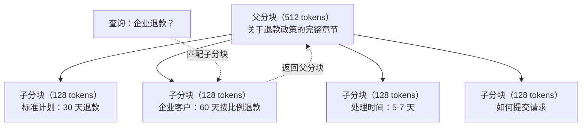
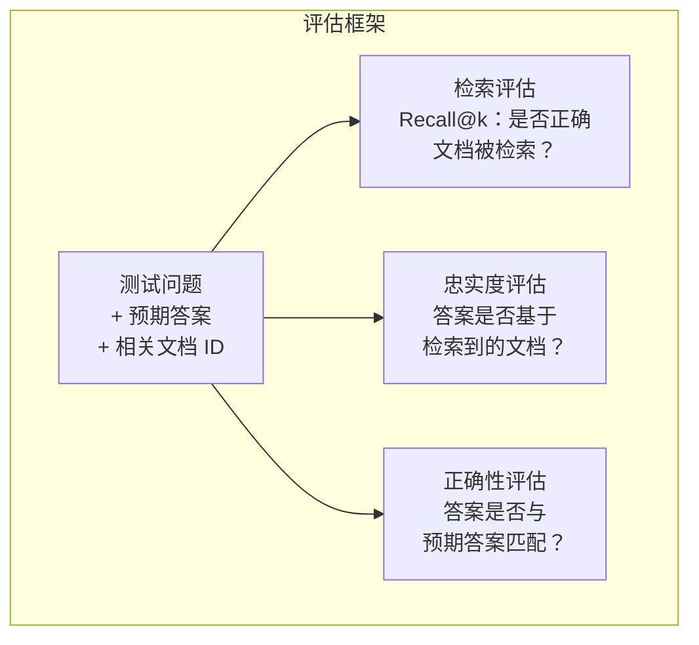

# 高级 RAG（分块、重排序、混合搜索）

> 基础 RAG 检索最相似的 top-k 个分块。这对简单问题有效，但在多跳推理、模糊查询和大型语料库中就会失效。高级 RAG 决定了 demo 能处理 10 份文档还是 1000 万份文档。

**类型：** 构建
**语言：** Python
**前置知识：** 第 11 阶段，第 06 课（RAG）
**时间：** 约 90 分钟
**相关：** 第 5 阶段 · 23（RAG 的分块策略）涵盖所有六种分块算法——递归、语义、句子、父子、延迟分块、上下文检索——并附有 Vectara/Anthropic 的基准测试结果。本课在此基础上扩展：混合搜索、重排序、查询转换。

## 学习目标

- 实现高级分块策略（语义、递归、父子），保留文档结构和上下文
- 构建混合搜索管道，结合 BM25 关键词匹配、语义向量搜索和交叉编码器重排序
- 应用查询转换技术（HyDE、多查询、后退步）来提高模糊或复杂问题的检索效果
- 诊断并修复常见 RAG 故障：检索到错误分块、答案不在上下文中、多跳推理崩溃

## 问题所在

你在第 06 课构建了一个基础 RAG 管道。它对小型语料库上的直接问题有效。现在试试这些：

**模糊查询**："上个季度的收入是多少？"语义搜索返回关于收入策略、收入预测和 CFO 对收入增长看法的分块。它们都与"revenue"这个词语义相似，但没有一个包含实际数字。正确的分块说"2025年Q3收入4720万美元"，但使用的是"earnings"而非"revenue"。嵌入模型认为"收入策略"比"Q3收入4720万美元"更接近查询。

**多跳问题**："哪个团队的客户满意度评分提升最高？"这需要找到每个团队的满意度评分，比较它们，找出最大值。没有一个分块包含完整答案。信息分散在团队报告中。

**大规模语料库问题**：你有 200 万个分块。正确答案在第 1,847,293 号分块中。你的 top-5 检索结果拉取了第 14、89,201、1,200,000、44 和 901,333 号分块。在嵌入空间中很接近，但没有一个包含答案。在这个规模上，近似最近邻搜索引入的误差足够大，导致相关结果被挤出 top-k。

基础 RAG 失败是因为向量相似度不等于相关性。一个分块可能与查询语义相似，但对回答问题没有帮助。高级 RAG 通过四种技术解决此问题：混合搜索（添加关键词匹配）、重排序（更仔细地评分候选项）、查询转换（搜索前修复查询）和更好的分块（在正确的粒度检索）。

## 概念讲解

### 混合搜索：语义 + 关键词

语义搜索（向量相似度）擅长理解含义。"如何取消订阅？"可以匹配"终止计划的步骤"，即使它们没有共享任何词汇。但它会遗漏精确匹配。"错误代码 E-4021"可能不会匹配包含"E-4021"的分块，如果嵌入模型将其视为噪声。

关键词搜索（BM25）正好相反。它擅长精确匹配。"E-4021"完美匹配。但如果文档说"终止计划"，"取消订阅"会返回零结果。

混合搜索同时运行两者，然后合并结果。

**BM25**（Best Matching 25）是标准的关键词搜索算法。自 1990 年代以来一直是搜索引擎的核心。公式如下：

```
BM25(q, d) = sum over terms t in q:
    IDF(t) * (tf(t,d) * (k1 + 1)) / (tf(t,d) + k1 * (1 - b + b * |d| / avgdl))
```

其中 tf(t,d) 是文档 d 中 term t 的词频，IDF(t) 是逆文档频率，|d| 是文档长度，avgdl 是平均文档长度，k1 控制词频饱和（默认 1.2），b 控制长度归一化（默认 0.75）。

用通俗的话说：BM25 对包含查询词（尤其是稀有词）的文档给予更高评分，但随着重复出现，回报递减。包含 50 次"收入"的文档并不比包含一次的文档相关 50 倍。

### 互惠等级融合（RRF）

你有两个排名列表：一个来自向量搜索，一个来自 BM25。如何合并它们？互惠等级融合是标准方法。

```
RRF_score(d) = sum over rankings R:
    1 / (k + rank_R(d))
```

其中 k 是常数（通常为 60），用于防止排名最高的结果占主导。

在向量搜索中排名第 1、在 BM25 中排名第 5 的文档得分：1/(60+1) + 1/(60+5) = 0.0164 + 0.0154 = 0.0318

在向量搜索中排名第 3、在 BM25 中排名第 2 的文档得分：1/(60+3) + 1/(60+2) = 0.0159 + 0.0161 = 0.0320

RRF 自然地平衡两种信号。在两个列表中都排名靠前的文档获得最佳得分。在一个列表中排名第 1 但在另一个列表中不存在的文档获得中等得分。这很稳健，因为它使用等级而非原始分数，因此两个系统之间的分数分布差异无关紧要。

### 重排序

检索（无论是向量、关键词还是混合）快速但不精确。它使用双编码器：查询和每个文档独立嵌入，然后比较。嵌入只计算一次并缓存。这可以扩展到数百万文档。

重排序使用交叉编码器：查询和候选文档一起输入模型，输出相关性分数。模型同时看到两种文本，可以捕捉它们之间的细粒度交互。交叉编码器可以理解"Q3 收入是多少？"与包含"$47.2M in Q3"的分块高度相关，即使双编码器错过了这种关联。

权衡在于：交叉编码器比双编码器慢 100-1000 倍，因为它们联合处理查询-文档对。你不能为 100 万文档预计算交叉编码器分数。解决方案：检索更大的候选集（来自混合搜索的 top-50），然后用交叉编码器重排序以获得最终 top-5。


常见的重排序模型（2026 年阵容）：
- Cohere Rerank 3.5：托管 API，多语言，混合语料库召回增益最佳
- Voyage rerank-2.5：托管 API，托管选项中延迟最低
- Jina-Reranker-v2 Multilingual：开源权重，支持 100+ 语言
- bge-reranker-v2-m3：开源权重，强基线
- cross-encoder/ms-marco-MiniLM-L-6-v2：开源权重，可在 CPU 上运行用于原型开发
- ColBERTv2 / Jina-ColBERT-v2：后期交互多向量重排序器——评分时 O(tokens) 而非 O(docs)

### 查询转换

有时问题不在于检索，而在于查询本身。"关于新政策变化的那件事是什么？"是一个糟糕的搜索查询。它不包含任何具体词汇。嵌入很模糊。没有检索系统能从这种情况中找到正确的文档。

**查询重写**：将用户的查询重新表述为更好的搜索查询。LLM 可以做到：

```
用户："关于新政策变化的那件事是什么？"
重写后："最新的政策变更和更新"
```

**HyDE（假设文档嵌入）**：不是用查询搜索，而是生成一个假设答案，嵌入它，然后搜索与之相似的真正文档。

```
查询："企业客户的退款政策是什么？"
假设答案："企业客户在购买后 60 天内有资格获得全额退款。
退款根据剩余订阅期按比例计算，并在 5-7 个工作日内处理。"
```

嵌入假设答案并搜索与其相似的真正文档。直觉是：假设答案在嵌入空间中比原始问题更接近真实答案。问题和答案具有不同的语言结构。通过生成假设答案，你在嵌入中 bridging "问题空间"和"答案空间"之间的差距。

HyDE 在检索前增加一次 LLM 调用。这会增加 500-2000ms 的延迟。当原始查询的检索质量较差时值得这样做。

### 父子分块

标准分块强制一种权衡：小而精确的检索用小分块，足够上下文用大分块。父子分块消除了这种权衡。

索引小分块（128 tokens）用于检索。当一个小分块被检索到时，返回其父分块（512 tokens）用于提示词。小分块精确匹配查询。父分块提供足够的上下文让 LLM 生成好答案。



查询"企业退款？"精确匹配子分块 C2。但提示词接收完整的父分块 P，其中包含关于处理时间和提交流程的上下文。

### 元数据过滤

在运行向量搜索之前，按元数据过滤语料库：日期、来源、类别、作者、语言。这减少了搜索空间并防止不相关的结果。

"安全政策上个月有什么变化？"应该只搜索过去 30 天内安全类别的文档。没有元数据过滤，你会搜索整个语料库，可能会检索到恰好语义相似的两个月前安全文档。

生产级 RAG 系统在分块旁边存储元数据：源文档、创建日期、类别、作者、版本。向量数据库支持在相似度搜索之前按元数据预过滤，这对于规模化的性能至关重要。

### 评估

你构建了一个 RAG 系统。你怎么知道它是否工作？三个指标：

**检索相关性（Recall@k）**：对于一组已知相关文档的测试问题，相关文档出现在 top-k 结果中的百分比是多少？如果问题的答案在第 47 号分块中，第 47 号分块是否出现在 top-5 中？

**忠实度**：生成的答案是否基于检索到的文档？如果检索到的分块说"60 天退款窗口"而模型说"90 天退款窗口"，那就是忠实度失败。模型在有正确上下文的情况下仍然产生了幻觉。

**答案正确性**：生成的答案是否与预期答案匹配？这是端到端指标。它结合检索质量和生成质量。

一个简单的忠实度检查：取出生成答案中的每个声明，验证它是否在检索到的分块中出现（实质内容）。如果答案包含任何检索分块中不存在的事实，它可能是幻觉出来的。



```figure
agentic-rag-loop
```

## 动手构建

### 第 1 步：BM25 实现

```python
import math
from collections import Counter

class BM25:
    def __init__(self, k1=1.2, b=0.75):
        self.k1 = k1
        self.b = b
        self.docs = []
        self.doc_lengths = []
        self.avg_dl = 0
        self.doc_freqs = {}
        self.n_docs = 0

    def index(self, documents):
        self.docs = documents
        self.n_docs = len(documents)
        self.doc_lengths = []
        self.doc_freqs = {}

        for doc in documents:
            words = doc.lower().split()
            self.doc_lengths.append(len(words))
            unique_words = set(words)
            for word in unique_words:
                self.doc_freqs[word] = self.doc_freqs.get(word, 0) + 1

        self.avg_dl = sum(self.doc_lengths) / self.n_docs if self.n_docs else 1

    def score(self, query, doc_idx):
        query_words = query.lower().split()
        doc_words = self.docs[doc_idx].lower().split()
        doc_len = self.doc_lengths[doc_idx]
        word_counts = Counter(doc_words)
        score = 0.0

        for term in query_words:
            if term not in word_counts:
                continue
            tf = word_counts[term]
            df = self.doc_freqs.get(term, 0)
            idf = math.log((self.n_docs - df + 0.5) / (df + 0.5) + 1)
            numerator = tf * (self.k1 + 1)
            denominator = tf + self.k1 * (1 - self.b + self.b * doc_len / self.avg_dl)
            score += idf * numerator / denominator

        return score

    def search(self, query, top_k=10):
        scores = [(i, self.score(query, i)) for i in range(self.n_docs)]
        scores.sort(key=lambda x: x[1], reverse=True)
        return scores[:top_k]
```

### 第 2 步：互惠等级融合

```python
def reciprocal_rank_fusion(ranked_lists, k=60):
    scores = {}
    for ranked_list in ranked_lists:
        for rank, (doc_id, _) in enumerate(ranked_list):
            if doc_id not in scores:
                scores[doc_id] = 0.0
            scores[doc_id] += 1.0 / (k + rank + 1)
    fused = sorted(scores.items(), key=lambda x: x[1], reverse=True)
    return fused
```

### 第 3 步：混合搜索管道

```python
def hybrid_search(query, chunks, vector_embeddings, vocab, idf, bm25_index, top_k=5, fusion_k=60):
    query_emb = tfidf_embed(query, vocab, idf)
    vector_results = search(query_emb, vector_embeddings, top_k=top_k * 3)
    bm25_results = bm25_index.search(query, top_k=top_k * 3)
    fused = reciprocal_rank_fusion([vector_results, bm25_results], k=fusion_k)
    return fused[:top_k]
```

### 第 4 步：简单重排序器

在生产中，你会使用交叉编码器模型。这里我们构建一个使用词重叠、词重要性和短语匹配来评分查询-文档相关性的重排序器。

```python
def rerank(query, candidates, chunks):
    query_words = set(query.lower().split())
    stop_words = {"the", "a", "an", "is", "are", "was", "were", "what", "how",
                  "why", "when", "where", "do", "does", "for", "of", "in", "to",
                  "and", "or", "on", "at", "by", "it", "its", "this", "that",
                  "with", "from", "be", "has", "have", "had", "not", "but"}
    query_terms = query_words - stop_words

    scored = []
    for doc_id, initial_score in candidates:
        chunk = chunks[doc_id].lower()
        chunk_words = set(chunk.split())

        term_overlap = len(query_terms & chunk_words)

        query_bigrams = set()
        q_list = [w for w in query.lower().split() if w not in stop_words]
        for i in range(len(q_list) - 1):
            query_bigrams.add(q_list[i] + " " + q_list[i + 1])
        bigram_matches = sum(1 for bg in query_bigrams if bg in chunk)

        position_boost = 0
        for term in query_terms:
            pos = chunk.find(term)
            if pos != -1 and pos < len(chunk) // 3:
                position_boost += 0.5

        rerank_score = (
            term_overlap * 1.0
            + bigram_matches * 2.0
            + position_boost
            + initial_score * 5.0
        )
        scored.append((doc_id, rerank_score))

    scored.sort(key=lambda x: x[1], reverse=True)
    return scored
```

### 第 5 步：HyDE（假设文档嵌入）

```python
def hyde_generate_hypothesis(query):
    templates = {
        "what": "关于'{query}'的答案如下：根据我们的文档，{topic}涉及定义流程如何工作的具体政策和程序。",
        "how": "解决'{query}'：该流程涉及多个步骤。首先，你需要发起请求。然后，系统按照定义的规则处理它。",
        "default": "关于'{query}'：我们的记录表明与此主题相关的具体细节和政策，提供全面的答案。"
    }
    query_lower = query.lower()
    if query_lower.startswith("what"):
        template = templates["what"]
    elif query_lower.startswith("how"):
        template = templates["how"]
    else:
        template = templates["default"]

    topic_words = [w for w in query.lower().split()
                   if w not in {"what", "is", "the", "how", "do", "does", "a", "an",
                                "for", "of", "to", "in", "on", "at", "by", "and", "or"}]
    topic = " ".join(topic_words) if topic_words else "this topic"

    return template.format(query=query, topic=topic)


def hyde_search(query, chunks, vector_embeddings, vocab, idf, top_k=5):
    hypothesis = hyde_generate_hypothesis(query)
    hypothesis_emb = tfidf_embed(hypothesis, vocab, idf)
    results = search(hypothesis_emb, vector_embeddings, top_k)
    return results, hypothesis
```

### 第 6 步：父子分块

```python
def create_parent_child_chunks(text, parent_size=200, child_size=50):
    words = text.split()
    parents = []
    children = []
    child_to_parent = {}

    parent_idx = 0
    start = 0
    while start < len(words):
        parent_end = min(start + parent_size, len(words))
        parent_text = " ".join(words[start:parent_end])
        parents.append(parent_text)

        child_start = start
        while child_start < parent_end:
            child_end = min(child_start + child_size, parent_end)
            child_text = " ".join(words[child_start:child_end])
            child_idx = len(children)
            children.append(child_text)
            child_to_parent[child_idx] = parent_idx
            child_start += child_size

        parent_idx += 1
        start += parent_size

    return parents, children, child_to_parent
```

### 第 7 步：忠实度评估

```python
def evaluate_faithfulness(answer, retrieved_chunks):
    answer_sentences = [s.strip() for s in answer.split(".") if len(s.strip()) > 10]
    if not answer_sentences:
        return 1.0, []

    grounded = 0
    ungrounded = []
    context = " ".join(retrieved_chunks).lower()

    for sentence in answer_sentences:
        words = set(sentence.lower().split())
        stop_words = {"the", "a", "an", "is", "are", "was", "were", "and", "or",
                      "to", "of", "in", "for", "on", "at", "by", "it", "this", "that"}
        content_words = words - stop_words
        if not content_words:
            grounded += 1
            continue

        matched = sum(1 for w in content_words if w in context)
        ratio = matched / len(content_words) if content_words else 0

        if ratio >= 0.5:
            grounded += 1
        else:
            ungrounded.append(sentence)

    score = grounded / len(answer_sentences) if answer_sentences else 1.0
    return score, ungrounded


def evaluate_retrieval_recall(queries_with_relevant, retrieval_fn, k=5):
    total_recall = 0.0
    results = []

    for query, relevant_indices in queries_with_relevant:
        retrieved = retrieval_fn(query, k)
        retrieved_indices = set(idx for idx, _ in retrieved)
        relevant_set = set(relevant_indices)
        hits = len(retrieved_indices & relevant_set)
        recall = hits / len(relevant_set) if relevant_set else 1.0
        total_recall += recall
        results.append({
            "query": query,
            "recall": recall,
            "hits": hits,
            "total_relevant": len(relevant_set)
        })

    avg_recall = total_recall / len(queries_with_relevant) if queries_with_relevant else 0
    return avg_recall, results
```

## 实际应用

使用真实的交叉编码器进行重排序：

```python
from sentence_transformers import CrossEncoder

reranker = CrossEncoder("cross-encoder/ms-marco-MiniLM-L-6-v2")

def rerank_with_cross_encoder(query, candidates, chunks, top_k=5):
    pairs = [(query, chunks[doc_id]) for doc_id, _ in candidates]
    scores = reranker.predict(pairs)
    scored = list(zip([doc_id for doc_id, _ in candidates], scores))
    scored.sort(key=lambda x: x[1], reverse=True)
    return scored[:top_k]
```

使用 Cohere 的托管重排序器：

```python
import cohere

co = cohere.Client()

def rerank_with_cohere(query, candidates, chunks, top_k=5):
    docs = [chunks[doc_id] for doc_id, _ in candidates]
    response = co.rerank(
        model="rerank-english-v3.0",
        query=query,
        documents=docs,
        top_n=top_k
    )
    return [(candidates[r.index][0], r.relevance_score) for r in response.results]
```

使用真实 LLM 进行 HyDE：

```python
import anthropic

client = anthropic.Anthropic()

def hyde_with_llm(query):
    response = client.messages.create(
        model="claude-sonnet-5",
        max_tokens=256,
        messages=[{
            "role": "user",
            "content": f"写一段短文，作为这个问题的良好答案。不要说你不知道。只写出答案应该是什么样的。\n\n问题：{query}"
        }]
    )
    return response.content[0].text
```

使用 Weaviate 进行生产级混合搜索：

```python
import weaviate

client = weaviate.connect_to_local()

collection = client.collections.get("Documents")
response = collection.query.hybrid(
    query="enterprise refund policy",
    alpha=0.5,
    limit=10
)
```

alpha 参数控制平衡：0.0 = 纯关键词（BM25），1.0 = 纯向量，0.5 = 等权重。大多数生产系统使用 0.3 到 0.7 之间的 alpha。

## 交付成果

本课产出：
- `outputs/prompt-advanced-rag-debugger.md` -- 用于诊断和修复 RAG 质量问题的提示词
- `outputs/skill-advanced-rag.md` -- 用于构建具有混合搜索和重排序的生产级 RAG 的技能

## 练习题

1. 在示例文档上比较 BM25、向量搜索和混合搜索。对于每个测试查询，记录哪种方法在第 1 位返回最相关的分块。混合搜索应该在 5 个中至少赢 3 个。

2. 实现元数据过滤器。为每个文档添加"category"字段（security、billing、api、product）。在运行向量搜索之前，将分块过滤为仅相关类别。用"使用了什么加密？"测试并验证它只搜索 security 类别的分块。

3. 使用第 06 课中的简单生成函数构建完整的 HyDE 管道。比较直接查询搜索和 HyDE 搜索在所有 5 个测试查询上的检索质量（top-3 相关性）。HyDE 应该改善模糊查询的结果。

4. 在示例文档上实现父子分块策略。使用 child_size=30 和 parent_size=100。用子分块搜索但在提示词中返回父分块。将生成的答案与 chunk_size=50 的标准分块进行比较。

5. 创建评估数据集：10 个带有已知答案分块的问题。测量 (a) 仅向量搜索、(b) 仅 BM25、(c) 混合搜索、(d) 混合 + 重排序的 Recall@3、Recall@5 和 Recall@10。绘制结果并确定重排序在哪里帮助最大。

## 关键术语

| 术语 | 人们怎么说 | 实际上是什么意思 |
|------|------------|------------------|
| BM25 | "关键词搜索" | 一种概率排序算法，通过词频、逆文档频率和文档长度归一化对文档评分 |
| 混合搜索 | "两全其美" | 并行运行语义（向量）和关键词（BM25）搜索，然后用等级融合合并结果 |
| 互惠等级融合 | "合并排名列表" | 通过将所有列表中每个文档的 1/(k + rank) 求和来组合多个排名列表 |
| 重排序 | "第二遍评分" | 使用更昂贵的交叉编码器模型对初始检索的候选集重新评分 |
| 交叉编码器 | "联合查询-文档模型" | 将查询和文档作为单个输入接收、产生相关性分数的模型；比双编码器更准确，但对于全语料库搜索太慢 |
| 双编码器 | "独立嵌入模型" | 独立嵌入查询和文档的模型；由于嵌入是预计算的所以很快，但不如交叉编码器准确 |
| HyDE | "用假答案搜索" | 生成查询的假设答案，嵌入它，搜索与之相似的真正文档 |
| 父子分块 | "小搜索，大上下文" | 索引小分块用于精确检索，但返回较大的父分块以提供充足上下文 |
| 元数据过滤 | "搜索前先缩小范围" | 在运行向量搜索之前按属性（日期、来源、类别）过滤文档以减少搜索空间 |
| 忠实度 | "是否保持 grounded" | 生成的答案是否得到检索文档的支持，而不是从模型的训练数据中幻觉出来 |

## 延伸阅读

- Robertson & Zaragoza，《"The Probabilistic Relevance Framework: BM25 and Beyond"》（2009）—— BM25 的权威参考，解释公式背后的概率基础
- Cormack 等人，《"Reciprocal Rank Fusion Outperforms Condorcet and Individual Rank Learning Methods"》（2009）—— 原始 RRF 论文，显示它比更复杂的融合方法表现更好
- Gao 等人，《"Precise Zero-Shot Dense Retrieval without Relevance Labels"》（2022）—— HyDE 论文，证明假设文档嵌入在没有训练数据的情况下改善了检索
- Nogueira & Cho，《"Passage Re-ranking with BERT"》（2019）—— 展示了在 BM25 之上使用交叉编码器重排序显著改善检索质量
- [Khattab 等人，《"DSPy: Compiling Declarative Language Model Calls into Self-Improving Pipelines"》（2023）](https://arxiv.org/abs/2310.03714) —— 将提示词构建和权重选择视为检索管道上的优化问题；阅读此了解"编程 LLM"而非"提示词 LLM"。
- [Edge 等人，《"From Local to Global: A Graph RAG Approach to Query-Focused Summarization"》（微软研究院 2024）](https://arxiv.org/abs/2404.16130) —— GraphRAG 论文：实体关系提取 + Leiden 社区检测用于查询聚焦摘要；全局与局部检索的区别。
- [Asai 等人，《"Self-RAG: Learning to Retrieve, Generate, and Critique through Self-Reflection"》（ICLR 2024）](https://arxiv.org/abs/2310.11511) —— 具有反思 token 的自我评估 RAG；超越静态检索-生成范式的智能体前沿。
- [LangChain 查询构建博客](https://blog.langchain.dev/query-construction/) —— 如何将自然语言查询转换为结构化数据库查询（Text-to-SQL、Cypher）作为检索前的步骤。
