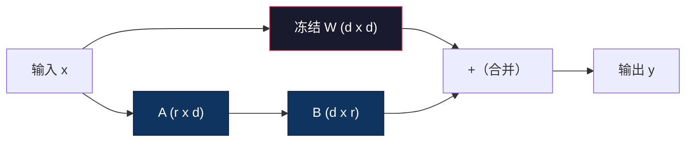
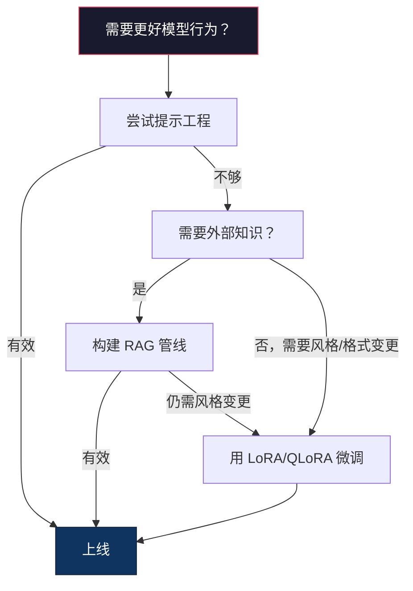

# 使用 LoRA 与 QLoRA 进行微调

> 对 7B 模型进行全量微调需要 56GB VRAM。你没有那么多，大多数公司也没有。LoRA 让你只需 6GB 就能微调同一模型，训练的参数不到 1%。这不是妥协——在大多数任务上，它的全量微调质量相当。整个开源微调生态系就是靠这一个技巧运转的。

**类型：** Build
**语言：** Python
**前置知识：** Phase 10, Lesson 06（指令微调 / SFT）
**时间：** ~75 分钟
**相关内容：** Phase 10 从零覆盖 SFT/DPO 循环。本课将这些接入 2026 年 PEFT 工具链（PEFT、TRL、Unsloth、Axolotl、LLaMA-Factory）。

## 学习目标

- 通过在预训练模型的注意力层注入低秩适配器矩阵（A 和 B）来实现 LoRA
- 计算 LoRA 相对于全量微调的参数节省：秩为 r、维度为 d_model 时训练 2*r*d 参数而非 d²
- 使用 QLoRA（4-bit 量化基座 + LoRA 适配器）微调模型，使其适配消费级 GPU 显存
- 将 LoRA 权重合并回基座模型用于部署，并对比有/无适配器的推理速度

## 问题所在

你有一个基座模型：Llama 3 8B。你想让它用你们公司的语气回答客户支持工单。SFT 是答案，但它有个成本问题。

全量微调会更新模型中的每一个参数。Llama 3 8B 有 80 亿参数。fp16 下每个参数占 2 字节，加载权重就要 16GB。训练过程中，你还需要梯度（16GB）、Adam 优化器状态（动量+方差共 32GB）以及激活值。总计：单个 8B 模型大约需要 56GB VRAM。

一块 A100 80GB 勉强塞得下。两台 A100 在云厂商上每小时花 $3-4。在 50,000 条样本上训练 3 个 epoch 需要 6-10 小时。一次实验花 $30-40。调好超参跑 10 次实验，还没部署就花了 $400。

放大到 Llama 3 70B，数字就更离谱了。光是权重要 140GB，你需要集群。每次实验 $100+。

还有个更深的问题。全量微调会修改模型的所有权重。如果你在客户支持数据上微调，可能会损害模型的通用能力。这叫灾难性遗忘（catastrophic forgetting）。模型在你指定的任务上变强，在其他一切事情上变弱。

你需要一种训练更少参数、使用更少显存、又不摧毁模型已有知识的方法。

## 概念

### LoRA：低秩自适应

Edward Hu 与微软同事于 2021 年 6 月发表了 LoRA。论文的核心洞察：微调期间的权重更新具有低内在秩。你不需要更新 4096×4096 权值矩阵中全部 1670 万个参数。更新中有效的信息可以用秩为 16 或 32 的矩阵来捕捉。

来看数学。一个标准线性层计算如下：

```
y = Wx
```

其中 W 是一个 d_out × d_in 矩阵。对于 4096×4096 的注意力投影，那就是 16,777,216 个参数。

LoRA 冻结 W 并添加一个低秩分解：

```
y = Wx + BAx
```

其中 B 是 (d_out × r)，A 是 (r × d_in)。秩 r 远小于 d——通常为 8、16 或 32。

对 r=16 的 4096×4096 层：
- 原始参数：4096 × 4096 = 16,777,216
- LoRA 参数：(4096 × 16) + (16 × 4096) = 65,536 + 65,536 = 131,072
- 缩减比例：131,072 / 16,777,216 = 0.78%

你只训练 0.78% 的参数，却得到 95-100% 的质量。



A 用随机高斯初始化，B 初始化为零。这意味着 LoRA 的贡献从 0 开始——模型从原始行为出发训练，逐渐学习适配。

### 缩放因子：Alpha

LoRA 引入缩放因子 alpha，控制低秩更新对输出的影响程度：

```
y = Wx + (alpha / r) * BAx
```

当 alpha = r 时，缩放为 1x。当 alpha = 2r（常见默认值）时，缩放为 2x。这个超参独立控制 LoRA 路径的学习率，与基座学习率解耦。

实践建议：
- alpha = 2 × rank 是社区常见约定（原始论文多数实验用 alpha = rank）
- alpha = rank 给出 1x 缩放，保守但稳定
- alpha 越大，每步更新越大，可能加速收敛也可能导致不稳定

### 在哪里应用 LoRA

Transformer 有很多线性层。你不需要在每个层都加 LoRA。原始论文测试了不同组合：

| 目标层 | 可训练参数（7B） | 质量 |
|--------------|----------------------|---------|
| 仅 q_proj | 4.7M | 良好 |
| q_proj + v_proj | 9.4M | 更好 |
| q_proj + k_proj + v_proj + o_proj | 18.9M | 注意力最佳 |
| 全部线性层（注意力+MLP） | 37.7M | 收益边际，参数翻倍 |

大多数任务的最佳选择：q_proj + v_proj。这瞄准自注意力中的查询和值投影，控制模型关注什么以及提取什么信息。添加 MLP 层对代码生成等复杂任务有帮助，但会使参数数量翻倍，在简单任务上收益递减。

### 秩的选择

秩 r 控制适配的表达力：

| 秩 | 每层可训练参数 | 适用场景 |
|------|---------------------------|----------|
| 4 | 32,768 | 简单分类、情感分析 |
| 8 | 65,536 | 单域问答、摘要 |
| 16 | 131,072 | 多域任务、指令跟随 |
| 32 | 262,144 | 复杂推理、代码生成 |
| 64 | 524,288 | 大多数任务收益递减 |
| 128 | 1,048,576 | 很少值得 |

Hu 等人证明，对简单任务 r=4 已能捕捉大部分适配。实践中 r=8 和 r=16 最常见。超过 r=64 很少提升质量，而且开始失去 LoRA 的显存优势。

### QLoRA：4-bit 量化 + LoRA

Tim Dettmers 与华盛顿大学同事于 2023 年 5 月发表了 QLoRA。思路：将冻结基座模型量化到 4-bit，然后在上面以 fp16 附加 LoRA 适配器。

这彻底改变了显存方程：

| 方法 | 权重显存（7B） | 训练显存（7B） | 所需 GPU |
|--------|-------------------|---------------------|-------------|
| 全量微调（fp16） | 14GB | ~56GB | 1× A100 80GB |
| LoRA（fp16 基座） | 14GB | ~18GB | 1× A100 40GB |
| QLoRA（4-bit 基座） | 3.5GB | ~6GB | 1× RTX 3090 24GB |

QLoRA 有三个技术贡献：

**NF4（Normal Float 4-bit）**：一种专为神经网络权重设计的数据类型。神经网络权重大致服从正态分布。NF4 将其 16 个量化等级置于标准正态分布的分位数处。这对正态分布数据在信息论意义下是最优的。相比均匀 4-bit 量化（INT4）或标准 Float4，它损失更少信息。

**双重量化**：量化常数本身也占用显存。每 64 个权重一组需要一个 fp32 缩放因子（4 字节）。对 7B 模型，额外 0.4GB。双重量化将这些常数量化为 fp8，把开销降到 0.1GB。量小但积少成多。

**分页优化器**：训练期间，优化器状态（Adam 的动量和方差）在长序列上可能超出 GPU 显存。分页优化器使用 NVIDIA 统一内存，当 GPU 显存耗尽时自动将优化器状态换出到 CPU 内存，需要时再换入。这防止 OOM 崩溃，代价是部分吞吐量。

### 质量问题

减少参数或量化基座会影响质量吗？多篇论文的结果：

| 方法 | MMLU（5-shot） | MT-Bench | HumanEval |
|--------|--------------|----------|-----------|
| 全量微调（Llama 2 7B） | 48.3 | 6.72 | 14.6 |
| LoRA r=16 | 47.9 | 6.68 | 14.0 |
| QLoRA r=16（NF4） | 47.5 | 6.61 | 13.4 |
| QLoRA r=64（NF4） | 48.1 | 6.70 | 14.2 |

LoRA 在 r=16 时与全量微调在大多数基准上差距在 1% 以内。QLoRA 在 r=16 再损失一小撮。QLoRA 在 r=64 几乎匹配全量微调，而显存使用少 90%。

### 实际成本

在 50,000 条样本上微调 Llama 3 8B（3 个 epoch）：

| 方法 | GPU | 时间 | 成本 |
|--------|-----|------|------|
| 全量微调 | 2× A100 80GB | 8 小时 | ~$32 |
| LoRA r=16 | 1× A100 40GB | 4 小时 | ~$8 |
| QLoRA r=16 | 1× RTX 4090 24GB | 6 小时 | ~$5 |
| QLoRA r=16（Unsloth） | 1× RTX 4090 24GB | 2.5 小时 | ~$2 |
| QLoRA r=16 | 1× T4 16GB | 12 小时 | ~$4 |

单块消费级 GPU 上的 QLoRA 成本不到一顿午餐钱。这就是 2023 年开源微调社区爆发式增长的原因，也是 2026 年每种训练框架默认附带 QLoRA 的原因。

### 2026 PEFT 工具栈

| 框架 | 是什么 | 何时选用 |
|-----------|-----------|-----------|
| **Hugging Face PEFT** | 官方 LoRA/QLoRA/DoRA/IA3 库 | 需要底层控制且训练循环已基于 `transformers.Trainer` |
| **TRL** | HF 的强化学习反馈训练器（SFT、DPO、GRPO、PPO、ORPO） | SFT 后需要 DPO/GRPO；基于 PEFT 构建 |
| **Unsloth** | Triton 核重写的前向/反向传播 | 想要 2-5 倍加速 + 一半显存且无精度损失；Llama/Mistral/Qwen 家族 |
| **Axolotl** | 基于 PEFT+TRL+DeepSpeed+Unsloth 的 YAML 配置包装 | 想要可复现、版本控制的训练运行 |
| **LLaMA-Factory** | 基于 PEFT+TRL 的 GUI/CLI/API | 想要零代码微调；支持 100+ 模型家族 |
| **torchtune** | 原生 PyTorch recipe，无 `transformers` 依赖 | 想要最小依赖且组织已标准化 PyTorch |

经验法则：研究用途或一次性实验 → PEFT。可复现的生产管线 → Axolotl 开启 Unsloth 核。丢弃式原型 → LLaMA-Factory。

### 合并适配器

训练完成后，你有两样东西：冻结基座模型和一个小 LoRA 适配器（通常 10-100MB）。你可以：

1. **保持分离**：加载基座模型，在上面加载适配器。为不同任务交换适配器。这是从一个基座模型服务多个微调变体的方式。

2. **永久合并**：计算 W' = W + (alpha/r) * BA 并保存为新完整模型。合并后的模型与原模型同大。无推理开销，无需管理适配器。

服务多任务（客户支持适配器、代码适配器、翻译适配器）时保持分离。部署单一专用模型时合并。

用于合并多个适配器的进阶技术：

- **TIES-Merging**（Yadav 等，2023）：裁剪小幅度参数，解决符号冲突，再合并。减少适配器间干扰。
- **DARE**（Yu 等，2023）：合并前随机丢弃适配器参数并重缩放其余部分。在组合能力方面出奇有效。
- **任务算术**：直接加/减适配器权重。叠加"代码"适配器和"数学"适配器通常产出同时擅长两者的模型。

### 何时不应微调

微调是第三选项，不是第一。

**第一步：提示工程**。写更好的系统提示，加 few-shot 示例，用 chain-of-thought。零成本、几分钟搞定。如果提示能让你达到 80% 效果，可能不需要微调。

**第二步：RAG**。如果模型需要了解你的特定数据（文档、知识库、产品目录），检索比固化到权重中更便宜、更易维护。见 Lesson 06。

**第三步：微调**。在你需要模型采用无法通过提示实现的特定风格、格式或推理模式时使用。当你需要一致的结构化输出时。当你需要把大模型蒸馏到小模型时。当延迟关键且你无法承受 few-shot 提示额外 token 时。



```figure
lora-params
```

## 动手实现

我们用纯 PyTorch 从零实现 LoRA。无库依赖，无黑魔法。你将构建 LoRA 层、注入模型、训练并合并权重。

### 步骤 1：LoRA 层

```python
import torch
import torch.nn as nn
import math

class LoRALayer(nn.Module):
    def __init__(self, in_features, out_features, rank=8, alpha=16):
        super().__init__()
        self.rank = rank
        self.alpha = alpha
        self.scaling = alpha / rank

        self.A = nn.Parameter(torch.randn(in_features, rank) * (1 / math.sqrt(rank)))
        self.B = nn.Parameter(torch.zeros(rank, out_features))

    def forward(self, x):
        return (x @ self.A @ self.B) * self.scaling
```

A 用缩放随机值初始化，B 初始化为零。乘积 BA 从 0 开始，模型从原始行为出发。

### 步骤 2：带 LoRA 的 Linear 层

```python
class LinearWithLoRA(nn.Module):
    def __init__(self, linear, rank=8, alpha=16):
        super().__init__()
        self.linear = linear
        self.lora = LoRALayer(
            linear.in_features, linear.out_features, rank, alpha
        )

        for param in self.linear.parameters():
            param.requires_grad = False

    def forward(self, x):
        return self.linear(x) + self.lora(x)
```

原始线性层被冻结，只有 LoRA 参数（A 和 B）可训练。

### 步骤 3：向模型注入 LoRA

```python
def inject_lora(model, target_modules, rank=8, alpha=16):
    for param in model.parameters():
        param.requires_grad = False

    lora_layers = {}
    for name, module in model.named_modules():
        if isinstance(module, nn.Linear):
            if any(t in name for t in target_modules):
                parent_name = ".".join(name.split(".")[:-1])
                child_name = name.split(".")[-1]
                parent = dict(model.named_modules())[parent_name]
                lora_linear = LinearWithLoRA(module, rank, alpha)
                setattr(parent, child_name, lora_linear)
                lora_layers[name] = lora_linear
    return lora_layers
```

先冻结模型所有参数，再遍历模型树，找到匹配目标名称的线性层，替换为 LoRA 包装版本。整个模型中只有 LoRA 的 A 和 B 矩阵是可训练的。

### 步骤 4：统计参数

```python
def count_parameters(model):
    total = sum(p.numel() for p in model.parameters())
    trainable = sum(p.numel() for p in model.parameters() if p.requires_grad)
    frozen = total - trainable
    return {
        "total": total,
        "trainable": trainable,
        "frozen": frozen,
        "trainable_pct": 100 * trainable / total if total > 0 else 0
    }
```

### 步骤 5：合并权重

```python
def merge_lora_weights(model):
    for name, module in model.named_modules():
        if isinstance(module, LinearWithLoRA):
            with torch.no_grad():
                merged = (
                    module.lora.A @ module.lora.B
                ) * module.lora.scaling
                module.linear.weight.data += merged.T
            parent_name = ".".join(name.split(".")[:-1])
            child_name = name.split(".")[-1]
            if parent_name:
                parent = dict(model.named_modules())[parent_name]
            else:
                parent = model
            setattr(parent, child_name, module.linear)
```

合并后 LoRA 层消失，模型与原模型同大，适配已烘焙进权重。无推理开销。

### 步骤 6：模拟 QLoRA 量化

```python
def quantize_to_nf4(tensor, block_size=64):
    blocks = tensor.reshape(-1, block_size)
    scales = blocks.abs().max(dim=1, keepdim=True).values / 7.0
    scales = torch.clamp(scales, min=1e-8)
    quantized = torch.round(blocks / scales).clamp(-8, 7).to(torch.int8)
    return quantized, scales

def dequantize_from_nf4(quantized, scales, original_shape):
    dequantized = quantized.float() * scales
    return dequantized.reshape(original_shape)
```

这通过把权重映射到 64 个一组内的 16 个离散级别来模拟 4-bit 量化。生产环境 QLoRA 使用 bitsandbytes 库在 GPU 上实现真正的 NF4。

### 步骤 7：训练循环

```python
def train_lora(model, data, epochs=5, lr=1e-3, batch_size=4):
    optimizer = torch.optim.AdamW(
        [p for p in model.parameters() if p.requires_grad], lr=lr
    )
    criterion = nn.MSELoss()

    losses = []
    for epoch in range(epochs):
        epoch_loss = 0.0
        n_batches = 0
        indices = torch.randperm(len(data["inputs"]))

        for i in range(0, len(indices), batch_size):
            batch_idx = indices[i:i + batch_size]
            x = data["inputs"][batch_idx]
            y = data["targets"][batch_idx]

            output = model(x)
            loss = criterion(output, y)

            optimizer.zero_grad()
            loss.backward()
            optimizer.step()

            epoch_loss += loss.item()
            n_batches += 1

        avg_loss = epoch_loss / n_batches
        losses.append(avg_loss)

    return losses
```

### 步骤 8：完整演示

```python
def demo():
    torch.manual_seed(42)
    d_model = 256
    n_classes = 10

    model = nn.Sequential(
        nn.Linear(d_model, 512),
        nn.ReLU(),
        nn.Linear(512, 512),
        nn.ReLU(),
        nn.Linear(512, n_classes),
    )

    n_samples = 500
    x = torch.randn(n_samples, d_model)
    y = torch.randint(0, n_classes, (n_samples,))
    y_onehot = torch.zeros(n_samples, n_classes).scatter_(1, y.unsqueeze(1), 1.0)

    data = {"inputs": x, "targets": y_onehot}

    params_before = count_parameters(model)

    lora_layers = inject_lora(
        model, target_modules=["0", "2"], rank=8, alpha=16
    )

    params_after = count_parameters(model)

    losses = train_lora(model, data, epochs=20, lr=1e-3)

    merge_lora_weights(model)
    params_merged = count_parameters(model)

    return {
        "params_before": params_before,
        "params_after": params_after,
        "params_merged": params_merged,
        "losses": losses,
    }
```

演示创建一个小型模型，向两层注入 LoRA，训练后合并权重。参数计数从全量可训练降到 LoRA 训练时的约 1%，合并后恢复到原始架构。

## 使用它

有了 Hugging Face 工具链，在真实模型上跑 LoRA 只需约 20 行：

```python
from transformers import AutoModelForCausalLM, AutoTokenizer
from peft import LoraConfig, get_peft_model, TaskType

model = AutoModelForCausalLM.from_pretrained("meta-llama/Llama-3.1-8B")
tokenizer = AutoTokenizer.from_pretrained("meta-llama/Llama-3.1-8B")

lora_config = LoraConfig(
    task_type=TaskType.CAUSAL_LM,
    r=16,
    lora_alpha=32,
    lora_dropout=0.05,
    target_modules=["q_proj", "v_proj"],
)

model = get_peft_model(model, lora_config)
model.print_trainable_parameters()
```

对于 QLoRA，加上 bitsandbytes 量化：

```python
from transformers import BitsAndBytesConfig

bnb_config = BitsAndBytesConfig(
    load_in_4bit=True,
    bnb_4bit_quant_type="nf4",
    bnb_4bit_compute_dtype=torch.bfloat16,
    bnb_4bit_use_double_quant=True,
)

model = AutoModelForCausalLM.from_pretrained(
    "meta-llama/Llama-3.1-8B",
    quantization_config=bnb_config,
    device_map="auto",
)

model = get_peft_model(model, lora_config)
```

就这些。同样的训练循环，同样的数据管线。基座模型现在以 4-bit 运行，LoRA 适配器以 fp16 训练，整体只需 6GB。

使用 Hugging Face Trainer 训练：

```python
from transformers import TrainingArguments, Trainer
from datasets import load_dataset

dataset = load_dataset("tatsu-lab/alpaca", split="train[:5000]")

training_args = TrainingArguments(
    output_dir="./lora-llama",
    num_train_epochs=3,
    per_device_train_batch_size=4,
    gradient_accumulation_steps=4,
    learning_rate=2e-4,
    fp16=True,
    logging_steps=10,
    save_strategy="epoch",
    optim="paged_adamw_8bit",
)

trainer = Trainer(
    model=model,
    args=training_args,
    train_dataset=dataset,
)

trainer.train()

model.save_pretrained("./lora-adapter")
```

保存的适配器只有 10-100MB。基座模型保持不变。你可以在 Hugging Face Hub 上分享适配器而无需重新分发完整模型。

## 交付物

本课产出：
- `outputs/prompt-lora-advisor.md` —— 帮助你在特定任务上决定 LoRA 秩、目标模块和超参的提示
- `outputs/skill-fine-tuning-guide.md` —— 教导智能体何时以及如何微调的决策树技能

## 练习

1. **秩消融实验。** 用秩 2、4、8、16、32、64 分别运行演示。绘制最终损失 vs. 秩曲线。找到收益递减点——加倍秩不再使损失减半的位置。对 256 维特征的简单分类任务，这大约在 r=8-16。

2. **目标模块对比。** 修改 inject_lora，分别只 targeting 层"0"、只 layer"2"、只 layer"4"、以及全部三层。各自训练 20 个 epoch，比较收敛速度和最终损失。这映射了现实中 targeting q_proj vs v_proj vs 全部线性层的选择。

3. **量化误差分析。** 取量化前后训练好的模型的权重矩阵，计算均方误差、最大绝对误差，以及原始权重与重建权重间的相关系数。实验 block_size 取值 32、64、128、256。

4. **多适配器服务。** 在不同数据子集上训练两个 LoRA 适配器（偶数索引 vs 奇数索引），保存两个适配器。只加载一次基座模型，然后交换适配器，验证相同输入产生不同输出。这是生产系统从一个基座服务多个微调模型的方式。

5. **合并与未合并推理对比。** 在相同 100 条输入上比较 merge_lora_weights 前后的 LoRA 模型输出，验证输出一致（浮点容差 1e-5 内）。然后基准测试双方推理速度——合并后应略快，因为它是单次矩阵乘法而非两次。

## 关键术语

| 术语 | 人们怎么说 | 实际含义 |
|------|----------------|----------------------|
| LoRA | "高效微调" | 低秩自适应：冻结基座权重，训练两个小矩阵 A 和 B，其乘积逼近完整权重更新 |
| QLoRA | "笔记本上微调" | 量化 LoRA：以 4-bit NF4 加载基座模型，在顶部以 fp16 训练 LoRA 适配器，实现 6GB VRAM 下微调 7B |
| 秩（r） | "模型能学多少" | A 和 B 矩阵的内层维度；控制表达力与参数量的权衡 |
| Alpha | "LoRA 学习率" | 作用于 LoRA 输出的缩放因子；alpha/r 控制适配对最终输出的贡献比例 |
| NF4 | "4-bit 量化" | Normal Float 4：量化等级位于正态分布分位数处的 4-bit 数据类型，对神经网络权重最优 |
| 适配器（Adapter） | "训练好的小部分" | 作为独立文件保存的 LoRA A 和 B 矩阵（10-100MB），可加载到任意基座模型副本上 |
| 目标模块 | "哪些层加 LoRA" | 注入 LoRA 适配器的具体线性层（q_proj、v_proj 等） |
| 合并 | "烘焙进去" | 计算 W + (alpha/r) * BA 并替换原始权重，消除推理时的适配器开销 |
| 分页优化器 | "训练中不 OOM" | GPU 显存耗尽时将优化器状态（Adam 动量、方差）换出到 CPU |
| 灾难性遗忘 | "微调毁了一切" | 更新所有权重导致模型丢失先前习得的能力 |

## 延伸阅读

- Hu 等，《LoRA: Low-Rank Adaptation of Large Language Models》（2021）—— 引入低秩分解方法的原始论文，在 GPT-3 175B 上测试，秩低至 4
- Dettmers 等，《QLoRA: Efficient Finetuning of Quantized Language Models》（2023）—— 引入 NF4、双重量化和分页优化器，实现在单块 48GB GPU 上微调 65B
- PEFT 库文档（huggingface.co/docs/peft）—— Hugging Face 生态中 LoRA、QLoRA 及其他参数高效方法的官方库
- Yadav 等，《TIES-Merging: Resolving Interference When Merging Models》（2023）—— 组合多个 LoRA 适配器而不降低质量的技术
- [Rafailov 等，《Direct Preference Optimization: Your Language Model is Secretly a Reward Model》（NeurIPS 2023）](https://arxiv.org/abs/2305.18290) —— DPO 推导；SFT 之后的偏好微调阶段，无需奖励模型
- [TRL 文档](https://huggingface.co/docs/trl/) —— `SFTTrainer`、`DPOTrainer`、`KTOTrainer` 的官方参考，以及与 PEFT/bitsandbytes/Unsloth 的集成接口
- [Unsloth 文档](https://docs.unsloth.ai/) —— 融合核使微调吞吐翻倍、显存减半；TRL 下的性能层
- [Axolotl 文档](https://axolotl-ai-cloud.github.io/axolotl/) —— YAML 配置的多 GPU SFT/DPO/QLoRA 训练器；手写脚本的配置文件即代码替代方案
