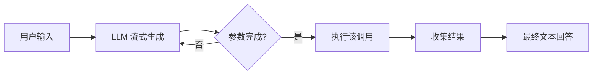

# 并行工具调用与流式处理

> 三次独立的天气查询串行执行需要三个往返。并行运行则总时间坍缩为最慢单次调用的耗时。所有前沿提供商现在都在单次对话中发出多个工具调用。收益是实实在在的；底层实现却微妙复杂。本课时同时讲解这两个方面：并行扇出与流式参数重组，重点在于 id 关联的陷阱。

**类型：** 构建
**语言：** Python（标准库、线程池 + 流式处理框架）
**前置知识：** Phase 13 · 02（函数调用深度剖析）
**预计时长：** 约 75 分钟

## 学习目标

- 解释 `parallel_tool_calls: true` 的存在原因及何时应禁用它。
- 在并行扇出时，将流式参数块正确关联到对应的工具调用 id。
- 将部分 `arguments` 字符串重组为完整 JSON，避免过早解析。
- 运行一个三城市天气基准测试，演示串行与并发的延迟差异。

## 问题所在

没有并行调用时，回答"班加罗尔、东京和苏黎世的天气如何"的智能体会这样执行：

```
user -> LLM
LLM -> call get_weather(Bengaluru)
host -> run executor, reply with result
LLM -> call get_weather(Tokyo)
host -> run executor, reply with result
LLM -> call get_weather(Zurich)
host -> run executor, reply with result
LLM -> final text answer
```

三次 LLM 往返，每次还需支付执行器延迟。理想墙钟时间的约 4 倍。

使用并行调用后：

```
user -> LLM
LLM -> call get_weather(Bengaluru); call get_weather(Tokyo); call get_weather(Zurich)
host -> run all three executors concurrently, reply with three results
LLM -> final text answer
```

一次 LLM 往返。执行器时间是三个调用的最大值，而非总和。在 OpenAI、Anthropic 和 Gemini 上的生产基准测试显示，扇出类工作负载可节省 60% 至 70% 的墙钟时间。

代价是关联复杂性。当三个调用乱序完成时，结果必须携带匹配的 `tool_call_id`，以便模型能够对齐它们。当结果流式返回时，你必须在执行前将部分参数片段重组为完整 JSON。Gemini 3 引入唯一 id 正是为了解决一个真实世界的问题——两次针对同一工具的并行调用无法区分。

## 概念解析

### 启用并行

- **OpenAI。** `parallel_tool_calls: true` 默认开启。设为 `false` 强制串行。
- **Anthropic。** 通过 `disable_parallel_tool_use: false` 启用并行（Claude 3.5 及以上默认开启）。设为 `true` 改为串行。
- **Gemini。** 始终具备并行能力；`tool_config.function_calling_config.mode = "AUTO"` 让模型自行决定。

在以下情况应禁用并行：工具存在顺序依赖（`create_file` 后接 `write_file`），一个调用的输出影响另一个的输入，或者速率限制器无法承受扇出压力。

### Id 关联

模型发出的每个调用都有一个 `id`。主机返回的每个结果也必须包含相同的 id。缺少这个关联，结果将无法区分。

- **OpenAI。** 每个 tool 角色消息上的 `tool_call_id`。
- **Anthropic。** 每个 `tool_result` 块上的 `tool_use_id`。
- **Gemini。** 每个 `functionResponse` 上的 `id`（Gemini 3 及以上；Gemini 2 按名称匹配，同名的并行调用会出问题）。

### 并发执行调用

主机在自己的线程、协程或远程 worker 上运行每个调用的执行器。最简单的框架使用线程池；生产环境使用带 `asyncio.gather` 的 asyncio 或结构化并发。完成顺序不可预测——id 是标识符。

一个常见 bug：按调用列表顺序而非完成顺序回复结果。这通常能工作，因为模型只关心 `tool_call_id`，但如果结果丢失或重复，乱序提交会让调试更困难。建议按完成顺序回复并明确使用 ids。

### 流式工具调用

当模型流式传输时，`arguments` 分批到达。三个并行调用的三个独立流在网络上交织。你需要为每个 id 维护一个累加器。

按提供商的形状：

- **OpenAI。** 每个 chunk 是 `choices[0].delta.tool_calls[i].function.arguments`（部分字符串）。chunk 携带 `index`（在调用列表中的位置）。你按 index 累加，在首次出现时读取 `id`，在 `finish_reason = "tool_calls"` 时解析 JSON。
- **Anthropic。** 流事件依次是 `message_start`，然后每个 block 一个 `content_block_start`（类型为 `tool_use`，包含 id、name 和空 input）。`content_block_delta` 事件携带 `input_json_delta` 块。`content_block_stop` 关闭每个 block。
- **Gemini。** `streamFunctionCallArguments`（Gemini 3 及以上）发出带有 `functionCallId` 的 chunk，使调用能够干净地交织。Gemini 3 之前，流式传输一次只返回一个完整调用。

### 部分 JSON 与"过早解析"陷阱

你不能在 `arguments` 完整之前解析它。部分 JSON 如 `{"city": "Beng` 不是合法 JSON，会抛出异常。正确的闸门是提供商的调用结束信号：OpenAI 的 `finish_reason = "tool_calls"`、Anthropic 的 `content_block_stop` 或 Gemini 的流结束事件。只有那时才尝试 `json.loads`。更健壮的方法是使用增量 JSON 解析器，它在结构完成时产生事件；OpenAI 的流式指南推荐这种方法以实现显示实时"思考"指示器的 UX。花括号计数作为完整性判断是不可靠的（引号字符串内或转义内容中的花括号会导致误判），仅应作为非正式的调试启发手段。

### 乱序完成

```
call_A: fast API, returns first
call_B: slow API, returns second
call_C: median API, returns third
```

主机回复仍必须引用 ids：

```
[{role: "tool", tool_call_id: "call_A", content: ...},
 {role: "tool", tool_call_id: "call_B", content: ...},
 {role: "tool", tool_call_id: "call_C", content: ...}]
```

在 OpenAI 或 Anthropic 上，回复中的顺序不影响正确性。只要 id 匹配，Gemini 接受任何顺序。

### 基准测试：串行 vs 并行

`code/main.py` 中的框架模拟了三个延迟分别为 400、600 和 800 毫秒的执行器。串行运行总计 1800 毫秒。并行运行取 max(400, 600, 800) = 800 毫秒。差异是恒定的，而非成比例的，因此随着工具数量增加，节省会更大。

现实世界的注意事项：并行调用会给下游 API 带来压力。10 路扇出到一个有速率限制的服务会失败。Phase 13 · 17 涵盖网关级背压；重试语义计划在未来的课时中介绍。

### 流式扇出的墙钟时间

如果模型本身也在流式传输，你可以在一个调用的参数完成后立即开始执行，而不必等待所有调用完成。这是 OpenAI 文档中记录但并非所有 SDK 都暴露的优化。本课时的框架实现了它：一旦模拟流产生完整的参数对象，主机就立即启动该调用。



## 实践使用

`code/main.py` 分为两部分。第一部分使用 `concurrent.futures.ThreadPoolExecutor` 串行和并行运行三个模拟的天气调用，并打印墙钟时间。第二部分重放一个伪造的流式响应——三个并行调用的 `arguments` 块在一个流上交错——并使用 `StreamAccumulator` 按 id 重组。没有 LLM，没有网络，只有重组逻辑。

值得关注的点：

- 串行计时器达到 1.8 秒。并行计时器在相同的假延迟下达到 0.8 秒。
- 累加器通过按 id 缓冲并在每个调用的 JSON 完整时解析来处理乱序到达的块。
- 执行器在 id 的参数完成时立即启动，而不是等待所有流结束。

## 交付成果

本课时生成 `outputs/skill-parallel-call-safety-check.md`。给定工具注册表，该技能会审计哪些工具适合并行化、哪些存在顺序依赖、哪些会给下游速率限制器造成压力——并返回带有每个工具 `parallel_safe` 标志的修订注册表。

## 练习

1. 运行 `code/main.py` 并调整模拟延迟。确认并行与串行的比率约为 `max/sum`（实际运行因线程调度、序列化和框架开销而略有偏差）。在什么延迟分布下并行的优势不再明显？

2. 扩展累加器以处理"调用在流式传输中途被取消"的情况，通过丢弃其缓冲区并发出 `cancelled` 事件。哪个提供商的文档明确说明了这种情况？检查 Anthropic 的 `content_block_stop` 语义和 OpenAI 的 `finish_reason: "length"` 行为。

3. 用 `asyncio.gather` 替换线程池。对两者进行基准测试。如果执行器进行真实的 I/O 操作，你应该会看到异步带来的小幅提升，因为上下文切换成本更低。

4. 选择两个不应该并行化的工具（例如 `create_file` 后接 `write_file`）。在注册表中添加 `ordering_dependency` 图，并基于该图限制并行扇出。这是依赖感知调度的最小机制，将在未来的智能体工程课时中形式化。

5. 阅读 OpenAI 的并行函数调用章节和 Anthropic 的 `disable_parallel_tool_use` 文档。找出 Anthropic 建议禁用并行的一个真实世界工具类型。（提示：对同一资源的实质性变更。）

## 关键术语

| 术语 | 人们怎么说 | 实际含义 |
|------|------------|----------|
| 并行工具调用 | "单次对话中的扇出" | 模型在单个 assistant 消息中发出多个工具调用 |
| `parallel_tool_calls` | "OpenAI 的标志" | 启用或禁用多调用发射 |
| `disable_parallel_tool_use` | "Anthropic 的反向标志" | 选择退出的标志；默认启用并行 |
| 工具调用 id | "关联句柄" | 结果消息必须回显的每次调用的标识符 |
| 累加器 | "流式缓冲区" | 用于部分 `arguments` 块的 per-id 字符串缓冲区 |
| 乱序完成 | "最快的先返回" | 并行调用以不可预测的顺序完成；ids 是粘合剂 |
| 依赖图 | "顺序约束" | 输出作为其他工具输入的工具有依赖关系；不能并行化 |
| 过早解析陷阱 | "JSON.parse 爆炸" | 尝试解析不完整的 `arguments` 字符串 |
| `streamFunctionCallArguments` | "Gemini 3 特性" | 带有每调用唯一 id 的流式参数块 |
| 完成顺序回复 | "不必等所有" | 按到达顺序回复结果，以 id 为键 |

## 延伸阅读

- [OpenAI — 并行函数调用](https://platform.openai.com/docs/guides/function-calling#parallel-function-calling) — 默认行为和选择退出标志
- [Anthropic — 工具使用：实现工具使用](https://docs.anthropic.com/en/docs/agents-and-tools/tool-use/implementing-tool-use) — `disable_parallel_tool_use` 和结果批处理
- [Google — Gemini 函数调用并行章节](https://ai.google.dev/gemini-api/docs/function-calling) — Gemini 3 的 id 关联并行调用
- [OpenAI — 带工具的流式响应](https://platform.openai.com/docs/api-reference/responses-streaming) — OpenAI 流的块参数重组
- [Anthropic — 流式消息](https://docs.anthropic.com/en/api/messages-streaming) — 带 `input_json_delta` 的 `content_block_delta`
