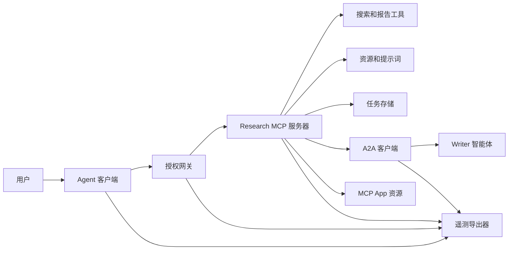
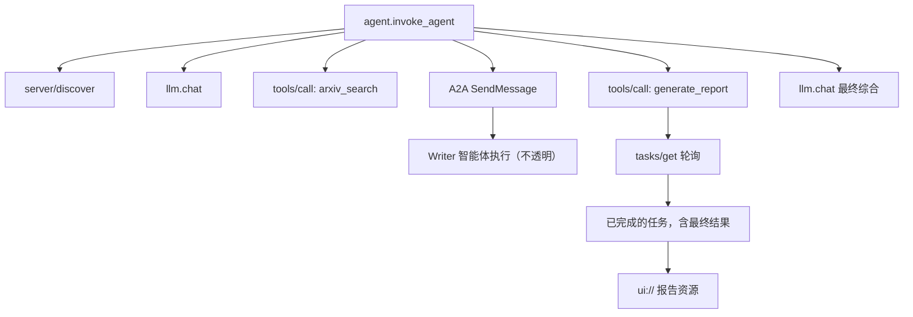
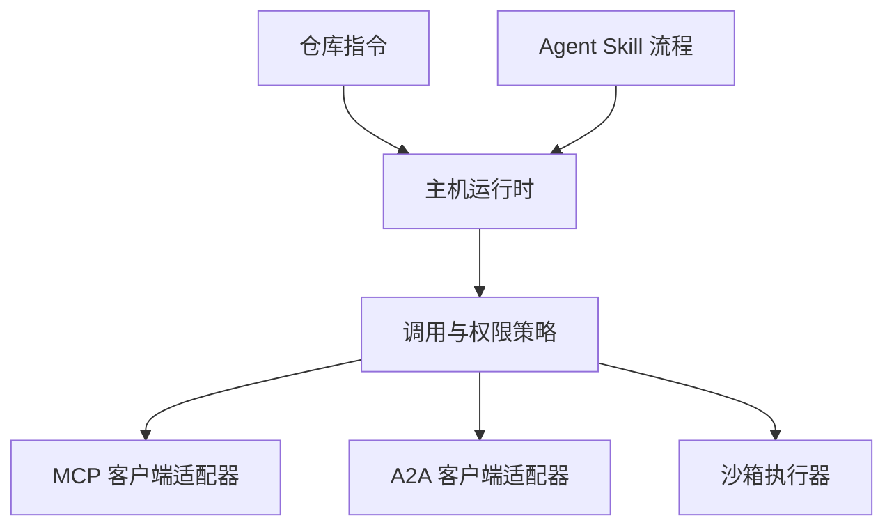

# Capstone：无状态工具生态系统

> 生产级智能体系统是一组边界，而不是一堆功能的堆砌。本综合项目将可读的进程内模拟与真实部署仍需要的协议客户端、授权服务器、沙箱和遥测导出器分离开来。

**类型：** 构建
**语言：** Python（标准库，进程内模拟）
**前置条件：** 第 13 阶段 · 01 至 22，使用 MCP 修订版 `2026-07-28`
**时间：** 约 120 分钟

## 学习目标

- 将工具调用、任务形状的结果、委托工作、UI 资源、授权策略和跟踪记录组合成一个流程。
- 在每次 MCP 请求中携带协议版本、客户端身份和能力，而不是依赖连接会话。
- 在使用前发现服务器，并通过官方 Tasks 扩展驱动长时工作。
- 区分协议形状的模拟与 MCP、A2A、OAuth 或 OpenTelemetry 的实现。
- 将每个模拟边界映射到必须替换它的生产组件。
- 使 `AGENTS.md`、Agent Skill、运行时适配器、工具和安全管理政策各司其职。
- 说明哪些声明可以从本地输出验证，哪些需要实时集成测试。

## 问题描述

设计一个研究-报告系统。用户请求有关智能体协议的论文。系统搜索论文目录、委托摘要生成、生成报告、返回 UI 资源，并记录系统中的路径。

这句话隐藏着几个独立的契约：

- 面向模型的工具模式；
- 无状态的请求信封和服务器发现契约；
- 针对行为者、范围和工具身份的网关注入决策；
- 长时操作契约；
- 委托协议；
- 主机到应用的桥接；
- 跟踪传播与导出；
- 可重用的操作流程。

`code/main.py` 使用普通的 Python 函数和字典保持这些边界可见。它不打开传输层、不联系 arXiv、不执行 OAuth、不调用 A2A 服务器、不渲染 MCP App、也不导出遥测数据。这使得控制流易于检查，而不会将一个模拟呈现为合规服务。

## 概念

### 目标架构



该架构是公共协议模式的组合概念。它不是对任何产品内部实现的声明。

### 目标跟踪



在真实实现中，每次跳转都会传播跟踪上下文。Span 名称和属性必须遵循所选 instrumentation 版本支持的 OpenTelemetry 语义约定。仅有一个共享的跟踪标识符并不能证明正确的父子关系、导出或后端摄取。

### 当前协议接口

使用当前协议定义的方法名，而非从旧草案中记住的名称：

| 边界 | 当前接口 | 本项目模拟的内容 |
|---|---|---|
| MCP 发现 | 强制的 `server/discover` | 直接返回版本、能力和服务器身份的函数 |
| MCP 请求上下文 | 每次 `params._meta` 中的版本、能力和客户端身份 | 传递给每次模拟调用的新鲜请求元数据 |
| MCP 工具调用 | `tools/call` | 直接 Python 函数分发 |
| MCP 任务轮询 | `io.modelcontextprotocol/tasks` 中的 `tasks/get` | 一个有效句柄，随后是一个携带最终结果的已完成任务 |
| A2A 委托 | gRPC 和 JSON-RPC 中的 `SendMessage`；HTTP+JSON 中的 `POST /message:send` | 一个嵌套 span，无远程调用或人工延迟 |
| MCP App 调用服务器工具 | `app.callServerTool({ name, arguments })` | 无实时桥接的 HTML 字符串 |
| OAuth 授权 | 授权服务器、受保护资源元数据、受众和范围验证 | 静态令牌查找和范围成员资格 |
| OpenTelemetry | SDK、传播器、导出器和收集器或后端 | 内存中的 span 字典 |

协议名称仅是第一层。生产测试必须在真实链路上练习序列化、认证失败、取消、超时、重试和版本兼容性。

### 无状态 MCP 改变了集成边界

修订版 `2026-07-28` 移除了协议会话和 `initialize` / `notifications/initialized` 握手。它也移除了 `Mcp-Session-Id`。每次请求都携带以下命名空间化的 `_meta` 字段：

```json
{
  "io.modelcontextprotocol/protocolVersion": "2026-07-28",
  "io.modelcontextprotocol/clientCapabilities": {
    "extensions": {
      "io.modelcontextprotocol/tasks": {}
    }
  },
  "io.modelcontextprotocol/clientInfo": {
    "name": "capstone-client",
    "version": "1.0.0"
  }
}
```

服务器必须实现 `server/discover`。普通结果使用 `resultType: "complete"`；任务句柄使用 `resultType: "task"`。每个结果应在 `_meta.io.modelcontextprotocol/serverInfo` 中标识服务器。

Tasks 扩展包含 `tasks/get`、`tasks/update` 和 `tasks/cancel`。工具首先返回 `resultType: "task"`；`tasks/get` 本身返回 `resultType: "complete"`，已完成的 `Task` 包含最终结果。旧的 `tasks/result` 和 `tasks/list` 方法不属于当前扩展。客户端必须在可能接收到任务句柄的同一请求中声明 `io.modelcontextprotocol/tasks`。如果未声明，服务器返回 `-32021`，`requiredCapabilities` 格式为缺失的客户端能力对象，包括 `extensions.io.modelcontextprotocol/tasks`。

### 安全态势

预期部署采用纵深防御：

- OAuth 授权，在客户端类型需要时使用 PKCE；
- 已签发访问令牌的资源绑定和受众绑定；
- 检查所请求工具、范围、行为者身份的网关 RBAC；
- 持有超出模型可见上下文的上游凭据；
- 固定或经过审核的工具描述清单；
- 对不可信输入、敏感数据和重大操作的 Rule of Two 审核；
- 执行沙箱，其文件系统、进程、网络、凭据和资源限制在技能之外强制执行。

演示仅实现静态令牌、范围检查和描述哈希。它对策略流程有用，而非安全验证。

### Skills 是流程，而非传输

Agent Skill 可以告知运行时如何执行研究流程、预期哪些工具契约、保存哪些证据以及何时停止。它无法使 MCP 服务器存在、建立 A2A 兼容性、授予范围或创建沙箱。



当流程引用配套文件时，请交付完整的 skill 目录。此较旧 capstone 中的扁平工件是一个课程蓝图，并非主机保留可移植包的确证。第 24 至 27 课构建并测试完整包生命周期。

### 课程工件元数据是本地适配器

课程目录和安装程序识别命名为 `skill-*.md` 的扁平文件，但这是仓库约定，而非可移植 Agent Skills 包契约。它们的最小 frontmatter 解析器仅读取顶层键。因此本课将可移植身份字段和课程目录字段保持在同一层级：

```yaml
---
name: ecosystem-blueprint
description: 为产品需求生成完整的第 13 阶段生态系统架构。
version: "1.0.0"
phase: "13"
lesson: "23"
tags: [mcp, capstone, ecosystem, architecture, a2a, otel]
---
```

`name` 和 `description` 是可移植身份字段。`version`、`phase`、`lesson` 和 `tags` 是课程特定的目录扩展。课程解析器要求 `tags` 作为内联列表，以便 `--tag capstone` 能够匹配。

可移植目录型 skill 可在可选的 `metadata` 映射中使用字符串值扩展数据。这并不意味着 `metadata` 可与本仓库的目录模式互换。如果此扁平文件将 `version` 或 `tags` 嵌套在 `metadata` 之下，最小解析器会跳过这些缩进键，目录将记录空版本，且标签过滤无法找到该工件。生产主机应使用安全的 YAML 解析器并验证自身记录的模式。

### 模拟与生产的对比

| 层级 | `code/main.py` | 生产替换 | 所需证据 |
|---|---|---|---|
| 发现 | `server_discover()` 加静态 `TOOLS` | `server/discover` 后接缓存感知的 `tools/list` | 链路记录、确定性顺序和模式验证 |
| 认证 | 令牌索引字典 | OAuth 授权和受保护资源验证 | 颁发者、受众、范围、过期时间和失败测试 |
| 授权 | 范围成员资格 | 绑定到行为者、工具、目标和租户的网关策略 | 允许和拒绝审计用例 |
| 搜索 | 静态论文示例数据 | 搜索 API 或 MCP 服务器 | 来源溯源、排序和错误测试 |
| 任务 | 本地句柄加即时 `tasks/get` | 耐久的 `io.modelcontextprotocol/tasks` 存储，含 `tasks/get`、`tasks/update`、`tasks/cancel` 和 TTL | 状态转换、输入、取消和恢复测试 |
| 委托 | Sleep 加嵌套 span | A2A 客户端和远程 Agent Card | 契约、超时、重试和不透明度测试 |
| App | HTML 字符串和 URI | MCP Apps 资源和 `App` 桥接 | CSP、权限、工具调用和浏览器测试 |
| 遥测 | 内存列表 | OTel SDK 和导出器 | 收集器接收和 trace-parent 断言 |
| 沙箱 | 无 | 主机执行的隔离执行器 | 逃逸、出站、密钥和资源限制测试 |

此表是移交边界。本地运行绿色仅验证模拟。

### 第 13 阶段地图

| 课程 | 贡献 |
|---|---|
| 01-05 | 工具接口、调用、模式、结构化结果和确定性验证 |
| 06-14 | 无状态 MCP 请求信封、发现、传输、资源、提示词、扩展和 Apps |
| 15-18 | 投毒防御、OAuth、网关、注册表和生产认证 |
| 19 | A2A 消息和任务委托 |
| 20 | OpenTelemetry GenAI 跟踪设计 |
| 21 | 模型供应商路由 |
| 22 | 可移植 skill 契约和运行时边界 |

```figure
t3-capstone-chain
```

## 构建

运行进程内测试程序：

```bash
cd phases/13-tools-and-protocols/23-capstone-tool-ecosystem
python3 code/main.py
```

检查五项内容：

1. `server/discover` 声明修订版 `2026-07-28` 和 Tasks 扩展。
2. Alice 可以读取和生成报告，而 Bob 的写入范围调用被拒绝。
3. 一次编排运行中的所有本地 span 共享一个跟踪标识符并记录父 span 标识。
4. 报告以任务句柄开始。`tasks/get` 返回一个已完成的任务，其最终结果包含文本和 `ui://` 引用。
5. 委托的 writer 保持不透明，因为编排器仅记录边界 span。
6. 没有任何输出声称网络联接、OAuth 交换、收集器导出、浏览器渲染或沙箱执行发生。

脚本运行两次，因此产生两个根跟踪。审计条目是进程本地的，在下一次运行时重置。

## 使用

逐层提升：

1. 用真实的 `server/discover` 和 `tools/list` 调用替换 `server_discover()` 和静态工具列表。在每次请求中发送版本、身份和能力。
2. 用授权服务器和受保护资源验证替换静态令牌。
3. 实现 `io.modelcontextprotocol/tasks` 扩展，并测试 `tasks/get`、`tasks/update`、`tasks/cancel`、超时、TTL 和重启恢复。不要添加 `tasks/result` 或 `tasks/list`。
4. 用 A2A 客户端替换委托存根，该客户端解析 Agent Card 并发送消息。
5. 使用官方 SDK 构建 App，并通过 `app.callServerTool` 调用服务器工具。
6. 将 spans 导出到测试收集器，并在接收端断言父子关系。
7. 在第 26 课的沙箱契约内运行工具和脚本执行。
8. 将流程打包为完整目录 bundle，并通过第 27 课发布门禁。

每次提升都需要一个跨越新边界的集成测试。当链路变为真实时，不要删除低层级的策略测试。

## 交付

本课生成 `outputs/skill-ecosystem-blueprint.md`，一个遗留的单文件课程工件。它要求一页涵盖原始概念、安全、委托、遥测、打包和最棘手的运营风险的架构。其顶层目录字段由仓库的真实目录和安装程序解析器练习。

由于它不是目录包，因此无法携带引用、脚本、资产或评估示例数据。在课程外发布可重用 skill 时，请使用第 22 课和第 24 至 27 课的包格式。

## 练习

1. 运行 `code/main.py`。将输出所证明的事实与仍需集成证据的生产声明区分开。
2. 添加第二个静态后端，并定义两个同名工具间的冲突规则。然后将两个列表替换为真实的 `tools/list` 调用。
3. 用 A2A 测试服务器替换 writer 存根。记录 Agent Card、消息请求、超时路径和返回的工件。
4. 添加一个在进程重启后仍能存在的任务存储。证明客户端可以使用 `tasks/get` 恢复、尊重 `pollIntervalMs`，并读取已完成任务的最终结果，而无需 `tasks/result`。
5. 构建一个最小 MCP App，并在具有严格 CSP 和显式权限的浏览器中验证 `app.callServerTool`。
6. 通过 OTel SDK 将模拟 spans 导出到本地收集器。断言接收、跟踪标识符、父子关系和错误状态。
7. 为仓库级维护规则编写 `AGENTS.md`，并为可重用研究流程编写独立的 skill bundle。解释为何这两个文件都不授予工具权限。

## 关键术语

| 术语 | 人们所说的 | 实际含义 |
|---|---|---|
| Capstone（综合项目） | "一切已接线连接" | 分阶段集成，其中模拟和真实边界保持明确 |
| 协议形状模拟 | "基本就是 MCP" | 本地数据和调用类似于协议，但未实现其链路契约 |
| Tasks 扩展 | "长时工具调用" | 可选的 `io.modelcontextprotocol/tasks` 生命周期，含耐久身份、轮询、客户端输入、最终结果和取消语义 |
| 不透明边界 | "另一个智能体处理了它" | 调用方仅看到声明的接口和工件，而非私有推理或内部状态 |
| 运行时适配器 | "Skill 集成" | 将可移植流程映射到发现、调用、工具、策略和上下文的宿主代码 |
| 集成证据 | "它通过了" | 证明真实边界已被跨越的链路记录、工件或接收端观察 |

## 延伸阅读

- [MCP 规范 2026-07-28](https://modelcontextprotocol.io/specification/2026-07-28)：无状态请求、发现、工具、授权和传输行为。
- [MCP 2026-07-28 关键变更](https://modelcontextprotocol.io/specification/2026-07-28/changelog)：会话移除、每请求元数据、MRTR、扩展和弃用。
- [MCP Tasks 扩展](https://tasks.extensions.modelcontextprotocol.io/specification/draft/tasks)：`tasks/get`、`tasks/update`、`tasks/cancel`，以及由终端任务携带的最终结果。
- [MCP Apps SDK](https://github.com/modelcontextprotocol/ext-apps/blob/main/docs/overview.md)：`App` 和 `app.callServerTool`。
- [A2A 协议](https://a2a-protocol.org/latest/)：Agent Cards、消息投递、任务、工件和传输绑定。
- [OpenTelemetry GenAI 语义约定](https://opentelemetry.io/docs/specs/semconv/gen-ai/)：跟踪和属性约定。
- [Agent Skills 规范](https://agentskills.io/specification)：流程层使用的可移植包契约。
