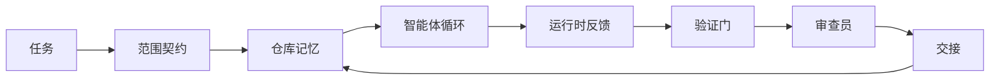

# Agent 工作台工程：为什么强大的模型仍然会失败

> 一个强大的模型是不够的。可靠的智能体需要一个工作台：指令、状态、范围、反馈、验证、审查和交接。将这些剥离，即使是前沿模型也会产生无法安全交付的成果。

**类型：** 学习 + 构建
**语言：** Python (stdlib)
**前置条件：** Phase 14 · 01 (Agent Loop), Phase 14 · 26 (Failure Modes)
**时间：** ~45 分钟

## 学习目标

- 将模型能力与执行可靠性区分开来。
- 说出决定智能体能否交付的七个工作台表面。
- 在小型仓库任务上，对比仅用提示的运行与使用工作台指导的运行。
- 生成一份失败模式报告，将每个缺失的表面映射到它导致的症状。

## 问题所在

你将一个前沿模型放入一个真实仓库，让它添加输入验证。它打开了四个文件，写出了看似合理的代码，声明成功，然后停止。你运行测试。两个失败了。第三个文件被修改了，但那与验证毫无关系。没有记录智能体做了什么假设、它首先尝试了什么、或者还有什么未完成。

模型在 Python 方面没错。它错在对工作的理解。它不知道什么算完成、它可以写入哪里、哪些测试是权威的、或者下一个会话应该如何继续。

这不是模型 bug。这是工作台 bug。围绕智能体的表面缺少将一次性生成转化为可靠、可恢复工程的部分。

## 概念

工作台是包裹模型在任务期间的运行环境。它有七个表面：

| 表面 | 承载内容 | 缺失时的故障 |
|---------|-----------------|----------------------|
| 指令 | 启动规则、禁止操作、完成定义 | 智能体猜测什么是可交付的 |
| 状态 | 当前任务、已触碰文件、阻塞项、下一步 | 每个会话从零开始 |
| 范围 | 允许文件、禁止文件、验收标准 | 修改泄漏到无关代码中 |
| 反馈 | 捕获到循环中的真实命令输出 | 智能体在 400 错误上声明成功 |
| 验证 | 测试、lint、冒烟运行、范围检查 | "看起来不错"就进入了主分支 |
| 审查 | 第二个角色进行的第二遍检查 | 建造者批改自己的作业 |
| 交接 | 改变了什么、为什么、还剩下什么 | 下一个会话重新发现一切 |

工作台独立于模型存在。你可以更换模型而保留这些表面。你不能更换表面而保留可靠性。



循环在状态文件上闭合，而不是在聊天记录上。聊天是易失的。仓库是记录系统。

### 工作台与提示工程

提示告诉模型你想要这回合的结果。工作台告诉模型如何跨回合和跨会话工作。大多数智能体失败故事都是穿着提示工程外衣的工作台失败。

### 工作台与框架

框架给你运行时（LangGraph、AutoGen、Agents SDK）。工作台给智能体一个在那个运行时内工作的地方。你需要两者。这个迷你系列专注于后者。

### 从原语推理，而非厂商分类法

目前有很多关于"harness 工程"的写作。Addy Osmani、OpenAI、Anthropic、LangChain、Martin Fowler、MongoDB、HumanLayer、Augment Code、Thoughtworks、walkinglabs awesome 列表，以及 Medium 和 Hacker News 上一篇接一篇的文章都在讨论这个。它们对 harness 的边界、范围内容和应使用的词汇存在分歧。我们不需要选边站。七个表面是一个 UX 层；在每个工作台下面，都有相同的分布式系统原语来支撑任何可靠的后端。

暂时去掉 agent 标签。一次 agent 运行是跨越时间、进程和机器的计算。要使其可靠，你需要与任何生产系统相同的基本原语。

| 原语 | 是什么 | 对 agent 承载什么 |
|-----------|------------|------------------------------|
| 函数 | 类型化处理器。尽量纯净。拥有自己的输入和输出。 | 工具调用、规则检查、验证步骤、模型调用 |
| 工作者 | 长期运行的进程，拥有函数和生命周期 | 建造者、审查者、验证者、MCP 服务器 |
| 触发器 | 调用函数的-event 源 | Agent 循环滴答、HTTP 请求、队列消息、cron、文件变更、钩子 |
| 运行时 | 决定什么在哪里运行、使用什么超时和资源的边界 | Claude Code 的进程、LangGraph 的运行时、工作者容器 |
| HTTP / RPC | 调用者和工作者之间的传输 | 工具调用协议、MCP 请求、模型 API |
| 队列 | 触发器和工作者之间的持久缓冲区；背压、重试、幂等性 | 任务板、反馈日志、审查收件箱 |
| 会话持久化 | 生存于崩溃、重启、模型更换的状态 | `agent_state.json`、检查点、KV 存储、仓库本身 |
| 授权策略 | 谁能调用哪个函数、带什么范围 | 允许/禁止文件、审批边界、MCP 能力列表 |

现在将七个工作台表面对映到这些原语。

- **指令** — 策略 + 函数元数据。规则是检查（函数）。路由器（`AGENTS.md`）是附加到运行时启动的策略。
- **状态** — 会话持久化。运行时每一步读取的键值存储。文件、KV 或 DB；持久化语义重要，存储后端不重要。
- **范围** — 按任务划分的授权策略。允许/禁止的 glob 是 ACL。需要审批的是权限格。
- **反馈** — 写入队列的调用日志。每次 shell 调用都是一条记录，持久化、可重放。
- **验证** — 一个函数。对输入是确定性的。在任务关闭时触发。失败时关闭。
- **审查** — 一个独立的 worker，对建造者工件有只读权限，对审查报告有只写权限。
- **交接** — 由会话结束触发器发出的持久记录。下一个会话的启动触发器读取它。

Agent 循环本身是一个消费事件（用户消息、工具结果、计时器滴答）、调用函数（模型，然后是模型选择的工具）、写入记录（状态、反馈）、发出触发器（验证、审查、交接）的工作者。没有神秘之处；与作业处理器相同的形状。

### 流通中的模式，翻译为原语

每个流行的 harness 模式都归结为八个原语。翻译表。

| 厂商或社区模式 | 它实际上是 |
|------------------------------|--------------------|
| Ralph Loop（Claude Code、Codex、agentic_harness 书）— 当 agent 试图提前停止时，将原始意图重新注入新的上下文窗口 | 一个触发器，将任务重新入队，带有干净的上下文；会话持久化将目标向前传递 |
| 计划 / 执行 / 验证（PEV） | 三个工作者，每个角色一个，通过状态和阶段间的队列通信 |
| Harness-compute 分离（OpenAI Agents SDK，2026 年 4 月）— 将控制面与执行面分离 | 重新表述控制面 / 数据面。比 agent 标签早几十年 |
| Open Agent Passport（OAP，2026 年 3 月）— 在执行前根据声明策略签名和审计每次工具调用 | 一个授权策略，由预动作工作者执行，带有签名审计队列 |
| 指南和传感器（Birgitta Böckeler / Thoughtworks）— 前馈规则 + 反馈可观测性 | 授权策略 + 验证函数 + 可观测性跟踪 |
| 渐进式压缩，5 阶段（Claude Code 逆向工程，2026 年 4 月） | 一个状态管理工作者，以 cron 风格运行在会话持久化上，以保持其低于预算 |
| 钩子 / 中间件（LangChain、Claude Code）— 拦截模型和工具调用 | 触发器 + 函数包装在运行时调用路径周围 |
| 作为 Markdown 的技能，带渐进式披露（Anthropic、Flue） | 一个函数注册表，其中函数元数据按需加载到上下文中 |
| 沙箱智能体（Codex、Sandcastle、Vercel Sandbox） | 计算面：一个具有隔离文件系统、网络和生命周期的运行时 |
| MCP 服务器 | 通过稳定 RPC 暴露函数的工作者，能力列表作为授权 |

该表中的每个条目都是 agent 社区发现一个已经在分布式系统中有了名称的原语，并给它起了一个新名字。用于营销的有用标签；作为工程词汇并不有用。

### 这些收据实际上说了什么

harness 优于 model 的主张现在有了数字支持。值得了解，因为它们也是对"只需等待更聪明的模型"的唯一诚实反驳。

- Terminal Bench 2.0 — 相同模型，harness 变更将编码 agent 从 top 30 之外移至第五名（LangChain，《智能体 harness 解剖》）。
- Vercel — 删除了 80% 的 agent 工具；成功率从 80% 跃升至 100%（MongoDB）。
- Harvey — 法律 agent 仅通过 harness 优化就将准确率提高了一倍多（MongoDB）。
- 88% 的企业 AI agent 项目无法达到生产环境。失败集中在运行时，而非推理（preprints.org，《语言 agent 的 Harness 工程》，2026 年 3 月）。
- 一项 2025 年跨三个流行开源框架的基准研究报道了约 50% 的任务完成率；长上下文 WebAgent 在长上下文条件下从 40-50% 崩溃到不到 10%，主要来自无限循环和目标丢失（在 2026 年初广泛报道）。

要点不是"harness 永远获胜"。模型会随着时间的推移吸收 harness 技巧。要点是，今天，承重工程是在模型周围，而不是在模型内部，而承载这些负载的原语是任何生产系统一直需要的。

### 厂商文档不足之处

这是你不需要客气的部分。

- LangChain 的《智能体 harness 解剖》列举了十一个组件 — prompts、tools、hooks、sandboxes、orchestration、memory、skills、subagents，以及一个运行时"哑循环"。它没有命名队列、作为部署单元的工作者、触发器语义、将会话持久化作为单独关注点，或授权策略。它将 harness 视为一个你配置的对象，而非一个你部署的系统。
- Addy Osmani 的《Agent Harness Engineering》提出了 `Agent = Model + Harness` 的框架和棘轮模式，但没有说明 harness 由什么构成。它读起来像是一种立场，而非规范。
- Anthropic 和 OpenAI 在表面上最深，但局限于自己的运行时。2026 年 4 月 Agents SDK 中的"harness-compute 分离"公告是第一个明确支持控制面 / 数据面分离的厂商文档。这是一个原语想法，并非新思想。
- agentic_harness 书将 harness 视为配置对象（Jaymin West 的《Agentic Engineering》，第 6 章），其中最强的一句是"harness 是智能体系统中的主要安全边界"。这只是重新表述的授权策略。
- Hacker News 帖子不断到达同一地方。2026 年 4 月的帖子《agent harness 应在沙箱之外》论证 harness 应坐在"更像 hypervisor，位于一切之外，基于上下文和用户授权访问"。这再次是作为单独平面的授权策略。

你不需要不同意这些文章来注意到差距。它们在为已经存在的系统编写 UX 描述。我们在构建系统。当系统构建正确时，七个表面会从原语中涌现。当构建错误时，任何 `AGENTS.md` 的打磨都无法修复缺失的队列。

因此，当你在别处听到"harness 工程"时，翻译为原语。Prompts 和规则是策略和函数。脚手架是运行时。护栏是授权 + 验证。钩子是触发器。记忆是会话持久化。Ralph Loop 是重新入队。Subagents 是工作者。沙箱是计算面。词汇变化；工程不变。工作台是 agent 友好的 UX；harness，在这个能经得起下一次厂商重新框架的意义下，是正确连接的功能、工作者、触发器、运行时、队列、持久化和策略。

```figure
wb-seven-surfaces
```

## 构建它

`code/main.py` 运行一个小型仓库任务两次。首先仅用提示，然后接入七个表面。相同模型，相同任务。脚本计算失败运行中缺失了多少表面，并打印失败模式报告。

仓库任务故意很小：为一个单文件 FastAPI 风格处理器添加输入验证并编写通过测试。

运行它：

```
python3 code/main.py
```

输出：两个运行的并排日志、总结仅提示运行的 `failure_modes.json`，以及工作台运行的单行结论。

Agent 是一个小型基于规则的存根；重点是表面，而非模型。在本迷你系列的其余部分，你将重建每个表面作为真正可重用的工件。

## 使用它

三个地方，工作台表面已经存在于现实中，即使没人这么叫它们：

- **Claude Code、Codex、Cursor。** `AGENTS.md` 和 `CLAUDE.md` 是指令表面。斜杠命令是范围。钩子是验证。
- **LangGraph、OpenAI Agents SDK。** 检查点和会话存储是状态表面。交接是交接表面。
- **真实仓库上的 CI。** 测试、lint 和类型检查是验证。PR 模板是交接。CODEOWNERS 是审查。

工作台工程是让这些表面变得明确且可重用的纪律，而不是让每个团队各自重新发现它们。

## 交付

`outputs/skill-workbench-audit.md` 是一个便携技能，审计现有仓库的七个工作台表面，报告哪些缺失、哪些部分存在、哪些健康。放在任何 agent 设置旁边；它告诉你首先修复什么。

## 练习

1. 选择一个你已经运行 agent 的仓库。从 0（缺失）到 2（健康）评分七个表面。你最强的表面是什么？最弱的表面是什么？
2. 扩展 `main.py`，让仅提示的运行也产生虚假的"成功"声明。验证验证门是否本应捕获它。
3. 为你的产品添加第八个表面。证明它不会坍缩到现有七个中的任何一个。
4. 用另一个会幻觉出额外文件写入的存根 agent 重新运行脚本。哪个表面最先捕获它？
5. 将 Phase 14 · 26 中的五个行业反复出现的失败模式映射到七个表面。每个表面旨在吸收哪种模式？

## 关键术语

| 术语 | 人们说的 | 它实际意味着 |
|------|----------------|------------------------|
| 工作台 | "设置" | 围绕模型的工程表面，使工作可靠 |
| 表面 | "一个文档"或"一个脚本" | 智能体每回合读取或写入的命名、机器可读输入 |
| 记录系统 | "笔记" | 当聊天记录消失时，智能体视为真理的文件 |
| 完成定义 | "验收" | 一个客观的、文件支持的清单，智能体无法伪造 |
| 工作台审计 | "仓库就绪检查" | 对七个表面的检查，在工作开始前标记缺失部分 |

## 延伸阅读

将这些作为数据点阅读，而非权威。每个都是部分分类法。在决定是否采用之前，将每个概念翻译回原语（函数、工作者、触发器、运行时、HTTP/RPC、队列、持久化、策略）。

厂商框架：

- [Addy Osmani, Agent Harness Engineering](https://addyosmani.com/blog/agent-harness-engineering/) — `Agent = Model + Harness` 和棘轮模式；基础设施薄弱
- [LangChain, The Anatomy of an Agent Harness](https://blog.langchain.com/the-anatomy-of-an-agent-harness/) — 十一个组件：prompts、tools、hooks、orchestration、sandboxes、memory、skills、subagents、runtime；缺少队列、部署、authz
- [OpenAI, Harness engineering: leveraging Codex in an agent-first world](https://openai.com/index/harness-engineering/) — Codex 团队对其运行时周围表面的看法
- [OpenAI, Unrolling the Codex agent loop](https://openai.com/index/unrolling-the-codex-agent-loop/) — agent 循环简化为对函数调用的 `while`
- [Anthropic, Effective harnesses for long-running agents](https://www.anthropic.com/engineering/effective-harnesses-for-long-running-agents) — 特定运行时内的长周期表面
- [Anthropic, Harness design for long-running application development](https://www.anthropic.com/engineering/harness-design-long-running-apps) — 应用设计笔记
- [LangChain Deep Agents harness capabilities](https://docs.langchain.com/oss/python/deepagents/harness) — 运行时配置表面

有可用细节的实践文章：

- [Martin Fowler / Birgitta Böckeler, Harness engineering for coding agent users](https://martinfowler.com/articles/harness-engineering.html) — 指南（前馈）+ 传感器（反馈）；最清晰的控制论框架
- [HumanLayer, Skill Issue: Harness Engineering for Coding Agents](https://www.humanlayer.dev/blog/skill-issue-harness-engineering-for-coding-agents) — "这不是模型问题，是配置问题"
- [MongoDB, The Agent Harness: Why the LLM Is the Smallest Part of Your Agent System](https://www.mongodb.com/company/blog/technical/agent-harness-why-llm-is-smallest-part-of-your-agent-system) — 收据：Vercel 80% 到 100%，Harvey 2 倍准确率，Terminal Bench Top 30 到 Top 5
- [Augment Code, Harness Engineering for AI Coding Agents](https://www.augmentcode.com/guides/harness-engineering-ai-coding-agents) — 约束优先演练
- [Sequoia podcast, Harrison Chase on Context Engineering Long-Horizon Agents](https://sequoiacap.com/podcast/context-engineering-our-way-to-long-horizon-agents-langchains-harrison-chase/) — 运行时关注点优于模型关注点

书籍、论文和参考实现：

- [Jaymin West, Agentic Engineering — Chapter 6: Harnesses](https://www.jayminwest.com/agentic-engineering-book/6-harnesses) — 书籍级处理，将 harness 视为主要安全边界
- [preprints.org, Harness Engineering for Language Agents (March 2026)](https://www.preprints.org/manuscript/202603.1756) — 学术框架作为控制 / 代理 / 运行时
- [walkinglabs/awesome-harness-engineering](https://github.com/walkinglabs/awesome-harness-engineering) — 跨上下文、评估、可观测性、编排的策划阅读列表
- [ai-boost/awesome-harness-engineering](https://github.com/ai-boost/awesome-harness-engineering) — 替代策划列表（工具、评估、记忆、MCP、权限）
- [andrewgarst/agentic_harness](https://github.com/andrewgarst/agentic_harness) — 生产就绪的参考实现，带有 Redis 支持的记忆和评估套件
- [HKUDS/OpenHarness](https://github.com/HKUDS/OpenHarness) — 内置个人 agent 的开源 agent harness

值得因分歧而非共识阅读的 Hacker News 帖子：

- [HN: Effective harnesses for long-running agents](https://news.ycombinator.com/item?id=46081704)
- [HN: Improving 15 LLMs at Coding in One Afternoon. Only the Harness Changed](https://news.ycombinator.com/item?id=46988596)
- [HN: The agent harness belongs outside the sandbox](https://news.ycombinator.com/item?id=47990675) — 论证将授权作为单独平面

本课程内部交叉引用：

- Phase 14 · 23 — OpenTelemetry GenAI 约定：传感器文献指向的可观测性层
- Phase 14 · 26 — 失败模式目录，七个表面旨在吸收这些模式
- Phase 14 · 27 — 提示注入防御，位于授权策略原语
- Phase 14 · 29 — 生产运行时（队列、事件、cron）：本课程中原语在部署中的位置
