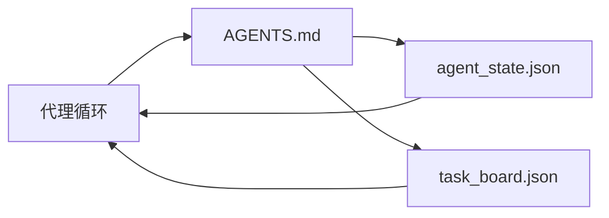

# 最小代理工作台

> 最小的可用工作台由三个文件组成：一个根指令路由器、一个状态文件和一个任务看板。其余内容都是在此之上叠加的。如果一个仓库承载不了这三个文件，再强的模型也救不了它。

**类型：** 构建
**语言：** Python（标准库）
**前置条件：** 第 14 阶段 · 31（为何强大的模型仍然会失败）
**预计时间：** 约 45 分钟

## 学习目标

- 定义构成最小可行工作台的三个文件。
- 解释为何简短的根路由器优于冗长的单体 `AGENTS.md`。
- 构建一个代理在每一步都能读取、在结束时能够写入的状态文件。
- 构建一个能跨越多次会话工作的任务看板，无需依赖聊天记录。

## 问题所在

大多数团队倾向于通过编写一个 3000 行的 `AGENTS.md` 并认为这就够了。模型加载它，忽略那些它无法总结的部分，仍然在相同的缺陷上失败。

你需要的是相反的做法。一个简短的根文件，仅在必要时将代理路由到更深层的文件。代理在行动前读取的可持久化状态，行动后写入。一张说明哪些工作在进行中、哪些被阻塞、哪些是下一步的任务看板。

三个文件，每个都有明确的职责，都足够结构化，以便日后演进成真正的系统。

## 核心概念



### AGENTS.md 是路由器，不是手册

一个好的 `AGENTS.md` 应该简短。它指引代理去：

- 状态文件（你在哪里）。
- 任务看板（还剩什么）。
- 更深层的规则（位于 `docs/agent-rules.md`）。
- 验证命令（如何确认它能工作）。

任何更长的内容都放入更深层的文档中，仅在需要时加载。冗长的手册会被忽略，简短的路由器会被遵循。

### agent_state.json 是系统记录

状态携带：当前任务 id、已触达的文件、所做的假设、阻塞项和下一步动作。代理在每一步都读取它。下一次会话直接读取它，而非回放聊天记录。

状态存在于文件中，因为聊天记录不可靠。会话会中断，对话会被截断，文件不会。

### task_board.json 是队列

任务看板携带每个任务的 `todo | in_progress | done | blocked` 状态。它是状态为空时代理从中拉取任务的队列，也是你想确认代理是否跟上进度的队列。

看板上的任务包含 id、目标、负责人（`builder`、`reviewer` 或 `human`）和验收标准。看板故意保持简短：当它超出一个屏幕大小时，你面临的是规划问题，而非看板问题。

### 三个文件是下限，不是上限

后续课程会添加范围契约、反馈执行器、验证门控、审查员清单和交接包。这里的三个文件是所有这些方案的前提假设。

```figure
wb-three-files
```

## 构建它

`code/main.py` 向一个空仓库写入最小工作台，并演示一次完整的代理回合，该回合：

1. 读取 `agent_state.json`。
2. 若状态为空，从 `task_board.json` 中拉取下一个任务。
3. 在工作范围内触碰单个文件。
4. 回写更新后的状态。

运行它：

```
python3 code/main.py
```

脚本会在自身旁边创建 `workdir/`，铺设这三个文件，运行一次代理回合，并打印差异。再次运行可以看到第二次回合如何接上第一次的结尾。

## 使用它

在实际的代理产品中，同样的三个文件会以不同的名称出现：

- **Claude Code：** `AGENTS.md` 或 `CLAUDE.md` 作为路由器，`.claude/state.json` 形式的存储作为状态，钩子作为看板。
- **Codex / Cursor：** 工作区规则作为路由器，会话记忆作为状态，聊天侧栏中的排队任务作为看板。
- **自定义 Python 代理：** 正是你刚刚写的那三个文件。

名称会变，形状不变。

## 生产环境的现成模式

最小工作台在面对真实 monorepo 时，需要叠加三个模式才能存活。它们是独立的，选择你的仓库真正需要的即可。

**嵌套 `AGENTS.md` 配合最近优先原则。** OpenAI 在其主仓库中分发了 88 个 `AGENTS.md` 文件，每个子组件一个。Codex、Cursor、Claude Code 和 Copilot 都会从当前工作文件向仓库根目录遍历，拼接沿途遇到的所有 `AGENTS.md`。子目录文件扩展根文件。Codex 额外支持 `AGENTS.override.md` 用于替换而非扩展；该覆盖机制是 Codex 独有的，跨工具协作时请避免使用。Augment Code 的测量结论是：最好的 `AGENTS.md` 文件带来的质量提升相当于从 Haiku 升级到 Opus；最差的会让输出比没有任何文件更糟。

**拒绝反模式，即使它们看起来能覆盖更多内容。** 冲突的指令会无声地将代理从交互式降级为贪婪模式（ICLR 2026 AMBIG-SWE：48.8% → 28% 解决率）；改用编号优先级而非平铺堆叠。没有强制命令的不可验证风格规则（如"遵循 Google Python 风格指南"）会让代理自行发明合规方式；每条风格规则都要配上精确的 lint 命令。以风格开头、命令靠后会将验证路径埋没；先命令，后风格。为人类而非代理写作会浪费上下文预算；简洁是一种特性。

**跨工具符号链接。** 一个根文件配合符号链接（`ln -s AGENTS.md CLAUDE.md`、`ln -s AGENTS.md .github/copilot-instructions.md`、`ln -s AGENTS.md .cursorrules`）能让所有编码代理共享同一份权威来源。Nx 的 `nx ai-setup` 可从单一配置自动完成 Claude Code、Cursor、Copilot、Gemini、Codex 和 OpenCode 的全部设置。

## 交付

`outputs/skill-minimal-workbench.md` 可为任意新仓库生成三文件工作台：适配项目的 `AGENTS.md` 路由器、拥有正确键的 `agent_state.json`，以及以当前待办事项为种子的 `task_board.json`。

## 练习

1. 向 `agent_state.json` 添加 `last_run` 时间戳。若文件超过 24 小时，除非操作员确认，否则拒绝执行。
2. 向任务看板添加 `priority` 字段，并修改拉取逻辑，使其始终选择优先级最高的 `todo` 任务。
3. 将 `task_board.json` 迁移为 JSON Lines 格式，使每个任务独占一行，在版本控制中 diff 更清晰。
4. 编写 `lint_workbench.py`：若 `AGENTS.md` 超过 80 行或引用了不存在的文件，则报错失败。
5. 判断三个文件中丢失哪一个伤害最大，并为之辩护。

## 关键术语

| 术语 | 人们常说的说法 | 实际含义 |
|------|----------------|----------|
| Router | `AGENTS.md` | 简短的根文件，指引代理前往更深层的文档和文件 |
| State file | "笔记" | 机器可读的记录，说明代理的位置，每步都会写入 |
| Task board | "待办清单" | 带有状态、负责人、验收标准的 JSON 任务队列 |
| System of record | "真相来源" | 当聊天记录消失后，工作台视其为权威依据的文件 |

## 延伸阅读

- [agents.md — 开放规范](https://agents.md/) — 已被 Cursor、Codex、Claude Code、Copilot、Gemini、OpenCode 采纳
- [Augment Code，《好的 AGENTS.md 等于一次模型升级，坏的 AGENTS.md 比完全没有文档更糟》](https://www.augmentcode.com/blog/how-to-write-good-agents-dot-md-files) — 经测量的质量提升数据
- [Blake Crosley，《AGENTS.md 模式：哪些真正改变了代理行为》](https://blakecrosley.com/blog/agents-md-patterns) — 经验验证的有效做法与无效做法
- [Datadog Frontend，《用 AGENTS.md 在 Monorepo 中引导 AI 代理》](https://dev.to/datadog-frontend-dev/steering-ai-agents-in-monorepos-with-agentsmd-13g0) — 嵌套优先级的实践经验
- [Nx Blog，《教你的 AI 代理如何在 Monorepo 中工作》](https://nx.dev/blog/nx-ai-agent-skills) — 六款工具的单一来源生成
- [The Prompt Shelf，《AGENTS.md 最佳实践：结构、范围和真实示例》](https://thepromptshelf.dev/blog/agents-md-best-practices/) — 经得起审查的章节排序
- [Anthropic，《Claude Code 子代理》](https://code.claude.com/docs/en/sub-agents)
- 第 14 阶段 · 31 —— 本最小工作台所吸收的失败模式
- 第 14 阶段 · 34 —— 本课程预告的持久化状态模式
