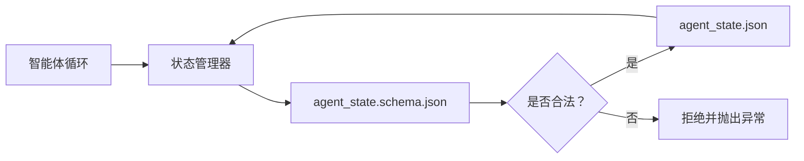

# 仓库记忆与持久化状态

> 聊天记录是易失的。仓库是持久的。工作台将智能体状态存储在版本化文件中，这样下一次会话、下一个智能体和下一个审查者都能从同一个真实来源读取。

**类型：** 构建
**语言：** Python（stdlib + `jsonschema` 可选）
**前置：** 第 14 阶段 · 32（最小化工作台）
**耗时：** 约 60 分钟

## 学习目标

- 定义什么属于仓库记忆，什么属于聊天记录。
- 为 `agent_state.json` 和 `task_board.json` 编写 JSON Schema。
- 构建一个状态管理器，能够加载、验证、修改并以原子方式持久化状态。
- 利用 schema 在写入之前拒绝无效状态，防止其污染工作台。

## 问题所在

智能体结束了一次会话，聊天关闭，下次会话打开并询问从哪里开始。模型说"让我检查下文件"，读取了过时的笔记，然后重复完成了的工作。或者更糟——它重写了一个已完成文件，因为没人告诉它那个文件已经完成了。

工作台的修复方案是仓库记忆：状态以 JSON 文件形式存在于仓库中，在 schema 下写入，以原子方式持久化，便于代码审查时 diff。聊天是临时流；仓库才是记录系统。

## 概念



### 什么属于仓库记忆

| 属于 | 不属于 |
|------|--------|
| 当前任务 id | 原始聊天转录 |
| 本次会话触碰过的文件 | Token 级推理痕迹 |
| 智能体做出的假设 | "用户似乎很沮丧" |
| 未解决的阻碍 | 采样完成的输出 |
| 下一步行动 | 厂商特定的模型 id |

测试标准是持久性：三个月后在 CI 重跑中这还有用吗？如果有，放入仓库；如果没有，放入遥测。

### 先定义 Schema 的状态

JSON Schema 是契约。没有它，每个智能体都发明新字段，每个审查者都要学习新结构，每个 CI 脚本都必须对旧版本做特殊处理。有了它，无效写入会被拒绝。

Schema 涵盖：

- 必填键。
- 允许的 `status` 值。
- 禁止的值（例如数组不允许 `null`）。
- 模式约束（任务 id 匹配 `T-\d{3,}`）。
- 用于迁移的版本字段。

### 原子写入

状态写入需要容忍部分失败：写入临时文件，fsync，然后 rename 覆盖目标。状态文件是真实来源；半个写入的文件比完全没有文件更糟。

### 迁移

当 schema 发生变化时，在 schema 版本号升级旁附带迁移脚本。状态文件携带 `schema_version` 字段；管理器拒绝加载无法迁移的版本。

```figure
wb-state-persist
```

## 构建

`code/main.py` 实现了：

- `agent_state.schema.json` 和 `task_board.schema.json`。
- 仅用 stdlib 的验证器（JSON Schema 子集：required、type、enum、pattern、items）。
- `StateManager.load`、`StateManager.update`、`StateManager.commit`，以原子方式的"写临时文件再 rename"实现持久化。
- 一个演示脚本，修改状态、持久化、重新加载，并证明往返一致。

运行：

```
python3 code/main.py
```

该脚本写入 `workdir/agent_state.json` 和 `workdir/task_board.json`，在两轮之间修改它们，并在每个步骤打印验证后的状态。

## 生产环境中的模式

四种模式将这个课程的最低要求转化为多智能体重型仓库可存活的东西。

**原子式的"写临时文件再 rename"不是可选的。** 一份 March 2026 的 Hive 项目 bug 报告清晰记录了失败模式：`state.json` 通过 `write_text()` 写入，异常被捕获并静默吞掉。部分写入导致会话在损坏状态下恢复，且没有任何信号提示。修复方案始终如一：使用 `tempfile.mkstemp` 在与目标相同的目录中创建临时文件，写入，`fsync`，然后 `os.replace`（POSIX 和 Windows 上的原子 rename）。本课程中的 `atomic_write` 正是这样实现的。

**为每个非幂等工具调用附加幂等键。** 如果智能体在调用工具后、检查点结果前崩溃，恢复时会重试该工具调用。对读操作安全；对发送邮件、数据库插入、文件上传来说则很危险。做法是：在执行前将每个工具调用 ID 记录到 `pending_calls.jsonl`。重试时检查该 ID；若已存在，则跳过调用并使用缓存结果。Anthropic 和 LangChain 在 2026 年的指南中都提到了这一点；LangGraph 的 checkpointer 同样因为此原因持久化待处理写入。

**将大型制品与状态分离。** 不要将 CSV、长转录或生成的文件存入 `agent_state.json`。将制品保存为独立文件（或上传到对象存储），仅在状态中保留路径。检查点保持小巧快速；制品独立增长。

**事件溯源用于审计，快照用于恢复。** 每次修改时追加到事件日志（`state.events.jsonl`）；定期快照到 `state.json`。恢复时读取快照，然后重放快照时间戳之后的任何事件。这消耗更多磁盘空间，但让你能够逐字重放智能体的决策——这对调试长周期运行至关重要。Postgres 内部使用相同的结构来管理 WAL。

**有 Schema 迁移，或拒绝加载。** `schema_version` 整数就是契约。当管理器在未知版本加载文件时，它拒绝读取。在 schema 升级旁附带迁移脚本；`tools/migrate_state.py` 在每个启动时幂等运行。

## 如何使用

在生产环境中：

- **LangGraph checkpointer。** 思路相同，存储方式不同。checkpointer 将图状态持久化到 SQLite、Postgres 或自定义后端。本课程教授的 schema 是在 checkpointer 失效、需要手动读取状态时的替代品。
- **Letta 记忆块。** 具有结构化 schema 的持久化块（第 14 阶段 · 08）。将同样的纪律应用于长期运行的角色。
- **OpenAI Agents SDK 会话存储。** 可插拔后端，感知 schema。本课程中的状态文件即本地文件后端。

## 交付物

`outputs/skill-state-schema.md` 生成一个项目特定的 JSON Schema 配对（状态 + 看板）、一个绑定到原子写入的 Python `StateManager`，以及一个迁移脚手架，确保下次 schema 升级不会破坏工作台。

## 练习

1. 添加 `last_human_touch` 时间戳。拒绝任何在人类编辑后五秒内由智能体发起的写入。
2. 扩展验证器以支持 `oneOf`，使一个任务可以是构建任务或审查任务，各自有不同的必填字段。
3. 添加 `schema_version` 字段，并编写从 v1 到 v2 的迁移脚本（将 `blockers` 重命名为 `risks`）。
4. 将存储后端从本地文件迁移到 SQLite。保持 `StateManager` API 不变。
5. 让两个智能体同时对同一个状态文件进行写入，引入 50ms 写入竞争。会发生什么，原子 rename 如何挽救局面？

## 关键术语

| 术语 | 人们怎么说 | 实际含义 |
|------|-----------|---------|
| 仓库记忆 | "笔记文件" | 在仓库受跟踪文件中、在 schema 约束下的状态存储 |
| 先 Schema | "验证输入" | 在写入器之前定义契约，拒绝漂移 |
| 原子写入 | "直接 rename 就行" | 写入临时文件、fsync、rename，使得部分失败无法造成损坏 |
| 迁移 | "Schema 升级" | 将 vN 状态转换为 v(N+1) 状态的脚本 |
| 记录系统 | "单一真实来源" | 工作台视作权威的那个产物 |

## 延伸阅读

- [JSON Schema 规范](https://json-schema.org/specification.html)
- [LangGraph checkpointer](https://langchain-ai.github.io/langgraph/concepts/persistence/)
- [Letta 记忆块](https://docs.letta.com/concepts/memory)
- [Fast.io，AI 智能体状态检查点：实用指南](https://fast.io/resources/ai-agent-state-checkpointing/) —— 带幂等性的先 Schema 检查点
- [Fast.io，AI 智能体工作流状态持久化：2026 最佳实践](https://fast.io/resources/ai-agent-workflow-state-persistence/) —— 并发控制、TTL、事件溯源
- [Hive Issue #6263 —— 非原子 state.json 写入被静默忽略](https://github.com/aden-hive/hive/issues/6263) —— 真实项目中的失败模式
- [eunomia，检查点/恢复系统：演进、技术、应用](https://eunomia.dev/blog/2025/05/11/checkpointrestore-systems-evolution-techniques-and-applications-in-ai-agents/) —— 源自操作系统历史的 CR 原语在智能体中的应用
- [Indium，2026 年长周期 AI 智能体的 7 种状态持久化策略](https://www.indium.tech/blog/7-state-persistence-strategies-ai-agents-2026/)
- [Microsoft Agent Framework，压缩](https://learn.microsoft.com/en-us/agent-framework/agents/conversations/compaction) —— 厂商检查点管理器
- 第 14 阶段 · 08 —— 记忆块和休眠期计算
- 第 14 阶段 · 32 —— 本课程用 schema 化的三文件最小集
- 第 14 阶段 · 40 —— 从同一 schema 读取的交接包
