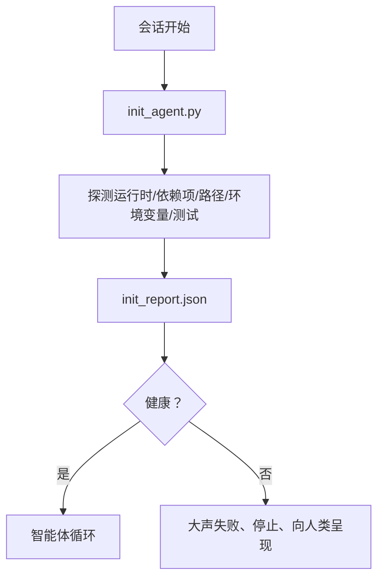

# Agent 初始化脚本

> 每次冷启动的会话都要交一次税。智能体读取相同的文件、重试相同的探测、重新发现相同的路径。一个初始化脚本支付一次税款，并将答案写入状态。

**类型：** 构建
**语言：** Python（标准库）
**前置要求：** 阶段 14 · 32（极简工具链）、阶段 14 · 34（仓库记忆）
**时间：** 约 45 分钟

## 学习目标

- 识别智能体在每个会话中不应重复完成的工作。
- 构建一个确定性的初始化脚本，探测运行时、依赖项和仓库健康状况。
- 持久化探测结果，使智能体读取它而不是重新运行检查。
- 当初始化失败时，大声失败、快速失败，并提供一个查看位置。

## 问题所在

开启一个会话。智能体猜测 Python 版本。猜测测试命令。列出仓库根目录五次以找到入口点。尝试导入一个未安装的包。询问用户配置文件在哪里。等到它进行实际编辑时，一万两千 token 已经花在了本应只需一个脚本就能完成的设置工作上。

解决方案是一个初始化脚本，它在智能体执行任何其他操作之前运行，并写入一个智能体在启动时读取的 `init_report.json`。

## 概念



### 初始化脚本的探测内容

| 探测项 | 重要性 |
|-------|--------|
| 运行时版本 | 错误的 Python 或 Node 版本意味着静默的错误版本 bug |
| 依赖项可用性 | 缺失的包后续造成的代价是现在发现的十倍 |
| 测试命令 | 智能体必须知道如何验证；如果命令缺失，工具链就坏了 |
| 仓库路径 | 硬编码路径会漂移；解析一次并固定下来 |
| 环境变量 | 缺少 `OPENAI_API_KEY` 是一个故障面，而不是运行时谜团 |
| 状态 + 看板新鲜度 | 来自崩溃会话的陈旧状态是一个陷阱 |
| 上次已知良好提交 | 会话结束时交接 diff 的锚点 |

### 大声失败，快速失败，在一个地方失败

探测失败意味着停止并向人类呈现。没有"智能体会自己搞定"这种事。初始化的全部意义在于拒绝在工具链损坏时启动。

### 幂等性

连续运行两次。第二次运行应该是空操作，除了更新的时间戳。幂等性让你能够将脚本接入 CI、hooks 或预任务斜杠命令。

### 初始化脚本与启动规则的区别

规则（阶段 14 · 33）描述的是行动必须满足的条件。初始化脚本是确立那些规则可以被检查的脚本。没有初始化脚本的规则会变成"小心为妙"。没有规则的初始化脚本会变成精致的失败。

```figure
wb-init-probes
```

## 构建它

`code/main.py` 实现了 `init_agent.py`：

- 五个探测：Python 版本、通过 `importlib.util.find_spec` 列出依赖项、测试命令可解析性、所需环境变量、状态文件新鲜度。
- 每个探测返回 `(name, status, detail)`。
- 脚本写入包含完整探测集的 `init_report.json`，如果任何阻断级探测失败则以非零状态退出。

运行它：

```
python3 code/main.py
```

脚本打印探测表，写入 `init_report.json`，在正常路径下退出零，或在失败时以非零状态和失败的探测列表退出。

## 生产环境中的模式

三种模式将一个有用的初始化脚本与仪式区分开来。

**上次已知良好提交锚定。** 将当前提交与上次成功合并时写入的 `LKG` 文件进行比对。如果差异超过预算（默认 50 个文件），拒绝启动并要求人类确认新的基线。这是 Cloudflare 的 AI 代码审查用于限定审查者智能体范围的方式：每个审查会话都锚定在相同的上次已知良好提交上，不会跨会话累积漂移。

**带 TTL 的锁文件。** 在首次成功探测通过后写入 `prereqs.lock`。后续运行信任该锁 N 小时（默认 24 小时）并跳过昂贵的探测。初始化脚本首先读取锁；如果锁是新鲜的且依赖清单哈希匹配，则短路。这与 Docker 用于层缓存的模式相同：幂等探测 + 内容哈希 = 跳过。

**热路径中没有网络、没有 LLM、没有意外。** 初始化探测是确定性的管道。调用 LLM 来分类失败或访问外部服务检查许可证的探测不是探测；它是工作流。如果探测在干跑中耗时超过三秒，将其视为工具链异味，移出初始化或缓存其结果。

## 使用它

在生产环境中：

- **Claude Code hooks。** `pre-task` hook 调用初始化脚本，如果失败则拒绝启动智能体。
- **GitHub Actions。** 一个 `setup-agent` job 运行初始化脚本；智能体 job 依赖它。
- **Docker 入口点。** 智能体容器在执行智能体运行时之前运行初始化脚本；失败时日志可见。

初始化脚本是可移植的，因为它不针对特定框架进行调用。Bash、Make 或任务文件都可以包装它。

## 交付

`outputs/skill-init-script.md` 对项目进行访谈，将其设置工作分类为探测项，并发出一个项目特定的 `init_agent.py` 以及在智能体任何步骤之前运行它的 CI 工作流。

## 练习

1. 添加一个探测，将当前提交与上次已知良好提交进行比对，如果超过 50 个文件发生变化则拒绝启动。
2. 让脚本写入 `prereqs.lock` 文件，如果锁文件超过七天则拒绝启动。
3. 添加一个 `--fix` 标志，自动安装缺失的开发依赖项，但未经批准从不修改运行时依赖项。
4. 将探测从硬编码函数移动到 YAML 注册表。为之辩护。
5. 为每个探测添加时间预算。运行超过三秒的探测是工具链异味。

## 关键术语

| 术语 | 人们所说的 | 实际含义 |
|------|-----------|---------|
| 探测 | "一个检查" | 返回 `(name, status, detail)` 的确定性函数 |
| 初始化报告 | "设置输出" | 写在状态旁边的包含探测结果的 JSON |
| 幂等性 | "安全可重运行" | 连续两次运行产生除时间戳外相同的报告 |
| 大声失败 | "不要吞咽" | 停止并向人类呈现；没有静默回退 |
| 设置税 | "引导成本" | 智能体每个会话重新发现显而易见事项所花费的 token |

## 延伸阅读

- [Anthropic, Effective harnesses for long-running agents](https://www.anthropic.com/engineering/effective-harnesses-for-long-running-agents)
- [GitHub Actions, composite actions for setup](https://docs.github.com/en/actions/sharing-automations/creating-actions/creating-a-composite-action)
- [microservices.io, GenAI dev platform: guardrails](https://microservices.io/post/architecture/2026/03/09/genai-development-platform-part-1-development-guardrails.html) — 预提交 + CI 检查作为初始化
- [Augment Code, How to Build Your AGENTS.md (2026)](https://www.augmentcode.com/guides/how-to-build-agents-md) — 初始化期望
- [Codex Blog, Codex CLI Context Compaction](https://codex.danielvaughan.com/2026/03/31/codex-cli-context-compaction-architecture/) — 会话启动作为压缩感知的初始化
- 阶段 14 · 33 — 此脚本使能的一套规则
- 阶段 14 · 34 — 此脚本播种的状态文件
- 阶段 14 · 38 — 初始化脚本馈送的验证门
- 阶段 14 · 40 — 消费初始化报告最后已知良好值的交接
