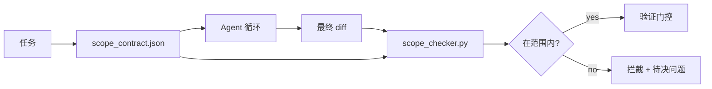

# 范围契约与任务边界

> 模型并不知道工作的边界在哪里。范围契约是一个按任务划分的文件，它说明了工作从哪里开始、到哪里结束，以及在越界时如何回滚。契约把"待在范围内"从一个愿望变成一个可检查的事实。

**类型：** 构建
**语言：** Python（标准库）
**前置条件：** Phase 14 · 32（最小化工作台）、Phase 14 · 33（规则即约束）
**耗时：** ~50 分钟

## 学习目标

- 编写一份范围契约：agent 在任务开始时读取它，验证器在任务结束时读取它。
- 明确允许的文件、禁止的文件、验收标准、回滚方案和审批边界。
- 实现一个范围检查器：将 diff 与契约进行比较并标记违规。
- 让范围蔓延变得可见、自动且可审查。

## 问题所在

Agent 会越界。任务说的是"修复登录 bug"，diff 却碰了登录路由、邮件辅助函数、数据库驱动、README 和发布脚本。每一步在当时都看似合理。但合在一起，它已经变成了一个不同于已审查变更的变更。

范围蔓延是 agent 工作中最缺乏监控的失败模式，因为 agent 会真诚地叙述每一步。解决方案不是更严格的 prompt，而是一份写在磁盘上的契约，说明承诺了什么，再有一个检查来对比结果与承诺。

## 概念



### 范围契约包含什么

| 字段 | 作用 |
|-------|---------|
| `task_id` | 与看板上的任务关联 |
| `goal` | 审查者可验证的一句话 |
| `allowed_files` | agent 可写入的通配符 globs |
| `forbidden_files` | agent 不得触碰的通配符 globs（即使是误触） |
| `acceptance_criteria` | 证明"已完成"的测试命令或断言行 |
| `rollback_plan` | 一行段落，操作员在需要中止时可执行 |
| `approvals_required` | 超出范围、需要人工明确签字的动作 |

没有 `forbidden_files` 的契约是不完整的。负空间是契约的一半。

### 用 globs，而非裸路径

真实的仓库会移动文件。把契约钉在 glob 上（如 `app/**/*.py`、`tests/test_signup*.py`），这样会话间的重构就不会使契约失效。

### 回滚是范围的一部分

列出如何回滚，会迫使契约作者思考可能出什么问题。一份无法回滚的契约，是一份不应被批准的契约。

### 范围检查就是 diff 检查

agent 写出一份 diff，检查器读取 diff、允许 globs、禁止 globs，以及已执行的 acceptance 命令列表。每条违规都是一个带标签的发现，验证门控可以据此拒绝。

### 两种粒度的范围：功能列表与任务契约

范围契约限制的是单个任务，而不是整个项目。一个 agent 可以完美地待在登录修复的契约内，但在下一次回合却决定项目还需要一个设置页、一个深色模式开关和一次路由重写。契约从未被要求判断"项目范围内该做哪些工作"，只判断"任务范围内该碰哪些文件"。

第二种粒度需要自己的原语：一个 `feature_list.json`，agent 在会话开始时读取。它是项目的待办事项，以机器可读的有序文件形式存在。agent 恰好挑选一个 `status` 为 `todo` 的功能，将其 `id` 写入当前范围契约，并在同一会话中禁止开始第二个功能。"一次一个功能"不再是一句 agent 可以自我辩解的 prompt 条款，而是从磁盘读出的值和门控强制执行的检查。

```json
{
  "project": "knowledge-base",
  "active": "import-pdf",
  "features": [
    { "id": "import-pdf",   "status": "in_progress", "goal": "将 PDF 导入库中",        "done_when": "pytest tests/test_import.py && 示例 PDF 出现在库视图中" },
    { "id": "full-text-search", "status": "todo",     "goal": "搜索文档文本并按相关性排序",   "done_when": "查询返回带摘要的排序结果" },
    { "id": "cite-answers", "status": "todo",         "goal": "回答携带来源引用",        "done_when": "每条回答至少渲染一个可点击的引用" }
  ]
}
```

| 字段 | 作用 |
|-------|---------|
| `active` | 当前会话可触碰的单一功能；为空时表示挑选一个并设为 active |
| `features[].id` | 稳定 slug，范围契约的 `task_id` 指向它 |
| `features[].status` | `todo`、`in_progress`、`done`、`blocked`；同时只能有一个 `in_progress` |
| `features[].goal` | 审查者可验证的一句话 |
| `features[].done_when` | 将 `in_progress` 翻转为 `done` 的验收行 |

两条规则让这个列表成为承重结构而非装饰。第一条：不变量"最多一个 `in_progress`"本身就是一次启动检查（Phase 14 · 33）：如果列表显示有两个，会话拒绝启动，直到人工解决。第二条：功能列表是一个文件，而不是一条聊天消息，因为聊天会滑出上下文，文件则跨会话和跨 agent 持久存在。交接（Phase 14 · 40）会将已完成功能的状态写回 `done`，使下一次会话打开的是一个准确的面板，而不是重新推导剩余工作。

契约和列表通过最小权限组合：任务契约的 `allowed_files` 必须落在当前活跃功能所触碰的范围内，绝不允许超出。

```figure
wb-scope-bounce
```

## 构建它

`code/main.py` 实现了：

- `scope_contract.json` schema（JSON Schema 子集、glob 数组）。
- 一个 diff 解析器，把触达文件列表和执行命令列表转为 `RunSummary`。
- 一个 `scope_check`，对照契约返回 `(violations, in_scope, off_scope)`。
- 两次示例运行：一次待在范围内，一次蔓延。检查器会标记蔓延之处，给出精确文件和原因。

运行方式：

```
python3 code/main.py
```

输出：契约、两次运行的结果、每次的运行结论，以及一份保存的 `scope_report.json`。

## 生产环境中的实践模式

一位实践者在使用"specsmaxxing"（在调用 agent 之前用 YAML 写范围契约）后报告：三周内兔子洞率从 52% 降至 21%，且未改动 agent。起作用的不是模型，而是契约。三项模式让收益得以固化。

**违规预算，而非二元失败。** `agent-guardrails`（Claude Code、Cursor、Windsurf、Codex 借由 MCP 使用的开源合并门控）为每个任务提供 `violationBudget`：预算内的轻微越界以 warning 形式呈现；只有超出预算时合并门控才会拒绝。配合 `violationSeverity: "error" | "warning"` 使用。预算是让门控真正投入生产、而不是被团队因讨厌它而关掉的差别所在。

**按路径族设置严重性不对称。** 对 `docs/**` 的越界写入通常只是 `warn`；对 `scripts/**`、`migrations/**`、`config/prod/**` 的越界写入一律 `block`。这种不对称必须存在于契约中而非运行时中，因为它依赖项目、且随任务变化。

**与文件预算并列的时间预算和网络预算。** `time_budget_minutes` 字段限制墙钟时间；运行时会拒绝在超出之后继续，除非重新获得批准。主机名维度的 `network_egress` 白名单防止 agent 悄悄访问任务之外的外部 API。这些同样是范围维度；文件 globs 只是必要条件而非充分条件。

**多契约合并语义（最小权限）。** 当两个范围契约同时适用（例如项目级契约加任务级契约）时，合并规则为：**交集** `allowed_files`（两份契约都必须允许该路径）、**并集** `forbidden_files`（任一禁止即禁止）、`time_budget_minutes` 取最严格的（min）、`approvals_required` 累加。`network_egress` 为 `None` 表示不执行限制、`[]` 表示全部拒绝、`[...]` 为白名单；合并时 `None` 委托给另一方、两个列表取交集、deny-all 保持 deny-all。在契约 schema 中明确这一规则，使合并过程可机械执行、可审查。

## 使用它

生产模式：

- **Claude Code 斜杠命令。** `/scope` 命令写入契约并将其钉为会话上下文。子 agent 在行动前先读契约。
- **GitHub PR。** 将契约作为 JSON 文件放入 PR 描述或作为 checked-in 产物。CI 针对合并 diff 运行范围检查器。
- **LangGraph 中断。** 范围违规触发中断；处理函数询问人工：契约是否需要扩大，还是 agent 需要退让。

契约随任务一起流转。任务关闭时，契约归档至 `outputs/scope/closed/`。

## 交付物

`outputs/skill-scope-contract.md` 生成一份针对任务描述的范围契约，以及一个在 CI 中对每次 agent diff 运行的 glob 感知检查器。

## 练习

1. 增加一个 `network_egress` 字段，列出允许的外部主机。拒绝触及其它主机的运行。
2. 扩展检查器：对 `docs/**` 软失败，对 `scripts/**` 硬失败。说明这种不对称的合理性。
3. 让契约通过一组静态规则从 `goal` 字段推导出 `allowed_files`（不使用 LLM）。第一个边界情况会哪里出错？
4. 增加 `time_budget_minutes`，一旦墙钟超出就拒绝继续。
5. 用同一份 diff 跑两份契约。两份契约同时适用时，正确的合并语义是什么？

## 关键术语

| 术语 | 人们怎么说 | 实际含义 |
|------|----------------|------------------------|
| 范围契约 | "任务简介" | 按任务列出的 JSON，包含允许/禁止文件、验收、回滚 |
| 范围蔓延 | "它还碰了……" | 同一任务内、超出契约的文件被改动 |
| 回滚方案 | "我们可以回退" | 一段操作手册，用于中止时的回滚 |
| 审批边界 | "需要签字" | 契约中列出、需要人工明确批准的项 |
| diff 检查 | "路径审计" | 将触达文件与契约 globs 做比较 |

## 延伸阅读

- [LangGraph human-in-the-loop 中断](https://langchain-ai.github.io/langgraph/concepts/human_in_the_loop/)
- [OpenAI Agents SDK 工具审批策略](https://platform.openai.com/docs/guides/agents-sdk)
- [logi-cmd/agent-guardrails — 合并门控与范围校验](https://github.com/logi-cmd/agent-guardrails) — 违规预算、严重性分级
- [Dev|Journal，使用 Agent 契约测试防止 AI Agent 配置漂移](https://earezki.com/ai-news/2026-05-05-i-built-a-tiny-ci-tool-to-keep-ai-agent-configs-from-drifting-in-my-repo/) — 无需外部依赖的 `--strict` 模式
- [Agentic Coding Is Not a Trap（生产日志）](https://dev.to/jtorchia/agentic-coding-is-not-a-trap-i-answered-the-viral-hn-post-with-my-own-production-logs-33d9) — specsmaxxing 收据：52% → 21%
- [OpenCode 权限 globs](https://opencode.ai/docs/agents/) — 细粒度按权限划分范围
- [Knostic，AI 编码 Agent 安全：威胁模型与防护策略](https://www.knostic.ai/blog/ai-coding-agent-security) — 将范围作为最小权限的一部分
- [Augment Code，AI 规格模板](https://www.augmentcode.com/guides/ai-spec-template) — 三级边界体系（必须/询问/禁止）
- Phase 14 · 27 — 与范围锁配合的 prompt 注入防御
- Phase 14 · 33 — 该契约按任务特化的规则集
- Phase 14 · 38 — 检查器所报告的验证门控
