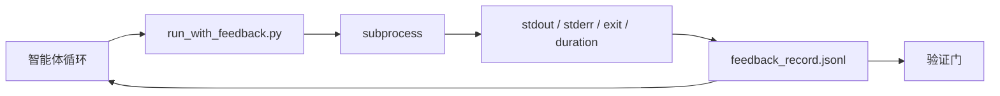

# 运行时反馈循环

> 看不到真实命令输出的智能体会进行猜测。一个反馈运行器会将 stdout、stderr、退出码和耗时捕获到结构化记录中，供下一轮读取。这样智能体就能基于事实做出反应，而不是基于自己对事实的预测。

**类型：** 构建
**语言：** Python（标准库）
**前置条件：** 阶段 14 · 32（最小工作台）、阶段 14 · 35（初始化脚本）
**时间：** 约 50 分钟

## 学习目标

- 区分运行时反馈与可观测性遥测数据。
- 构建一个包裹 shell 命令并持久化结构化记录的反馈运行器。
- 以确定性方式截断大输出，使循环保持在 token 预算内。
- 当反馈缺失时拒绝推进循环。

## 问题所在

智能体说"正在运行测试"。下一条消息说"所有测试通过"。现实是根本没有运行测试。智能体想象了输出，或者运行了命令却从未读取结果，或者读取了结果却静默地截断了失败行。

反馈运行器消除了这一差距。每条命令都经过运行器处理。每条记录都包含命令、捕获的 stdout 和 stderr、退出码、墙钟时长以及一行智能体备注。智能体在下一轮读取该记录。验证门在任务结束时读取这些记录。

## 概念



### 反馈记录中包含什么

| 字段 | 重要性 |
|------|--------|
| `command` | 精确的 argv，无 shell 展开带来的意外 |
| `stdout_tail` | 最后 N 行，确定性截断 |
| `stderr_tail` | 最后 N 行，与 stdout 分开 |
| `exit_code` | 明确的成信号 |
| `duration_ms` | 暴露慢速探测和失控进程 |
| `started_at` | 用于回放的时间戳 |
| `agent_note` | 智能体写的关于其预期的单行说明 |

### 截断是确定性的

50 MB 的日志会破坏循环。运行器使用 `...已截断 N 行...` 标记截断头部和尾部，确保确定性——相同的输出总是产生相同的记录。不采样；智能体需要看到的部分（最终错误、最终摘要）位于尾部。

### 反馈与遥测的区别

遥测（阶段 14 · 23，OTel GenAI 规范）用于人工操作员跨时间审查运行。反馈用于本次运行的下一轮。它们共享字段，但存储在不同的文件中，具有不同的保留策略。

### 没有反馈就拒绝推进

如果运行器在捕获退出之前出错，记录携带 `exit_code: null` 和 `error: <原因>`。智能体循环必须拒绝在 `null` 退出时声称成功。没有退出码，就没有进展。

```figure
wb-feedback-loop
```

## 构建

`code/main.py` 实现了：

- `run_with_feedback(command, agent_note)` 包裹 `subprocess.run`，捕获 stdout/stderr/退出/时长，确定性截断，追加到 `feedback_record.jsonl`。
- 一个小加载器，将 JSONL 流式加载为 Python 列表。
- 一个演示程序，运行三个命令（成功、失败、慢速），并打印每个命令的最后一条记录。

运行它：

```
python3 code/main.py
```

输出：三条反馈记录追加到 `feedback_record.jsonl`，每条命令的最后一条内联打印。跨多次运行 tail 该文件以查看循环如何累积。

## 生产环境中的模式

三种模式让运行器足够健壮以交付使用。

**写入时脱敏，而非读取时。** 任何触及 stdout 或 stderr 的记录都可能泄露机密。运行器在 JSONL 追加前执行脱敏传递：剥离匹配 `^Bearer `、`password=`、`api[_-]?key=`、`AKIA[0-9A-Z]{16}`（AWS）、`xox[baprs]-`（Slack）的行。在读取时脱敏是一个隐患；磁盘上的文件是攻击者能接触到的内容。每季度针对生产运行时的已知机密格式审计脱敏模式。

**轮换策略，而非单一文件。** 将 `feedback_record.jsonl` 限制在每个文件 1 MB；溢出时轮换为 `.1`、`.2`，丢弃 `.5`。智能体的循环只读取当前文件，因此运行时成本可控。CI 制品存储获得完整的轮换集合。没有轮换，文件会成为每次加载调用的瓶颈。

**父命令 ID 用于重试链。** 每条记录都获得 `command_id`；重试携带指向前一次尝试的 `parent_command_id`。审查者的"失败尝试"列表（阶段 14 · 40）和验证门的审计都遵循此链条。没有这个链接，重试看起来像是独立成功，审计会隐藏失败历史。

## 使用方式

生产模式：

- **Claude Code Bash 工具。** 该工具已经捕获 stdout、stderr、退出和时长。本教程中的运行器是适用于任何智能体产品的框架无关等价物。
- **LangGraph 节点。** 将任何 shell 节点包裹在运行器中，使记录持久化到图状态之外。
- **CI 日志。** 将 JSONL 管道传输到你的 CI 制品存储；审查者可以回放任何命令而无需重新运行会话。

运行器是一个薄封装，因其拥有记录的结构而能抵御每次框架迁移。

## 交付

`outputs/skill-feedback-runner.md` 生成项目特定的 `run_with_feedback.py`，包含正确的截断预算、连接到工作台的 JSONL 写入器，以及智能体每轮读取的加载器。

## 练习

1. 为每条记录添加 `cwd` 字段，以便区分从不同目录运行的相同命令。
2. 添加 `redaction` 步骤，剥离匹配 `^Bearer ` 或 `password=` 的行。在示例记录上测试。
3. 通过将文件轮换为 `.1`、`.2` 来将 `feedback_record.jsonl` 的总大小限制在 1 MB。论证轮换策略。
4. 添加 `parent_command_id`，使重试链可见：哪个命令产生了下一个命令消费的输入。
5. 将 JSONL 管道传输到一个小型 TUI，高亮显示最新的非零退出。TUI 在审查中要有用必须显示的八个功能。

## 关键术语

| 术语 | 人们怎么说 | 实际含义 |
|------|-----------|---------|
| 反馈记录 | "运行日志" | 包含命令、输出、退出、时长的结构化 JSONL 条目 |
| 尾部截断 | "修剪日志" | 确定性的头+尾捕获，使记录适应 token 预算 |
| 空值拒绝 | "在数据缺失时阻塞" | 当 `exit_code` 为 null 时，循环不得推进 |
| 智能体备注 | "期望标签" | 智能体在读取结果前写的一行预测 |
| 遥测分离 | "两个日志文件" | 反馈用于下一轮，遥测用于操作员 |

## 延伸阅读

- [OpenTelemetry GenAI 语义规范](https://opentelemetry.io/docs/specs/semconv/gen-ai/)
- [Anthropic，适用于长运行智能体的有效隔离](https://www.anthropic.com/engineering/effective-harnesses-for-long-running-agents)
- [Guardrails AI x MLflow — 确定性安全、PII、质量验证器](https://guardrailsai.com/blog/guardrails-mlflow) — 将脱敏模式作为回归测试
- [Aport.io，2026 最佳 AI 智能体护栏：动作前授权对比](https://aport.io/blog/best-ai-agent-guardrails-2026-pre-action-authorization-compared/) — 动作前后捕获
- [Andrii Furmanets，2026 年 AI 智能体：工具、内存、评估、护栏的实用架构](https://andriifurmanets.com/blogs/ai-agents-2026-practical-architecture-tools-memory-evals-guardrails) — 可观测性表面
- 阶段 14 · 23 — 遥测侧的 OTel GenAI 规范
- 阶段 14 · 24 — 智能体可观测性平台（Langfuse、Phoenix、Opik）
- 阶段 14 · 33 — 要求在声明完成前必须有反馈的规则
- 阶段 14 · 38 — 读取 JSONL 的验证门
