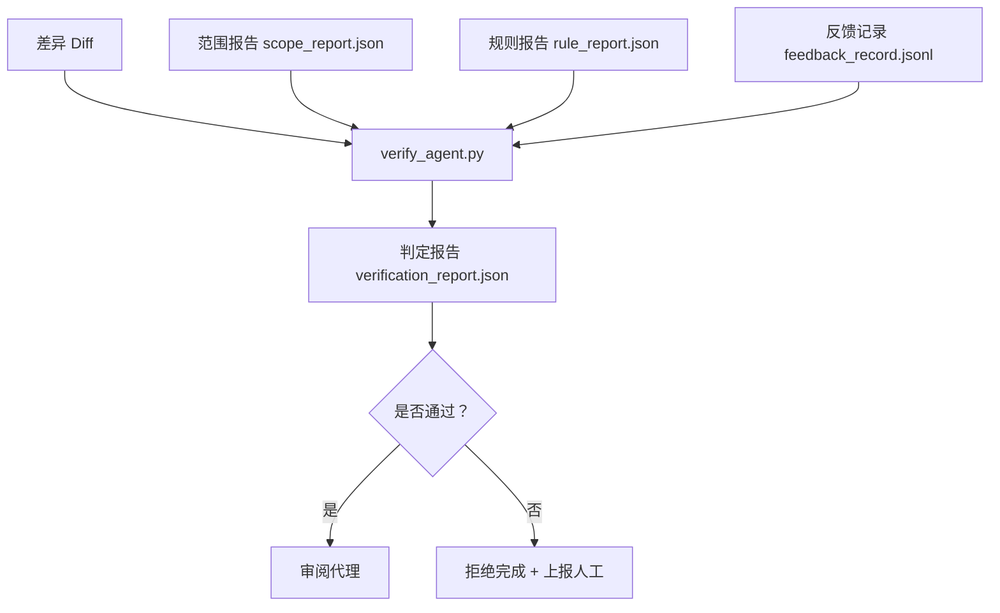

# 验证门控

> 代理无法自行将工作标记为完成。验证门控会读取范围契约、反馈日志、规则报告和差异，并回答一个核心问题：这个任务是否真的完成了？如果门控判定为否，则任务未完成，无论对话中说的是什么。

**类型：** 构建
**语言：** Python（标准库）
**前置条件：** 阶段 14 · 33（规则）、阶段 14 · 36（范围）、阶段 14 · 37（反馈）
**时间：** 约 55 分钟

## 学习目标

- 将验证门控定义为作用于工作台工件的确定性函数。
- 将规则报告、范围报告、反馈记录和差异合并为单一判定。
- 生成 `verification_report.json`，供审阅代理和 CI 共同读取。
- 对任何阻塞级故障，无条件拒绝推进任务。

## 问题

代理过早宣告成功。三种失败模式最为常见：

- "看起来不错。"模型阅读了自己的差异并判断是正确的。
- "测试已通过。"说得很有信心，但没有记录测试实际运行过。
- "验收标准已满足。"验收标准被宽泛解读为"类似于完成的状态"。

工作台的解决方案是一个单一的验证门控，它会读取代理已生成的工件并做出判定。门控是确定性的。门控受版本控制管理。门控已接入 CI 流水线。代理无法贿赂它。

## 概念



### 门控检查项

| 检查项 | 来源工件 | 严重程度 |
|-------|-----------------|----------|
| 所有验收命令均已运行 | `feedback_record.jsonl` | 阻塞 |
| 所有验收命令均以零退出 | `feedback_record.jsonl` | 阻塞 |
| 范围检查无禁止写入 | `scope_report.json` | 阻塞 |
| 范围检查无越界写入 | `scope_report.json` | 阻塞 或 警告 |
| 所有阻塞级规则通过 | `rule_report.json` | 阻塞 |
| 反馈中无空退出码 | `feedback_record.jsonl` | 阻塞 |
| 修改的文件与 `scope.allowed_files` 匹配 | 两者 | 警告 |

警告级发现会标注判定结果；阻塞级发现会阻止 `passed: true`。

### 确定性而非概率性

门控每次必须为同一工件集产生相同的判定。不得使用 LLM 判定。LLM 判定应放在审阅侧（第 14 阶段 · 第 39 节），那里目标是定性评估，而非状态判定。

### 一份报告，单一路径

门控为每个任务关闭流程生成一个 `verification_report.json`，写入 `outputs/verification/<task_id>.json`。CI 消费同一路径。多个门控若路径不同，会导致真相源分裂。

### 无条件拒绝

阻塞级发现无法被代理覆盖。仅可由人类覆盖，且需记录 `override_reason`（覆盖原因）和 `overridden_by` 用户 ID。覆盖操作是签名变更，而非代理决策。

```figure
wb-gate-sequence
```

## 构建

`code/main.py` 实现：

- 各输入工件的加载器，本地存根以确保课程自包含。
- `verify(task_id, artifacts) -> VerdictReport` 纯函数。
- 展示逐项检查结果和最终通过/失败状态的打印器。
- 三个任务场景的演示：完整通过、范围蔓延、缺少验收。

运行：

```
python3 code/main.py
```

输出：三个判定报告，各自保存至脚本同目录下。

## 生产环境中的实践模式

四种模式可将门控从"又一个 lint 作业"提升为"决定性边界"。

**纵深防御，而非单一门控。** 预提交钩子 → CI 状态检查 → 预工具授权钩子 → 预合并门控。每一层都是确定性的，因此某一层失败时会被下一层捕获。microservices.io 2026 年 3 月的操作手册明确指出：预提交钩子是不可绕过的，因为它不像模型侧技能那样依赖代理遵循指令。验证门控位于 CI / 预合并层。

**确定性检查防御，模型判定仅用于微妙场景。** Anthropic 的 2026 混合规范配对：可验证奖励（单元测试、模式检查、退出码）回答"代码是否解决了问题"；LLM 规范回答"代码是否可读、安全、符合风格"。门控执行第一类；审阅器（第 14 阶段 · 第 39 节）执行第二类。混合两者会降低信号质量。

**签名覆盖日志，而非 Slack 线程。** 每次覆盖都会在 `outputs/verification/overrides.jsonl` 中写入一行，包含：时间戳、发现代码、原因、签名用户、当前 HEAD 提交。运行时拒绝任何缺少签名的覆盖；审计轨迹由 git 跟踪。这是覆盖策略与覆盖表演之间的分界线。

**覆盖率基线作为一等检查项。** `coverage_report.json` 会驱动一个 `coverage_floor`（默认 80%）检查。若测量覆盖率低于基线，或低于上次合并的基线超过 1 个百分点，门控即失败。若无此检查，代理会悄悄删除失败的测试，而验证报告仍保持绿色。

**`--strict` 模式将警告升级为阻塞。** 对于发布分支、阻断合并的 PR 或事件后排查，`--strict` 使每条警告变为硬性失败。该标志按分支选择启用，而非全局默认，因为事事严格会腐蚀日常流程。

## 使用方式

生产模式：

- **CI 步骤。** `verify_agent` 作业针对代理的最终工件运行门控。无 `passed: true` 则拒绝合并。
- **预交接钩子。** 代理运行时在生成交接文档之前调用门控。无绿色判定则不交接。
- **手动排查。** 当代理声称成功但人类怀疑时，操作员查阅报告。

门控是工作台流中的决定性边界。其他所有层面均在其上游。

## 交付

`outputs/skill-verification-gate.md` 将门控接入具体项目：哪些验收命令为其提供输入，哪些规则属于阻塞级，哪些越界写入被容忍，覆盖审计日志如何存储。

## 练习

1. 添加 `coverage_floor` 检查：测试命令必须生成至少 80% 的覆盖率报告。确定哪个工件承载基线。
2. 支持 `--strict` 模式，将每条警告升级为阻塞。文档说明何时严格模式应为默认值。
3. 使门控除 JSON 外还生成 Markdown 摘要。论证哪些字段应包含在摘要中。
4. 添加 `time_since_last_human_touch` 检查：距人类最近一次击键 60 秒内编辑的文件免除越界标记。
5. 在真实产品代理差异上运行门控。多少发现是真实的，多少是噪音？门控需要扩展哪些方面？

## 关键术语

| 术语 | 人们通常说的 | 实际含义 |
|------|----------------|----------|
| 验证门控 | "阻止事物的检查" | 作用于工作台工件的确定性函数，产生通过/失败判定 |
| 阻塞级 | "硬性失败" | 阻止 `passed: true` 的发现，需签名覆盖 |
| 覆盖日志 | "我们为何放行" | 含原因和用户 ID 的签名条目，接受审查 |
| 验收命令 | "证明" | 零退出即代表 `done` 的 shell 命令 |
| 单一报告路径 | "真相源" | `outputs/verification/<task_id>.json`，CI 和人类共同消费 |

## 延伸阅读

- [Anthropic, Harness design for long-running application development](https://www.anthropic.com/engineering/harness-design-long-running-apps)
- [OpenAI Agents SDK guardrails](https://openai.github.io/openai-agents-python/guardrails/)
- [microservices.io, GenAI dev platform: guardrails](https://microservices.io/post/architecture/2026/03/09/genai-development-platform-part-1-development-guardrails.html) — 预提交与 CI 间的纵深防御
- [ICMD, The 2026 Playbook for Agentic AI Ops](https://icmd.app/article/the-2026-playbook-for-agentic-ai-ops-guardrails-costs-and-reliability-at-scale-1776661990431) — 审批门控层级（草稿 → 审批 → 阈值内自动）
- [Type-Checked Compliance: Deterministic Guardrails (arXiv 2604.01483)](https://arxiv.org/pdf/2604.01483) — Lean 4 作为确定性门控的上限
- [logi-cmd/agent-guardrails — merge gate spec](https://github.com/logi-cmd/agent-guardrails) — 范围 + 变异测试门控
- [Guardrails AI x MLflow](https://guardrailsai.com/blog/guardrails-mlflow) — 确定性验证器作为 CI 评分器
- [Akira, Real-Time Guardrails for Agentic Systems](https://www.akira.ai/blog/real-time-guardrails-agentic-systems) — 预/后工具门控
- 阶段 14 · 27 — 提示注入防御（门控的对抗性搭档）
- 阶段 14 · 36 — 本门控执行的范围契约
- 阶段 14 · 37 — 本门控评估的反馈日志
- 阶段 14 · 39 — 门控交接的审阅代理
