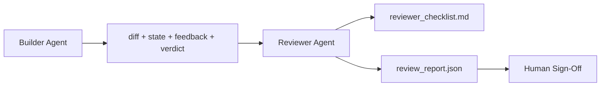

# Reviewer Agent: Separate Builder from Marker

> 编写代码的 agent 不能评分自己的代码。Reviewer 是第二个循环，使用不同的 system prompt、不同的目标，以及对 builder 产物的只读访问权限。builder 与 reviewer 之间的鸿沟，正是可靠性所在之处。

**Type:** Build
**Languages:** Python (stdlib)
**Prerequisites:** Phase 14 · 38 (Verification Gate)
**Time:** ~55 分钟

## 学习目标

- 说明为什么同一个 agent 无法可靠地审查自己的作品。
- 构建一个 reviewer agent 循环，消费 builder 产物并输出结构化审查报告。
- 编写 reviewer rubric，对特定维度进行评分，而非凭感觉。
- 将 reviewer 接入 workbench，使人类审查步骤从真实产物开始。

## 问题所在

你让 agent 修复一个 bug。它编辑了四个文件，运行了测试，然后报告完成。验证门（Phase 14 · 38）确认 acceptance 已运行，scope 保持住了。门返回 `passed: true`。你合并了。两天后你发现，修复解决了 bug 的另一半。

Acceptance 是必要条件，而非充分条件。Reviewer 问的是 acceptance 无法回答的问题：这次修改是否解决了正确的问题？它是否在没有标注的情况下扩大了 scope？它是否记录了你本应质疑的假设？它是否将 workbench 留给了下一个 session 能顺利接手的状态？

## 概念



### Reviewer rubric

五个维度，每个维度评分 0 到 2。

| 维度 | 问题 |
|------|------|
| Problem fit | 修改是否解决了任务描述的问题，而非邻近的问题？ |
| Scope discipline | 编辑是否限于合约范围，还是合约被有意扩大？ |
| Assumptions | 所有隐性假设是否都在某处以可审查的形式写了下来？ |
| Verification quality | acceptance 命令是否真的证明了目标，还是只证明了弱化版本？ |
| Handoff readiness | 下一个 session 能否从当前状态顺利接管？ |

总分 10 分。低于 7 分为软失败（soft fail）；低于 5 分为硬失败（hard fail）。

### Reviewer 是独立角色，而非独立模型

你可以用与 builder 相同的模型运行 reviewer。纪律在于角色分离：不同的 system prompt、不同的输入、对 diff 无写权限。姿态的转变就是信号的变化。

### Reviewer 不能编辑 diff

Reviewer 阅读 diff、状态、反馈、verdict。它写入报告。它不修补 diff。如果报告说"修复这个"，下一个 builder turn 做修复；reviewer 回到审查工作。混合角色会消灭这种鸿沟。

### Reviewer rubric 与验证门的区别

门（Phase 14 · 38）检查确定性事实：acceptance 是否运行、规则是否通过、scope 是否保持。Reviewer 进行定性判断：这是否是正确的工作、是否记录了假设、交接是否可用。两者缺一不可。

```figure
wb-builder-marker
```

## 构建它

`code/main.py` 实现了：

- `ReviewerInputs` 数据类，打包 reviewer 读取的产物。
- rubric 评分器，每个维度对应一个函数。每个函数是确定性的，并为课程做了 stub 打分；实际实现会调用 LLM。
- `review_report.json` 写入器，包含五个分数、总分和 verdict（`pass`、`soft_fail`、`hard_fail`）。
- 两个演示案例：干净修改和"正确的测试，错误的问题"修改。

运行：

```
python3 code/main.py
```

输出：两份审查报告写入磁盘，以及控制台表格形式的维度分数。

## 生产环境中的模式

Cloudflare 的 2026 年 4 月 AI Code Review 系统在 30 天内运行了 131,246 次审查，覆盖 48,095 个 merge request，涉及 5,169 个仓库。中位审查耗时 3 分 39 秒。多达七位专家 reviewer（安全、性能、代码质量、文档、发布管理、合规、Engineering Codex）在 Review Coordinator 下并行运行，由 coordinator 进行去重和严重程度判定。顶级模型专供 coordinator 使用；专家在更便宜的层级上运行。

四种模式使这在规模上可行。

**专家池，而非一个大型 reviewer。** 对于单人仓库，一个具有五维 rubric 的 reviewer 就够了。一旦代码库有了安全关键、性能关键和文档层面，就拆分为具有更小 prompt 的专家。coordinator 负责去重；专家从不运行完整 rubric。模型分层随之而来：便宜专家、昂贵 coordinator。

**偏差缓解作为设计需求，而非优化项。** LLM 评委显示四种可靠偏差（Adnan Masood，2026 年 4 月）：位置偏差（GPT-4 在 (A,B) 与 (B,A) 排序上约 40% 不一致），冗长偏差（~15% 评分偏向更长输出），自我偏好（评委偏好来自同一模型家族的输出），权威（评委高估对知名作者的引用）。缓解措施：评估两种顺序，只统计一致结果；使用 1-4 分量表，明确奖励简洁；在不同模型家族间轮换评委；打分前删除作者姓名。

**校准集，而非凭感觉。** 具有已知正确 verdict 的 10-20 个任务历史集。每次 prompt 变更时，在评审器上运行。如果与历史记录的同意率低于 80%，则需要在 reviewer 发布之前修订 rubric。这是每个团队最终都会重新发现的；不如从一开始就用它。

**与门的混合规范。** 验证门（Phase 14 · 38）处理确定性检查（acceptance 是否运行、测试是否通过、scope 是否保持）。Reviewer 处理语义检查（这是否是正确的工作、假设是否记录、交接是否可用）。Anthropic 的 2026 年指南对此分离表述明确：不要要求 reviewer 重新做门已经证明的事情。

## 使用它

生产模式：

- **Claude Code subagent。** Reviewer subagent 在 builder 完成任务后运行。它在 PR 上发布包含 rubric 分数的评论。
- **OpenAI Agents SDK 交接。** Builder 在任务完成时交接给 Reviewer。Reviewer 可以返回包含一系列发现或交回给人类的列表。
- **双模型配对。** Builder 在更快更便宜的模型上运行。Reviewer 在更强的模型上运行，上下文更小，专注于判断。

当人类无法亲自完成所有审查时，reviewer 是 workbench 增长的第二个眼睛。

## 交付它

`outputs/skill-reviewer-agent.md` 生成项目特定的 reviewer rubric、接入 builder 产物的 reviewer agent stub，以及与验证门的集成，使人能审查从书面报告而不是空白页开始。

## 练习

1. 添加一个针对你产品领域的第六个维度。论证它为何不被现有五个维度吸收。
2. 用两个不同的 system prompt（简洁、冗长）运行 reviewer。哪个产生的人类更可能阅读的报告？
3. 为每个维度添加 `confidence` 字段。当最低维度的置信度低于 0.6 时，拒绝提交报告。
4. 构建校准集：10 个具有已知正确 verdict 的历史任务关闭。在它们上运行 reviewer。它在哪些地方与历史记录不一致？
5. 添加"请求更多证据"功能：reviewer 可以在打分前要求 builder 提供特定测试运行。合适的退避策略是什么以防止无限循环？

## 关键术语

| 术语 | 人们说的 | 实际含义 |
|------|----------|----------|
| Reviewer rubric | "清单" | 五维度 0-2 评分，每维度有书面问题 |
| Soft fail | "需要修订" | 总分低于 7；builder 获得需要处理的发现 |
| Hard fail | "拒绝" | 总分低于 5 或任意维度为 0；停止并上交人类 |
| Role separation | "不同 prompt" | 同一模型可同时担任两角色；纪律在于输入与姿态 |
| Confidence floor | "不提交低信号报告" | 当 rubric 不确定时拒绝发出 verdict |

## 延伸阅读

- [OpenAI Agents SDK 交接](https://openai.github.io/openai-agents-python/handoffs/)
- [Anthropic Claude Code subagents](https://code.claude.com/docs/en/sub-agents)
- [Cloudflare, Orchestrating AI Code Review at Scale](https://blog.cloudflare.com/ai-code-review/) — 7 专家 + coordinator 架构，131k 次运行 / 30 天
- [Agent-as-a-Judge: Evaluating Agents with Agents (OpenReview / ICLR)](https://openreview.net/forum?id=DeVm3YUnpj) — DevAI 基准，366 层次化解决方案要求
- [Adnan Masood, Rubric-Based Evaluations and LLM-as-a-Judge: Methodologies, Biases, Empirical Validation](https://medium.com/@adnanmasood/rubric-based-evals-llm-as-a-judge-methodologies-and-empirical-validation-in-domain-context-71936b989e80) — 四种偏差及缓解措施
- [MLflow, LLM-as-a-Judge Evaluation](https://mlflow.org/llm-as-a-judge) — 分离 builder/evaluator 的生产工具
- [LangChain, How to Calibrate LLM-as-a-Judge with Human Corrections](https://www.langchain.com/articles/llm-as-a-judge) — 校准集工作流
- [Evidently AI, LLM-as-a-judge: a complete guide](https://www.evidentlyai.com/llm-guide/llm-as-a-judge)
- [Arize, LLM as a Judge — Primer and Pre-Built Evaluators](https://arize.com/llm-as-a-judge/)
- Phase 14 · 05 — Self-Refine and CRITIC（单 agent 自审查基线）
- Phase 14 · 30 — Eval-driven agent development（校准集生成器）
- Phase 14 · 38 — reviewer 读取的验证门
- Phase 14 · 40 — reviewer 报告馈送的交接包
