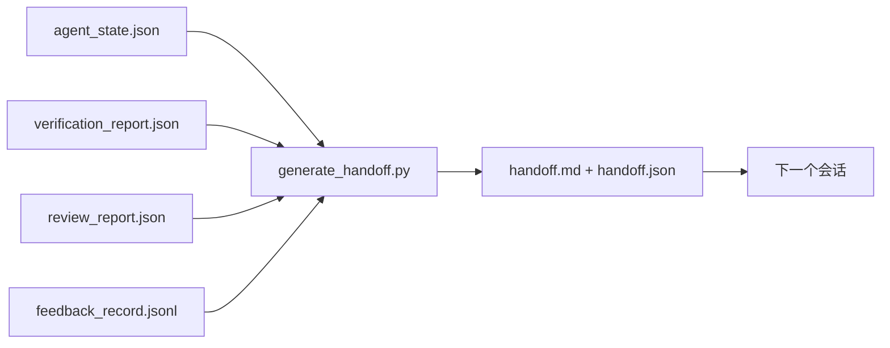

# 多会话交接

> 会话即将结束，但工作不会。交接包是将"代理工作了一小时"转变为"下一个会话在第一分钟就能高效产出"的关键产物。要有意识地构建它，而不是事后补写。

**类型：** 构建
**语言：** Python (stdlib)
**前置条件：** 第14阶段 · 34（仓库记忆），第14阶段 · 38（验证），第14阶段 · 39（评审员）
**时间：** 约50分钟

## 学习目标

- 识别每个交接包必备的七个字段。
- 从工作台工件自动生成交接包，而非手写文本。
- 将大型反馈日志裁剪为适合交接的摘要。
- 使下一个会话的第一步动作确定性执行。

## 问题所在

会话结束。代理说"太好了，我们有进展了。"下一个会话打开。新代理问"我们上次停在哪里了？"第一个代理的答案已经消失。新代理重新发现、重新运行相同的命令、重新向人类提出相同的问题，燃烧三十分钟去恢复上一个会话最后三十秒的工作。

糟糕交接的代价，在任务的整个生命周期中，每个会话都在支付。修复方案是在会话结束时自动生成一个包：什么变了、为什么变、尝试了什么、什么失败了、还剩下什么、下次第一步做什么。

## 概念



### 每个交接包携带的七个字段

| 字段 | 回答的问题 |
|-------|---------------------|
| `summary` | 做了什么的一段落概述 |
| `changed_files` | 一目了然的变更差异 |
| `commands_run` | 实际执行了什么命令 |
| `failed_attempts` | 尝试了什么以及为何失败 |
| `open_risks` | 什么可能在下个会话出问题，附带严重程度 |
| `next_action` | 下个会话的第一个具体步骤 |
| `verdict_pointer` | 指向验证报告和评审报告的路径 |

`next_action` 字段是支撑性的。除了 `next_action` 之外包含一切的交接包只是状态报告，而非交接。

### 交接包是生成的，不是写出来的

手写的交接包是在艰难日子最容易被跳过的东西。生成器读取工作台工件并发出包。代理的任务是把工作台留在生成器可以总结的状态，而不是手写总结。

### 两种形式：人类可读和机器可读

`handoff.md` 是人类阅读的。`handoff.json` 是下一个代理加载的。两者来自同一源工件。如果二者不一致，JSON 胜出。

### 反馈日志裁剪

完整的 `feedback_record.jsonl` 可能有数百条记录。交接包只携带最后 K 条加上所有非零退出的条目。下一个会话如果需要可以加载完整日志，但包本身保持精简。

### 留下干净状态

交接包描述工作。干净状态让工作可恢复。它们不是同一回事。如果下一个会话打开的是一个半应用的差异、代理忘记的临时文件、一个遗留分支、以及运行前就报错的测试，那么完美的 `handoff.md` 毫无价值。新代理会花前十分钟清理上一个代理留下的烂摊子，而不是开始构建，这种成本在每个会话中都叠加，贯穿任务整个生命周期。

所以会话不是在功能工作时结束的。当工作台处于生成器可以总结、下一个会话可以信任的状态时，会话才结束。清理是它自己的阶段，在交接之前运行，而且它是一个检查，而不是习惯——因为习惯正是在艰难日子最容易被跳过的东西。

| 检查项 | 干净意味着 | 脏状态阻塞因为 |
|-------|-------------|----------------------|
| 工作树 | 所有变更已提交或以附注形式明确暂存 | 半应用的差异看起来像是有意的变更，会误导下一个代理 |
| 临时工件 | 没有遗留的 `*.tmp`、草稿目录、调试打印或注释掉的代码块 | 遗留文件污染差异和下一个代理的心理模型 |
| 测试 | 全部通过，或者红色但失败已在 `open_risks` 中命名 | 静默的红色测试是一个陷阱，下一个会话会踩进去 |
| 功能板 | `feature_list.json` 状态反映现实（第14阶段 · 36） | 过时的板子会引导下一个会话去做已经完成的工作 |
| 分支 | 在预期分支上，无 detached HEAD，无孤立分支 | 错误的分支意味着下一个会话的首次提交落在错误位置 |

清理阶段输出一份 `clean_state.json` 列出阻塞性问题；空列表是交接生成器写入包之前断言的前置条件。建立在脏树之上的交接包不是交接，而是传递的混乱。两个工件配对：清理证明工作台可以安全离开，交接证明下一个会话知道从哪里开始。

```figure
wb-handoff-packet
```

## 构建它

`code/main.py` 实现了：

- 一个加载器，将状态、裁决、评审和反馈整合进单个 `WorkbenchSnapshot`。
- 一个 `generate_handoff(snapshot) -> (markdown, payload)` 函数。
- 一个过滤器，选取最后 K 条反馈条目加上所有非零退出条目。
- 一个演示运行，在脚本旁边写入 `handoff.md` 和 `handoff.json`。

运行：

```
python3 code/main.py
```

输出：打印的交接体，以及磁盘上的两个文件。

## 生产环境中的实践模式

Codex CLI、Claude Code 和 OpenCode 各自有不同的压缩方案；结构化交接包构建在所有三者之上。

**压缩策略各异，但包的模式不变。** Codex CLI 的 POST /v1/responses/compact 是服务端的不透明 AES 密文（OpenAI 模型快速路径）；备选方案是本地"交接摘要"，以 `_summary` 用户角色消息追加。Claude Code 在 95% 上下文时运行五阶段渐进式压缩。OpenCode 做基于时间戳的消息隐藏加上五段标题的 LLM 摘要。三种不同机制，满足同一需求：将压缩后幸存的内容序列化为可移植工件。包就是那个工件。

**新会话交接不同于压缩。** 压缩延长会话；交接干净地结束一个会话并开启下一个。Hermes Issue #20372 的框架（2026年4月）是正确的：当就地压缩开始降级时，代理应写入紧凑交接包、结束会话、然后在新鲜上下文中恢复。包是让这种过渡低成本的关键。错误在于继续压缩直到质量崩溃；修复方案是为早期干净的交接预留预算。

**每个分支和主题一个活跃交接。** 多代理协调在过时交接上的崩溃比在模型输出质量差上更严重。始终包含 `branch`、`last_known_good_commit`，以及 `status` 为 `active | superseded | archived`。过时交接被归档；只有活跃的那个驱动下一个会话。这是交接即笔记与交接即状态之间的区别。

**在 50-75% 上下文预算前收尾，而非卡到墙边。** 手写模式手册（CLAUDE.md + HANDOVER.md）报告最佳结果在会话于 50-75% 上下文预算结束时，而非 95%。包生成器在压缩伪影污染源状态之前干净运行。上下文完整时写入成本很低；当模型已开始迷失方向时写入成本昂贵。

## 使用它

生产模式：

- **会话结束钩子。** 运行时在用户关闭聊天时触发生成器。包进入 `outputs/handoff/<session_id>/`。
- **PR 模板。** 生成器的 markdown 同时作为 PR 正文。审阅者无需打开五个其他文件即可阅读。
- **跨代理交接。** 用一个产品构建（Claude Code），用另一个继续（Codex）。包是通用语。

包小而规整，生产成本低廉。成本节省在每个会话中复利增长。

## 交付它

`outputs/skill-handoff-generator.md` 产生一个针对项目工件路径调优的生成器、一个运行它的会话结束钩子，以及下一个代理启动时读取的 `handoff.json` 模式。

## 练习

1. 添加 `assumptions_to_validate` 字段，揭示构建者记录的所有假设，但评审员未评分高于 1 的。
2. 为失败运行与通过运行分别以不同方式裁剪反馈摘要。为这种不对称性辩护。
3. 包含"向人类提问"列表。什么问题进入包，什么进入聊天消息，阈值是什么？
4. 让生成器幂等：运行两次产生相同的包。需要什么保持稳定才能做到这一点？
5. 添加"下个会话前置条件"章节，列出下一个会话行动前必须加载的精确工件清单。

## 关键术语

| 术语 | 人们怎么说 | 实际上是什么意思 |
|------|----------------|------------------------|
| 交接包 | "会话摘要" | 携带七个字段的生成工件，同时包含 markdown 和 JSON |
| 下一步行动 | "先做什么" | 启动下一个会话的一个具体步骤 |
| 反馈裁剪 | "日志摘要" | 最后 K 条记录加上所有非零退出 |
| 状态报告 | "我们做了什么" | 缺少 `next_action` 的文档；有用，但不是交接 |
| 裁决指针 | "收据" | 指向验证和评审报告的路径，用于追溯 |

## 延伸阅读

- [Anthropic, Effective harnesses for long-running agents](https://www.anthropic.com/engineering/effective-harnesses-for-long-running-agents)
- [OpenAI Agents SDK handoffs](https://openai.github.io/openai-agents-python/handoffs/)
- [Codex Blog, Codex CLI Context Compaction: Architecture, Configuration, Managing Long Sessions](https://codex.danielvaughan.com/2026/03/31/codex-cli-context-compaction-architecture/) — POST /v1/responses/compact 和本地备选方案
- [Justin3go, Shedding Heavy Memories: Context Compaction in Codex, Claude Code, OpenCode](https://justin3go.com/en/posts/2026/04/09-context-compaction-in-codex-claude-code-and-opencode) — 三厂商压缩对比
- [JD Hodges, Claude Handoff Prompt: How to Keep Context Across Sessions (2026)](https://www.jdhodges.com/blog/ai-session-handoffs-keep-context-across-conversations/) — CLAUDE.md + HANDOVER.md，50-75% 上下文预算
- [Mervin Praison, Managing Handoffs in Multi-Agent Coding Sessions: Fresh Context Without Losing Continuity](https://mer.vin/2026/04/managing-handoffs-in-multi-agent-coding-sessions-fresh-context-without-losing-continuity/) — 分布式系统框架
- [Hermes Issue #20372 — 压缩变得危险时自动新会话交接](https://github.com/NousResearch/hermes-agent/issues/20372)
- [Hermes Issue #499 — 上下文压缩质量 overhaul](https://github.com/NousResearch/hermes-agent/issues/499) — Codex CLI 中的交接导向提示
- [Microsoft Agent Framework, Compaction](https://learn.microsoft.com/en-us/agent-framework/agents/conversations/compaction)
- [OpenCode, Context Management and Compaction](https://deepwiki.com/sst/opencode/2.4-context-management-and-compaction)
- [LangChain, Context Engineering for Agents](https://www.langchain.com/blog/context-engineering-for-agents)
- 第14阶段 · 34 — 生成器读取的状态文件
- 第14阶段 · 38 — 包指向的验证裁决
- 第14阶段 · 39 — 打包入包的评审报告
