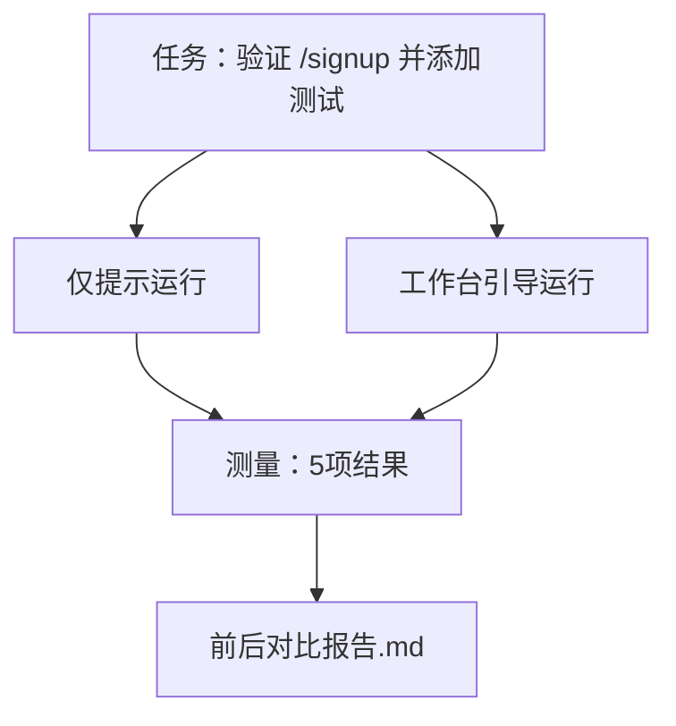

# 真实仓库上的工作台

> 如果七种工作表面无法在真实代码库上经受住考验，那么关于它们的十一次课程都是毫无意义的。本课将同一个小样本应用任务运行两次：仅提示 vs 工作台引导。数字会说话。

**类型：** 构建
**语言：** Python（标准库）
**前置条件：** 第14阶段 · 32至14 · 40
**时间：** 约60分钟

## 学习目标

- 将七种工作表面临时整合到一个小应用中。
- 对同一任务运行两次（仅提示和工作台引导），并测量五项结果。
- 阅读前后对比报告，判断哪些表面提供的杠杆最大。
- 针对"我的模型已经够好了"这类反驳，为工作台辩护。

## 问题所在

玩具任务的演示无法说服任何人。只有当一个看起来真实的任务在真实仓库上运行并最终进入生产环境，且失败更少、回退更少，并留下一个可供下次会话使用的交接包时，工作台的价值才得以证明。

本课提供这个"真实感"仓库，并对同一任务运行两种流水线。结果是一份你可以交给怀疑者的前后对比报告。

## 概念



### 样本应用

`sample_app/` 中一个最小化的类 FastAPI 风格的处理器：

- `app.py` 包含 `/signup`（尚无验证逻辑）。
- `test_app.py` 包含一个成功路径测试。
- `README.md` 和 `scripts/release.sh` 作为禁区诱饵。

### 任务

> 为 `/signup` 添加输入验证：拒绝短于8个字符的密码，返回422及类型化错误信封。添加一个证明新行为的测试。

### 两种流水线

仅提示：

1. 阅读 README。
2. 阅读 `app.py`。
3. 编辑文件。
4. 声明完成。

工作台引导：

1. 运行初始化脚本（第35课）。
2. 阅读范围契约（第36课）。
3. 阅读状态（第34课）。
4. 仅编辑允许的文件。
5. 通过反馈运行器执行验收命令（第37课）。
6. 执行验证门禁（第38课）。
7. 运行审阅器（第39课）。
8. 生成交接包（第40课）。

### 五项测量结果

| 结果 | 重要性 |
|------|--------|
| `tests_actually_run` | 大多数"测试通过"的声明是不可验证的 |
| `acceptance_met` | 证明目标的测试必须是实际运行的测试 |
| `files_outside_scope` | 范围蔓延是主导性静默失败 |
| `handoff_quality` | 下一次会话为此付费或从中受益 |
| `reviewer_total` | 在门禁之上的定性判断 |

```figure
wb-ab-runs
```

## 构建

`code/main.py` 对同一个样本应用夹具编排两种流水线。两种流水线都是脚本化的（循环中无LLM），因此测量是可复现的。脚本将对比结果写入 `before-after-report.md` 和 `comparison.json`。

运行它：

```
python3 code/main.py
```

输出：控制台表格显示每种流水线的结果、保存在脚本旁的markdown报告，以及供需要制图者使用的JSON。

## 生产环境中的模式

怀疑者的问题是"工作台实际上有多大帮助？"2026年的数据表明，帮助远超解释本身。

**Terminal Bench 前30名升至前5名，同一模型。** LangChain 的 *Anatomy of an Agent Harness*（2026年4月）：一个编码agent仅通过改变harness，就从Terminal Bench 2.0的前30名之外跃升至第5名。同一模型。不同的表面。二十五名次的差距。

**Vercel 从80%提升至100%，通过删除工具。** Vercel 报告称，删除agent 80%的工具使成功率从80%提升至100%。更小的工具表面，更精准的范围，更少的失败方式。负空间获胜。

**Harvey 仅通过harness实现2倍准确率提升。** 法律agent仅通过harness优化就将准确率提升了一倍以上，无需更换模型。

**88%的企业AI agent项目未能进入生产。** preprints.org 的 *Harness Engineering for Language Agents* 论文（2026年3月）将失败归因于运行时而非推理：陈旧的状态、脆弱的重试、过大的上下文、从中间错误的糟糕恢复。

**长上下文坍塌。** WebAgent 基线成功率40-50%，在长上下文条件下降至不足10%，主要来自无限循环和目标丢失。Ralph Loop和交接包正是为此设计的。

**假阴性仍然存在。** 单步事实任务、单行lint、格式化器运行、模型已逐字记住的任何内容——这些仅提示运行更快。基准应当如实枚举它们，以免工作台被误认为过度设计。

关键 takeaway 不是"harness永远获胜"。模型确实会随时间吸收harness的技巧。关键是，**今天**工程负载集中在七种表面上，数据证明了这一点。

## 使用

本课是你在以下场景中引用的案例文件：

- 有人问为什么每个PR都带有 `agent-rules.md` 和范围契约。
- 团队想在"就这一个冲刺周期"里跳过验证门禁。
- 一个新的agent产品上线，你需要一个便携基准来验证它是否真正节省时间。

数字比解释走得更远。

## 交付

`outputs/skill-workbench-benchmark.md` 是一个便携评估harness，它将任何agent产品通过两种流水线对项目的自有样本应用运行，并报告五项结果。

## 练习

1. 添加第六项结果：首次有意义编辑的时间。如何干净地测量它？
2. 在你的代码库中第二个真实日常任务上运行对比。工作台数据在哪里会出现下滑？
3. 添加"假阴性"轮次：仅提示更快的任务，以及工作台开销是真实成本的情况。为即使如此仍保留工作台进行辩护。
4. 将脚本化的"agent"替换为真实LLM调用。哪些结果会变得不那么稳定？
5. 为一名非工程师撰写一页摘要。什么能经得起删减？

## 关键术语

| 术语 | 人们怎么说 | 实际含义 |
|------|-----------|---------|
| 样本应用 | "玩具仓库" | 虽小但足够真实，能够测试所有七种表面 |
| 流水线 | "工作流" | agent遵循的表面读写有序序列 |
| 前后对比报告 | "凭据" | 你交给怀疑者的产物 |
| 假阴性 | "工作台过度设计" | 仅提示更快的任务；值得诚实枚举 |
| 工作台基准 | "可靠性分数" | 在你的代码库上运行对比的便携harness |

## 延伸阅读

- [LangChain, The Anatomy of an Agent Harness](https://blog.langchain.com/the-anatomy-of-an-agent-harness/) — Terminal Bench 前30名升至前5名的凭据
- [MongoDB, The Agent Harness: Why the LLM Is the Smallest Part of Your Agent System](https://www.mongodb.com/company/blog/technical/agent-harness-why-llm-is-smallest-part-of-your-agent-system) — Vercel + Harvey 数据
- [preprints.org, Harness Engineering for Language Agents](https://www.preprints.org/manuscript/202603.1756) — 88%企业失败率，运行时根因
- [HN: Improving 15 LLMs at Coding in One Afternoon. Only the Harness Changed](https://news.ycombinator.com/item?id=46988596) — 跨15个模型复现
- [Cloudflare, Orchestrating AI Code Review at Scale](https://blog.cloudflare.com/ai-code-review/) — 生产环境中131k次审阅运行/30天
- [Anthropic, Building Effective Agents](https://www.anthropic.com/research/building-effective-agents)
- 第14阶段 · 32至14 · 40 — 本课端到端练习的表面
- 第14阶段 · 19 — SWE-bench、GAIA、AgentBench 作为本课补充的宏观基准
- 第14阶段 · 30 — eval驱动的agent开发，同一harness可接入
