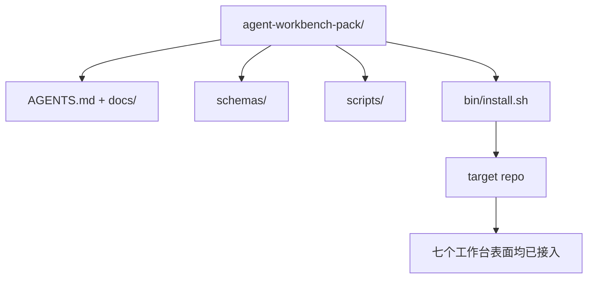

# Capstone：发布一个可复用的 Agent Workbench 包

> 该迷你课程的终点是一个你可以直接投入任意仓库的包。十一节课的内容被压缩到一个目录中，只需 `cp -r` 就能让 agent 次日上午稳定运行。本结业项目是本课程的核心产出物。

**类型：** 构建
**语言：** Python (stdlib)
**前置条件：** Phase 14 · 31 至 14 · 41
**时间：** 约 75 分钟

## 学习目标

- 将七个工作台表面（surfaces）打包到一个即插即用的目录中。
- 锁定模式、脚本和模板，确保新仓库获得一个已知良好的基线。
- 添加一个单点安装脚本，幂等地部署该包。
- 决定什么留在包内、什么留在包外，并为每个取舍提供辩护。

## 问题所在

一个存在于 Google Doc、聊天历史和三个半记忆脚本中的工作台，每个季度都会被重新搭建一次。解决方案是一个版本化的包：一个包含这些表面、模式、脚本和一个一键安装器的仓库或目录。

完成本节课程后，你将在磁盘上获得 `outputs/agent-workbench-pack/`，以及一个能将此包部署到任意目标仓库的 `bin/install.sh`。

## 概念



### 包的结构

```
outputs/agent-workbench-pack/
├── AGENTS.md
├── docs/
│   ├── agent-rules.md
│   ├── reliability-policy.md
│   ├── handoff-protocol.md
│   └── reviewer-rubric.md
├── schemas/
│   ├── agent_state.schema.json
│   ├── task_board.schema.json
│   └── scope_contract.schema.json
├── scripts/
│   ├── init_agent.py
│   ├── run_with_feedback.py
│   ├── verify_agent.py
│   └── generate_handoff.py
├── bin/
│   └── install.sh
└── README.md
```

### 保留与剔除的内容

保留：

- 表面模式。它们是契约。
- 上述四个脚本。它们是运行时。
- 四份文档。它们是规则和评估标准。

剔除：

- 项目特定的任务。任务属于目标仓库的任务看板，而非包内。
- 供应商 SDK 调用。包是框架无关的。
- 入职介绍文本。包与团队现有的入职指南并存，而非嵌入其中。

### 安装器

一个简短的 `bin/install.sh`（或 `bin/install.py`）：

1. 拒绝在没有 `--force` 的情况下覆盖已存在的包。
2. 将包复制到目标仓库。
3. 如果存在 `.github/workflows/`，则配置 CI。
4. 打印后续步骤：填写看板、设置验收命令、运行初始化脚本。

### 版本控制

包携带一个 `VERSION` 文件。需要迁移的模式变更和脚本变更会提升主版本号。仅文档变更则提升修订号。目标仓库的 `agent_state.json` 会记录其初始化的包版本。

```figure
wb-pack-install
```

## 构建它

`code/main.py` 将包组装到课程旁边的 `outputs/agent-workbench-pack/` 中，以本迷你课程前几节中的模式和脚本以及你已经写好的文档作为种子数据。

运行：

```
python3 code/main.py
```

该脚本会复制并锁定各表面、写入 README、打印包的目录树，并以退出码 0 结束。重复运行是幂等的。

## 生产环境中的模式

一个包只有在能抵御分叉、更新和不友善的上游依赖时才有价值。四种模式使其可行。

**`VERSION` 是契约，而非营销话术。** 主版本变更需要状态迁移。次版本变更需要重新运行检查器。修订号变更仅涉及文档。安装器每次安装时都会在目标仓库中写入 `.workbench-version`；`lint_pack.py` 在目标的锁版本与包的 `VERSION` 不一致时拒绝发布。`npm`、`Cargo` 和 `pyproject.toml` 就是这样存活过十年的 churn 的；agent 的规则并无不同。

**跨工具分发的单一来源。** Nx 发布一个 `nx ai-setup`，从单一配置生成 `AGENTS.md`、`CLAUDE.md`、`.cursor/rules/`、`.github/copilot-instructions.md` 以及 MCP 服务器。包也应如此；安装器会发出符号链接（`ln -s AGMENTS.md CLAUDE.md`），使单一真相源扩展到每种编码 agent。为支持某一种工具而分叉包是一种失败模式。

**拒绝在非平凡状态下卸载的 `uninstall.sh`。** 卸载包不应删除用户的 `agent_state.json`、`task_board.json` 或 `outputs/`。卸载器会删除模式、脚本、文档和 `AGENTS.md`（可通过 `--keep-agents-md` 选项保留），并在状态文件有任何未提交更改时拒绝继续。状态属于用户；包不拥有它。

**技能即发布物。SkillKit 风格的分发。** 包以 SkillKit 技能的形式发布：`skillkit install agent-workbench-pack` 从单一来源将其部署到 32 个 AI agent。包仓库是真相源；SkillKit 是分发渠道。供应商锁定随之瓦解；七个表面保持不变。

## 使用它

包的三种分发方式：

- **作为直接复制到仓库的目录。** `cp -r outputs/agent-workbench-pack /path/to/repo`。
- **作为公开的模板仓库。** Fork 并自定义，由 `VERSION` 控制漂移。
- **作为 SkillKit 技能。** 集成到你的 agent 产品中，一条命令即可完成部署。

包是配方，每次安装是一份服务。

## 交付

`outputs/skill-workbench-pack.md` 生成一个针对项目优化的包：规则针对团队历史加以细化，scope glob 与仓库匹配，rubric 维度扩展了一条领域专用条目。

## 练习

1. 决定哪个可选的第五份文档值得提升到核心包中。为这次取舍辩护。
2. 用带 `--dry-run` 标志的 Python 重写安装器。比较其与 bash 的人机交互体验。
3. 添加一个 `bin/uninstall.sh`，安全地移除包，并在状态文件有非平凡历史时拒绝操作。什么算作非平凡？
4. 添加一个 `lint_pack.py`，当包偏离 `VERSION` 时报错。将其集成到包自身仓库的 CI 中。
5. 编写从手工工作台迁移到此包的迁移手册。什么操作顺序能将停机时间最小化？

## 关键术语

| 术语 | 人们说的 | 实际含义 |
|------|---------|---------|
| 工作台包 | "启动套件" | 携带全部七个表面的版本化目录 |
| 安装器 | "设置脚本" | `bin/install.sh`，幂等地部署包 |
| 包版本 | "VERSION" | 模式/脚本变更提升主版本，仅文档变更提升修订号 |
| 即插即用包 | "cp -r 就能用" | 首日无需针对仓库定制即可工作的包 |
| 可分叉模板 | "GitHub 模板" | GitHub 的"使用此模板"可克隆的公开仓库 |

## 延伸阅读

- Phase 14 · 31 至 14 · 41 — 本包捆绑的每个表面
- [SkillKit](https://github.com/rohitg00/skillkit) — 从单一来源将此技能安装到 32 个 AI agent
- [Nx Blog, Teach Your AI Agent How to Work in a Monorepo](https://nx.dev/blog/nx-ai-agent-skills) — 跨六种工具的单一来源生成器
- [agents.md — 开放规范](https://agents.md/) — 包的路由器必须实现的内容
- [HKUDS/OpenHarness](https://github.com/HKUDS/OpenHarness) — 包等价物的参考实现
- [andrewgarst/agentic_harness](https://github.com/andrewgarst/agentic_harness) — 基于 Redis 的参考实现，带评估套件
- [Augment Code, A good AGENTS.md is a model upgrade](https://www.augmentcode.com/blog/how-to-write-good-agents-dot-md-files) — 包文档的质量基线
- [Anthropic, Effective harnesses for long-running agents](https://www.anthropic.com/engineering/effective-harnesses-for-long-running-agents)
- [Anthropic, Harness design for long-running application development](https://www.anthropic.com/engineering/harness-design-long-running-apps)
- Phase 14 · 30 — 消耗包验证关卡的评估驱动 agent 开发
- Phase 14 · 41 — 本包改进的基准测试（前后对比）
