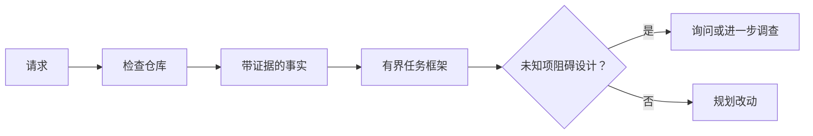

# 在代理编写代码之前先框定任务

> 编码代理可以快速实现一个清晰的任务。它也可以快速实现一个模糊的任务。速度是一样的。代价却不同。

**类型：** 学习 + 构建
**语言：** Python（标准库）
**前置条件：** 第 14 阶段课程 31 和 36
**时间：** 约 60 分钟

## 学习目标

- 在编辑代码之前，将请求转化为有边界的任务框架。
- 区分仓库事实、假设和待解决问题。
- 定义允许的改动路径、禁止的改动路径和验收证据。
- 判断何时侦察足够，可以开始工作。

## 昂贵的失败

"添加重复邮件保护"听起来很具体。但并非如此。唯一性约束应落在 API 层、领域服务层还是数据库层？比较是否区分大小写？已有哪个公开的错误形状？是否允许迁移？哪个测试能证明该行为？

一个有能力的代理会用合理的选项填补这些空白。这正是危险所在——实现可以很干净、有测试覆盖，但仍与系统不兼容。

因此，编码代理工作的第一个单元不是编辑。它是基于仓库证据支撑的任务框架。

## 任务框架

一个有用的框架包含六个字段：

| 字段 | 问题 |
|---|---|
| 目标 | 哪些可观测的行为必须改变？ |
| 仓库事实 | 你在代码、测试、配置或历史记录中验证了什么？ |
| 允许的路径 | 改动可以落在哪里？ |
| 禁止的路径 | 哪些内容必须保持不动？ |
| 验收证据 | 哪些命令或观察结果能证明目标已达成？ |
| 未知项 | 哪些决策仍需要证据或人类判断？ |

事实需要有凭据。"API 对重复数据返回 409"在你能指向现有测试或处理器之前，不算事实。一个文件路径加行号就足够了；当行为至关重要时，一条命令结果更好。



## 侦察是对约束的搜索

不要通读整个仓库。搜索那些约束改动的关键表面：

1. 当前行为及其调用方。
2. 最接近的现有测试。
3. 公开契约或序列化形状。
4. 规范改动路径的项目指令。
5. 构建与验证命令。
6. 揭示本地模式的相似已完成改动。

当每一个计划中的决策要么由证据支撑、要么被明确授权、要么列为未知项时，就可以停止。在那之后继续阅读，多半是回避。

## 未知项不是失败

未知项是一个受控的空白。假设则是对这个空白的非受控回答。

对每个未知项进行分类：

- **可发现的：** 仓库或运行中的系统可以给出答案。
- **可决定的：** 任务契约授权代理自行选择。
- **需人工的：** 该选择会改变产品行为、成本、风险或公开兼容性。
- **延后的：** 该选择超出本范围，属于非目标。

代理应持续推进可发现和已授权的未知项。对于需人工的未知项，应在选择被埋入代码之前暂停。

## 先写验收，再写实现

先写证明，再写补丁。证明可以是：

- 一个聚焦的单元测试或集成测试命令；
- 带有命名视口和期望状态的浏览器操作流程；
- 一条 HTTP 请求及精确的响应契约；
- 带阈值的性能测量；
- 一项范围检查，确认没有无关文件被改动。

"测试通过"不是一个证明计划。指明权威测试及其支撑的声明。

## 构建它

本实验创建一个 `TaskFrame`，验证其边界与证据，并写入 `outputs/task-frame.md`。

从本课目录运行：

```bash
python3 code/main.py
python3 -m unittest discover code/tests -v
```

用四种方式破坏示例：删除目标、删除事实凭据、让允许路径与禁止路径重叠、删除验收命令。验证器应对每个框架以不同的理由拒绝。

## 在实际仓库中使用

在请求代理进行编辑之前：

1. 以行为而非文件变动来书写目标。
2. 记录两到三个带有精确证据的事实。
3. 指明最小的允许路径集合。
4. 显式说明禁区。
5. 写出关闭任务的命令或观察方式。
6. 列出尚未获得依据的决策。

框架应能在一屏内显示。如果放不下，说明任务可能包含多个可独立验证的改动。

## 练习

1. 框定你仓库中一个真实的 bug，但不提出解决方案。
2. 在框架中找一个实际上是假设的声明，用证据替换它。
3. 添加一个人类未知项，其答案会改变公开契约。
4. 将一个宽泛的允许路径拆分为最小安全集合。
5. 在验收证据中添加一条范围凭据。

## 延伸阅读

- [Nuseibeh 和 Easterbrook，《需求工程：一份路线图》](https://www.cs.toronto.edu/~sme/papers/2000/ICSE2000.pdf)，了解如何将实现锚定到现实目标与演进约束。
- [Yang 等，《SWE-agent：代理-计算机接口使能自动化软件工程》](https://arxiv.org/abs/2405.15793)，了解围绕编码代理的接口如何影响其有效性的证据。

## 保留什么

保留 `outputs/task-frame.md`。它是下一课的输出，在那里框架将转化为有证据支撑的执行计划。
