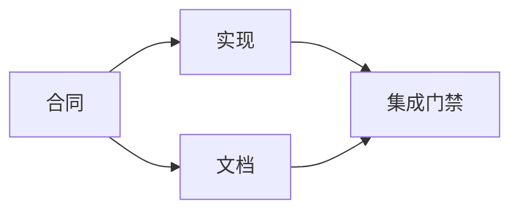

# 构建基于证据的执行计划

> 计划不是更漂亮的待办清单。它是一个依赖图，其中每个变更都有理由，每个终端节点都有证明。

**类型：** 学习 + 构建
**语言：** Python (stdlib)
**前置条件：** 第 14 阶段第 43 课
**时间：** 约 65 分钟

## 学习目标

- 将任务框转换为带证据和证明的工作项。
- 将排序建模为依赖关系而非文本序列。
- 在编辑前检测缺失的事实、未知的依赖和循环。
- 区分可以并行运行的步骤和必须等待的步骤。

## 为什么智能体计划会失败

薄弱的计划只是将来时的请求重复：

1. 更新 API。
2. 添加测试。
3. 更新文档。

列表中没有任何内容说明发现了什么、为什么这些文件是正确的、哪个合同先变更、哪些可以并发进行。智能体可以执行每一个步骤，但仍然会产生返工。

一个强有力的计划会对每个工作项做出五项承诺：

| 承诺 | 目的 |
|---|---|
| 标识符 | 依赖和交接的稳定引用 |
| 变更 | 最小化的行为或合同变更 |
| 证据 | 支持该变更的代码库事实 |
| 依赖 | 必须先完成的工作 |
| 证明 | 关闭该项目的确切检查 |

## 先规划合同再规划其实现

当多个表面依赖于相同的行为时，先定义行为。测试、实现、文档和集成可以共享一个合同，而不是各自发明四个版本。



该图暴露了安全的并发。合同确定后，实现和文档可以并行进行。集成等待两者完成。

## 证据会改变计划

代码库证据不是装饰。它应该有能力改变工作：

- 现有的辅助函数会移除计划中的新抽象。
- 兼容性测试会强制引入迁移步骤。
- 部署约束会将模式变更移到另一个任务中。
- 公共响应类型会改变实现和文档的顺序。

如果证据无法改变计划，那它可能就不是该决策的证据。

## 为中断而设计

编码智能体会话可能意外结束。可恢复的计划具有足够小的工作项，使另一个会话可以确定：

- 哪个项目已完成；
- 哪项证明已运行；
- 哪些工件已变更；
- 哪些依赖现在已解除阻塞；
- 下一个安全的工作项是什么。

不要只在聊天中的勾选框里编码状态。将计划与工作一起存储。

## 计划验证

在执行为之前拒绝该计划，当：

- 存在重复的标识符；
- 工作项没有证据；
- 工作项没有证明；
- 依赖指向未知的项目；
- 图中存在循环；
- 第一个不可逆的动发生在相关不确定性解决之前。

前五个检查是机械性的。最后一条需要判断力，应明确标注。

## 构建

`code/main.py` 对工作进行建模，验证其收据，通过拓扑排序计算执行浪次，并写入 `outputs/evidence-plan.json`。

运行：

```bash
python3 code/main.py
python3 -m unittest discover code/tests -v
```

示例产生三个浪次。合同定义最先运行。实现和文档同时运行。集成门禁最后运行。

## 与编码智能体配合使用

要求智能体在变更文件之前先产出计划。审查计划的以下三点：

1. 每个路径和行为声明都有一个代码库收据。
2. 每个项目都有一个明确的完成证明。
3. 该图将昂贵或不可逆的工作推迟到其依赖的不确定性得到解决之后。

批准计划，而不是批准一个模糊的"小心处理"承诺。

## 练习

1. 添加一个需要明确人工批准的迁移项目。
2. 创建一个循环，并解释其背后的隐藏产品分歧。
3. 拆分一个有两个证明命令的项目。
4. 添加一个可以在第二个浪次中运行而不触碰任何现有分支的工作项。
5. 将计划渲染为 Markdown，同时保持 JSON 作为单一数据源。

## 延伸阅读

- [Nuseibeh 和 Easterbrook，《需求工程：一张路线图》](https://www.cs.toronto.edu/~sme/papers/2000/ICSE2000.pdf)，探讨目标、规格、协议和演化之间的迭代关系。
- [Barry Boehm，《软件开发与增强的螺旋模型》](https://dl.acm.org/doi/10.1145/12944.12948)，探讨围绕风险解决而非固定线性序列来安排开发。

## 你保留的内容

保留 `outputs/evidence-plan.json`。它将成为下一课中的委托合同。
