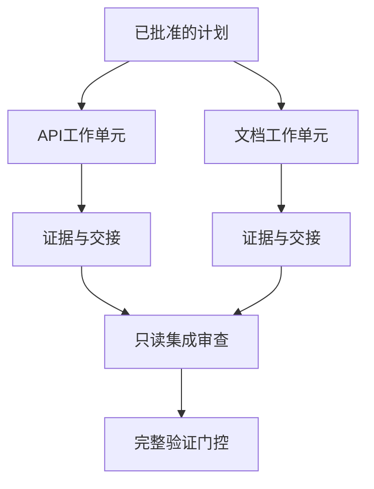

# 使用隔离与合并契约委托代理工作

> 并行代理仅在任务相互独立时才能节省实际运行时间。否则，它们会把一个清晰的任务转化为协调问题，并以更快的速度失败。

**类型：** 学习 + 构建
**语言：** Python（标准库）
**前置条件：** 第14阶段 第39课和第44课
**时长：** 约70分钟

## 学习目标

- 根据真实的独立性判断是否值得委托。
- 为每个代理赋予独占的文件所有权与明确证据。
- 从依赖关系计算执行波次。
- 设计合并契约以安全整合代理工作。

## 并行性测试

不要仅仅因为代理可用就进行委托。当满足以下条件之一时才委托：

- 两项调查可以独立回答不同的未知问题；
- 两个实现拥有不重叠的文件与接口契约；
- 审阅者可以检查已完成的产物而无需修改它；
- 缓慢的外部检查可以与本地工作并行进行。

当代理需要访问同一文件、未决的共同决策或同一可变环境时，保持串行执行。

## 工作单元即契约

每个委托单元需要：

| 字段 | 含义 |
|---|---|
| 目标 | 一个可观测的结果 |
| 所有者 | 一个负责执行的代理 |
| 路径 | 独占写所有权 |
| 依赖 | 启动前必须已完成的前置单元 |
| 证据 | 返回给集成器的精确证明 |
| 交接 | 已变更的文件、已做出的决策、剩余风险 |

“处理后端”不是一个工作单元。"在 `app/accounts.py` 中实现重复检查，并用聚焦账号测试证明它"才是。

## 隔离有三个层次

1. **文件系统隔离：** 独立的工作树或沙箱防止意外共享编辑。
2. **所有权隔离：** 契约防止两个代理同时有意编辑同一路径。
3. **状态隔离：** 独立的日志与输出防止一个代理覆盖另一个代理的证据。

文件系统隔离无法解决所有权冲突。两个干净的工作树仍可能产生相互冲突的设计。合并契约必须在开工前解决共享接口。



## 集成器不重建工作

集成器应该：

1. 确认每项交接都与其分配的范围一致；
2. 阅读证据输出，而非仅阅读代理的总结；
3. 按依赖顺序整合变更；
4. 运行完整的跨单元验证；
5. 拒绝隐蔽的范围扩张；
6. 将冲突记录为新决策，而非静默修改。

如果集成需要重写代理大部分结果，说明原始分解有误。

## 人类与代理角色

委托并不消除人类判断。人类仍然掌控那些改变公共行为、风险、权限或不可逆成本的决策。代理可以承担有界的调查、实现、验证与审查工作。

这是校准后的自主性：系统在证据充分且可回滚的地方授予自由，在后果重大的地方设置检查点。

## 构建

实验室检查路径重叠、验证依赖、计算安全的执行波次，并写入 `outputs/delegation-plan.json`。

运行：

```bash
python3 code/main.py
python3 -m unittest discover code/tests -v
```

将文档单元改为拥有 `app/`。计划应被阻断，因为该父路径与API单元重叠。

## 练习

1. 将一个真实变更分解为两个独立工作单元和一个集成器。
2. 找出一个看似独立实则不然的并行划分，指出共享的决策点。
3. 添加一个输出为事实表的只读研究代理。
4. 添加一个合并门控，检查最终变更文件集是否与所有单元契约一致。
5. 定义一个取消规则：当某个代理的依赖变为无效时，如何处理该代理。

## 延伸阅读

- [Reid Smith, The Contract Net Protocol](https://doi.org/10.1109/TC.1980.1675516)，对分布式任务分配与结果报告的首批形式化处理。
- [Eric Horvitz, Principles of Mixed-Initiative User Interfaces](https://dl.acm.org/doi/10.1145/302979.303030)，用于判断自动化应在何时行动、何时应将控制权交还给人。

## 保留内容

保留 `outputs/delegation-plan.json`。它记录了拆分的安全依据、每条路径的所有者，以及集成必须接收的证据。
