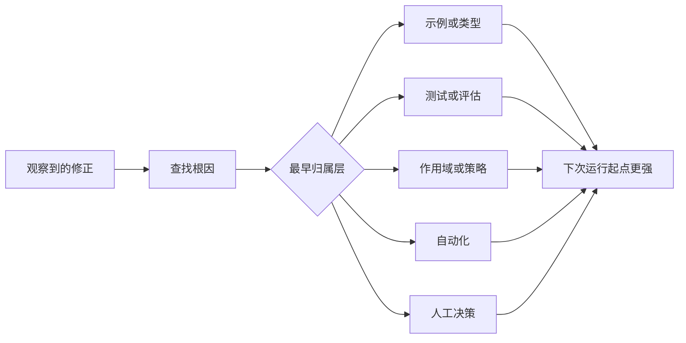

# 将每次 Agent 修正转化为系统改进

> 停留在对话中的修正只修复一次运行。被提升为测试、边界、示例或工具的修正会改善后续每一次运行。

**类型：** 学习 + 构建
**语言：** Python (stdlib)
**前置条件：** 第 14 阶段课程 37 至 41
**时间：** 约 65 分钟

## 学习目标

- 将 Agent 修正转化为持久化控制措施。
- 将每项控制措施放置在能够最早预防重复发生的层级。
- 用稳定的指纹消除重复教训的冗余。
- 撤销不再保护真实风险的控制措施。

## 修正是证据

当你告诉 Agent"不要编辑那个文件"时，你学到的教训是作用域边界没有可执行性。当你说"这个输出形状不对"时，你学到的教训是缺少示例或测试。当环境配置再次失败时，你学到的教训是环境知识属于自动化范畴。

将修正视为对工作系统的观察，而非提示词编写失误。

## 提升至上层有效控制

使用以下顺序：

| 反复出现的失败 | 持久化归属层 |
|---|---|
| 错误结果或回归 | 测试或评估 |
| 越界或不安全操作 | 作用域或权限策略 |
| 重复的环境配置或命令错误 | 自动化或工具 |
| 重复的输出格式错误 | 标准示例加验证器 |
| 模糊的本地约定 | 带场景检查的指令 |
| 产品分歧 | 人工决策记录 |

早期控制成本更低。防止无效状态的类型检查比事后拦截的审查评论更强。聚焦的测试比一段要求 Agent 记住的段落更强。



## 棘轮记录

捕获：

- 症状；
- 根因；
- 后果；
- 复发次数；
- 所选控制措施；
- 对该控制的验证方式；
- 负责人；
- 审查或撤销日期。

不要将每次一次性偏好都提升。当复发或后果证明值得永久复杂性时，才提升修正。

## 区分根因与症状

"Agent 编辑了 README"是一个症状。可能的根因包括：

- 任务允许访问仓库根目录；
- 文档被视为隐式安全；
- 计划将实现和文档捆绑在一起；
- 两个工作者存在重叠的职责范围。

每种根因对应不同的控制措施。仅重复症状的规则在下一个略有不同的场景中就会失效。

## 控制措施也会老化

旧控制措施可能产生冲突、膨胀上下文、编码一个已不存在的系统。每项被提升的规则都需要到期审查。在以下情况移除或重写：

- 底层架构发生变化；
- 更强的可执行控制措施替代了它；
- 在合理的时间窗口内该失败未再发生；
- 该控制措施带来的摩擦多于它防止的风险。

目标不是最长的指令文件。是最小的、能保留来之不易的判断的系统。

## 构建

实验项目会对修正进行分类，将其提升为控制措施，对重复项建立指纹，并写入 `outputs/feedback-ratchet.json`。

运行：

```bash
python3 code/main.py
python3 -m unittest discover code/tests -v
```

添加两条措辞不同但原因相同的修正。改进归一化逻辑，使它们合并为一个控制措施，同时不会将不相关的失败也合并。

## 练习

1. 从最近一次编码会话中选取五条修正，分类它们的真正归属层。
2. 将一条文字规则替换为可执行的测试。
3. 增加后果权重，使严重的初次发生即可立即提升。
4. 为实验项目的输出添加负责人和到期日期字段。
5. 审查一条现有的 Agent 指令，仅在证明存在更强的控制措施后才删除它。

## 延伸阅读

- [Basili, Caldiera, and Rombach, The Goal Question Metric Approach](https://www.cs.toronto.edu/~sme/CSC444F/handouts/GQM-paper.pdf)，关于将目标转化为问题和操作性度量。
- [Shinn et al., Reflexion](https://arxiv.org/abs/2303.11366)，关于使用反馈轨迹改进后续决策而不更改模型权重。
- [Madaan et al., Self-Refine](https://arxiv.org/abs/2303.17651)，关于在任务循环内进行迭代反馈和修订。

## 你保留的内容

保留 `outputs/feedback-ratchet.json`。这是 Agent 辅助工程路径的持久化终点，也是未来工作台变更的输入。
