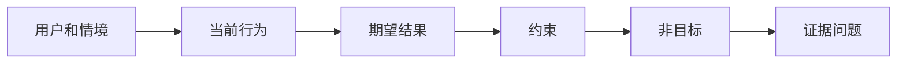

# 在选择输出之前先定义结果

> 快速实现会放大选择错误问题的代价。先塑造结果，让速度指向正确的方向。

**类型：** 学习 + 实践
**语言：** Python (标准库)
**前置要求：** 无
**时间：** 约 60 分钟

## 学习目标

- 写出不命名解决方案的结果框架。
- 识别用户、情境、当前行为和期望变更。
- 使约束和非目标显式化。
- 在方案泄漏硬化为范围之前将其发现。

## 输出不等于结果

"构建一个事件处理助手"命名了一个输出。它没有说明谁需要它、什么会改善、什么必须保持安全。

结果框架说：

> 当生产环境告警到达时，值班工程师在两分钟内识别故障服务和一个安全的下一步操作，同时诊断过程保持只读和可审计。

这句话可以由软件、运行手册、数据修复或更小的界面变更来满足。它让团队专注于结果，而非某个人想象出的第一个产物。

## 六部分框架

| 部分 | 问题 |
|---|---|
| 用户 | 谁直接体验这个问题？ |
| 情境 | 它何时何地发生？ |
| 当前行为 | 今天发生了什么，包括变通方法？ |
| 期望结果 | 哪个可观察的状态应该改善？ |
| 约束 | 哪些安全、政策、成本或兼容性限制是固定的？ |
| 非目标 | 哪些诱人的相邻工作被排除在外？ |



## 发现方案泄漏

结果陈述包含未被证据支持的产物形态、接口、模型选择、框架或架构时，就会泄漏方案。

- "用户收到每周 AI 摘要"泄漏了摘要形式和节奏。
- "用户在审批前理解账户变更"陈述了结果。
- "部署向量数据库"泄漏了基础设施。
- "相关策略证据在审查期间可用"陈述了一种能力。

当兼容性真正固定了技术时，约束可以指明技术。记录为什么它是固定的。

## 约束保护结果

约束不是实现细节。它们是真实世界目标的一部分：

- 诊断期间不写入生产数据；
- 在事件时间预算内响应；
- 现有审计事件保持权威；
- 无新增运行时依赖；
- 无障碍行为保持不变。

一个通过违反约束而达到结果的构建，并没有真正达到结果。

## 非目标划定边界

非目标防止有用的一小部分变成平台。好的非目标足够具体，能够拒绝工作：

- 无自动修复；
- 无新告警路由系统；
- 无替代事件指挥官；
- 本切片中无历史分析。

## 构建

实验室验证 `OutcomeFrame` 并写入 `outputs/outcome-frame.json`。

```bash
python3 code/main.py
python3 -m unittest discover code/tests -v
```

将期望结果替换为"使用事件处理助手"。验证器应标记该提议的输出已泄漏到结果中。

## 练习

1. 将回测表中的一个功能请求重写为结果框架。
2. 添加一个改变可行方案的约束。
3. 添加两个非目标，使第一切片保持精简。
4. 找出会反驳期望结果的最早观测。
5. 写出三个可能满足同一结果的不同输出。

## 延伸阅读

- [Nuseibeh 和 Easterbrook，《需求工程：一份路线图》](https://www.cs.toronto.edu/~sme/papers/2000/ICSE2000.pdf)，用于将真实世界目标作为软件工作的锚点。
- [Dardenne、van Lamsweerde 和 Fickas，《面向目标的需求获取》](https://doi.org/10.1016/0167-6423(93)90021-G)，用于将高层目标细化为约束和操作需求。

## 你保留什么

保留 `outputs/outcome-frame.json`。下一课将用人们实际执行的工作流来检验它。
