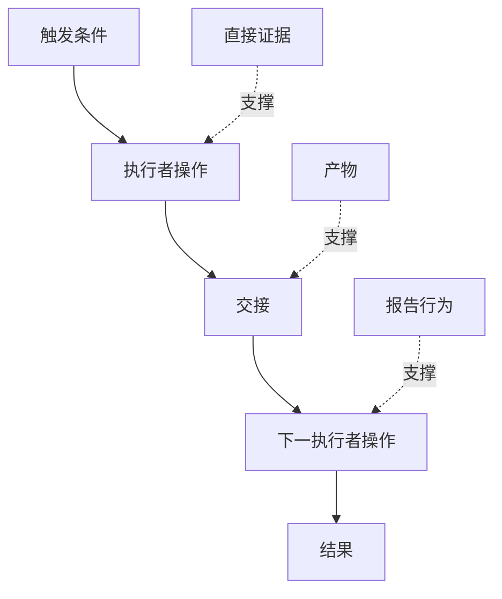

# 探索人们真正执行的工作流

> 需求不会在会议中等待被收集。它们散落在各种操作、变通方案、记录与分歧之中。

**类型：** 学习 + 构建
**语言：** Python (stdlib)
**前置条件：** 第14阶段课程 47
**时间：** ~70分钟

## 学习目标

- 将当前工作流建模为带证据的有序操作。
- 区分直接观察到的行为与报告或推断的行为。
- 定位摩擦点、交接、权限和隐藏状态。
- 让不确定的主张保持可见，而非将其转化为需求。

## 从现有系统开始

不要从询问人们想要什么功能开始。应从重建当前正在发生什么入手。

针对每个步骤，记录：

| 字段 | 示例 |
|---|---|
| 执行者 | 值班工程师 |
| 触发条件 | 生产环境告警到达 |
| 操作 | 打开告警，然后搜索仪表板 |
| 输入 | 告警负载和部署记录 |
| 输出 | 候选服务和负责人 |
| 摩擦 | 在三个工具之间切换上下文 |
| 权限 | 事故指挥官批准一次写入 |
| 证据 | 屏幕录制、事故日志、运行手册 |

工作流比屏幕更大。它包括等待、复制粘贴、侧边渠道、审批、错误恢复，以及人们已不再注意到的步骤。

## 证据有强弱之分

使用一个简单的证据阶梯：

1. **直接行为：** 观察、追踪、录制或系统事件。
2. **产物：** 工单、运行手册、日志、表单或已完成输出。
3. **报告行为：** 某人描述他们的操作。
4. **推断：** 团队得出可能发生什么的结论。

这四种都有用。只有前两种能直接证明当前行为。标记其余类型，以免置信度无声膨胀。



## 寻找四类东西

- **摩擦：** 重复劳动、延迟、重新输入或恢复操作。
- **隐藏状态：** 以记忆、聊天记录或个人笔记形式存在的事实。
- **权限：** 被允许做出关键变更的人或系统。
- **异常：** 正常流程不再适用的情况。

AI 功能往往在交接点和异常处失败，因为舒适路径是唯一被塑造的路径。

## 不要平均掉分歧

两个用户可能出于合理原因执行不同的工作流。在你理解这些变体代表什么之前，先保留它们：

- 不同的角色；
- 不同的风险等级；
- 遗留流程与当前流程；
- 专业程度差异；
- 真正的政策分歧。

一个平均化的工作流可能谁都无法准确描述。

## 构建它

实验室将证据存储在每一个工作流步骤上，验证顺序和置信度，计算直接证据比率，并写入 `outputs/workflow-evidence.json`。

```bash
python3 code/main.py
python3 -m unittest discover code/tests -v
```

添加一个异常路径，即部署记录缺失的情况。保持主顺序完整，并记录分支起始位置。

## 练习

1. 在不采访任何人的情况下，从日志重构一个工作流。
2. 采访一位用户，并标记所有仍缺乏直接证据的主张。
3. 添加一个权限边界和一个故障恢复步骤。
4. 建模两个工作流变体，不要将它们合并。
5. 识别一个移除可见步骤但使隐藏工作不受影响的新功能提议。

## 延伸阅读

- [Nuseibeh 和 Easterbrook，《需求工程：一张路线图》](https://www.cs.toronto.edu/~sme/papers/2000/ICSE2000.pdf)，尤其是其中将获取视为解释、建模和验证而非简单收集的处理方式。
- [Gotel 和 Finkelstein，《需求追溯性问题的分析》](https://doi.org/10.1109/ICRE.1994.292398)，用于理解保留需求与其来源之间关系的困难性。

## 你保留什么

保留 `outputs/workflow-evidence.json`。它将观察到的摩擦和不确定性转化为下一课中的假设地图。
