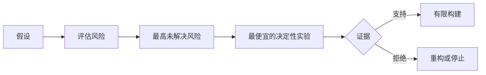

# 映射假设并优先解决最冒险的假设

> 路线图把不确定性藏在特性之中。假设地图则暴露了在这些特性值得存在之前必须成立的条件。

**类型：** 学习 + 构建
**语言：** Python（标准库）
**前置条件：** 第 14 阶段第 48 课
**时间：** 约 65 分钟

## 学习目标

- 将提议的工作转化为显式假设。
- 分别对影响、不确定性和不可逆性进行评分。
- 按风险而非热情来选择下一个实验。
- 用证据和决策替换已被验证的假设。

## 每个构建都包含赌注

一个故障工具可能依赖于所有这些条件为真：

- 告警上下文包含足够的信息以识别服务；
- 工程师信任他们自己并未推导出的建议；
- 期望的响应时间在运营上是有意义的；
- 所需数据可以在没有不安全授权的情况下访问；
- 工作流程发生的频率足够高，能够证明维护成本是合理的。

这些不是实现任务。它们是构建有价值、可用、可行且安全的条件。

## 假设类别

| 类别 | 问题 |
|---|---|
| 价值 | 结果是否足够重要？ |
| 可用性 | 用户能否理解并据此行动？ |
| 可行性 | 系统能否在现有数据和约束下产生结果？ |
| 生存能力 | 组织能否持续承担成本、归属和运营？ |
| 安全性 | 它能否在不产生不可接受后果的情况下失败？ |

将假设写为可证伪的陈述。「该功能有用」无法测试。「十分中的八位值班工程师能在只读结果下更快识别正确的服务」可以。

## 风险不是一个数字

实验使用来自一到五的三个维度：

- **影响：** 假设错误时的损害程度。
- **不确定性：** 当前证据的强度。
- **不可逆性：** 承诺后的学习成本。

示例得分将影响与不确定性相乘，然后加上不可逆性。该公式并非通用。它的目的是迫使团队阐明为何一个未知应先于另一个未知被解决。



## 设计实验，而非确认仪式

一个有用的测试包含：

- 一个可能为假的声明；
- 一个总体或代表性样本；
- 一个可观察的结果；
- 在结果之前确定的阈值；
- 针对通过、失败和模糊证据的下一步决策。

避免那些仅证明团队能够构建该想法的测试。

## 可逆性改变顺序

高风险且不可逆的选择需要更早的证据。只读回放可以先于生产集成。临时适配器可以先于数据迁移。人工审批的建议可以先于自动操作。

构建的形态应跟随不确定性的形态。

## 构建

实验对假设进行排序，区分已验证和未验证的声明，选择最高的未验证风险，并生成 `outputs/assumption-map.json`。

```bash
python3 code/main.py
python3 -m unittest discover code/tests -v
```

更改最高风险假设的证据，观察下一个实验如何变化。

## 练习

1. 为你想构建的一个功能写出五个假设。
2. 添加一个你的功能列表遗漏的安全性假设。
3. 定义一个会导致你停止构建的阈值。
4. 用一个更便宜的决定性测试替换一个大实验。
5. 对比风险排序与路线图优先级，并解释不匹配的原因。

## 延伸阅读

- [Barry Boehm，《软件开发与增强的螺旋模型》](https://dl.acm.org/doi/10.1145/12944.12948)，阐述了一种在更深投入之前先解决不确定性的风险驱动开发周期。
- [Dardenne、van Lamsweerde 和 Fickas，《目标导向的需求获取》](https://doi.org/10.1016/0167-6423(93)90021-G)，阐述在揭示障碍和约束的同时精炼目标的方法。

## 你需要保留的内容

保留 `outputs/assumption-map.json`。下一课将使用它来选择能够产生决定性证据的最小切片。
