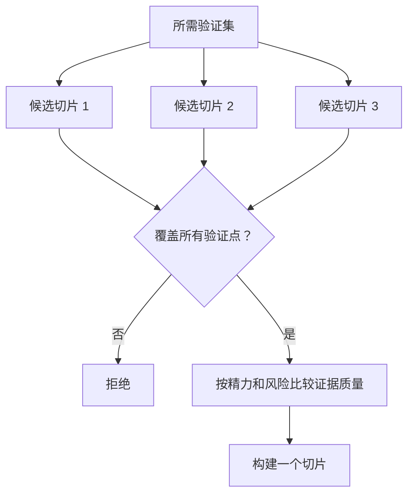

# 选择能改变决策的最小切片

> 微小本身并无价值，除非它能证明重要的事。一个无法影响下一个决策的迷你构建，只是不完整的半成品。

**类型：** 学习 + 构建
**语言：** Python（标准库）
**前置知识：** Phase 14 课程 49
**耗时：** 约 65 分钟

## 学习目标

- 根据切片所验证的假设来定义切片。
- 在结果价值、不确定性降低、投入精力和后果之间取得平衡。
- 优先选择可逆的证据，而非过早的生产承诺。
- 拒绝省略工作流中高风险部分的切片。

## 纵向意味着端到端提供证据

一个有用的切片必须跨越观察结果所需的最少真实工作流。它可以在用户、数据、时长和能力上很窄，但不应通过删除你需要测试的关键不确定性而变得狭窄。

示例：

- 对十个真实故障进行只读回放，测试服务识别和运维人员信任。
- 基于合成数据的精美仪表板可能测试了可理解性，但未测试数据可行性。
- 生产环境自动修复器会一次性测试所有内容，但后果不可接受。

## 先明确所需验证内容

找出风险最高的未验证假设，将其转化为所需验证集。只有覆盖该验证集的候选切片才符合资格。

然后对比符合条件的切片：

| 维度 | 方向 |
|---|---|
| 结果价值 | 越高越好 |
| 不确定性降低 | 越高越好 |
| 投入精力 | 越低越好 |
| 后果 | 越低越好 |
| 可逆性 | 越高越好 |

评分表故意设计得简单。资格筛选比算术运算更重要。



## 常见的伪最小切片

- **仅 UI 的最小切片：** 删除了数据和运维层面的不确定性。
- **仅基础设施的最小切片：** 证明了技术可行性，但未触及用户价值。
- **仅快乐路径的最小切片：** 省略了产生大部分风险的异常场景。
- **仅演示的最小切片：** 产出了有说服力的成果物，但没有可重复的度量。
- **仅平台的最小切片：** 在任何一个工作流未获得验证前，就构建了可复用的基础设施。

## 添加停止规则

实现之前，写下切片失败时的应对方案：

- 放弃该结果；
- 更换目标用户或场景；
- 测试不同的机制；
- 收集更好的证据；
- 进一步缩小权限范围。

如果任何结果都导向"继续构建"，则该切片不是实验。

## 构建它

实验室按所需验证集筛选候选切片，对符合条件的切片评分，并写入 `outputs/slice-decision.json`。

```bash
python3 code/main.py
python3 -m unittest discover code/tests -v
```

添加一个成本更低的候选切片，仅验证一个必需假设。即使其数值评分很高，也应保持不符合资格。

## 练习

1. 为同一结果设计三个处于不同后果级别的切片。
2. 在评分前先陈述所需验证集。
3. 移除一项能力，同时保留决定性证据。
4. 为失败的试点添加停止规则。
5. 识别一个应等待切片完成后再构建的可复用平台组件。

## 延伸阅读

- [Barry Boehm, A Spiral Model of Software Development and Enhancement](https://dl.acm.org/doi/10.1145/12944.12948)，用于将每个开发周期与它所必须解决的风险相匹配。
- [Lenarduzzi and Taibi, MVP Explained: A Systematic Mapping Study on the Definitions of Minimal Viable Product](https://arxiv.org/abs/1609.07592)，用于了解软件工程实践中"最小"与"可行"定义中的模糊性。

## 保留内容

保留 `outputs/slice-decision.json`。它记录了为何此切片是能改变决策的最小切片。
