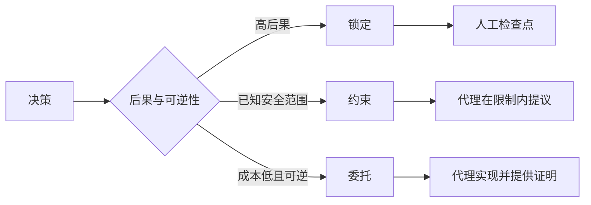

# 编写保留判断力的规格说明

> 有用的规格说明固定了不变量和证据，同时为可逆的实现选择留出空间。它是决策边界，而非剧本。

**类型：** 学习 + 构建
**语言：** Python（标准库）
**前置条件：** 第 14 阶段第 50 课
**时间：** 约 75 分钟

## 学习目标

- 区分目标、不变量、示例、非目标和证明。
- 将决策标记为锁定、约束或委托。
- 在成本低且可逆的选择处保留代理的判断力。
- 在涉及后果或公开行为变化的地方要求人工检查点。

## 两个极端误区

规格过于简单，是要求代理猜测系统；规格过于详细，是要求它抄录可能本身就有问题的设计。

有用的中间地带是一份可执行的契约：

| 表面 | 用途 |
|---|---|
| 目标 | 可观察的结果 |
| 不变量 | 必须始终成立的条件 |
| 示例 | 揭示意图的具体案例 |
| 非目标 | 明确排除的相邻行为 |
| 决策策略 | 哪些选择是锁定、约束还是委托的 |
| 证明 | 完成前所需的证据 |

## 三种决策模式

- **锁定（Locked）：** 代理不得自行选择。用于公开兼容性、权威、安全、不可逆成本或产品承诺。
- **约束（Bounded）：** 代理可在明确限制内选择。用于搜索预算、重试次数、允许的依赖项或已知接口族。
- **委托（Delegated）：** 代理拥有该选择权，并需解释其理由。用于局部结构、命名、可逆重构和实现细节。



## 通过示例定义行为

示例比形容词更能压缩意图。"有用""稳健""生产就绪"都不是可执行的标准。一组正常情况、边界情况、失败情况和禁止情况的示例，可以为构建者和验证者提供具体依据。

示例不能替代不变量。一个通过的案例无法证明普遍的规则。

## 证明必须匹配声明

- 单元测试证明局部函数契约。
- 线路测试证明序列化和传输行为。
- 浏览器旅程证明接口路径。
- 回放集证明在代表性案例上的行为。
- 审计日志证明权威边界得到遵守。

不要以低层的证据作为高层声明的证明。

## 刻意保留未知项

规格说明可以写道："实现可以选择任何在时间预算内返回的只读数据源。"这不是模糊，而是一个带有边界和证明要求的有意委托决策。

当证据发生变化时，规格说明应随之演进。保留锁定和约束选择背后的原因，以便后续团队无需考古即可对其进行修订。

## 动手实现

本实验验证每一个契约表面、检查决策模式，并写入 `outputs/executable-specification.json`。

```bash
python3 code/main.py
python3 -m unittest discover code/tests -v
```

将"生产写入"这一决策从锁定改为委托。解释为何 Schema 接受该值，但产品风险不允许。

## 练习

1. 将一个 backlog 工单转化为六个规格说明表面。
2. 将三条实现指令替换为一条不变量和两个示例。
3. 标记每一个决策，并为每个锁定或约束选择提供理由。
4. 为每一条不变量添加证明凭证。
5. 移除一条既无证据又无风险依据的约束。

## 延伸阅读

- [Nuseibeh 和 Easterbrook，《Requirements Engineering: A Roadmap》](https://www.cs.toronto.edu/~sme/papers/2000/ICSE2000.pdf)，探讨目标、精确规格、验证、协议和演进之间的关系。
- [Zave 和 Jackson，《Four Dark Corners of Requirements Engineering》](https://doi.org/10.1145/267895.267896)，区分环境假设、需求和规格说明。
- [Gotel 和 Finkelstein，《An Analysis of the Requirements Traceability Problem》](https://doi.org/10.1109/ICRE.1994.292398)，保留需求存在的原因及其来源。

## 保留内容

保留 `outputs/executable-specification.json`。它将成为编码代理和人类评审者共享的契约。
