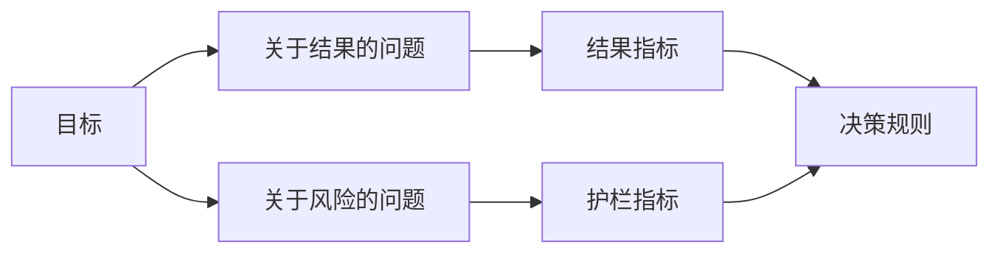

# 在结果出现之前设计成功指标

> 测量应当回答一个决策问题，而不是装饰仪表盘。从目标出发，推导问题，然后选择能够回答这些问题的最小指标集。

**类型：** 学习 + 构建
**语言：** Python（标准库）
**前置知识：** Phase 14 第 47 和 51 课
**预计时间：** 约 70 分钟

## 学习目标

- 从结果目标中推导问题和指标。
- 在观察结果之前定义阈值、窗口、来源和方向。
- 将结果指标与护栏指标和反向指标配对。
- 将评估证据与构建需要支持的决策相匹配。

## 目标、问题、指标

从一个目标开始：

> 在不增加不安全操作的情况下，缩短识别受影响服务的时间。

推导问题：

- 正确服务被识别的速度有多快？
- 识别出的服务正确的频率是多少？
- 诊断是否保持只读？
- 该工作流程是否会增加告警忽略或操作员工作量？

然后选择能够将这些问题操作化的指标。



## 指标需要一个契约

每个指标都需要：

| 字段 | 示例 |
|---|---|
| 名称 | `median_identification_seconds` |
| 方向 | 至多 |
| 阈值 | 120 |
| 窗口 | 十次事件重放 |
| 来源 | 重放事件日志 |
| 总体 | 试点中的值勤工程师 |
| 类型 | 结果或护栏 |

没有来源和窗口，数字无法复现。没有阈值，它无法驱动决策。

## 结果、护栏和反向指标

- **结果指标：** 期望的状态是否改善？
- **护栏：** 固定约束是否保持不变？
- **反向指标：** 局部改善是否将成本或伤害转移到了其他地方？

对于事件处理流程，速度还不够。正确性、生产写入、操作员工作量和漏报的告警用于防范快速但不安全的结果。

## 离线与在线证据

离线重放有助于可重复性和边缘覆盖。受限的试点有助于真实行为、信任和流程影响。两者不能互相替代。

使用能够回答当前决策的最便宜证据。不要因为实现就绪就让真实用户暴露于风险中。

## 先决定再测量

在看到结果之前写下通过、失败和模糊路径。否则团队会移动阈值来保护构建。

示例：

- 通过：正确服务率至少 0.9 且中位时间至多 120 秒；
- 失败：任何生产写入或正确率低于 0.75；
- 模糊：小幅改善但方差较宽，需要更大的重放集合。

## 构建它

本实验验证测量计划、评估包含性阈值、记录缺失值，并写入 `outputs/measurement-report.json`。

```bash
python3 code/main.py
python3 -m unittest discover code/tests -v
```

移除护栏指标，观察为何即使结果指标保持有效，计划也会变得无效。

## 练习

1. 从一个结果目标中推导三个问题。
2. 添加一个能够捕捉成本转移到其他角色的反向指标。
3. 为每个指标定义来源、总体和窗口。
4. 在生成数值之前写下通过、失败和模糊决策。
5. 找出一个易于收集但无法改变决策的指标，将其移除。

## 延伸阅读

- [Basili, Software Modeling and Measurement: The Goal/Question/Metric Paradigm](https://drum.lib.umd.edu/items/8119803a-362b-42ec-b6ce-2311713e7236)，用于从明确目标推导可操作测量。
- [Basili, Caldiera, and Rombach, The Goal Question Metric Approach](https://www.cs.toronto.edu/~sme/CSC444F/handouts/GQM-paper.pdf)，用于将方法作为反馈和改进系统来应用。

## 你保留什么

保留 `outputs/measurement-report.json`。它定义了原型、试点或生产阶段的证据门槛。
