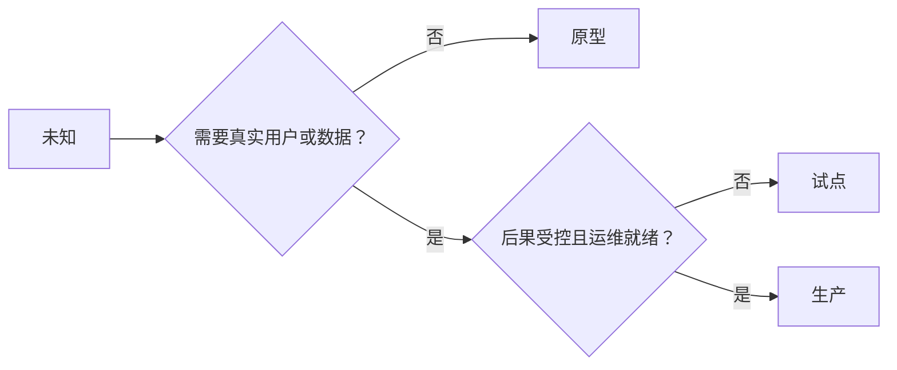

# 审慎选择原型、试点或生产环境

> 这是三种不同的学习环境，而非成熟度等级。选择能够以最小不必要代价回答当前未知问题的阶段。

**类型：** 学习 + 构建
**语言：** Python（标准库）
**前置条件：** 第14阶段课程50至52
**时间：** 约70分钟

## 学习目标

- 根据未知性、受众、数据、后果和准备度选择构建阶段。
- 定义各阶段专属的控制措施和退出标准。
- 防止原型悄然演变为生产系统。
- 在证据和运营能力充分之前，不赋予真正权限。

## 三种不同的问题

| 阶段 | 核心问题 |
|---|---|
| 原型 | 该机制能否产出证据？ |
| 试点 | 在受限的真实受众和真实条件下能否安全运行？ |
| 生产 | 我们能否以承诺的可靠性和风险水平持续负责？ |

原型可以是技术完整的，但仍可丢弃。试点可以使用生产数据，但受众和权限保持有限。当组织接受持续性责任时，才进入生产阶段。

## 原型

在未知性不需要真实用户或真实数据时使用原型。保持以下特征：

- 可丢弃；
- 孤立运行；
- 行为范围狭窄；
- 明确学习问题；
- 不含虚假的运行保障。

在该机制赢得下一个阶段之前，不要优化架构。

## 试点

在未知性需要真实行为、真实数据或真实工作流，但后果或准备度尚未适合广泛发布时使用试点。

试点需要：

- 明确的受众；
- 明确的人类负责人；
- 有限的持续时间和权限；
- 审计和回滚；
- 结果与护栏阈值；
- 扩展、修订或终止的退出标准。

## 生产

生产环境需要部署之外的更多内容：

- 服务级别目标（SLO）；
- 值班和事件责任归属；
- 安全和隐私审查；
- 成本和容量控制；
- 回滚和恢复；
- 持续监控；
- 退役路径。



## 阶段漂移

原型代码一旦获得用户、数据或权限，却未同步获得责任归属，便会产生风险。在配置、访问控制、遥测和文档中标注原型和试点的边界。仅靠警告横幅是不够的。

所处阶段应当能从系统本身直接观察到。

## 动手实践

本实验根据决策上下文选择一个阶段，返回所需控制措施，并写入 `outputs/stage-decisions.json`。

```bash
python3 code/main.py
python3 -m unittest discover code/tests -v
```

将试点示例调整为低后果且具备运维就绪性。说明哪些额外证据能够证明进入生产阶段的合理性。

## 练习

1. 根据学习阶段而非部署状态，对三个当前项目进行分类。
2. 编写包含停止决策在内的试点退出标准。
3. 增加一项技术控制，防止原型触及生产数据。
4. 识别让构建进入生产阶段的首要运营责任。
5. 为受限试点设计一份回滚凭证。

## 延伸阅读

- [Barry Boehm, A Spiral Model of Software Development and Enhancement](https://dl.acm.org/doi/10.1145/12944.12948)，关于将每轮迭代的承诺与已解决的风险相匹配。
- [Fagerholm et al., Building Blocks for Continuous Experimentation](https://doi.org/10.1145/2601248.2601276)，关于持续运行实验所需的组织和条件。

## 保留内容

保留 `outputs/stage-decisions.json`。它记录了每个阶段合理的理由，以及进入下一阶段前必须具备哪些控制措施。
