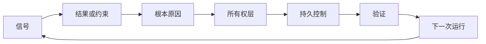

# 构建具有所有权和退役机制的反馈棘轮

> 交付关闭一个构建循环并开启学习循环。证据必须改变系统，否则就成了无人负责的遥测数据。

**类型：** 学习 + 构建
**语言：** Python（标准库）
**前置条件：** 第14阶段课程46和53
**时间：** 约75分钟

## 学习目标

- 将事件、评估、用户行为和修正转化为有归属的操作。
- 将每个信号路由到上下文、评估、策略、运行时或待办事项。
- 按严重程度和频率对重复性进行优先级排序。
- 为每项控制措施设定退役条件。

## 反馈即基础设施

一个团队可以收集追踪数据、评估结果、支持工单和事件日志，却不对任何一项进行学习。缺失的机制是晋升：一条从观察到持久变更的明确路径，附带所有者和证明。

循环如下：

1. 观察具体信号；
2. 将其与结果、约束或假设关联；
3. 识别拥有该原因的最早系统层；
4. 创建有界的变更；
5. 验证重复发生的可能性是否降低；
6. 审查该控制措施是否应继续保留。

## 路由到所有权层

| 信号 | 目标 |
|---|---|
| 误报、回归、错误结果 | 评估或测试 |
| 缺失上下文、重复工作、过时事实 | 上下文来源或检索路由 |
| 不安全操作或权限缺口 | 策略或权限边界 |
| 超时、重试风暴、不可用依赖 | 运行时控制 |
| 新产品需求或未解决的权衡 | 已塑形的待办项 |

在最早有效的层修复原因。当测试或权限即可防止失败时，不要添加另一段提示词。



## 所有权是控制的一部分

每项棘轮操作需要：

- 一个所有者；
- 基于后果和重复性的优先级；
- 要更改的工件；
- 证明变更的验证；
- 审查或到期窗口；
- 一个退役条件。

无归属的改进只是格式更好的观察记录。

## 退役过时控制

反馈系统会累积策略。这些策略可能变得相互矛盾且代价高昂。在以下情况时审查控制措施：

- 架构或工作流发生变化；
- 较低层的不变量替换了较高层的指令；
- 受保护的故障在选定窗口内未再出现；
- 控制措施阻碍合法工作的频率超过其防止危害的频率。

退役同样需要证据。不要因为某个控制看起来过时了就删除它。

## 连接构建和编码代理的反馈

同一个棘轮服务于两条轨道：

- 产品证据改变结果框架、假设、切片或测量计划。
- 编码代理的修正改变测试、上下文、范围、自动化或交接。
- 事件可以同时改变产品边界和代理工作台。

这就是为什么塑形构建不是一个在编码开始前就结束的阶段。它通过每一项已接受的变更持续进行。

## 构建

实验将信号分类、创建有归属的棘轮操作、进行优先级排序，并写入 `outputs/feedback-backlog.json`。

```bash
python3 code/main.py
python3 -m unittest discover code/tests -v
```

添加运行时超时信号，确认它路由到运行时而非通用待办事项。

## 练习

1. 将一个事件和一个用户投诉转化为棘轮操作。
2. 命名能防止每种重复发生的最早层。
3. 在实验输出中添加验证命令或观察项。
4. 为某项策略规则定义退役条件。
5. 追踪一项已接受的修正回到下一个任务框架。

## 延伸阅读

- [Basili、Caldiera 和 Rombach，《目标问题度量方法》](https://www.cs.toronto.edu/~sme/CSC444F/handouts/GQM-paper.pdf)，关于通过目标导向度量实现组织学习。
- [Fagerholm 等，《持续实验的构建模块》](https://doi.org/10.1145/2601248.2601276)，关于连接证据与持续产品开发的Technical和组织循环。
- [Nuseibeh 和 Easterbrook，《需求工程：路线图》](https://www.cs.toronto.edu/~sme/papers/2000/ICSE2000.pdf)，关于将需求视为随系统生命周期演化的观点。

## 保留内容

保留 `outputs/feedback-backlog.json`。它是产品判断与交付路径的收尾工件，也是下一个结果框架的输入。
