# 通信协议

> 无法说同一种语言的Agent不是团队，而是向虚空中呐喊的陌生人。

**类型：** 构建
**语言：** TypeScript
**前置要求：** 第14阶段（Agent工程）、第16.01课（为什么需要多Agent）
**时间：** 约120分钟

## 学习目标

- 实现MCP工具发现与调用，使Agent能够使用外部服务器暴露的工具
- 构建A2A Agent卡和任务端点，使一个Agent能够通过HTTP将工作委派给另一个Agent
- 对比MCP（工具访问）、A2A（Agent间通信）、ACP（企业审计）和ANP（去中心化信任），并解释每种协议解决了什么问题
- 在单一系统中将多种协议连接，其中Agent通过MCP发现工具，通过A2A委派任务

## 问题

你将系统拆分为多个Agent：一个研究员、一个编码员、一个审查员。他们在各自的工作上都很出色。但现在你需要让他们真正相互交流。

你的第一个尝试显而易见：传递字符串。研究员返回一段文本，编码员尽可能解析它。直到编码员误解了研究摘要，或两个Agent相互等待死锁，或你需要不同团队构建的Agent协作——此时"只是传递字符串"突然崩溃了。

这就是通信协议问题。如果没有Agent交换信息的共享契约，多Agent系统就很脆弱、无法审计，并且不可能扩展到超过你亲自编写的少数Agent。

AI生态系统已经用四种协议回应这个问题，每个协议解决不同的问题切面：

- **MCP** 用于工具访问
- **A2A** 用于Agent间协作
- **ACP** 用于企业可审计性
- **ANP** 用于去中心化身份和信任

本课将进行深入学习。你将阅读每个规范的原始格式，构建实际实现，并将所有四种协议连接成一个统一系统。

## 概念

### 协议生态

将这些四种协议视为层次结构，每种协议解决不同的问题：

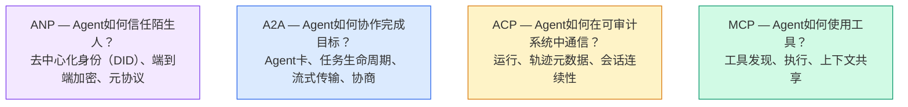

它们不是竞争关系。它们在不同层面解决不同的问题。

### MCP（回顾）

MCP在第13阶段已深入讲解。快速回顾：MCP标准化了LLM如何连接到外部工具和数据源。它是一种**客户端-服务器**协议，Agent（客户端）发现和调用服务器暴露的工具。

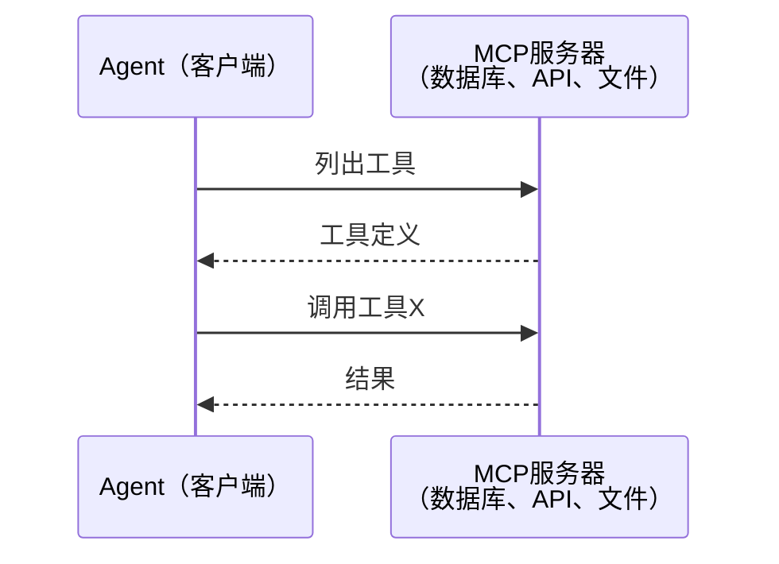

MCP是**Agent到工具**的通信。它不能帮助Agent彼此通信。

### A2A（Agent2Agent协议）

**创建方：** Google（现归Linux基金会管理，为`lf.a2a.v1`）
**规范版本：** 1.0.0
**问题：** 自主Agent如何协作、协商和相互委派任务？

A2A是**对等Agent协作**的协议。MCP将Agent连接到工具，A2A将Agent连接到其他Agent。每个Agent在知名URL处发布**Agent卡**，其他Agent发现、协商并与之委派任务。

#### A2A如何工作

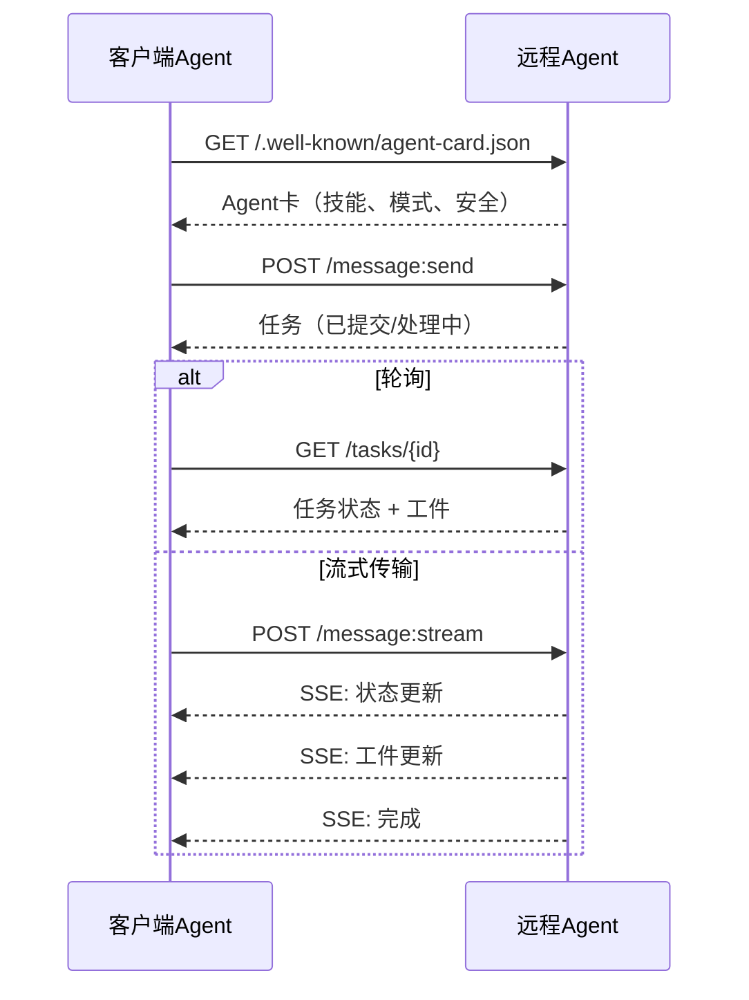

#### 真实的Agent卡

这就是A2A Agent卡在现实中的样子。通过 `GET /.well-known/agent-card.json` 提供服务：

```json
{
  "name": "研究Agent",
  "description": "搜索文档并总结发现",
  "version": "1.0.0",
  "supportedInterfaces": [
    {
      "url": "https://research-agent.example.com/a2a/v1",
      "protocolBinding": "JSONRPC",
      "protocolVersion": "1.0"
    },
    {
      "url": "https://research-agent.example.com/a2a/rest",
      "protocolBinding": "HTTP+JSON",
      "protocolVersion": "1.0"
    }
  ],
  "provider": {
    "organization": "您的公司",
    "url": "https://example.com"
  },
  "capabilities": {
    "streaming": true,
    "pushNotifications": false
  },
  "defaultInputModes": ["text/plain", "application/json"],
  "defaultOutputModes": ["text/plain", "application/json"],
  "skills": [
    {
      "id": "web-research",
      "name": "网络研究",
      "description": "搜索网络并综合发现",
      "tags": ["研究", "搜索", "总结"],
      "examples": ["研究React 19的最新变化"]
    },
    {
      "id": "doc-analysis",
      "name": "文档分析",
      "description": "阅读和分析技术文档",
      "tags": ["文档", "分析"],
      "inputModes": ["text/plain", "application/pdf"],
      "outputModes": ["application/json"]
    }
  ],
  "securitySchemes": {
    "bearer": {
      "httpAuthSecurityScheme": {
        "scheme": "Bearer",
        "bearerFormat": "JWT"
      }
    }
  },
  "security": [{ "bearer": [] }]
}
```

需要注意的关键点：
- **技能**是Agent能做什么。每个技能都有ID、标签和支持的输入/输出MIME类型。这是客户端Agent决定远程Agent能否处理其请求的方式。
- **supportedInterfaces**列出多种协议绑定。单个Agent可以同时支持JSON-RPC、REST和gRPC。
- **安全**内置于卡中。客户端在发出任何请求之前就知道需要什么认证。

#### 任务生命周期

任务是A2A中的核心工作单位。它们经过定义的状态：

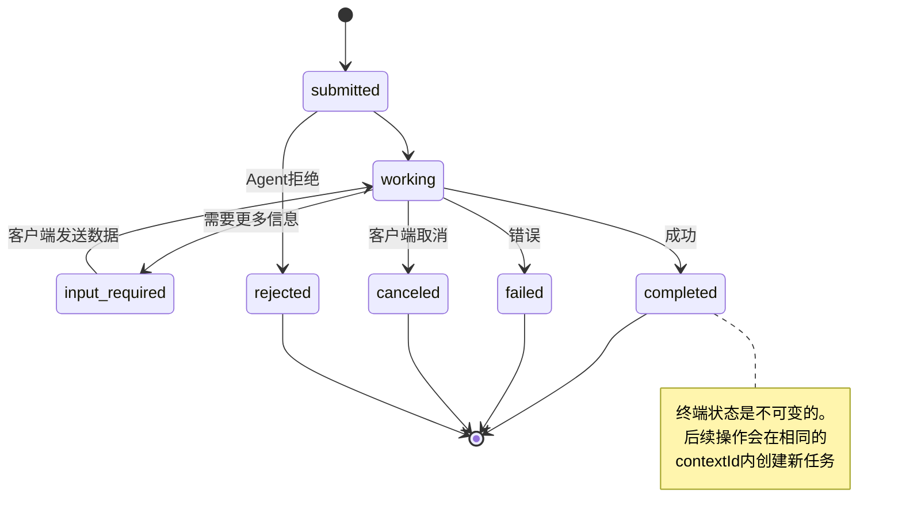

所有8种状态（规范还定义了`UNSPECIFIED`作为哨兵值，此处省略）：

| 状态 | 是否终端？ | 含义 |
|---|---|---|
| `TASK_STATE_SUBMITTED` | 否 | 已确认，尚未处理 |
| `TASK_STATE_WORKING` | 否 | 正在积极处理 |
| `TASK_STATE_INPUT_REQUIRED` | 否 | Agent需要客户端提供更多信息 |
| `TASK_STATE_AUTH_REQUIRED` | 否 | 需要认证 |
| `TASK_STATE_COMPLETED` | 是 | 成功完成 |
| `TASK_STATE_FAILED` | 是 | 带错误完成 |
| `TASK_STATE_CANCELED` | 是 | 完成前取消 |
| `TASK_STATE_REJECTED` | 是 | Agent拒绝任务 |

任务一旦到达终端状态，就是不可变的。不再发送消息。后续操作会在相同的`contextId`内创建新任务。

#### 线路格式

A2A使用JSON-RPC 2.0。以下是真实消息交换的样子：

**客户端发送任务：**
```json
{
  "jsonrpc": "2.0",
  "id": 1,
  "method": "SendMessage",
  "params": {
    "message": {
      "messageId": "msg-001",
      "role": "ROLE_USER",
      "parts": [{ "text": "研究React 19编译器特性" }]
    },
    "configuration": {
      "acceptedOutputModes": ["text/plain", "application/json"],
      "historyLength": 10
    }
  }
}
```

**Agent用任务响应：**
```json
{
  "jsonrpc": "2.0",
  "id": 1,
  "result": {
    "task": {
      "id": "task-abc-123",
      "contextId": "ctx-xyz-789",
      "status": {
        "state": "TASK_STATE_COMPLETED",
        "timestamp": "2026-03-27T10:30:00Z"
      },
      "artifacts": [
        {
          "artifactId": "art-001",
          "name": "research-results",
          "parts": [{
            "data": {
              "findings": [
                "React 19编译器自动memoize组件",
                "不再需要手动useMemo/useCallback",
                "编译器在构建时运行，而非运行时"
              ]
            },
            "mediaType": "application/json"
          }]
        }
      ]
    }
  }
}
```

**通过SSE流式传输：**
```text
POST /message:stream HTTP/1.1
Content-Type: application/json
A2A-Version: 1.0

data: {"task":{"id":"task-123","status":{"state":"TASK_STATE_WORKING"}}}

data: {"statusUpdate":{"taskId":"task-123","status":{"state":"TASK_STATE_WORKING","message":{"role":"ROLE_AGENT","parts":[{"text":"正在搜索文档..."}]}}}}

data: {"artifactUpdate":{"taskId":"task-123","artifact":{"artifactId":"art-1","parts":[{"text":"部分发现..."}]},"append":true,"lastChunk":false}}

data: {"statusUpdate":{"taskId":"task-123","status":{"state":"TASK_STATE_COMPLETED"}}}
```

### ACP（Agent通信协议）

**创建方：** IBM / BeeAI
**规范版本：** 0.2.0（OpenAPI 3.1.1）
**状态：** 正在合并入A2A（Linux基金会）
**问题：** Agent如何以完全可审计、会话连续性和轨迹跟踪的方式进行通信？

ACP是**企业协议**。与许多摘要声称的不同，ACP**不使用**JSON-LD。它是一个通过OpenAPI定义的简单REST/JSON API。它的独特之处在于**轨迹元数据**：每个Agent响应都可以携带详细的推理步骤和工具调用日志。

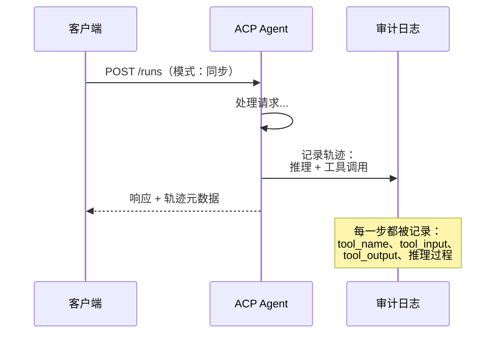

#### ACP中的Agent发现

ACP定义了四种发现方法：

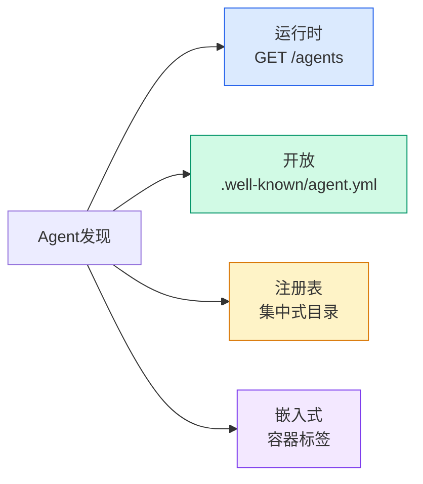

**AgentManifest**比A2A的Agent卡更简单：

```json
{
  "name": "summarizer",
  "description": "用来源引用总结文档",
  "input_content_types": ["text/plain", "application/pdf"],
  "output_content_types": ["text/plain", "application/json"],
  "metadata": {
    "tags": ["总结", "RAG"],
    "framework": "BeeAI",
    "capabilities": [
      {
        "name": "文档总结",
        "description": "将长文档压缩为要点"
      }
    ],
    "recommended_models": ["llama3.3:70b-instruct-fp16"],
    "license": "Apache-2.0",
    "programming_language": "Python"
  }
}
```

#### 运行生命周期

ACP使用"运行"而不是"任务"。运行是Agent执行，有三种模式：

| 模式 | 行为 |
|---|---|
| `sync` | 阻塞。响应包含完整结果。 |
| `async` | 立即返回202。轮询 `GET /runs/{id}` 获取状态。 |
| `stream` | SSE流。Agent工作时触发事件。 |

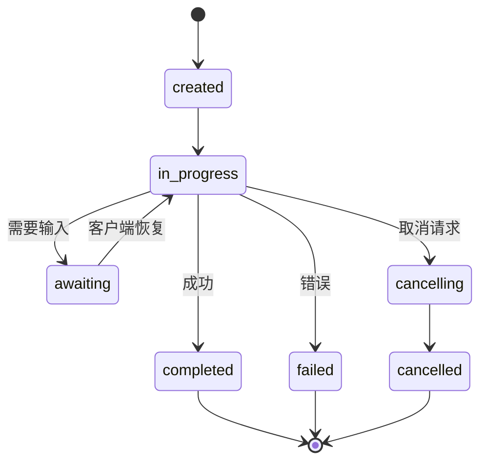

#### 轨迹元数据（审计链）

这是ACP的关键区别点。每个消息部分都可以包含显示Agent确切操作的元数据：

```json
{
  "role": "agent/researcher",
  "parts": [
    {
      "content_type": "text/plain",
      "content": "旧金山的天气是72华氏度且晴朗。",
      "metadata": {
        "kind": "trajectory",
        "message": "我需要检查这个位置的天气",
        "tool_name": "weather_api",
        "tool_input": { "location": "San Francisco, CA" },
        "tool_output": { "temperature": 72, "condition": "sunny" }
      }
    }
  ]
}
```

对于受监管行业来说这是无价之宝。每个答案都附带可证明的推理链：调用了哪些工具、使用了什么输入、接收了什么输出。没有黑盒。

ACP还支持**引用元数据**用于来源标注：

```json
{
  "kind": "citation",
  "start_index": 0,
  "end_index": 47,
  "url": "https://weather.gov/sf",
  "title": "国家气象局旧金山预报"
}
```

### ANP（Agent网络协议）

**创建方：** 开源社区（由GaoWei Chang创立）
**仓库：** [github.com/agent-network-protocol/AgentNetworkProtocol](https://github.com/agent-network-protocol/AgentNetworkProtocol)
**问题：** 来自不同组织的Agent如何在没有中心权威的情况下互相信任？

ANP是**去中心化身份协议**。它使用W3C去中心化标识符（DID）和端到端加密来建立信任。与A2A通过已知端点发现Agent不同，ANP让Agent能够密码学地证明其身份。

ANP有三个层次：

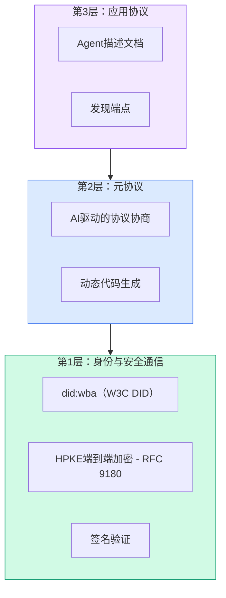

#### DID文档（真实结构）

ANP使用一个名为`did:wba`（基于Web的Agent）的自定义DID方法。DID `did:wba:example.com:user:alice`解析为`https://example.com/user/alice/did.json`：

```json
{
  "@context": [
    "https://www.w3.org/ns/did/v1",
    "https://w3id.org/security/suites/jws-2020/v1",
    "https://w3id.org/security/suites/secp256k1-2019/v1"
  ],
  "id": "did:wba:example.com:user:alice",
  "verificationMethod": [
    {
      "id": "did:wba:example.com:user:alice#key-1",
      "type": "EcdsaSecp256k1VerificationKey2019",
      "controller": "did:wba:example.com:user:alice",
      "publicKeyJwk": {
        "crv": "secp256k1",
        "x": "NtngWpJUr-rlNNbs0u-Aa8e16OwSJu6UiFf0Rdo1oJ4",
        "y": "qN1jKupJlFsPFc1UkWinqljv4YE0mq_Ickwnjgasvmo",
        "kty": "EC"
      }
    },
    {
      "id": "did:wba:example.com:user:alice#key-x25519-1",
      "type": "X25519KeyAgreementKey2019",
      "controller": "did:wba:example.com:user:alice",
      "publicKeyMultibase": "z9hFgmPVfmBZwRvFEyniQDBkz9LmV7gDEqytWyGZLmDXE"
    }
  ],
  "authentication": [
    "did:wba:example.com:user:alice#key-1"
  ],
  "keyAgreement": [
    "did:wba:example.com:user:alice#key-x25519-1"
  ],
  "humanAuthorization": [
    "did:wba:example.com:user:alice#key-1"
  ],
  "service": [
    {
      "id": "did:wba:example.com:user:alice#agent-description",
      "type": "AgentDescription",
      "serviceEndpoint": "https://example.com/agents/alice/ad.json"
    }
  ]
}
```

需要注意的关键点：
- **密钥分离**被强制执行。签名密钥（secp256k1）与加密密钥（X25519）是分开的。
- **`humanAuthorization`**是ANP独有的。这些密钥在使用前需要明确的人工批准（生物识别、密码、HSM）。高风险操作（如资金转移）通过此路径进行。
- **`keyAgreement`**密钥用于HPKE端到端加密（RFC 9180）。
- **service**部分链接到Agent描述文档。

#### ANP中信任如何工作

ANP**不使用**信任网或背书图。信任是双边且按交互验证的：

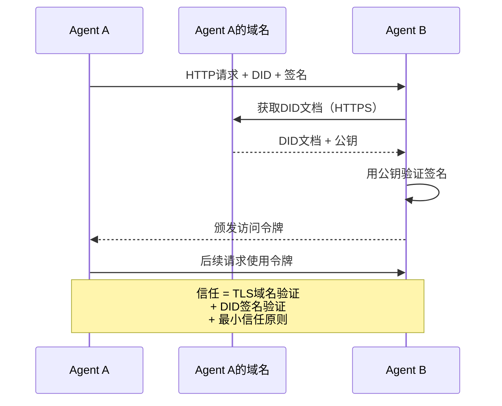

信任来自三个来源：
1. **域名级TLS**验证DID文档主机
2. **DID密码学签名**验证Agent身份
3. **最小信任原则**仅授予最低权限

没有基于谣言的信任传播或PageRank评分。你通过DID直接验证每个Agent。

#### 元协议协商

这是ANP最创新的特性。当来自不同生态系统的两个Agent相遇时，它们不需要预定义的數據格式。它们用自然语言协商：

```json
{
  "action": "protocolNegotiation",
  "sequenceId": 0,
  "candidateProtocols": "我可以使用以下方式通信：\n1. 带酒店预订模式的JSON-RPC\n2. 带OpenAPI 3.1规范的REST\n3. HTTP上的自然语言",
  "modificationSummary": "初始提案",
  "status": "negotiating"
}
```

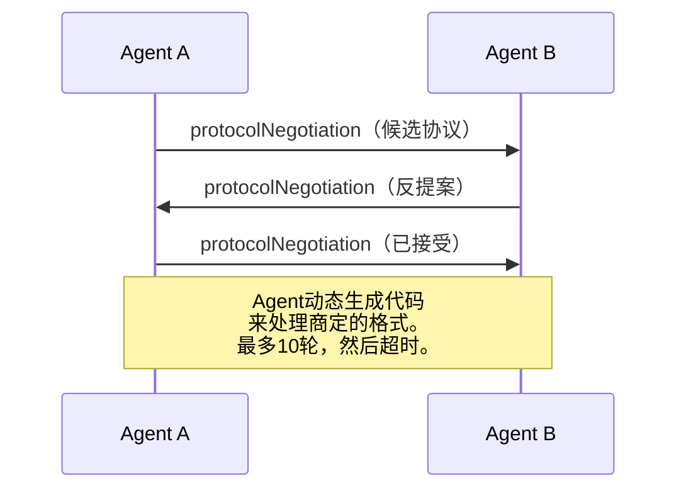

Agent来回协商（最多10轮）直到达成一致，然后动态生成代码来处理它。状态值：`negotiating`、`rejected`、`accepted`、`timeout`。

这意味着两个以前从未见过面的Agent可以弄清楚如何通信，而不需要任何人预先定义共享模式。

### 对比（修正版）

| | MCP | A2A | ACP | ANP |
|---|---|---|---|---|
| **创建方** | Anthropic | Google / Linux基金会 | IBM / BeeAI | 社区 |
| **规范格式** | JSON-RPC | JSON-RPC / REST / gRPC | OpenAPI 3.1（REST） | JSON-RPC |
| **主要用途** | Agent到工具 | Agent到Agent | Agent到Agent | Agent到Agent |
| **发现方式** | 工具列表 | `/.well-known/agent-card.json` | `GET /agents`、`/.well-known/agent.yml` | `/.well-known/agent-descriptions`、DID服务端点 |
| **身份** | 隐式（本地） | 安全方案（OAuth、mTLS） | 服务器级 | W3C DID（`did:wba`）加端到端加密 |
| **审计链** | 不适用 | 基础（任务历史） | 轨迹元数据（工具调用、推理） | 未正式规范 |
| **状态机** | 不适用 | 9个任务状态 | 7个运行状态 | 不适用 |
| **流式传输** | 不适用 | SSE | SSE | 传输无关 |
| **独特功能** | 工具模式 | Agent卡 + 技能 | 轨迹审计链 | 元协议协商 |
| **最佳适用** | 工具和数据 | 动态协作 | 受监管行业 | 跨组织信任 |
| **状态** | 稳定 | 稳定（v1.0） | 合并入A2A | 活跃开发中 |

### 它们如何协同工作

这些协议不是互斥的。一个现实的企业系统会使用多种协议：

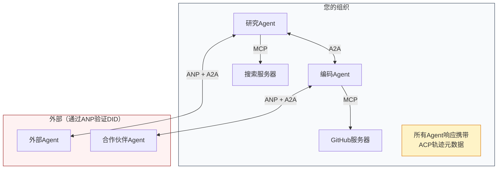

- **MCP**将每个Agent连接到其工具
- **A2A**处理Agent之间的协作（内部和外部）
- **ACP**将响应包装在轨迹元数据中以支持可审计性
- **ANP**为你提供无法控制的Agent的身份验证

```figure
swarm-message-bus
```

## 动手构建

### 步骤1：核心消息类型

每个多Agent系统都从消息格式开始。我们定义映射到真实协议使用的类型：

```typescript
import crypto from "node:crypto";

type MessageRole = "user" | "agent";

type MessagePart =
  | { kind: "text"; text: string }
  | { kind: "data"; data: unknown; mediaType: string }
  | { kind: "file"; name: string; url: string; mediaType: string };

type TrajectoryEntry = {
  reasoning: string;
  toolName?: string;
  toolInput?: unknown;
  toolOutput?: unknown;
  timestamp: number;
};

type AgentMessage = {
  id: string;
  role: MessageRole;
  parts: MessagePart[];
  trajectory?: TrajectoryEntry[];
  replyTo?: string;
  timestamp: number;
};

function createMessage(
  role: MessageRole,
  parts: MessagePart[],
  replyTo?: string
): AgentMessage {
  return {
    id: crypto.randomUUID(),
    role,
    parts,
    replyTo,
    timestamp: Date.now(),
  };
}

function textMessage(role: MessageRole, text: string): AgentMessage {
  return createMessage(role, [{ kind: "text", text }]);
}
```

注意：`MessagePart`是多模态的（文本、结构化数据、文件），就像真实的A2A和ACP规范一样。`TrajectoryEntry`捕获推理链，与ACP的轨迹元数据匹配。

### 步骤2：A2A Agent卡和注册表

构建符合真实A2A规范的Agent发现：

```typescript
type Skill = {
  id: string;
  name: string;
  description: string;
  tags: string[];
  inputModes: string[];
  outputModes: string[];
};

type AgentCard = {
  name: string;
  description: string;
  version: string;
  url: string;
  capabilities: {
    streaming: boolean;
    pushNotifications: boolean;
  };
  defaultInputModes: string[];
  defaultOutputModes: string[];
  skills: Skill[];
};

class AgentRegistry {
  private cards: Map<string, AgentCard> = new Map();

  register(card: AgentCard) {
    this.cards.set(card.name, card);
  }

  discoverBySkillTag(tag: string): AgentCard[] {
    return [...this.cards.values()].filter((card) =>
      card.skills.some((skill) => skill.tags.includes(tag))
    );
  }

  discoverByInputMode(mimeType: string): AgentCard[] {
    return [...this.cards.values()].filter(
      (card) =>
        card.defaultInputModes.includes(mimeType) ||
        card.skills.some((skill) => skill.inputModes.includes(mimeType))
    );
  }

  resolve(name: string): AgentCard | undefined {
    return this.cards.get(name);
  }

  listAll(): AgentCard[] {
    return [...this.cards.values()];
  }
}
```

这比简单的名称到能力映射丰富得多。你可以按技能标签、按输入MIME类型或按名称发现Agent，就像真实A2A规范支持的那样。

### 步骤3：A2A任务生命周期

构建完整的任务状态机：

```typescript
type TaskState =
  | "submitted"
  | "working"
  | "input-required"
  | "auth-required"
  | "completed"
  | "failed"
  | "canceled"
  | "rejected";

const TERMINAL_STATES: TaskState[] = [
  "completed",
  "failed",
  "canceled",
  "rejected",
];

type TaskStatus = {
  state: TaskState;
  message?: AgentMessage;
  timestamp: number;
};

type Artifact = {
  id: string;
  name: string;
  parts: MessagePart[];
};

type Task = {
  id: string;
  contextId: string;
  status: TaskStatus;
  artifacts: Artifact[];
  history: AgentMessage[];
};

type TaskEvent =
  | { kind: "statusUpdate"; taskId: string; status: TaskStatus }
  | {
      kind: "artifactUpdate";
      taskId: string;
      artifact: Artifact;
      append: boolean;
      lastChunk: boolean;
    };

type TaskHandler = (
  task: Task,
  message: AgentMessage
) => AsyncGenerator<TaskEvent>;

class TaskManager {
  private tasks: Map<string, Task> = new Map();
  private handlers: Map<string, TaskHandler> = new Map();
  private listeners: Map<string, ((event: TaskEvent) => void)[]> = new Map();

  registerHandler(agentName: string, handler: TaskHandler) {
    this.handlers.set(agentName, handler);
  }

  subscribe(taskId: string, listener: (event: TaskEvent) => void) {
    const existing = this.listeners.get(taskId) ?? [];
    existing.push(listener);
    this.listeners.set(taskId, existing);
  }

  async sendMessage(
    agentName: string,
    message: AgentMessage,
    contextId?: string
  ): Promise<Task> {
    const handler = this.handlers.get(agentName);
    if (!handler) {
      const task = this.createTask(contextId);
      task.status = {
        state: "rejected",
        timestamp: Date.now(),
        message: textMessage("agent", `没有找到${agentName}的处理程序`),
      };
      return task;
    }

    const task = this.createTask(contextId);
    task.history.push(message);
    task.status = { state: "submitted", timestamp: Date.now() };

    this.processTask(task, handler, message).catch((err) => {
      task.status = {
        state: "failed",
        timestamp: Date.now(),
        message: textMessage("agent", String(err)),
      };
    });
    return task;
  }

  getTask(taskId: string): Task | undefined {
    return this.tasks.get(taskId);
  }

  cancelTask(taskId: string): boolean {
    const task = this.tasks.get(taskId);
    if (!task || TERMINAL_STATES.includes(task.status.state)) return false;
    task.status = { state: "canceled", timestamp: Date.now() };
    this.emit(taskId, {
      kind: "statusUpdate",
      taskId,
      status: task.status,
    });
    return true;
  }

  private createTask(contextId?: string): Task {
    const task: Task = {
      id: crypto.randomUUID(),
      contextId: contextId ?? crypto.randomUUID(),
      status: { state: "submitted", timestamp: Date.now() },
      artifacts: [],
      history: [],
    };
    this.tasks.set(task.id, task);
    return task;
  }

  private async processTask(
    task: Task,
    handler: TaskHandler,
    message: AgentMessage
  ) {
    task.status = { state: "working", timestamp: Date.now() };
    this.emit(task.id, {
      kind: "statusUpdate",
      taskId: task.id,
      status: task.status,
    });

    try {
      for await (const event of handler(task, message)) {
        if (TERMINAL_STATES.includes(task.status.state)) break;

        if (event.kind === "statusUpdate") {
          task.status = event.status;
        }
        if (event.kind === "artifactUpdate") {
          const existing = task.artifacts.find(
            (a) => a.id === event.artifact.id
          );
          if (existing && event.append) {
            existing.parts.push(...event.artifact.parts);
          } else {
            task.artifacts.push(event.artifact);
          }
        }
        this.emit(task.id, event);
      }
    } catch (err) {
      task.status = {
        state: "failed",
        timestamp: Date.now(),
        message: textMessage("agent", String(err)),
      };
      this.emit(task.id, {
        kind: "statusUpdate",
        taskId: task.id,
        status: task.status,
      });
    }
  }

  private emit(taskId: string, event: TaskEvent) {
    for (const listener of this.listeners.get(taskId) ?? []) {
      listener(event);
    }
  }
}
```

这实现了真实的A2A任务生命周期：已提交、处理中、需要输入、终端状态。处理程序是异步生成器，产生与SSE流式传输模型匹配的事件（状态更新和工件块）。

### 步骤4：ACP风格审计链

用轨迹跟踪包装通信：

```typescript
type AuditEntry = {
  runId: string;
  agentName: string;
  input: AgentMessage[];
  output: AgentMessage[];
  trajectory: TrajectoryEntry[];
  status: "created" | "in-progress" | "completed" | "failed" | "awaiting";
  startedAt: number;
  completedAt?: number;
  sessionId?: string;
};

class AuditableRunner {
  private log: AuditEntry[] = [];
  private handlers: Map<
    string,
    (input: AgentMessage[]) => Promise<{
      output: AgentMessage[];
      trajectory: TrajectoryEntry[];
    }>
  > = new Map();

  registerAgent(
    name: string,
    handler: (input: AgentMessage[]) => Promise<{
      output: AgentMessage[];
      trajectory: TrajectoryEntry[];
    }>
  ) {
    this.handlers.set(name, handler);
  }

  async run(
    agentName: string,
    input: AgentMessage[],
    sessionId?: string
  ): Promise<AuditEntry> {
    const entry: AuditEntry = {
      runId: crypto.randomUUID(),
      agentName,
      input: structuredClone(input),
      output: [],
      trajectory: [],
      status: "created",
      startedAt: Date.now(),
      sessionId,
    };
    this.log.push(entry);

    const handler = this.handlers.get(agentName);
    if (!handler) {
      entry.status = "failed";
      return entry;
    }

    entry.status = "in-progress";
    try {
      const result = await handler(input);
      entry.output = structuredClone(result.output);
      entry.trajectory = structuredClone(result.trajectory);
      entry.status = "completed";
      entry.completedAt = Date.now();
    } catch (err) {
      entry.status = "failed";
      entry.trajectory.push({
        reasoning: `错误：${String(err)}`,
        timestamp: Date.now(),
      });
      entry.completedAt = Date.now();
    }
    return entry;
  }

  getFullAuditLog(): AuditEntry[] {
    return structuredClone(this.log);
  }

  getAuditLogForAgent(agentName: string): AuditEntry[] {
    return structuredClone(
      this.log.filter((e) => e.agentName === agentName)
    );
  }

  getAuditLogForSession(sessionId: string): AuditEntry[] {
    return structuredClone(
      this.log.filter((e) => e.sessionId === sessionId)
    );
  }

  getTrajectoryForRun(runId: string): TrajectoryEntry[] {
    const entry = this.log.find((e) => e.runId === runId);
    return entry ? structuredClone(entry.trajectory) : [];
  }
}
```

每个Agent执行都会生成完整的审计条目：输入了什么、输出了什么，以及两者之间完整的工具调用和推理步骤轨迹。你可以按Agent、按会话或按单个运行进行查询。

### 步骤5：ANP风格身份验证

构建基于DID的身份和验证：

```typescript
type VerificationMethod = {
  id: string;
  type: string;
  controller: string;
  publicKeyDer: string;
};

type DIDDocument = {
  id: string;
  verificationMethod: VerificationMethod[];
  authentication: string[];
  keyAgreement: string[];
  humanAuthorization: string[];
  service: { id: string; type: string; serviceEndpoint: string }[];
};

type AgentIdentity = {
  did: string;
  document: DIDDocument;
  privateKey: crypto.KeyObject;
  publicKey: crypto.KeyObject;
};

class IdentityRegistry {
  private documents: Map<string, DIDDocument> = new Map();

  publish(doc: DIDDocument) {
    this.documents.set(doc.id, doc);
  }

  resolve(did: string): DIDDocument | undefined {
    return this.documents.get(did);
  }

  verify(did: string, signature: string, payload: string): boolean {
    const doc = this.documents.get(did);
    if (!doc) return false;

    const authKeyIds = doc.authentication;
    const authKeys = doc.verificationMethod.filter((vm) =>
      authKeyIds.includes(vm.id)
    );

    for (const key of authKeys) {
      const publicKey = crypto.createPublicKey({
        key: Buffer.from(key.publicKeyDer, "base64"),
        format: "der",
        type: "spki",
      });
      const isValid = crypto.verify(
        null,
        Buffer.from(payload),
        publicKey,
        Buffer.from(signature, "hex")
      );
      if (isValid) return true;
    }
    return false;
  }

  requiresHumanAuth(did: string, operationKeyId: string): boolean {
    const doc = this.documents.get(did);
    if (!doc) return false;
    return doc.humanAuthorization.includes(operationKeyId);
  }
}

function createIdentity(domain: string, agentName: string): AgentIdentity {
  const did = `did:wba:${domain}:agent:${agentName}`;
  const { publicKey, privateKey } = crypto.generateKeyPairSync("ed25519");

  const publicKeyDer = publicKey
    .export({ format: "der", type: "spki" })
    .toString("base64");

  const keyId = `${did}#key-1`;
  const encKeyId = `${did}#key-x25519-1`;

  const document: DIDDocument = {
    id: did,
    verificationMethod: [
      {
        id: keyId,
        type: "Ed25519VerificationKey2020",
        controller: did,
        publicKeyDer,
      },
      {
        id: encKeyId,
        type: "X25519KeyAgreementKey2019",
        controller: did,
        publicKeyDer,
      },
    ],
    authentication: [keyId],
    keyAgreement: [encKeyId],
    humanAuthorization: [],
    service: [
      {
        id: `${did}#agent-description`,
        type: "AgentDescription",
        serviceEndpoint: `https://${domain}/agents/${agentName}/ad.json`,
      },
    ],
  };

  return { did, document, privateKey, publicKey };
}

function signPayload(identity: AgentIdentity, payload: string): string {
  return crypto
    .sign(null, Buffer.from(payload), identity.privateKey)
    .toString("hex");
}
```

这镜像了真实的ANP身份模型：Agent有DID文档，包含独立的认证、密钥协商和人工授权密钥。`IdentityRegistry`模拟DID解析（在生产环境中这将是向Agent域名的HTTP获取）。

### 步骤6：协议网关

将所有四种协议连接到统一系统：

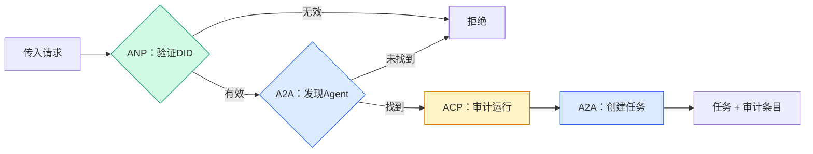

```typescript
class ProtocolGateway {
  private registry: AgentRegistry;
  private taskManager: TaskManager;
  private auditRunner: AuditableRunner;
  private identityRegistry: IdentityRegistry;

  constructor(
    registry: AgentRegistry,
    taskManager: TaskManager,
    auditRunner: AuditableRunner,
    identityRegistry: IdentityRegistry
  ) {
    this.registry = registry;
    this.taskManager = taskManager;
    this.auditRunner = auditRunner;
    this.identityRegistry = identityRegistry;
  }

  async delegateTask(
    fromDid: string,
    signature: string,
    targetAgent: string,
    message: AgentMessage,
    sessionId?: string
  ): Promise<{ task: Task; audit: AuditEntry } | { error: string }> {
    if (!this.identityRegistry.verify(fromDid, signature, message.id)) {
      return { error: "身份验证失败" };
    }

    const card = this.registry.resolve(targetAgent);
    if (!card) {
      return { error: `注册表中未找到Agent ${targetAgent}` };
    }

    const audit = await this.auditRunner.run(
      targetAgent,
      [message],
      sessionId
    );
    const task = await this.taskManager.sendMessage(targetAgent, message);

    return { task, audit };
  }

  discoverAndDelegate(
    fromDid: string,
    signature: string,
    skillTag: string,
    message: AgentMessage
  ): Promise<{ task: Task; audit: AuditEntry } | { error: string }> {
    const candidates = this.registry.discoverBySkillTag(skillTag);
    if (candidates.length === 0) {
      return Promise.resolve({
        error: `未找到具有技能标签的Agent：${skillTag}`,
      });
    }
    return this.delegateTask(
      fromDid,
      signature,
      candidates[0].name,
      message
    );
  }
}
```

网关在一次调用中做四件事：
1. **ANP**：通过DID签名验证调用者的身份
2. **A2A**：发现目标Agent并检查能力
3. **ACP**：用轨迹包装执行为审计链
4. **A2A**：创建具有完整生命周期跟踪的任务

### 步骤7：连接一切

```typescript
async function protocolDemo() {
  const registry = new AgentRegistry();
  registry.register({
    name: "researcher",
    description: "搜索并总结发现",
    version: "1.0.0",
    url: "https://researcher.local/a2a/v1",
    capabilities: { streaming: true, pushNotifications: false },
    defaultInputModes: ["text/plain"],
    defaultOutputModes: ["text/plain", "application/json"],
    skills: [
      {
        id: "web-research",
        name: "网络研究",
        description: "搜索网络",
        tags: ["研究", "搜索", "总结"],
        inputModes: ["text/plain"],
        outputModes: ["application/json"],
      },
    ],
  });
  registry.register({
    name: "coder",
    description: "根据规范编写代码",
    version: "1.0.0",
    url: "https://coder.local/a2a/v1",
    capabilities: { streaming: false, pushNotifications: false },
    defaultInputModes: ["text/plain", "application/json"],
    defaultOutputModes: ["text/plain"],
    skills: [
      {
        id: "code-gen",
        name: "代码生成",
        description: "生成代码",
        tags: ["编码", "生成"],
        inputModes: ["text/plain", "application/json"],
        outputModes: ["text/plain"],
      },
    ],
  });

  const taskManager = new TaskManager();
  const auditRunner = new AuditableRunner();

  const researchTrajectory: TrajectoryEntry[] = [];

  taskManager.registerHandler(
    "researcher",
    async function* (task, message) {
      yield {
        kind: "statusUpdate" as const,
        taskId: task.id,
        status: { state: "working" as const, timestamp: Date.now() },
      };

      researchTrajectory.push({
        reasoning: "正在搜索React 19文档",
        toolName: "web_search",
        toolInput: { query: "React 19编译器特性" },
        toolOutput: {
          results: ["react.dev/blog/react-19", "github.com/react/react"],
        },
        timestamp: Date.now(),
      });

      researchTrajectory.push({
        reasoning: "从搜索结果中提取关键发现",
        toolName: "doc_analysis",
        toolInput: { url: "react.dev/blog/react-19" },
        toolOutput: {
          summary:
            "React 19编译器自动memoize，无需手动useMemo",
        },
        timestamp: Date.now(),
      });

      yield {
        kind: "artifactUpdate" as const,
        taskId: task.id,
        artifact: {
          id: crypto.randomUUID(),
          name: "research-results",
          parts: [
            {
              kind: "data" as const,
              data: {
                findings: [
                  "React 19编译器自动memoize组件",
                  "不再需要手动useMemo/useCallback",
                  "编译器在构建时运行，而非运行时",
                ],
                sources: ["react.dev/blog/react-19"],
              },
              mediaType: "application/json",
            },
          ],
        },
        append: false,
        lastChunk: true,
      };

      yield {
        kind: "statusUpdate" as const,
        taskId: task.id,
        status: { state: "completed" as const, timestamp: Date.now() },
      };
    }
  );

  auditRunner.registerAgent("researcher", async () => ({
    output: [
      textMessage("agent", "React 19编译器自动memoize组件"),
    ],
    trajectory: researchTrajectory,
  }));

  const identityRegistry = new IdentityRegistry();

  const coderIdentity = createIdentity("coder.local", "coder");
  const researcherIdentity = createIdentity("researcher.local", "researcher");

  identityRegistry.publish(coderIdentity.document);
  identityRegistry.publish(researcherIdentity.document);

  const gateway = new ProtocolGateway(
    registry,
    taskManager,
    auditRunner,
    identityRegistry
  );

  console.log("=== 协议演示 ===\n");

  console.log("1. Agent发现（A2A）");
  const researchAgents = registry.discoverBySkillTag("研究");
  console.log(
    `   找到${researchAgents.length}个Agent：`,
    researchAgents.map((a) => a.name)
  );

  console.log("\n2. 身份验证（ANP）");
  const message = textMessage("user", "研究React 19编译器特性");
  const signature = signPayload(coderIdentity, message.id);
  const verified = identityRegistry.verify(
    coderIdentity.did,
    signature,
    message.id
  );
  console.log(`   Coder DID: ${coderIdentity.did}`);
  console.log(`   签名验证：${verified}`);

  console.log("\n3. 任务委派（A2A + ACP + ANP）");
  const result = await gateway.delegateTask(
    coderIdentity.did,
    signature,
    "researcher",
    message,
    "session-001"
  );

  if ("error" in result) {
    console.log(`   错误：${result.error}`);
    return;
  }

  console.log(`   任务ID：${result.task.id}`);
  console.log(`   任务状态：${result.task.status.state}`);
  console.log(`   工件：${result.task.artifacts.length}`);

  console.log("\n4. 审计链（ACP）");
  console.log(`   运行ID：${result.audit.runId}`);
  console.log(`   状态：${result.audit.status}`);
  console.log(`   轨迹步骤：${result.audit.trajectory.length}`);
  for (const step of result.audit.trajectory) {
    console.log(`     - ${step.reasoning}`);
    if (step.toolName) {
      console.log(`       工具：${step.toolName}`);
    }
  }

  console.log("\n5. 完整审计日志");
  const fullLog = auditRunner.getFullAuditLog();
  console.log(`   总运行数：${fullLog.length}`);
  for (const entry of fullLog) {
    const duration = entry.completedAt
      ? `${entry.completedAt - entry.startedAt}毫秒`
      : "进行中";
    console.log(`   ${entry.agentName}: ${entry.status}（${duration}）`);
  }
}

protocolDemo().catch((err) => {
  console.error("协议演示失败：", err);
  process.exitCode = 1;
});
```

## 故障排除

协议解决了理想路径。以下是生产环境中可能出错的地方：

**模式漂移。** Agent A发布了一个Agent卡，宣称输出`application/json`。但JSON模式在版本之间发生了变化。Agent B解析旧格式得到乱码。修复方法：为技能和输出模式添加版本。A2A规范支持在Agent卡上使用`version`正是为此。

**状态机违规。** Agent处理程序产生了`completed`事件，然后尝试产生更多工件。任务是不可变的。你的代码会静默丢弃更新或抛出异常。修复方法：在产生前检查终端状态。上面的`TaskManager`通过在终端状态后`break`来强制执行此操作。

**信任解析失败。** Agent A尝试验证Agent B的DID，但Agent B的域名宕机了。无法获取DID文档。你是开放失败（接受未验证的Agent）还是关闭失败（拒绝一切）？ANP建议使用最小信任原则的关闭失败。

**轨迹膨胀。** ACP轨迹日志很有力但代价高昂。一个复杂的Agent每次运行进行200次工具调用会产生庞大的审计条目。修复方法：在可配置的详细程度级别记录轨迹。为了合规记录工具名称和IO，跳过非监管工作负载的推理步骤。

**发现洪泛。** 50个Agent在启动时同时查询`GET /agents`。修复方法：缓存带有TTL的Agent卡，交错发现间隔，或使用推送式注册替代轮询。

## 使用指南

### 真实实现

**A2A**是最成熟的。Google的[官方规范](https://github.com/google/A2A)在Linux基金会下开源。提供Python和TypeScript的SDK。如果你的Agent需要动态发现和协作，从这里开始。

**ACP**正在合并入A2A。IBM的[BeeAI项目](https://github.com/i-am-bee/acp)创建了ACP作为REST优先的替代方案，但轨迹元数据概念正在被吸收进A2A生态系统。即使你使用A2A作为传输层，也要使用ACP模式（轨迹日志、运行生命周期）。

**ANP**是最实验性的。[社区仓库](https://github.com/agent-network-protocol/AgentNetworkProtocol)有Python SDK（AgentConnect）。元协议协商概念确实新颖。对于跨组织Agent部署值得持续关注。

**MCP**在第13阶段已经覆盖。如果你的Agent需要使用工具，MCP是标准。

### 选择合适的协议

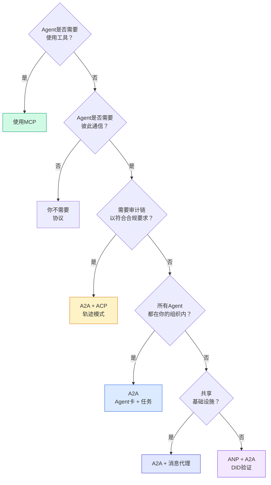

## 交付

本课产出：
- `code/main.ts` -- 四种协议模式的完整实现
- `outputs/prompt-protocol-selector.md` -- 帮助你为系统选择协议的问题提示

## 练习

1. **多跳任务委派。** 扩展`TaskManager`，使Agent处理程序能够向其他Agent委派子任务。研究员接收一个任务，将"搜索"和"总结"子任务委派给两个专家Agent，等待两者完成，然后将结果合并到自己的工件中。

2. **流式审计链。** 修改`AuditableRunner`以支持流式模式。不要等待完整结果，而是在添加轨迹条目时实时产生`AuditEntry`更新。使用产生审计快照的异步生成器。

3. **DID轮换。** 向`IdentityRegistry`添加密钥轮换。Agent应该能够发布带有更新密钥的新DID文档，同时保持`previousDid`引用。验证方应该在宽限期内接受来自当前和先前密钥的签名。

4. **协议协商。** 实现ANP的元协议概念。两个Agent交换带有候选格式的`protocolNegotiation`消息（例如，"我可以说JSON-RPC" vs "我更喜欢REST"）。经过最多3轮后，它们要么就格式达成一致，要么超时。商定的格式决定了它们使用哪个`TaskManager`或`AuditableRunner`。

5. **限速发现。** 添加一个`RateLimitedRegistry`包装器，使用可配置的TTL缓存Agent卡查找，并限制每个Agent每秒的发现查询次数。模拟启动时100个Agent互相发现的洪泛，并测量差异。

## 关键术语

| 术语 | 人们怎么说 | 实际含义 |
|------|----------------|----------------------|
| MCP | "AI工具的协议" | Agent发现和使用的客户端-服务器协议。Agent到工具，不是Agent到Agent。 |
| A2A | "Google的Agent协议" | Linux基金会下的Agent对等协作协议。通过Agent卡发现，9状态任务生命周期，通过SSE流式传输。支持JSON-RPC、REST和gRPC绑定。 |
| ACP | "企业Agent消息传递" | IBM/BeeAI的REST API，用于带有轨迹元数据的Agent运行：每个响应都附带完整的推理和工具调用链。正在合并入A2A。 |
| ANP | "去中心化Agent身份" | 使用`did:wba`（DID）进行密码学身份、HPKE进行端到端加密、AI驱动元协议协商的社区协议，适用于从未见过面的Agent。 |
| Agent卡 | "Agent的名片" | 位于`/.well-known/agent-card.json`的JSON文档，描述技能、支持的MIME类型、安全方案和协议绑定。 |
| DID | "去中心化ID" | W3C标准，用于在Agent自己的域上托管的可密码学验证身份。ANP使用`did:wba`方法。 |
| 轨迹元数据 | "审计收据" | ACP的机制，用于将推理步骤、工具调用及其输入/输出附加到每个Agent响应。 |
| 元协议 | "Agent协商如何通信" | ANP的方法，Agent使用自然语言动态商定数据格式，然后生成代码来处理它们。 |
| 任务 | "工作单位" | A2A的状态对象，跟踪从提交到完成的工作。到达终端后不可变。 |

## 进一步阅读

- [Google A2A规范](https://github.com/google/A2A) -- 官方规范和SDK（v1.0.0，Linux基金会）
- [IBM/BeeAI ACP规范](https://github.com/i-am-bee/acp) -- 用于Agent运行和轨迹元数据的OpenAPI 3.1规范
- [Agent网络协议](https://github.com/agent-network-protocol/AgentNetworkProtocol) -- 基于DID的身份、端到端加密、元协议协商
- [模型上下文协议文档](https://modelcontextprotocol.io/) -- Anthropic的MCP规范（在第13阶段覆盖）
- [W3C去中心化标识符](https://www.w3.org/TR/did-core/) -- ANP支持的身份标准
- [RFC 9180（HPKE）](https://www.rfc-editor.org/rfc/rfc9180) -- ANP用于端到端加密的加密方案
- [FIPA Agent通信语言](http://www.fipa.org/specs/fipa00061/SC00061G.html) -- 现代Agent协议的学术先驱
