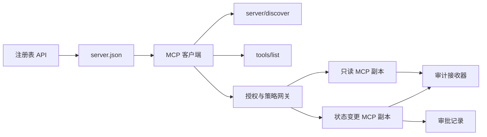

# Capstone 13：无状态 MCP Server 与注册表及治理

> 生产级 MCP 不是单个服务器进程。它是合约链：可发布的元数据、实时发现、无状态请求信封、授权、策略、审计和部署证据。

**类型：** Capstone
**语言：** Python 和 TypeScript 参考模型；任意生产语言
**前置条件：** Phase 11、Phase 13、Phase 14、Phase 17 和 Phase 18
**MCP 必读章节：** [第 28 课：工具合约](../../../13-tools-and-protocols/28-mcp-tool-contracts-and-content/docs/en.md)、[第 29 课：可靠性](../../../13-tools-and-protocols/29-mcp-reliability-cancellation-and-flow-control/docs/en.md)、[第 30 课：注册表供应链](../../../13-tools-and-protocols/30-mcp-registry-supply-chain-and-drift/docs/en.md)、[第 31 课：合规操作](../../../13-tools-and-protocols/31-mcp-conformance-versioning-and-operations/docs/en.md)
**协议目标：** MCP `2026-07-28`
**时间：** ~25 小时

## 学习目标

- 实现无状态 MCP 请求和结果信封。
- 将注册表元数据与实时协议发现分离。
- 构建确定性、缓存感知的工具发现。
- 为每次工具调用强制执行发行方、受众、范围和审批策略。
- 部署无会话亲和性的 Streamable HTTP。
- 在链路、授权、策略、注册表和审计边界验证行为。

## 必读 MCP 前置路径

按顺序完成以下四节 Phase 13 课程后，再视本 Capstone 为生产就绪：

1. [第 28 课](../../../13-tools-and-protocols/28-mcp-tool-contracts-and-content/docs/en.md) 定义了本服务器必须暴露的工具、Schema、内容、分页、完成、路由和错误合约。
2. [第 29 课](../../../13-tools-and-protocols/29-mcp-reliability-cancellation-and-flow-control/docs/en.md) 定义了取消竞态、截止时间、幂等性、背压、重试和重连行为。
3. [第 30 课](../../../13-tools-and-protocols/30-mcp-registry-supply-chain-and-drift/docs/en.md) 定义了命名空间、溯源、准入钉、注册表状态、漂移、账本和回滚证据。
4. [第 31 课](../../../13-tools-and-protocols/31-mcp-conformance-versioning-and-operations/docs/en.md) 定义了黄金和负面转录、严格版本时代、SDK 差异检查、代理证明、脱敏、健康检查和发布门禁。

本 Capstone 整合上述工件。它不会用一个顺路 SDK 测试替代它们。

## 问题

内部平台需要只读数据工具和少量状态变更工具。开发人员必须能够发现服务器、了解连接方式、检查其实时能力，并且只能调用被授权的操作。

难点不在于注册一个函数。难点在于让六个不同的事实保持一致：

1. `server.json` 说明服务器可以安装或访问的位置。
2. `server/discover` 说明当前运行进程支持哪些功能。
3. 每个请求说明其使用的协议修订版和本端能力。
4. 授权将调用者与正确的发行方、资源和范围绑定。
5. 策略判断此特定操作是否可以执行。
6. 审计证据记录穿越边界的内容，而不泄露密钥或敏感负载。

如果其中任何一个发生漂移，平台可能会列出无法访问的服务器、路由不兼容的客户端、接受为另一资源签发的令牌，或在缺少预期审批的情况下暴露破坏性操作。

## 两层发现

注册表和实时 MCP 服务器回答不同的问题。

| 层级 | 合约 | 回答的问题 |
|---|---|---|
| 发布 | `server.json` 和注册表 API | 这是哪个服务器、其包或远程端点在哪里、如何配置？ |
| 运行时 | `server/discover` | 此进程支持哪些协议版本、能力、扩展和服务器身份？ |

官方注册表使用版本化的 `server.json` Schema。远程条目可以指定 Streamable HTTP URL：

```json
{
  "$schema": "https://static.modelcontextprotocol.io/schemas/2025-12-11/server.schema.json",
  "name": "com.example/internal-readonly",
  "title": "Internal Read-Only Tools",
  "description": "Read-only incident and data lookup tools.",
  "version": "1.0.0",
  "remotes": [
    {
      "type": "streamable-http",
      "url": "https://mcp.internal.example.com/readonly"
    }
  ]
}
```

注册表 Schema 版本与 MCP 协议修订版相互独立。不要用其中一个日期去匹配另一个。各自对照自己的合约验证文档。

Schema 有效性不能证明命名空间所有权。经认证的 `example.com` 发布者使用反向 DNS 命名空间 `com.example/*` 或其子命名空间之一。注册表认证流程可证明此所有权。保持域名标签的正常顺序命名的是不同命名空间。

stdlib 模型的 `validate_registry_document` 函数故意是部分远程配置验证器。它检查官方必需的 `name`、`description` 和 `version` 字段；可选的 `title`；已发布名称和长度约束；具体版本形状；以及每个 `streamable-http` 或 `sse` 远程的 HTTP(S) URL 形状。它还要求非空的 `remotes` 列表，因为本 Capstone 始终实时探测远程。`validate_publisher_namespace` 单独针对已认证发布者域名检查名称，而 `validate_runtime_alignment` 将发布名称和版本与实时 `serverInfo` 进行比较。官方 Schema 也支持仅包记录和更多远程字段。发布前，使用钉住版本的官方 JSON Schema 或 `mcp-publisher` 验证完整文档；不要将此无依赖的子集呈现为完整 Schema 验证。

服务器必须实现 `server/discover`；客户端可在其他方法之前调用它。本 Capstone 客户端在解析端点后调用它，并获得当前协议修订版和实时能力：

```json
{
  "resultType": "complete",
  "supportedVersions": ["2026-07-28"],
  "capabilities": {
    "tools": {
      "listChanged": false
    }
  },
  "_meta": {
    "io.modelcontextprotocol/serverInfo": {
      "name": "com.example/internal-readonly",
      "version": "1.0.0"
    }
  },
  "ttlMs": 3600000,
  "cacheScope": "public"
}
```

私有目录可以索引额外的所有权、审查或生命周期数据，但不得将这些数据虚构为 MCP 链路字段或根级 `server.json` 字段。将组织策略存储在已发布记录旁边。当需要公共自定义元数据时，使用注册表的 `_meta.io.modelcontextprotocol.registry/publisher-provided` 扩展并保持在 4 KB 限制内。

## 无状态 MCP 核心

MCP 修订版 `2026-07-28` 移除了协议会话和 `initialize` / `notifications/initialized` 握手。它还移除了 `Mcp-Session-Id`。

每个请求都在 `params._meta` 中携带协议上下文：

```json
{
  "io.modelcontextprotocol/protocolVersion": "2026-07-28",
  "io.modelcontextprotocol/clientCapabilities": {},
  "io.modelcontextprotocol/clientInfo": {
    "name": "internal-platform-client",
    "version": "1.0.0"
  }
}
```

版本和能力是请求事实，而非连接事实。负载均衡器可以将连续请求发送到不同健康副本，因为任一副本都能从消息本身验证请求。

普通结果包含 `resultType: "complete"`。服务器应在每个结果中将自身身份放在 `_meta.io.modelcontextprotocol/serverInfo` 中。缺失或非字符串的协议版本是无效参数 `-32602`。错误 `-32022` 仅用于提供的不支持字符串，且其数据必须为 `{"supported": ["2026-07-28"], "requested": "..."}`。

### 可缓存发现

`tools/list` 对于相同的有效工具集必须是确定性的。结果包括：

- `ttlMs`，客户端的新鲜度提示；
- `cacheScope`，为 `public` 或 `private`；
- 稳定工具顺序，使相同列表可复用 prompt 缓存；
- `resultType: "complete"` 和服务器身份信息。

每用户授权通常应生成 `cacheScope: "private"`。不要在共享公共缓存后面放置用户特定的工具可见性。

## Streamable HTTP

网络服务器暴露一个接受 POST 的 MCP 端点。每个 JSON-RPC 请求或通知各自获得其独立的 POST。

对于请求，服务器返回单个 JSON 对象或该请求作用域的 SSE 流。长期存在的 `subscriptions/listen` 请求携带已选择的变更通知。当前传输中没有独立的 GET 流、会话 DELETE、会话头或 `Last-Event-ID` 重放。

每个请求包含：

- `MCP-Protocol-Version`，与正文元数据匹配；
- `Mcp-Method`，与 JSON-RPC 方法匹配；
- `Mcp-Name` 用于 `tools/call`、`resources/read` 和 `prompts/get`；
- `Accept: application/json, text/event-stream`。

拒绝不匹配的镜像头，返回指定的 `-32020` 错误。验证 `Origin`，将本地开发服务器绑定到环回地址，对远程客户端进行认证，并将关闭的请求作用域 SSE 响应视为取消。



```figure
cf-mcp-gate
```

## 授权与策略

传输元数据不是授权。对每次调用验证授权。

对于远程服务器：

1. 发现受保护资源元数据。
2. 选择该资源的授权服务器。
3. 优先使用客户端 ID 元数据文档进行客户端注册。将动态客户端注册视为兼容性支持。
4. 在授权期间发送资源指示符。
5. 对流的授权服务器记录的 `iss` 值进行验证。
6. 以发行方为键索引客户端凭据。绝不跨发行方重用注册数据。
7. 在 MCP 服务器验证令牌发行方、受众或资源、过期时间和范围。
8. 对具体工具和参数应用第二次策略决策。

工具注解如 `readOnlyHint` 和 `destructiveHint` 帮助客户端呈现风险。它们不是可信的授权控制。

### 审批是一条记录，而非神奇范围

状态变更调用需要一条绑定到行为者、工具、标准化参数或摘要、目标环境、过期时间和一次性或重复使用策略的审批记录。聊天消息本身不是审批证明。

Python 模型对排序键的标准 JSON 进行哈希，然后将该摘要与令牌主题、工具名称、服务器 URL 和过期时间绑定。即使更改一个参数后重放记录，也会在处理器运行之前失败。审批是独立证据，不是添加到访问令牌的范围。

当能够实质性地降低爆炸半径时，将高风险工具放在可单独审查的表面上。仅当凭据、策略、部署身份和审计控制也分离时，分离才有用。

## 构建

### 1. 模型发布元数据

创建并 schema 验证 `server.json`。包含在发布者认证命名空间内的稳定名称，加上版本、描述、官方 `repository` 或 `packages` 元数据（如适用）以及远程或 stdio 传输。将密钥作为声明的环境变量输入，永远不要字面值。

### 2. 实现实时发现

在任何特性 RPC 之前实现 `server/discover`。广告支持的协议版本、能力、扩展和服务器身份。添加使用 `-32022` 的版本拒绝分支。

### 3. 实现无状态信封

在每个请求中要求协议版本和客户能力。在每个结果中返回 `resultType` 和服务器身份。移除初始化状态、连接作用域的能力缓存和会话标识符。

### 4. 构建工具表面

从两个只读工具和一个状态变更工具开始。每个工具赋予有界的 JSON Schema、精确描述、确定性结果形状和诚实的注解。当客户端依赖结构化结果时添加输出 Schema。

### 5. 添加缓存感知列表

以稳定顺序返回工具，附带 `ttlMs` 和 `cacheScope`。分别测试缓存过期和列表变更通知行为。

### 6. 添加授权与策略

验证发行方、受众、过期时间和范围。为每次工具调用运行策略决策。将审批绑定到精确的高风险操作。在执行处理器之前拒绝缺失或过期的审批。

### 7. 分离注册表与运行时验证

验证静态 `server.json` 记录，然后用 `server/discover` 探测远程端点。当已发布的远程、身份、版本或所需能力与实时进程不一致时报告漂移。

### 8. 添加审计证据

记录行为者、发行方、资源、工具、策略决策、请求标识符、追踪上下文、延迟和结果。在持久化前脱敏或摘要敏感参数和结果。将审计接收器保持在模型可见上下文之外。

### 9. 横向扩展演练

将两个无状态副本置于负载均衡器后面。发送至少 100 个并发请求。证明正确性不依赖于亲和性。如果工具需要跨调用状态，生成明确的不透明句柄并将其存储在共享持久系统中。

### 10. 跨越真实链路

针对实际服务器二进制文件运行合规性检查。捕获请求头和 JSON 体，不仅仅是 SDK 对象。测试错误版本、头不匹配、缺少范围、错误受众、畸形参数、处理器失败、取消和缓存过期。

## 必需证据包

提交物缺少以下五类证据之一即为不完整：

| 证据 | 最低证明 | 来源课程 |
|---|---|---|
| 链路 | 黄金和负面用例的脱敏原始头和 JSON-RPC 体，包括元数据类型失败、头不匹配、不支持版本、缺少或未知 `resultType`、通知无响应、响应 ID 匹配 | [第 31 课](../../../13-tools-and-protocols/31-mcp-conformance-versioning-and-operations/docs/en.md) |
| 代理 | 直接运行与通过已部署中介运行的相同稳定用例，包含入口、源和出口状态及正文摘要；证明协议错误不会坍缩为通用 500 响应且流式传输未缓冲 | [第 29 课](../../../13-tools-and-protocols/29-mcp-reliability-cancellation-and-flow-control/docs/en.md) 和 [第 31 课](../../../13-tools-and-protocols/31-mcp-conformance-versioning-and-operations/docs/en.md) |
| 准入 | 经认证的发布者命名空间、不可变注册表记录摘要、制品或远程溯源、实时 `server/discover` 身份和能力观测、描述符钉、当前注册表状态、准入账本事件 | [第 30 课](../../../13-tools-and-protocols/30-mcp-registry-supply-chain-and-drift/docs/en.md) |
| 重试 | 取消与完成竞态、显式超时、安全读取重试、变更幂等键、重连重新获取、证明请求取消不会静默变为持久任务取消 | [第 29 课](../../../13-tools-and-protocols/29-mcp-reliability-cancellation-and-flow-control/docs/en.md) |
| 回滚 | 精确的前一版本、准入和制品摘要、描述符钉、活跃注册表状态、当前健康窗口、路由恢复结果、脱敏决策证据 | [第 30 课](../../../13-tools-and-protocols/30-mcp-registry-supply-chain-and-drift/docs/en.md) 和 [第 31 课](../../../13-tools-and-protocols/31-mcp-conformance-versioning-and-operations/docs/en.md) |

将脱敏包的摘要与发布一起存储。如果任何类别缺失，则暂停发布。不得从进程内调度器推断代理行为、从注册表存在推断准入、从新的 JSON-RPC id 推断重试安全性、或从"先前部署"推断回滚就绪。

## 本地参考模型

Python 模型演示了注册表元数据、反向 DNS 发布者命名空间验证、发布到运行时身份检查、实时发现、确定性工具列表、逐请求元数据、可信发行方、受众、过期时间和范围检查、操作绑定审批、文档化部分注册表验证器、策略和审计，无需打开网络套接字：

```bash
cd phases/19-capstone-projects/13-mcp-server-with-registry
python3 code/main.py
python3 -m unittest discover -s code/tests -v
```

TypeScript 项目通过 stdio 暴露无状态 JSON-RPC 形状，无 MCP SDK。其 `tools/call` 路径强制执行与 `tools/list` 所广告相同的有界输入 Schema；已知工具的错误参数返回带有 `isError: true` 的完整结果，且不触发执行器：

```bash
cd phases/19-capstone-projects/13-mcp-server-with-registry/code/ts
npm install
npm run typecheck
npm test
npm run demo
```

这些模型证明了本地合约逻辑。它们没有证明 HTTP 头、OAuth 交换、注册表发布、OPA 集成、负载均衡或收集器收据。

## 链路示例

```http
POST /mcp HTTP/1.1
Host: mcp.internal.example.com
Content-Type: application/json
Accept: application/json, text/event-stream
MCP-Protocol-Version: 2026-07-28
Mcp-Method: tools/call
Mcp-Name: postgres.readonly
Authorization: Bearer REDACTED

{
  "jsonrpc": "2.0",
  "id": 42,
  "method": "tools/call",
  "params": {
    "name": "postgres.readonly",
    "arguments": {"sql": "SELECT 1"},
    "_meta": {
      "io.modelcontextprotocol/protocolVersion": "2026-07-28",
      "io.modelcontextprotocol/clientCapabilities": {},
      "io.modelcontextprotocol/clientInfo": {
        "name": "internal-platform-client",
        "version": "1.0.0"
      }
    }
  }
}
```

## 交付

交付包含以下内容的仓库：

- schema 有效的 `server.json`；
- 只读和状态变更服务器表面；
- `server/discover`、确定性 `tools/list` 和策略门控的 `tools/call`；
- 两个可互换副本的 Streamable HTTP 部署；
- 授权和审批集成；
- 注册表发布者或私有注册表 API 适配器；
- 策略定义和操作绑定审批记录；
- 脱敏审计输出和追踪传播；
- 链路和代理失败证据；
- 准入、重试、健康和回滚证据及脱敏包摘要。

| 权重 | 标准 | 证据 |
|---:|---|---|
| 25 | 协议正确性 | 无状态请求元数据、发现、结果、头和负面用例 |
| 20 | 授权 | 发行方、受众、过期时间、范围和操作绑定审批用例 |
| 15 | 注册表完整性 | 有效 `server.json`、发布记录、实时发现探测和漂移报告 |
| 15 | 策略与安全 | 允许、拒绝、畸形、过期审批和敏感数据用例 |
| 15 | 扩展性与可靠性 | 两个副本、无亲和性依赖、取消、超时和恢复 |
| 10 | 可审计性 | 脱敏接收端审计和追踪证据 |

## 练习

1. 更改已发布的远程 URL 同时保持实时服务器不变。让注册表验证报告精确漂移。
2. 用相同输入发送两次 `tools/list` 并证明工具顺序字节稳定。然后使 `ttlMs` 过期并刷新。
3. 用不同 `MCP-Protocol-Version` 头发送有效体。返回 `-32020` 且不触发策略或工具。
4. 为只读服务器签发令牌并呈现给状态变更服务器。证明受众验证在处理器运行之前失败。
5. 将审批绑定到一个标准化参数摘要。更改一个字段并证明审批无法重放。
6. 将连续调用路由到交替副本。在工作流需要持久性的地方将隐藏进程内存替换为显式共享句柄。
7. 破坏请求作用域 SSE 连接并用新 JSON-RPC 请求 ID 重试。验证未使用任何 `Last-Event-ID` 恢复路径。

## 关键术语

| 术语 | 人们常说的 | 实际含义 |
|---|---|---|
| 无状态 MCP | "到处无状态" | 无协议会话；跨调用状态是显式且服务器管理的 |
| `server.json` | "工具清单" | 命名、打包、配置和传输的注册表元数据 |
| `server/discover` | "握手" | 实时版本和能力的普通强制 RPC，非会话初始化器 |
| 缓存范围 | "能缓存吗？" | 可缓存结果是否适合共享或私有复用 |
| 策略决策 | "令牌允许它" | 对行为者、工具、目标、参数和上下文的独立决策 |
| 审批记录 | "人类点了同意" | 绑定到一个行为者和后果性操作且在过期策略下的证据 |
| 显式句柄 | "会话 ID" | 命名服务器管理状态的普通应用数据，非协议连接状态 |

## 延伸阅读

- [MCP 2026-07-28 关键变更](https://modelcontextprotocol.io/specification/2026-07-28/changelog)
- [Streamable HTTP](https://modelcontextprotocol.io/specification/2026-07-28/basic/transports/streamable-http)
- [服务器发现](https://modelcontextprotocol.io/specification/2026-07-28/server/discover)
- [MCP 授权](https://modelcontextprotocol.io/specification/2026-07-28/basic/authorization)
- [官方注册表 server.json 要求](https://github.com/modelcontextprotocol/registry/blob/main/docs/reference/server-json/official-registry-requirements.md)
- [官方注册表 OpenAPI 合约](https://registry.modelcontextprotocol.io/openapi.yaml)
