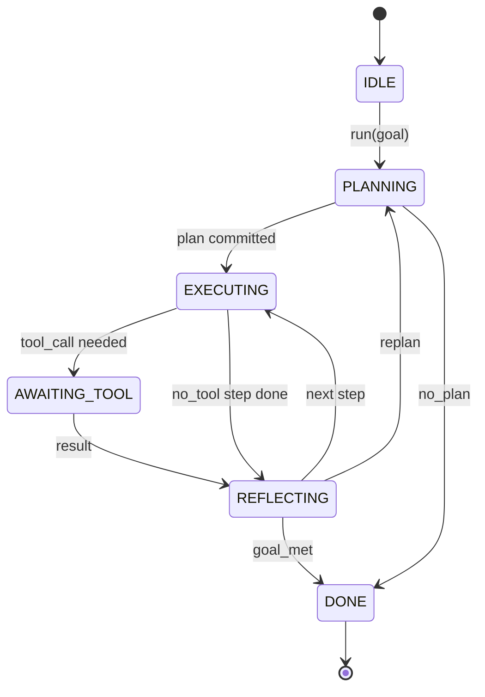

# Agent Harness 循环契约

> Harness 就是 agent。模型是一个协处理器。本课冻结循环契约，你可以将任意模型接入其中。

**类型：** 构建
**语言：** Python
**前置课程：** Phase 13 课程 01-07，Phase 14 课程 01
**时间：** 约 90 分钟

## 学习目标
- 将 agent harness 循环规范为一个具有显式转换的确定性状态机。
- 实现十个生命周期钩子主题，供操作员接入策略、遥测和护栏。
- 定义两个拉取点，循环在此处将控制权交还调用方，并在收到新输入后恢复执行。
- 在超出限制时不泄露部分状态地实施每次会话的预算控制（轮次、工具调用、墙钟时间）。
- 发出十一种事件类型的类型化流，使下游 UI 和追踪器能够订阅而无需直接检查循环内部。

```figure
cf-loop-contract
```

## 框架

一个连续运行四十轮次的编码 agent 不是一个聊天循环。它是一个状态机，操作员可以拦截其节点并审计其边。一旦你写明了这份契约，替换模型、工具或策略就不再需要重构代码。它变成了一个注册调用。

本课构建这份契约。我们定义了六个状态、十个钩子主题、两个拉取点、十一种事件类型以及一个预算包络。harness 中的所有内容（工具注册表、JSON-RPC 传输、分发器、规划器）都接入这个结构。

## 状态

循环有六个状态。五个是活动状态，一个是终态。



`IDLE` 是唯一合法的入口点。`DONE` 是唯一合法的出口。`AWAITING_TOOL` 是唯一产生拉取点状态。其他所有转换都是内部的。

状态机是确定性的。给定相同的事件日志，harness 会进入相同的状态。这一特性让你可以重放会话日志进行调试，而无需重新调用模型。

## 钩子主题

钩子是操作员切入循环的接缝。harness 会触发十个主题。每个主题接受任意数量的订阅者。订阅者按注册顺序触发。一个订阅者可以修改负载、抛出异常以中止当前轮次，或返回哨兵值以跳过下一步。

```text
before_plan         after_plan
before_tool_call    after_tool_call
before_step         after_step
on_error
on_pause
on_budget_exceeded
on_complete
```

这种结构与 Claude Code、Cursor 和 OpenCode 到 2025 年中期的共识保持一致。这些名称是功能性的，而非品牌化的。阻止 `rm -rf` 的钩子位于 `before_tool_call`。发送 OpenTelemetry span 的钩子位于 `after_step`。在暂停会话上恢复的钩子位于 `on_pause`。

## 拉取点

循环两次交出控制权。第一次在 `AWAITING_TOOL` 状态，当它无法在没有工具结果的情况下继续推进时。第二次在 `on_pause`，当预算耗尽或钩子明确要求人工审查时。

拉取点不是一个异常。它是一个返回。调用方检查 harness 状态，获取 harness 所需的内容，然后调用 `resume(payload)`。harness 从停下的地方继续执行。这与 Python 生成器的形状相同。跨越拉取点的传输方式由你决定。在 TUI 中是按键，通过 MCP 是 `tools/call`，通过队列是作业轮询。

## 事件流

循环在契约的特定位置将事件追加到类型化流中。该流是仅追加的，订阅者可以从任意偏移量重放。十一种已实现的事件类型为：

- `session.start` — 在调用 `run(goal)` 时发出一次
- `plan.draft` — 在规划器返回草稿计划时发出
- `plan.commit` — 在草稿被提交为活动计划后发出
- `step.start` — 在每个执行步骤开始时发出
- `step.end` — 在每个执行步骤结束时发出
- `tool.call` — 当需要工具步骤交出控制权给调用方时发出
- `tool.result` — 在恢复时附带工具结果发出
- `tool.error` — 在恢复时附带错误或钩子中止调用时发出
- `budget.warn` — 当达到预算限制时发出
- `session.pause` — 当循环在暂停状态下交出控制权时发出（预算或钩子触发）
- `session.complete` — 当循环到达 `DONE` 时发出一次

事件不重复钩子的负载。钩子是命令式的（修改、中止）。事件是观察式的（记录、发送）。将它们视为正交的。

## 预算包络

一个会话携带三个限制：轮次计数、工具调用计数、墙钟秒数。每次轮次将轮次计数加一。每次工具调用将工具调用计数加一。墙钟时间在每次状态转换时检查。当任何限制被触及时，循环触发 `on_budget_exceeded`，发出 `budget.warn`，然后在下一个拉取点转换回 `IDLE` 并附带预算超限原因。

预算不是一个杀断开关。它是一个让步点。调用方决定是否延长预算并恢复，或关闭会话。

## 本课不做的事情

它不调用模型。它不注册真实工具。它不实现传输层。这些是接下来四课的内容。本课钉下契约，使接下来四课可以接入其中而无需重写。

`main.py` 中的确定性规划器是一个占位符。它返回一个硬编码的三步计划，其中两步需要工具结果。重点是循环，而非计划。

## 如何阅读代码

`HarnessLoop` 是主类。它持有状态、触发钩子、发出事件。`Budget` 跟踪限制。`Event` 是流上的类型化信封。`HookRegistry` 是分发表。`_transition` 是唯一改变状态的函数，因此状态机不变量存在于一个地方。

从顶部到底部阅读 `main.py`。然后阅读 `code/tests/test_loop.py`。测试固定了每一次转换和每个钩子的触发顺序。

## 进一步探索

在生产中构建 harness 最难的部分不是状态机。而是让契约可强制执行。契约必须经得起规划器的热重载。必须经得起返回畸形 JSON 的工具。必须经得起钩子在四十轮次进行到三分之二时抛出异常。本课中的测试练习了这些故障模式。运行它们。破坏它们。添加用例。

下一课添加工具注册表。之后是 JSON-RPC 传输。再之后是分发器。到第二十四课，本文件中的循环将使用真实计划对真实工具运行，并强制执行真实预算。
