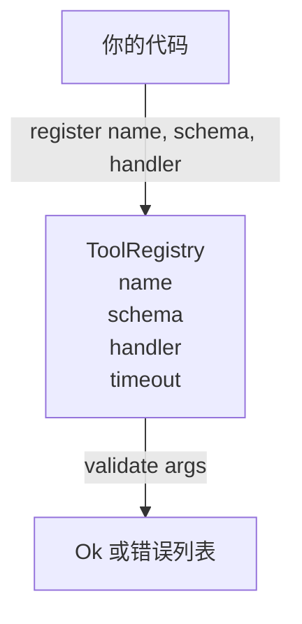

# 带有 Schema 验证的工具注册表

> 无法验证的工具就是无法调用的工具。在构建工具之前，先构建注册表和 schema 检查器。

**类型：** 构建
**语言：** Python
**前置要求：** Phase 13 课程 01-07，Phase 14 课程 01
**时间：** 约 90 分钟

## 学习目标
- 维护一个类型明确的注册表（工具名 → schema → handler），让调度器只需查询一次即可信任后续调用。
- 实现一个覆盖 90% 工具调用实际使用关键词的 JSON Schema 2020-12 子集。
- 返回精确的、符合 json-pointer 格式的错误路径，以便模型能在一次往返中自我修正。
- 拒绝未明确覆盖的重复注册，因为静默覆盖正是生产环境工具目录发生漂移的根源。
- 保持验证器纯净（无 I/O、无时间依赖、无全局变量），以便可在重放日志上重复运行。

````text
cf-registry-validate
````

## 为什么注册表要先于工具构建

2026 年的代码智能体拥有的已注册工具数量，已超过单个上下文窗口所能容纳的规模。一个非平凡的 harness 会注册两百个工具，并在任意一轮对话中暴露十到四十个。注册表是以下三个问题的唯一真相来源：“存在哪些工具”、“它们的参数是什么形状”以及“我应该调用哪个 handler”。一旦这三个答案确定下来，harness 的其余部分就可以停止猜测。

我们要避免的错误是：发布没有 schema 的 handler，或者发布没有验证功能的 schema。这两种情况都很常见。两者都会把下一层（第 23 课中的 dispatcher）变成一个猜谜游戏，其唯一的故障表现就是 handler 抛出的堆栈跟踪。

## 工具记录的结构

```text
ToolRecord
  name        : str          (unique, lowercase alphanumeric and underscore segments separated by dots, e.g., snake_case.segment.case)
  description : str          (one line, shown to the model)
  schema      : dict         (JSON Schema 2020-12 subset)
  handler     : Callable     (async or sync, returns Any)
  idempotent  : bool         (dispatcher uses this for retry decisions)
  timeout_ms  : int          (override per-tool dispatcher default)
```

schema 是验证器唯一会处理的字段。handler 对其而言是黑盒。我们有意将它们分离。schema 是数据。handler 是代码。将二者混用会诱使你把验证逻辑塞进 handler 里，而这正是我们要阻止的 bug。

## JSON Schema 2020-12 子集

完整的 2020-12 规范是一篇论文。我们只需要八个关键词。

```text
type           string / number / integer / boolean / object / array / null
properties     map of property name -> schema
required       list of property names
enum           list of allowed primitive values
minLength      integer, applies to strings
maxLength      integer, applies to strings
pattern        ECMA-262-compatible regex, applies to strings
items          schema applied to every array element
```

这足以覆盖工具 API 实际需要的功能。我们不添加的关键词（oneOf、anyOf、allOf、$ref、conditionals）在生产级 schema 中是有效的，但会让验证器变成带有环的树形遍历器。我们在构建的是注册表，而不是 JSON Schema 引擎。

## JSON Pointer 错误路径

当验证失败时，验证器会返回一个错误列表。每个错误都携带一条指向输入数据的 json-pointer 路径。指针是由斜杠前缀的属性名和数组索引组成的序列。

```text
{"a": {"b": [1, 2, "x"]}}
                    ^
                    /a/b/2
```

模型理解错误路径的能力比理解自然语言句子更强。如果 schema 要求 `args.user.email` 而模型传入了一个整数，错误路径应为 `/user/email`，并附带 `expected_type: string`。模型会在下一次调用中直接修正，无需经历一轮自然语言交互。

## 注册与覆盖

`register(name, schema, handler, **opts)` 默认拒绝重复注册。调用方必须传入 `override=True` 才能替换。这是运维层面的基本规范。代码库的两个部分静默注册同一个工具名，是一种在生产环境中要花一周才能排查出来的 bug。

注册表暴露了三个读方法。`get(name)` 返回记录或抛出异常。`validate(name, args)` 返回一个 `Ok` 或错误列表。`names()` 按注册顺序返回工具名列表。

## 验证器的边界

它对 schema 树进行单次递归遍历。它是纯函数。它不会调用 handler。它不会进行类型强制转换（字符串 `"42"` 无法通过 number schema 的校验）。它不会静默截断数据。

它不是安全边界。即使验证通过，恶意 handler 仍可能表现出异常行为。第 23 课中的 dispatcher 会补充超时和沙箱层。注册表只负责保证结构形状。

## 结构



## 如何阅读代码

`code/main.py` 定义了 `ToolRegistry`、`ToolRecord`、`ValidationError` 以及八个验证函数。验证器会根据 `schema["type"]` 进行分发（或者将含有 `enum` 的 schema 视为无类型枚举检查）。每个类型验证器要么返回空列表，要么返回 `ValidationError` 列表。顶层遍历器在向下遍历时会将错误拼接起来，并前置路径段。

`code/tests/test_registry.py` 覆盖了注册、覆盖、验证成功、带路径的验证失败，以及子集中的所有关键词。

## 后续扩展

本课落地后你会想要补充的两个扩展是：针对本地 definitions 块的 `$ref` 解析，以及用于严格形状的 `additionalProperties: false`。两者都很小。当工具目录增长到超过五十个时，添加这两项是很常见的做法。我们将它们排除在本课之外，以保持单文件阅读量可控。

下一课（第 22 课）将构建 JSON-RPC stdio 传输层，将此注册表暴露给模型客户端。再下一课（第 23 课）将在带有超时和重试机制的 dispatcher 背后封装这两者。
